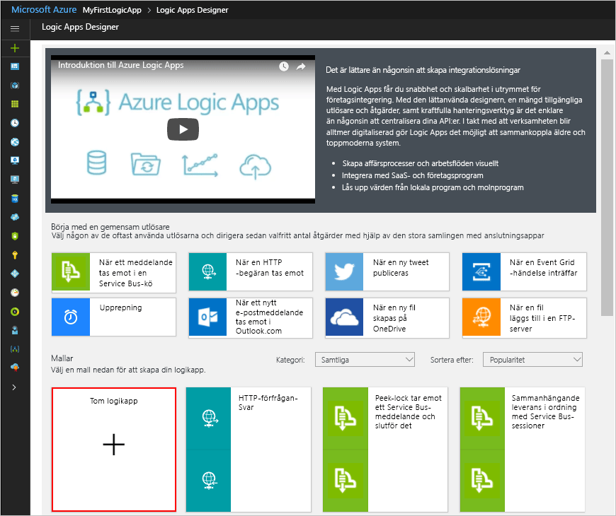

# <a name="check-traffic-on-a-schedule-with-azure-logic-apps"></a>Kontrollera trafik enligt ett schema med Azure Logic Apps

Med Azure Logic Apps kan du automatisera arbetsflöden som körs enligt ett schema. Den här kursen visar hur du kan skapa en [logikapp](../logic-apps/logic-apps-overview.md) med en utlösare som körs varje morgon på vardagar och kontrollerar restiden, inklusive trafik, mellan två platser. Om tiden överskrider en viss gräns, skickar logikappen ett e-postmeddelande med restiden och den extra tid som krävs för att nå ditt mål.

I den här guiden får du lära dig att:

> [!div class="checklist"]
> * Skapa en tom logikapp. 
> * Lägger till en utlösare som fungerar som en schemaläggare för din logikapp.
> * Lägger till en åtgärd som hämtar restiden för en resväg.
> * Lägger till en åtgärd som skapar en variabel, omvandlar restiden från sekunder till minuter och sparar resultatet i variabeln.
> * Lägger till ett villkor som jämför restiden med en angiven tidsgräns.
> * Lägger till en åtgärd som skickar ett e-postmeddelande om restiden överskrider tidsgränsen.

När du är klar ser logikappen ut som det här arbetsflödet på en hög nivå:


Om du inte har någon Azure-prenumeration kan du <a href="https://azure.microsoft.com/free/" target="_blank">registrera ett kostnadsfritt Azure-konto</a> innan du börjar.

## <a name="prerequisites"></a>Nödvändiga komponenter

* Ett e-postkonto från en e-postleverantör som stöds av Logic Apps, som Office 365 Outlook, Outlook.com eller Gmail. För andra providrar [läser du listan med anslutningsappar här](https://docs.microsoft.com/connectors/). I den här snabbstarten används ett Outlook.com-konto. Om du använder ett annat e-postkonto är stegen desamma, men användargränssnittet kan vara lite annorlunda.

* För att kunna hämta restiden för en resväg behöver du en åtkomstnyckel för Bing Maps-API:t. Hämta nyckeln genom att följa anvisningarna för <a href="https://msdn.microsoft.com/library/ff428642.aspx" target="_blank">hur du hämtar en Bing Maps-nyckel</a>. 

## <a name="sign-in-to-the-azure-portal"></a>Logga in på Azure Portal

Logga in på <a href="https://portal.azure.com" target="_blank">Azure Portal</a> med autentiseringsuppgifterna för ditt Azure-konto.

## <a name="create-your-logic-app"></a>Skapa en logikapp

1. Välj **Skapa en resurs** > **Enterprise-integration** > **Logikapp** på Azure-huvudmenyn.

   

2. Under **Skapa en logikapp** anger du informationen om din logikapp så som det visas här. När du är klar väljer du **Fäst på instrumentpanelen** > **Skapa**.

   

   | Inställning | Värde | Beskrivning | 
   | ------- | ----- | ----------- | 
   | **Namn** | LA-TravelTime | Logikappens namn | 
   | **Prenumeration** | <*your-Azure-subscription-name*> | Azure-prenumerationens namn | 
   | **Resursgrupp** | LA-TravelTime-RG | Namnet på den [Azure-resursgrupp](../azure-resource-manager/resource-group-overview.md) som används för att organisera relaterade resurser | 
   | **Plats** | Östra USA 2 | Regionen där informationen om logikappen ska lagras | 
   | **Log Analytics** | Av | Behåll inställningen **Av** för diagnostisk loggning. | 
   |||| 

3. När Azure har distribuerat din app öppnas Logic Apps Designer och en sida med en introduktionsvideo och mallar för vanliga logikappar visas. Under **Mallar** väljer du **Tom logikapp**.

   

Sedan lägger du till en [utlösare](../logic-apps/logic-apps-overview.md#logic-app-concepts) som utlöses enligt ett angivet schema. Varje logikapp måste börja med en utlösare som utlöses när en specifik händelse sker eller när nya data uppfyller ett särskilt villkor. Mer information finns i [Skapa din första logikapp](../logic-apps/quickstart-create-first-logic-app-workflow.md).

## <a name="add-scheduler-trigger"></a>Lägg till en utlösare

1. På designern anger du ”återkommande” i sökrutan. Välj den här utlösaren: **Schema – återkommande**

   

2. I formen för **återkommande** väljer du knappen med **punkter** (**...**) och sedan **Byt namn**. Byt namn på utlösaren med den här beskrivningen: ```Check travel time every weekday morning```

   

3. I utlösaren väljer du **Visa avancerade alternativ**.

4. Ange schema- och upprepningsinformation för din utlösare enligt bilden och beskrivningen:

   

   | Inställning | Värde | Beskrivning | 
   | ------- | ----- | ----------- | 
   | **Intervall** | 1 | Antalet intervaller som ska förflyta mellan kontrollerna | 
   | **Frekvens** | Vecka | Den tidsenhet som används för upprepningen | 
   | **Tidszon** | Ingen | Gäller bara när du anger en starttid. Det här är användbart när du anger en tidszon som inte är lokal. | 
   | **Starttid** | Ingen | Skjut upp upprepningen till en viss tidpunkt. Mer information finns i [Schemalägga aktiviteter och arbetsflöden som körs regelbundet](../connectors/connectors-native-recurrence.md). | 
   | **Dessa dagar** | Måndag,Tisdag,Onsdag,Torsdag,Fredag | Endast tillgängligt när Vecka har valts i fältet **Frekvens** | 
   | **Vid dessa timmar** | 7,8,9 | Endast tillgängligt när Vecka eller Dag har valts i fältet **Frekvens**. Välj vid vilka timmar på dagen den här upprepningen ska köras. Det här exemplet körs vid 7, 8 och 9. | 
   | **Vid dessa minuter** | 0,15,30,45 | Endast tillgängligt när Vecka eller Dag har valts i fältet **Frekvens**. Välj vid vilka minuter på dagen den här upprepningen ska köras. Det här exemplet körs varje kvart och börjar vid noll minuter. | 
   ||||

   Den här utlösaren utlöses varje kvart under vardagar med start kl. 7:00 och slut kl. 9:45. 
   Upprepningsschemat visas i rutan **Förhandsgranskning**. 
   Mer information finns i [Schemalägga aktiviteter och arbetsflöden](../connectors/connectors-native-recurrence.md) och [Arbetsflödesåtgärder och utlösare](../logic-apps/logic-apps-workflow-actions-triggers.md#recurrence-trigger).

5. Om du vill dölja utlösarens information för tillfället klickar du på formens namnlist.

   

6. Spara din logikapp. Välj **Spara** i designerverktygsfältet. 

Logikappen har nu publicerats men gör inget annat än att upprepas. Därför ska vi lägga till en åtgärd som svarar när utlösaren utlöses.

## <a name="get-the-travel-time-for-a-route"></a>Hämta restiden för en resväg

Nu när du har en utlösare lägger du till en [åtgärd](../logic-apps/logic-apps-overview.md#logic-app-concepts) som hämtar restiden mellan två platser. Logic Apps tillhandahåller en anslutningsapp för Bing Maps-API:t så att du lätt kan hämta den här informationen. Innan du börjar kontrollerar du att du har en Bing Maps API-nyckel (beskrivs i förutsättningarna för den här kursen).

1. I Logic Apps Designer går du till utlösaren och väljer **+ Nytt steg** > **Lägg till en åtgärd**.

2. Sök efter ”maps” och välj den här åtgärden: **Bing Maps - Get route**

3. Om du inte har en Bing Maps-anslutning uppmanas du att skapa en anslutning. Ange den här anslutningsinformationen och välj **Skapa**.

   

   | Inställning | Värde | Beskrivning |
   | ------- | ----- | ----------- |
   | **Anslutningsnamn** | BingMapsConnection | Ange ett namn på anslutningen. | 
   | **API-nyckel** | <*your-Bing-Maps-key*> | Ange Bing Maps-nyckeln som du fick tidigare. Om du inte har en Bing Maps-nyckel tar du reda på <a href="https://msdn.microsoft.com/library/ff428642.aspx" target="_blank">hur du hämtar en nyckel</a>. | 
   | | | |  

4. Byt namn på åtgärden med den här beskrivningen: ```Get route and travel time with traffic```

5. Ange information för åtgärden **Get route** (Hämta resväg) som visas och beskrivs här, till exempel:

    

   | Inställning | Värde | Beskrivning |
   | ------- | ----- | ----------- |
   | **Waypoint 1** (Platsmarkör 1) | <*start-location*> | Startpunkt för resvägen | 
   | **Waypoint 2** (Platsmarkör 2) | <*end-location*> | Slutpunkten för resvägen | 
   | **Avoid** (Undvik) | Ingen | Alla objekt som ska undvikas längs vägen, till exempel motorvägar, vägtullar och så vidare | 
   | **Optimize** (Optimera) | timeWithTraffic | En parameter för att optimera färdvägen, till exempel avstånd, restid med aktuell trafik med mera. Välj den här parametern: ”timeWithTraffic” | 
   | **Avståndsenhet** | <*your-preference*> | Avståndsenhet för din resväg. Den här artikeln används enheten: ”Mile”  | 
   | **Travel mode** (Färdsätt) | Driving (Bil) | Färdsättet för din resväg. Välj det här läget: "Driving" | 
   | **Transit Date-Time** (Tid/datum för kollektivtrafik) | Ingen | Gäller endast ”transit mode” (kollektivtrafik) | 
   | **Date-Time Type** (Typ av datum/tid) | Ingen | Gäller endast ”transit mode” (kollektivtrafik) | 
   |||| 

   Mer information om dessa parametrar finns [Calculate a route](https://msdn.microsoft.com/library/ff701717.aspx) (Beräkna en resväg).

6. Spara din logikapp.

Skapa sedan en variabel så att du kan omvandla och lagra den aktuella restiden i minuter i stället för sekunder. På så sätt behöver du inte upprepa omvandlingen och det blir enklare att använda värdet i senare steg. 

## <a name="create-variable-to-store-travel-time"></a>Skapa en variabel för att lagra restiden

Ibland kanske du vill utföra åtgärder för data i arbetsflödet och använda resultatet för senare åtgärder. Du kan skapa variabler för att spara resultaten efter att de har bearbetats så att du enkelt kan återanvända dem eller referera till dem. Du kan skapa variabler endast på den översta nivån i din logikapp.

Den tidigare åtgärden **Get route** (Hämta resväg) returnerar aktuell restid med trafik i sekunder via fältet **Travel Duration Traffic** (Restid med aktuell trafik). Genom att omvandla och lagra det här värdet i minuter i stället för sekunder blir det enklare att använda värdet senare utan att du behöver omvandla det på nytt.

1. Under åtgärden **Get route** (Hämta resväg) väljer du **+Nytt steg**  > **Lägg till en åtgärd**.

2. Sök efter ”variabler” och välj den här åtgärden: **Variabler – initiera variabel**

   

3. Byt namn på åtgärden med den här beskrivningen: ```Create variable to store travel time```

4. Ange detaljer för variabeln enligt beskrivningen nedan:

   | Inställning | Värde | Beskrivning | 
   | ------- | ----- | ----------- | 
   | **Namn** | travelTime | Namnet på variabeln | 
   | **Typ** | Heltal | Datatypen för variabeln | 
   | **Värde** | Ett uttryck som omvandlar den aktuella restiden från sekunder till minuter (se stegen under den här tabellen). | Det inledande värdet för variabeln | 
   |||| 

   1. Du skapar uttrycket för fältet **Value** (Värde) genom att klicka i fältet så att listan för dynamiskt innehåll visas. 
   Du kan behöva öka webbläsarens bredd för att kunna se listan. 
   Välj **Expression** (Uttryck) i listan med dynamiskt innehåll. 

      

      När du klickar i vissa rutor visas en lista med dynamiskt innehåll eller en infogad parameterlista. I listan visas alla parametrar från tidigare åtgärder som du kan använda som indata i ditt arbetsflöde. 
      Listan med dynamiskt innehåll har en uttrycksredigerare som gör att du kan välja funktioner för att utföra åtgärder. 
      Uttrycksredigeraren visas bara i listan med dynamiskt innehåll.

      Webbläsarens bredd bestämmer vilken lista som visas. 
      Om webbläsaren är bred visas listan med dynamiskt innehåll. 
      Om webbläsaren är smal visas en parameterlista infogad under den ruta som för närvarande har fokus.

   2. Ange det här uttrycket i uttrycksredigeraren: ```div(,60)```

      

   3. Placera markören i uttrycket mellan vänsterparentesen (**(**) och kommatecknet (**,**). 
   Välj **Dynamic content** (Dynamiskt innehåll).

      

   4. I listan med dynamiskt innehåll väljer du **Travel Duration Traffic** (Restid med aktuell trafik).

      

   5. Välj **OK** när fältet matchar uttrycket.

      

      Fältet **Value** (Värde) ser nu ut så här:

      

5. Spara din logikapp.

Lägg sedan till ett villkor som kontrollerar om den aktuella restiden är större än en specifik gräns.

## <a name="compare-travel-time-with-limit"></a>Jämför restiden med en tidsgräns

1. Under den föregående åtgärden väljer du **+ Nytt steg** > **Lägg till ett villkor**. 

2. Byt namn på villkoret med den här beskrivningen: ```If travel time exceeds limit```

3. Skapa ett villkor som kontrollerar om **travelTime** (Restid) överskrider den angivna gränsen:

   1. I villkoret klickar du i rutan **Choose a value** (Välj ett värde) till vänster (bred webbläsarvy) eller längst upp (smal webbläsarvy).

   2. Välj fältet **travelTime** (Restid) under **Variables** (Variabler) i listan med dynamiskt innehåll eller i parameterlistan.

   3. I jämförelserutan väljer du operatorn **is greater than** (är större än)

   4. I rutan **Choose a value** (Välj ett värde) till höger (bred vy) eller längst ned (smal vy) anger du följande gräns: ```15```

   Om du till exempel arbetar i en smal vy skapar du villkoret på följande sätt:

   

4. Spara din logikapp.

Lägg sedan till åtgärden som ska utföras när restiden överskrider din gräns.

## <a name="send-email-when-limit-exceeded"></a>Skicka ett e-postmeddelande när gränsen överskrids

Nu lägger du till en åtgärd som skickar ett e-postmeddelande när restiden överskrider din gräns. E-postmeddelandet innehåller den aktuella restiden och den extra restid som krävs för den angivna resvägen. 

1. I grenen **If true** (Om sant) för villkoret väljer du **Add an action** (Lägg till en åtgärd).

2. Sök efter ”skicka e-post” och välj en anslutningsapp för e-post och den e-poståtgärd som du vill använda.

   

   * För personliga Microsoft-konton väljer du **Outlook.com**. 
   * För Azure arbets- eller skolkonto väljer du **Office 365 Outlook**.

3. Om du inte har någon anslutning ombeds du logga in på ditt e-postkonto.

   Logic Apps skapar en anslutning till ditt e-postkonto.

4. Byt namn på åtgärden med den här beskrivningen: ```Send email with travel time```

5. Ange mottagarens e-postadress i fältet **Till**. I testsyfte använder du din egen e-postadress.

6. I rutan **Ämne** anger du ämnet för e-postmeddelandet och tar med variabeln **travelTime** (Restid).

   1. Ange texten ```Current travel time (minutes):``` med ett avslutande blanksteg. 
   
   2. Välj fältet **travelTime** (Restid) under **Variables** (Variabler) i parameterlistan eller i listan med dynamiskt innehåll. 
   
      Om webbläsaren till exempel visas i en smal vy:

      

7. Ange innehållet för e-postmeddelandet i rutan **Brödtext**. 

   1. Ange texten ```Add extra travel time (minutes):``` med ett avslutande blanksteg. 
   
   2. Du kan behöva öka webbläsarens bredd för att kunna se listan med dynamiskt innehåll. 
   Välj **Expression** (Uttryck) i listan med dynamiskt innehåll.

      

   3. I uttrycksredigeraren anger du det här uttrycket för att beräkna hur många minuter som överskrider gränsen: ```sub(,15)```

      

   4. Placera markören i uttrycket mellan vänsterparentesen (**(**) och kommatecknet (**,**). Välj **Dynamic content** (Dynamiskt innehåll).

      

   5. Välj **travelTime** (Restid) under **Variables** (Variabler).

      

   6. Välj **OK** när fältet matchar uttrycket.

      

      Fältet **Body** (Brödtext) ser nu ut så här:

      

8. Spara din logikapp.

Nu testar du logikappen, som ser ut som i det här exemplet:


## <a name="run-your-logic-app"></a>Kör logikappen

Om du vill starta logikappen manuellt väljer du **Kör** i Designer-verktygsfältet. Om den aktuella restiden håller sig under ditt gränsvärde gör logikappen ingenting. Den väntar bara till nästa intervall då den gör en ny kontroll.
Men om den aktuella restiden överskrider din gräns får du ett e-postmeddelande med den aktuella restiden och antalet minuter som överstiger din gräns. Här är ett exempel på ett e-postmeddelande som logikappen skickar:


Om du inte får e-post kan du titta i mappen Skräppost. Ditt skräppostfilter kan dirigera om dessa typer av e-post. Om du är osäker på om din logikapp kördes korrekt kan du läsa informationen om att [felsöka logikappen](../logic-apps/logic-apps-diagnosing-failures.md).

Gratulerar! Du har nu skapat och kört en logikapp med en återkommande åtgärd enligt ett schema. 

Om du vill skapa andra logikappar som använder utlösaren **Schema – återkommande** kan du ta en titt på dessa mallar som är tillgängliga efter att du har skapat en logikapp:

* Få dagliga påminnelser skickade till dig.
* Ta bort gamla Azure-blobar.
* Lägg till ett meddelande i en Azure Storage-kö.

## <a name="clean-up-resources"></a>Rensa resurser

Ta bort resursgruppen som innehåller logikappen och alla relaterade resurser när de inte längre behövs. På Azures huvudmeny går du till **Resursgrupper** och väljer resursgruppen för logikappen. Välj **Ta bort resursgrupp**. Ange resursgruppens namn som bekräftelse och välj **Ta bort**.


## <a name="get-support"></a>Få support

* Om du har frågor kan du besöka [forumet för Azure Logic Apps](https://social.msdn.microsoft.com/Forums/en-US/home?forum=azurelogicapps).
* Om du vill skicka in eller rösta på förslag på funktioner besöker du [webbplatsen för Logic Apps-användarfeedback](https://aka.ms/logicapps-wish).

## <a name="next-steps"></a>Nästa steg

I den här kursen har du skapat en logikapp som kontrollerar trafiken baserat på ett angivet schema (på morgonen på vardagar) och vidtar en åtgärd (skickar ett e-postmeddelande) när restiden överstiger en angiven gräns. Nu kan du lära dig hur du skapar en logikapp som skickar begäranden om distributionslista för godkännande genom att integrera Azure-tjänster, Microsoft-tjänster och andra SaaS-appar.

> [!div class="nextstepaction"]
> [Hantera begäranden om distributionslista](../logic-apps/tutorial-process-mailing-list-subscriptions-workflow.md)
