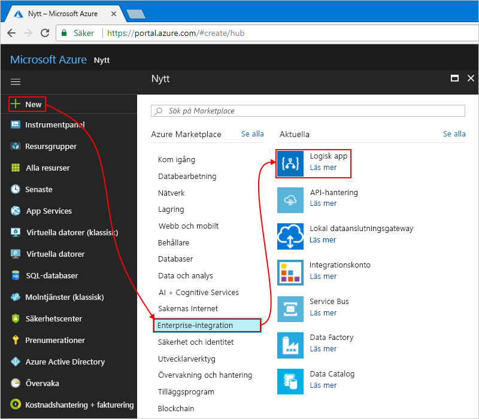

# <a name="process-emails-and-attachments-with-azure-logic-apps"></a>Bearbeta e-postmeddelanden och bilagor med Azure Logic Apps

Med Azure Logic Apps lär du dig att automatisera arbetsflöden och integrera data i olika Azure-tjänster, Microsoft-tjänster och andra SaaS-appar (programvara som en tjänst) samt lokala system. I den här självstudien får du lära dig att skapa en [logikapp](../logic-apps/logic-apps-overview.md) som hanterar inkommande e-post och bilagor. Logikappen bearbetar innehållet, sparar det i Azure Storage och skickar meddelanden för granskning av innehållet. 

I den här guiden får du lära dig att:

> [!div class="checklist"]
> * Konfigurera [Azure Storage](../storage/common/storage-introduction.md) och Storage Explorer så att de kollar sparade e-postmeddelanden och bifogade filer.
> * Skapa en [Azure-funktion](../azure-functions/functions-overview.md) som tar bort HTML från e-postmeddelanden. Den här självstudiekursen innehåller koden som du kan använda för den här funktionen.
> * Skapa en tom logikapp.
> * Lägg till en utlösare som övervakar bifogade filer i e-postmeddelanden.
> * Lägg till ett villkor som kontrollerar om e-postmeddelanden har bifogade filer eller inte.
> * Lägg till en åtgärd som anropar Azure-funktionen när ett e-postmeddelande innehåller bifogade filer.
> * Lägg till en åtgärd som skapar lagringsblobar för e-postmeddelanden och bifogade filer.
> * Lägg till en åtgärd som skickar e-postmeddelanden.

När du är klar ser logikappen ut som det här arbetsflödet på en hög nivå:


Om du inte har någon Azure-prenumeration kan du <a href="https://azure.microsoft.com/free/" target="_blank">registrera ett kostnadsfritt Azure-konto</a> innan du börjar. 

## <a name="prerequisites"></a>Nödvändiga komponenter

* Ett e-postkonto från en e-postleverantör som stöds av Logic Apps, som Office 365 Outlook, Outlook.com eller Gmail. För andra providrar [läser du listan med anslutningsappar här](https://docs.microsoft.com/connectors/).

  För den här logikappen används ett Office 365 Outlook-konto. 
  Om du använder ett annat e-postkonto är stegen desamma, men användargränssnittet kan vara lite annorlunda.

* Ladda ned och installera <a href="https://storageexplorer.com/" target="_blank">kostnadsfria Microsoft Azure Storage Explorer</a>. Med det här verktyget kan du kontrollera att din lagringscontainer är korrekt inställd.

## <a name="sign-in-to-azure-portal"></a>Logga in på Azure-portalen

Logga in på <a href="https://portal.azure.com" target="_blank">Azure Portal</a> med autentiseringsuppgifterna för ditt Azure-konto.

## <a name="set-up-storage-to-save-attachments"></a>Konfigurera lagring för att spara bifogade filer

Du kan spara inkommande e-postmeddelanden och blobar i en [Azure-lagringscontainer](../storage/common/storage-introduction.md). 

1. Innan du kan skapa en lagringscontainer ska du [skapa ett lagringskonto](../storage/common/storage-quickstart-create-account.md) med de här inställningarna:

   | Inställning | Värde | Beskrivning | 
   |---------|-------|-------------| 
   | **Namn** | attachmentstorageacct | Namnet på lagringskontot | 
   | **Distributionsmodell** | Resource manager | [Distributionsmodellen](../azure-resource-manager/resource-manager-deployment-model.md) för att hantera resursdistributionen | 
   | **Typ av konto** | Generellt syfte | [Lagringskontotyp](../storage/common/storage-introduction.md#types-of-storage-accounts) | 
   | **Plats** | Västra USA | Regionen där informationen om lagringskontot ska lagras | 
   | **Replikering** | Lokalt redundant lagring (LRS) | Den här inställningen anger hur dina data kopieras, lagras, hanteras och synkroniseras. Se [Replikering](../storage/common/storage-introduction.md#replication). | 
   | **Prestanda** | Standard | Den här inställningen anger datatyper som stöds och media för att lagra data. Se [Typer av lagringskonton](../storage/common/storage-introduction.md#types-of-storage-accounts). | 
   | **Säker överföring krävs** | Disabled | Den här inställningen anger den säkerhet som krävs för begäranden från anslutningar. Se [Kräv säker överföring](../storage/common/storage-require-secure-transfer.md). | 
   | **Prenumeration** | <*your-Azure-subscription-name*> | Azure-prenumerationens namn | 
   | **Resursgrupp** | LA-Tutorial-RG | Namnet på den [Azure-resursgrupp](../azure-resource-manager/resource-group-overview.md) som används för att organisera och hantera relaterade resurser. <p>**Obs!** En resursgrupp finns i en viss region. Trots att objekten i den här självstudien kanske inte är tillgängliga i alla regioner ska du försöka att använda samma region när det är möjligt. | 
   | **Konfigurera virtuella nätverk** | Disabled | För den här självstudien behåller du inställningen **Disabled** (Inaktiverad). | 
   |||| 

   När du skapar lagringskontot kan du också använda [Azure PowerShell](../storage/common/storage-quickstart-create-storage-account-powershell.md) och [Azure CLI](../storage/common/storage-quickstart-create-storage-account-cli.md).

2. När Azure har distribuerat ditt lagringskonto hämtar du åtkomstnyckeln för ditt lagringskonto:

   1. I lagringskontomenyn navigerar du till **Inställningar** och väljer **Åtkomstnycklar**. 

   2. Kopiera lagringskontonamnet och **key1** och spara dessa värden på en säker plats.

      

   När du hämtar lagringskontots åtkomstnyckel kan du också använda [Azure PowerShell](https://docs.microsoft.com/powershell/module/azurerm.storage/get-azurermstorageaccountkey) och [Azure CLI](https://docs.microsoft.com/cli/azure/storage/account/keys?view=azure-cli-latest.md#az-storage-account-keys-list). 

3. Skapa en bloblagringscontainer för e-postbilagor.
   
   1. Navigera till lagringskontots meny. Välj **Översikt**. 
   Under **Tjänster**väljer du **Blobar**.

      

   2. När sidan **Container** öppnas väljer du **Container**. 

   3. Skriv ”attachments” som containerns namn under **Ny container**. 
   Under **Offentlig åtkomstnivå** väljer du **Container (anonym läsåtkomst för containrar och blobar)** och sedan **OK**.

      När du är klar kan du hitta din lagringscontainer i lagringskontot här i Azure-portalen:

      

   När du skapar en lagringscontainer kan du också använda [Azure PowerShell](https://docs.microsoft.com/powershell/module/azure.storage/new-azurestoragecontainer) och [Azure CLI](https://docs.microsoft.com/cli/azure/storage/container?view=azure-cli-latest#az-storage-container-create). 

Anslut sedan Storage Explorer till ditt lagringskonto.

## <a name="set-up-storage-explorer"></a>Konfigurera Storage Explorer

Anslut nu Storage Explorer till lagringskontot så du kan bekräfta att logikappen kan spara bilagor och blobar korrekt i lagringscontainern.

1. Öppna Microsoft Azure Storage Explorer. 

   Storage Explorer ber om en anslutning till ditt lagringskonto. 

2. I fönstret **Anslut till Azure Storage**, väljer du **Använd lagringskontonamn och nyckel** och väljer **Nästa**. 

   

   > [!TIP]
   > Om ingen uppmaning visas väljer du **Lägg till konto** i Storage Explorer-verktygsfältet.

3. Under **Kontonamn** anger du lagringskontonamnet. Under **Kontonyckel** anger du den åtkomstnyckel som du sparat tidigare. Välj **Nästa**.

4. Bekräfta anslutningsinformationen och välj sedan **Anslut**. 

   Storage Explorer skapar anslutningen och visar lagringskontot i Explorer-fönstret under **(lokala och anslutna)** > **Lagringskonton**. 

5. För att hitta bloblagringscontainern öppnar du **Storage Accounts** (lagringskonton). Expandera ditt lagringskonto, som är **attachmentstorageacct** här, och expandera sedan **Blob Containers** (Blobcontainrar) där du hittar containern för **bifogade filer**, exempelvis: 

   

Skapa sedan en [Azure-funktion](../azure-functions/functions-overview.md) som tar bort HTML från inkommande e-post.

## <a name="create-function-to-clean-html"></a>Skapa funktion för att rensa HTML

Använd nu kodfragmentet som tillhandahålls via de här stegen för att skapa en Azure-funktion som tar bort HTML från varje inkommande e-postmeddelande. På så vis blir e-postinnehållet renare och enklare att bearbeta. Sedan kan du anropa den här funktionen från din logikapp.

1. Innan du kan skapa en funktion ska du [skapa en funktionsapp](../azure-functions/functions-create-function-app-portal.md) med dessa inställningar:

   | Inställning | Värde | Beskrivning | 
   | ------- | ----- | ----------- | 
   | **Appens namn** | CleanTextFunctionApp | Ett globalt unikt och beskrivande namn på funktionsappen | 
   | **Prenumeration** | <*your-Azure-subscription-name*> | Samma Azure-prenumeration som du tidigare använt | 
   | **Resursgrupp** | LA-Tutorial-RG | Samma Azure-resursgrupp som du tidigare använt | 
   | **Värdplan** | Förbrukningsplan | Den här inställningen avgör hur resurser ska allokeras och skalas, som datorkraft, för att köra din funktionsapp. Se [jämförelse av värdplaner](../azure-functions/functions-scale.md). | 
   | **Plats** | Västra USA | Samma region som du tidigare använt | 
   | **Storage** | cleantextfunctionstorageacct | Skapa ett lagringskonto för din funktionsapp. Använd bara gemena bokstäver och siffror. <p>**Obs!** Lagringskontot innehåller dina funktionsappar och skiljer sig från ditt tidigare skapade lagringskonto för e-postbilagor. | 
   | **Application Insights** | Av | Aktiverar programövervakning med [Application Insights](../application-insights/app-insights-overview.md), men för den här självstudien ska du välja inställningen **Av**. | 
   |||| 

   Om funktionsappen inte automatiskt öppnas efter distributionen kan hitta din app i <a href="https://portal.azure.com" target="_blank">Azure-portalen</a>. På Azures huvudmeny väljer du **Funktionsappar** och sedan din funktionsapp. 

   

   Om **Funktionsappar** inte visas på Azure-menyn öppnar du istället **Alla tjänster**. I sökrutan letar du upp och väljer **Function Apps**. Mer information finns i [Create your function](../azure-functions/functions-create-first-azure-function.md) (Skapa funktion).

   I annat fall öppnar Azure automatiskt funktionsappen som visas här:

   

   För att skapa en funktionsapp kan du också använda [Azure CLI](../azure-functions/functions-create-first-azure-function-azure-cli.md), [PowerShell- och Resource Manager-mallar](../azure-resource-manager/resource-group-template-deploy.md).

2. Under **Function Apps** expanderar du **CleanTextFunctionApp** och väljer **Functions**. I funktionsverktygsfältet väljer du **New function** (Ny funktion).

   

3. Under **Choose a template below or go to the quickstart** (Välj en mall eller öppna snabbstarten) öppnar du listan **Scenario** och väljer **Core**. I mallen **HTTP Trigger** väljer du **C#**.

   

   > [!NOTE]
   > Det här exemplet innehåller C#-exempelkoden så att du kan följa exemplet utan att behöva kunna C#.

4. I fönstret **New Function** (Ny funktion) under **Name** (Namn) skriver du ```RemoveHTMLFunction```. Behåll inställningen för **Authorization level** (Auktorisationsnivå) som **Function** (Funktion) och välj **Create** (Skapa).

   

5. När redigeringsprogrammet öppnas ersätter du mallkoden med den här exempelkoden som tar bort HTML och returnerar resultatet till anroparen:

   ``` CSharp
   using System.Net;
   using System.Text.RegularExpressions;

   public static async Task<HttpResponseMessage> Run(HttpRequestMessage req, TraceWriter log)
   {
      log.Info($"HttpWebhook triggered");

      // Parse query parameter
      string emailBodyContent = await req.Content.ReadAsStringAsync();

      // Replace HTML with other characters
      string updatedBody = Regex.Replace(emailBodyContent, "<.*?>", string.Empty);
      updatedBody = updatedBody.Replace("\\r\\n", " ");
      updatedBody = updatedBody.Replace(@"&nbsp;", " ");

      // Return cleaned text
      return req.CreateResponse(HttpStatusCode.OK, new { updatedBody });
   }
   ```

6. När du är klar väljer du **Spara**. Du kan testa funktionen. I redigeringsprogrammets högra kant, under pilikonen (**<**) väljer du **Test**. 

   

7. I panelen **Test**, under **Request body** (Begärandetext) skriver du in den här raden och väljer **Run** (Kör).

   ```json
   {"name": "<p><p>Testing my function</br></p></p>"}
   ```

   

   I fönstret **Utdata** visas resultatet från funktionen:

   ```json
   {"updatedBody":"{\"name\": \"Testing my function\"}"}
   ```

Skapa din logikapp när du har kontrollerat att funktionen fungerar. Trots att den här självstudien visar hur du skapar en funktion som tar bort HTML från e-post har Logic Apps även en **HTML till text**-anslutning.

## <a name="create-your-logic-app"></a>Skapa en logikapp

1. Välj **Skapa en resurs** > 
**Integration** > **Logikapp** på Azure-huvudmenyn.

   

2. Under **Skapa en logikapp** anger du informationen om din logikapp så som det visas här. När du är klar väljer du **Fäst på instrumentpanelen** > **Skapa**.

   

   | Inställning | Värde | Beskrivning | 
   | ------- | ----- | ----------- | 
   | **Namn** | LA-ProcessAttachment | Logikappens namn | 
   | **Prenumeration** | <*your-Azure-subscription-name*> | Samma Azure-prenumeration som du tidigare använt | 
   | **Resursgrupp** | LA-Tutorial-RG | Samma Azure-resursgrupp som du tidigare använt |
   | **Plats** | Västra USA | Samma region som du tidigare använt | 
   | **Log Analytics** | Av | För den här självstudien väljer du inställningen **Av**. | 
   |||| 

3. När Azure har distribuerat din app öppnas Logic Apps Designer och en sida med en introduktionsvideo och mallar för vanliga logikappar visas. Under **Mallar** väljer du **Tom logikapp**.

   

Lägg sedan till en [utlösare](../logic-apps/logic-apps-overview.md#logic-app-concepts) som lyssnar efter inkommande e-postmeddelanden som innehåller bilagor. Varje logikapp måste börja med en utlösare som utlöses när en specifik händelse sker eller när nya data uppfyller ett särskilt villkor. Mer information finns i [Skapa din första logikapp](../logic-apps/quickstart-create-first-logic-app-workflow.md).

## <a name="monitor-incoming-email"></a>Övervaka inkommande e-post

1. På designern i sökrutan anger du "when new email arrives" (när ett nytt e-postmeddelande kommer) som filter. Välj den här utlösaren för e-postleverantören: **When a new email arrives - <*your-email-provider*>** (när ett nytt e-postmeddelande kommer - <din-e-postleverantör>).

   Exempel:

   

   * För Azure arbets- eller skolkonto väljer du Office 365 Outlook. 
   * För personliga Microsoft-konton väljer du Outlook.com. 

2. Om du blir tillfrågad om autentiseringsuppgifter loggar du in på e-postkontot så att Logic Apps kan ansluta till e-postkontot.

3. Nu anger du villkoret utlösaren använder för att filtrera ny e-post.

   1. Ange mapp, intervall och frekvens för att kontrollera e-postmeddelanden.

      

      | Inställning | Värde | Beskrivning | 
      | ------- | ----- | ----------- | 
      | **Mapp** | Inkorgen | E-postmappen som ska kontrolleras | 
      | **Intervall** | 1 | Antalet intervaller som ska förflyta mellan kontrollerna | 
      | **Frekvens** | Minut | Tidsenhet för varje intervall mellan kontroller | 
      |  |  |  | 
  
   2. Välj **visa avancerade alternativ** och ange dessa inställningar:

      | Inställning | Värde | Beskrivning | 
      | ------- | ----- | ----------- | 
      | **Has Attachment** (Innehåller bifogad fil) | Ja | Hämta endast e-postmeddelanden med bifogade filer. <p>**Obs!** Utlösaren tar inte bort e-post från ditt konto, kontrollerar endast nya meddelanden och bearbetar endast e-postmeddelanden som matchar filtrets ämne. | 
      | **Inkludera bifogade filer** | Ja | Hämta bilagorna som indata i arbetsflödet istället för att bara söka efter bilagor. | 
      | **Ämnesfilter** | ```Business Analyst 2 #423501``` | Texten att söka efter i e-postämnet | 
      |  |  |  | 

4. Om du vill dölja utlösarinformationen för tillfället klickar du in utlösarens rubriklist.

   

5. Spara din logikapp. Välj **Spara** i designerverktygsfältet.

   Logikappen har nu publicerats men gör inget annat än att kolla din e-post. 
   Lägg sedan till ett villkor som anger kriterier för att fortsätta arbetsflödet.

## <a name="check-for-attachments"></a>Sök efter bifogade filer

Nu ska du lägga till ett villkor som väljer endast e-postmeddelanden med bifogade filer.

1. Under utlösaren väljer du **Nytt steg** > **Lägg till ett villkor**.

   

2. Byt namn på villkoret med en bättre beskrivning.

   1. I villkorets rubriklist väljer du **ellipsknappen** (**...**) > **Byt namn**.

      

   2. Byt namn på villkoret med den här beskrivningen: ```If email has attachments and key subject phrase```

3. Skapa ett villkor som kontrollerar om e-postmeddelanden har bifogade filer. 

   1. På den första raden under **And** (och) klickar du i den vänstra rutan. 
   På den dynamiska innehållslistan som visas väljer du egenskapen **Has attachment** (Har bifogad fil).

      

   2. I den mellersta rutan behåller du operatorn **is equal to** (är lika med).

   3. I höger ruta skriver du in **True** (Sant) som värde att jämföra med egenskapsvärdet **Has Attachment** (Har bifogad fil).

      

      Om båda värdena är lika innehåller e-postmeddelandet minst en bifogad fil, villkoret skickas och arbetsflödet fortsätter.

   I den underliggande logikappens definition, som du kan visa i kodredigeringsfönstret, ser villkoret ut som det här exemplet:

   ```json
   "Condition": {
      "actions": { <actions-to-run-when-condition-passes> },
      "expression": {
         "and": [ {
            "equals": [
               "@triggerBody()?['HasAttachment']",
                 "True"
            ]
         } ]
      },
      "runAfter": {},
      "type": "If"
   }
   ```

4. Spara din logikapp. Välj **Spara** i designerverktygsfältet.

### <a name="test-your-condition"></a>Testa ditt villkor

Testa nu om villkoret fungerar som det ska:

1. Om din logikapp inte körs redan väljer du **Kör** i designerverktygsfältet.

   Det här steget startar logikappen manuellt utan att vänta tills ditt angivna intervall skickas. 
   Men det händer ingenting förrän test-e-postmeddelandet hamnar i inkorgen. 

2. Skicka ett e-postmeddelande som uppfyller kriterierna till dig själv:

   * E-postmeddelandets ämne innehåller den text du har angett i utlösarens **ämnesfilter**: ```Business Analyst 2 #423501```

   * Ditt e-postmeddelande har en bifogad fil. 
   Skapa för tillfället en tom textfil och bifoga den i e-postmeddelandet.

   När e-postmeddelandet kommer letar logikappen efter bilagor och den angivna ämnestexten.
   Om villkoret uppfylls utlöser utlösaren Logic Apps-motorn och får den att skapa en logikappinstans och starta arbetsflödet. 

3. Om du vill kontrollera att utlösaren utlöstes och att logikappen kördes väljer du **Översikt** på logikappens meny.

   

   Om logikappen inte utlöstes eller kördes trots en lyckad utlösare kan du läsa [informationen om att felsöka logikappen](../logic-apps/logic-apps-diagnosing-failures.md).

Definiera därefter åtgärderna som ska vidtas för grenen **If true** (Om sant). För att spara e-postmeddelandet tillsammans med eventuella bifogade filer tar du bort alla HTML från e-postmeddelandet och skapar blobar i lagringscontainern för e-postmeddelandet och de bifogade filerna.

> [!NOTE]
> Logikappen behöver inte göra något för grenen **Om falskt** när ett e-postmeddelande inte innehåller bilagor. Som en extrauppgift efter självstudien kan du lägga till en lämplig åtgärd du vill vidta för grenen **Om falskt**.

## <a name="call-removehtmlfunction"></a>Anropa RemoveHTMLFunction

I det här steget lägger du till den tidigare skapade Azure-funktionen i logikappen och skickar innehållet i e-posttexten från e-postutlösaren till din funktion.

1. Välj **Logic App Designer** på logikappmenyn. I grenen **If true** (Om sant) väljer du **Add an action** (Lägg till en åtgärd).

   

2. I sökrutan hittar du ”azure functions” och väljer den här åtgärden: **Choose an Azure function - Azure Functions** (Välj en Azure-funktion - Azure-funktioner).

   

3. Välj funktionsappen som du skapade tidigare: **CleanTextFunctionApp**

   

4. Välj nu din funktion: **RemoveHTMLFunction**

   

5. Byt namn på funktionsformen med den här beskrivningen: ```Call RemoveHTMLFunction to clean email body```

6. Ange nu indata som funktionen ska bearbeta. 

   1. Under **Request Body** (Begärandetext) skriver du med ett avslutande blanksteg: 
   
      ```{ "emailBody": ``` 

      Medan du arbetar med dessa indata i nästa steg visas ett felmeddelande om ogiltig JSON tills dina indata är rätt formaterade som JSON.
      När du testade funktionen tidigare använde angivna indata för funktionen JavaScript Object Notation (JSON). 
      Så, begärandetexten måste vara i samma format.

      När markören befinner sig inom rutan **Begärandetext** visas den dynamiska innehållslistan så att du kan välja egenskapsvärden som är tillgängliga från tidigare åtgärder. 
      
   2. Öppna den dynamiska innehållslistan. Under **När ett nytt e-postmeddelande kommer** väljer du egenskapen **Brödtext**. Kom ihåg att lägga till en avslutande klammerparentes efter den här egenskapen: ```}```

      

   När du är klar ser indata i funktionen ut som i det här exemplet:

   

7. Spara din logikapp.

Lägg sedan till en åtgärd som skapar en blob i lagringscontainern så att du kan spara e-postmeddelandets brödtext.

## <a name="create-blob-for-email-body"></a>Skapa blob för e-postmeddelandets brödtext

1. I blocket **If true** (Om sant) och under Azure-funktionen väljer du **Add an action** (Lägg till en åtgärd). 

2. I sökrutan anger du "create blob" (skapa blob) som filter och väljer den här åtgärden: **Create blob - Azure Blob Storage** (Skapa blob - Azure-bloblagring).

   

3. Skapa en anslutning till ditt lagringskonto med inställningarna som visas och beskrivs här. När du är klar väljer du **Skapa**.

   

   | Inställning | Värde | Beskrivning | 
   | ------- | ----- | ----------- | 
   | **Anslutningsnamn** | AttachmentStorageConnection | Ett beskrivande namn för anslutningen | 
   | **Lagringskonto** | attachmentstorageacct | Namnet på lagringskontot som du skapade tidigare för att spara bilagor | 
   |||| 

4. Byt namn på åtgärden **Skapa blob**med den här beskrivningen: ```Create blob for email body```

5. I åtgärden **Skapa blob** anger du den här informationen och väljer fälten för att skapa bloben som visas och beskrivs:

   

   | Inställning | Värde | Beskrivning | 
   | ------- | ----- | ----------- | 
   | **Mappsökväg** | /attachments | Sökvägen till och namnet på containern som du skapade tidigare. I det här exemplet klickar du på mappikonen och väljer sedan containern "/attachments". | 
   | **Blobnamn** | Fältet **Från** | I det här exemplet använder du avsändarens namn som blobnamn. Klicka i den här rutan så att den dynamiska innehållslistan visas. Välj sedan fältet **From** (Från) under åtgärden **When a new email arrives** (När ett nytt e-postmeddelande kommer). | 
   | **Blobinnehåll** | **Innehålls**fält | I det här exemplet använder du e-postmeddelandets HTML-fria brödtext som blobinnehåll. Klicka i den här rutan så att den dynamiska innehållslistan visas. Välj sedan **Body** (Brödtext) under åtgärden **Call RemoveHTMLFunction to clean email body** (Anropa RemoveHTMLFunction för att rensa e-postbrödtext). |
   |||| 

   När du är klar ser villkoret ut som i det här exemplet:

   

6. Spara din logikapp. 

### <a name="check-attachment-handling"></a>Kontrollera hanteringen av bifogade filer

Testa nu om logikappen hanterar e-postmeddelanden som du angav:

1. Om din logikapp inte körs redan väljer du **Kör** i designerverktygsfältet.

2. Skicka ett e-postmeddelande som uppfyller kriterierna till dig själv:

   * E-postmeddelandets ämne innehåller den text du har angett i utlösarens **ämnesfilter**: ```Business Analyst 2 #423501```

   * Ditt e-postmeddelande har minst en bifogad fil. 
   Skapa för tillfället en tom textfil och bifoga den i e-postmeddelandet.

   * Ditt e-postmeddelande har testinnehåll i brödtexten, till exempel: 

     ```
     Testing my logic app
     ```

   Om logikappen inte utlöstes eller kördes trots en lyckad utlösare kan du läsa [informationen om att felsöka logikappen](../logic-apps/logic-apps-diagnosing-failures.md).

3. Kontrollera om logikappen sparade e-postmeddelandet i rätt lagringscontainer. 

   1. I Storage Explorer expanderar du **(Lokal och ansluten)** > 
   **Lagringskonton** > **attachmentstorageacct (extern)** > 
   **Blob Containers** (Blob-behållare) > **bifogade filer**.

   2. Titta i containern **attachments** efter e-postmeddelandet. 

      Endast e-postmeddelandet visas nu i containern eftersom logikappen inte behandlar bilagor ännu.

      

   3. När du är klar tar du bort e-postmeddelandet i Storage Explorer.

4. För att testa grenen **Om falskt**, som inte gör något just nu, kan du även skicka ett e-postmeddelande som inte uppfyller villkoren.

Lägg sedan till en loop för att bearbeta alla bilagor.

## <a name="process-attachments"></a>Bearbeta bilagor

För att bearbeta varje bilaga i e-postmeddelandet lägger du till en **For each**-loop (för varje) i logikappens arbetsflöde.

1. Under formen **Create blob for email body** (Skapa blob för e-postmeddelandets brödtext) väljer du **More** > **Add a for each** (Mer > Lägg till en för varje).

   

2. Byt namn på loopen med den här beskrivningen: ```For each email attachment```

3. Ange nu loopens data för att bearbeta. Klicka i rutan **Select an output from previous steps** (Välj utdata från tidigare steg) så att den dynamiska innehållslistan öppnas och välj **Attachments** (Bilagor). 

   

   Fältet **Bifogade filer** skickar en matris som innehåller alla bifogade filer som finns i ett e-postmeddelande. 
   Loopen **For each** (För varje) upprepar åtgärder för varje objekt som skickats med matrisen.

4. Spara din logikapp.

Lägg sedan till åtgärden som sparar varje bilaga som en blob i lagringscontainern **attachments**.

## <a name="create-blob-for-each-attachment"></a>Skapa blob för varje bifogad fil

1. I loopen **For each email attachment** (För varje e-postbilaga) väljer du **Lägga till en åtgärd** så du kan ange uppgiften som ska utföras på varje bifogad fil som hittats.

   

2. I sökrutan anger du "create blob" (skapa blob) som filter och väljer sedan den här åtgärden: **Create blob - Azure Blob Storage** (Skapa blob - Azure-bloblagring).

   

3. Byt namn på åtgärden **Skapa blob 2**med den här beskrivningen: ```Create blob for each email attachment```

4. I åtgärden **Create blob for each email attachment** (Skapa blob för varje e-postbilaga) anger du den här informationen och väljer egenskaperna för varje blob du vill skapa, som visas och beskrivs:

   

   | Inställning | Värde | Beskrivning | 
   | ------- | ----- | ----------- | 
   | **Mappsökväg** | /attachments | Sökvägen till och namnet på containern som du skapade tidigare. I det här exemplet klickar du på mappikonen och väljer sedan containern "/attachments". | 
   | **Blobnamn** | Fältet **Namn** | I det här exemplet använder du den bifogade filens namn som blobnamn. Klicka i den här rutan så att den dynamiska innehållslistan visas. Välj sedan fältet **Name** (Namn) under åtgärden **When a new email arrives** (När ett nytt e-postmeddelande kommer). | 
   | **Blobinnehåll** | **Innehålls**fält | I det här exemplet använder du fältet **Content** (Innehåll) som blobinnehåll. Klicka i den här rutan så att den dynamiska innehållslistan visas. Välj sedan fältet **Content** (Innehåll) under åtgärden **When a new email arrives** (När ett nytt e-postmeddelande kommer). |
   |||| 

   När du är klar ser villkoret ut som i det här exemplet:

   

5. Spara din logikapp. 

### <a name="check-attachment-handling"></a>Kontrollera hanteringen av bifogade filer

Testa nu om logikappen hanterar bilagor som du angav:

1. Om din logikapp inte körs redan väljer du **Kör** i designerverktygsfältet.

2. Skicka ett e-postmeddelande som uppfyller kriterierna till dig själv:

   * E-postmeddelandets ämne innehåller den text du har angett i utlösarens **ämnesfilter**: ```Business Analyst 2 #423501```

   * Ditt e-postmeddelande har minst två bifogade filer. 
   Skapa för tillfället två tomma textfiler och bifoga dem i e-postmeddelandet.

   Om logikappen inte utlöstes eller kördes trots en lyckad utlösare kan du läsa [informationen om att felsöka logikappen](../logic-apps/logic-apps-diagnosing-failures.md).

3. Kontrollera om logikappen sparade e-postmeddelandet och bilagorna i rätt lagringscontainer. 

   1. I Storage Explorer expanderar du **(Lokal och ansluten)** > 
   **Lagringskonton** > **attachmentstorageacct (extern)** > 
   **Blob Containers** (Blob-behållare) > **bifogade filer**.

   2. Kontrollera både e-postmeddelandet och bilagorna finns i containern **attachments**.

      

   3. När du är klar tar du bort e-postmeddelandet och bilagorna i Storage Explorer.

Lägg sedan till en åtgärd så att logikappen skickar e-post för att granska de bifogade filerna.

## <a name="send-email-notifications"></a>Skicka e-postmeddelanden

1. I grenen **if true** (om sant) under loopen **For each email attachment** (För varje e-postbilaga) väljer du **Lägga till en åtgärd**. 

   

2. I sökrutan anger du "send email" (skicka e-post) som filter och väljer åtgärden "send email" (skicka e-post) för din e-postleverantör. 

   Om du vill filtrera åtgärdslistan till en specifik tjänst kan du välja anslutningsappen först.

   

   * För Azure arbets- eller skolkonto väljer du Office 365 Outlook. 
   * För personliga Microsoft-konton väljer du Outlook.com. 

3. Om du blir tillfrågad om autentiseringsuppgifter loggar du in på e-postkontot så Logic Apps skapar en anslutning till ditt e-postkonto.

4. Byt namn på åtgärden **Skicka ett e-postmeddelande** med den här beskrivningen: ```Send email for review```

5. Ange informationen för åtgärden och välj fälten du vill ta med i e-postmeddelandet som det visas och beskrivs. Tryck på Skift + Enter för att lägga till tomma rader i en redigeringsruta.  

   

   Om du inte hittar ett förväntat fält i den dynamiska innehållslistan väljer du **See more** (Visa fler) brevid **When a new email arrives** (När ett nytt e-postmeddelande kommer). 

   | Inställning | Värde | Anteckningar | 
   | ------- | ----- | ----- | 
   | **Brödtext** | ```Please review new applicant:``` <p>```Applicant name: ``` **Från** <p>```Application file location: ``` **Sökväg** <p>```Application email content: ``` **Brödtext** | E-postmeddelandets brödtext. Klicka i den här rutan, ange exempeltext och välj de här fälten på den dynamiska innehållslistan: <p>- Fältet **Från** under **När ett nytt e-postmeddelande kommer** </br>- Fältet **Sökväg** under **Skapa blob för e-postmeddelandets brödtext** </br>- Fältet **Brödtext** under **Call RemoveHTMLFunction to clean email body** (Anropa RemoveHTMLFunction för att rensa e-postmeddelandets brödtext) | 
   | **Ämne**  | ```ASAP - Review applicant for position: ``` **Ämne** | E-postämnet du vill ha. Klicka i den här rutan, ange exempeltexten och välj fältet **Subject** (Ämne) under **When a new email arrives** (När ett nytt e-postmeddelande kommer). | 
   | **Till** | <*mottagarens-e-postadress*> | I testsyfte kan du använda din egen e-postadress. | 
   |||| 

   > [!NOTE] 
   > Om du väljer ett fält som innehåller en matris, som fältet **Innehåll** som är en matris som innehåller bifogade filer, lägger designerprogrammet automatiskt till en "For each"-loop (För varje) omkring åtgärden som refererar till fältet. På så sätt kan din logikappsåtgärd utförs på varje element i matrisen. För att ta bort loopen ska du ta bort matrisens fält, ta bort den refererande åtgärden utanför loopen, välja ellipserna (**...**) på loopens namnlist och välja **Ta bort**.
     
6. Spara din logikapp. 

Nu testar du logikappen, som nu ser ut som i det här exemplet:


## <a name="run-your-logic-app"></a>Kör logikappen

1. Skicka ett e-postmeddelande som uppfyller kriterierna till dig själv:

   * E-postmeddelandets ämne innehåller den text du har angett i utlösarens **ämnesfilter**: ```Business Analyst 2 #423501```

   * E-postmeddelandet innehåller en eller flera bilagor. 
   Du kan återanvända en tom textfil från föregående test. 
   Bifoga en återstartsfil för ett mer realistiskt scenario.

   * I e-postmeddelandet finns den här texten som du kan kopiera och klistra in:

     ```
     Name: Jamal Hartnett   
     
     Street address: 12345 Anywhere Road   
     
     City: Any Town   
     
     State or Country: Any State   
     
     Postal code: 00000   
     
     Email address: jamhartnett@outlook.com   
     
     Phone number: 000-000-0000   
     
     Position: Business Analyst 2 #423501   

     Technical skills: Dynamics CRM, MySQL, Microsoft SQL Server, JavaScript, Perl, Power BI, Tableau, Microsoft Office: Excel, Visio, Word, PowerPoint, SharePoint, and Outlook   

     Professional skills: Data, process, workflow, statistics, risk analysis, modeling; technical writing, expert communicator and presenter, logical and analytical thinker, team builder, mediator, negotiator, self-starter, self-managing  
     
     Certifications: Six Sigma Green Belt, Lean Project Management   
     
     Language skills: English, Mandarin, Spanish   
     
     Education: Master of Business Administration   
     ```

2. Kör logikappen. Om det lyckas skickar din logikapp ett e-postmeddelande som ser ut som i det här exemplet:

   

   Om du inte får e-post kan du titta i mappen Skräppost. 
   Ditt skräppostfilter kan dirigera om dessa typer av e-post. 
   Om du är osäker på om din logikapp kördes korrekt kan du läsa informationen om att [felsöka logikappen](../logic-apps/logic-apps-diagnosing-failures.md).

Grattis! Nu har du skapat en och kört en logikapp som automatiserar uppgifter i olika Azure-tjänster och anropar anpassad kod.

## <a name="clean-up-resources"></a>Rensa resurser

Ta bort resursgruppen som innehåller logikappen och alla relaterade resurser när de inte längre behövs. På Azures huvudmeny öppnar du **Resursgrupper** och väljer sedan resursgruppen för logikappen. Välj **Ta bort resursgrupp**. Ange resursgruppens namn som bekräftelse och välj **Ta bort**.


## <a name="get-support"></a>Få support

* Om du har frågor kan du besöka [forumet för Azure Logic Apps](https://social.msdn.microsoft.com/Forums/en-US/home?forum=azurelogicapps).
* Om du vill skicka in eller rösta på förslag på funktioner besöker du [webbplatsen för Logic Apps-användarfeedback](https://aka.ms/logicapps-wish).

## <a name="next-steps"></a>Nästa steg

I den här självstudiekursen har du skapat en logikapp som bearbetar och lagrar e-postbilagor genom att integrera Azure-tjänster, till exempel Azure Storage och Azure Functions. Lär dig nu mer om andra anslutningsappar som du kan använda för att skapa logikappar.

> [!div class="nextstepaction"]
> [Läs mer om anslutningsappar för Logic Apps](../connectors/apis-list.md)
