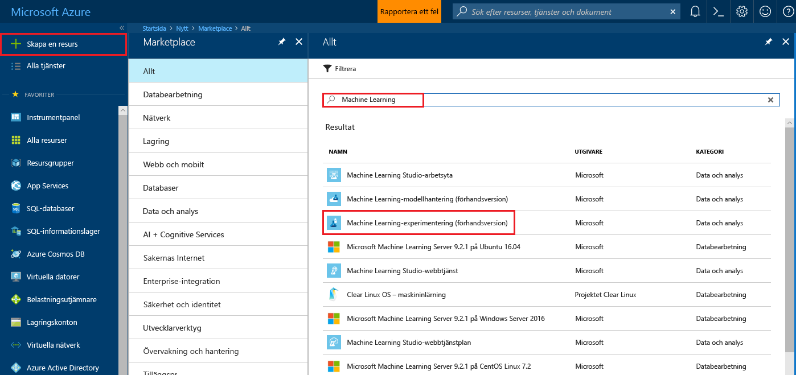
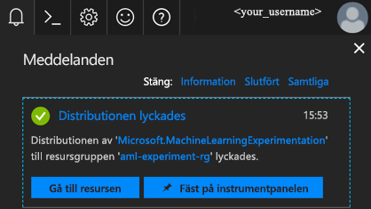
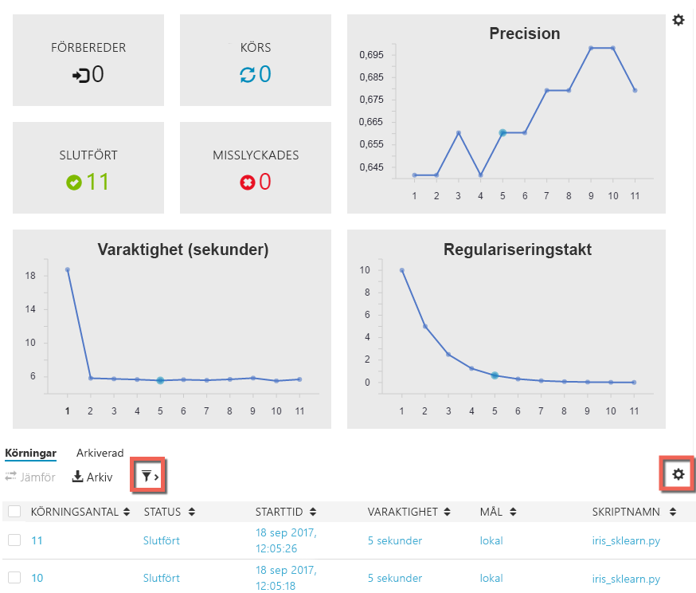

# <a name="create-azure-machine-learning-preview-accounts-and-install-azure-machine-learning-workbench"></a>Skapa konton för förhandsversionen av Azure Machine Learning och installera Azure Machine Learning Workbench
Azure Machine Learning är en integrerad, avancerad analyslösning som dataforskare kan använda för att förbereda data, utveckla experiment och distribuera modeller i molnskala.

Den här snabbstarten visar hur du skapar konton för att hantera experiment och modeller i förhandsversionen av Azure Machine Learning-tjänster. Den visar också hur du installerar skrivbordsprogrammet Azure Machine Learning Workbench och CLI-verktyg. Sedan får du en snabb genomgång av funktionerna i förhandsversionen av Azure Machine Learning med hjälp av den tidlösa [Iris-datamängden](https://en.wikipedia.org/wiki/iris_flower_data_set) för att skapa en modell för att förutspå typen av iris baserad på några av dess fysiska egenskaper.  

Om du inte har en Azure-prenumeration kan du skapa ett [kostnadsfritt konto](https://azure.microsoft.com/free/?WT.mc_id=A261C142F) innan du börjar.

## <a name="prerequisites"></a>Krav
För närvarande kan skrivbordsappen Azure Machine Learning Workbench endast installeras på följande operativsystem: 
- Windows 10
- Windows Server 2016
- macOS Sierra

>[!NOTE]
>macOS High Sierra stöds inte ännu.

## <a name="log-in-to-the-azure-portal"></a>Logga in på Azure Portal
Logga in på [Azure-portalen](https://portal.azure.com/).

## <a name="create-azure-machine-learning-accounts"></a>Skapa Azure Machine Learning-konton
Använd Azure Portal för att etablera Azure Machine Learning-konton. 
1. Klicka på knappen **Nytt** (+) i det övre vänstra hörnet i portalen.

2. Skriv ”Machine Learning” i sökfältet. Välj **Machine Learning Experimentation (preview)** i sökresultatet.  Klicka på stjärnikonen om du vill lägga till det här alternativet som favorit i Azure Portal.

   

3. Klicka på **+ Lägg till** för att konfigurera ett nytt Machine Learning-experimenteringskonto. Ett detaljerat formulär öppnas.

   

4. Fyll i Machine Learning-experimenteringsformuläret med följande information:

   Inställning|Föreslaget värde|Beskrivning
   ---|---|---
   Namn på experimenteringskonto | _Unikt namn_ |Välj ett unikt namn som identifierar kontot. Du kan till exempel använda ditt eget namn eller namnet på din avdelning eller ditt projekt. Välj det som bäst identifierar experimentet. Namnet ska bestå av mellan 2 och 32 tecken. Det får bara innehålla alfanumeriska tecken samt bindestreck (-). 
   Prenumeration | _Din prenumeration_ |Den Azure-prenumeration som ska användas för experimentet. Om du har flera prenumerationer, väljer du lämplig prenumeration som resursen ska debiteras till.
   Resursgrupp | _Din resursgrupp_ | Du kan skapa ett nytt resursgruppnamn eller använda ett befintligt namn i prenumerationen.
   Plats | _Regionen som ligger närmast dina användare_ | Välj den plats som är närmast användarna och dataresurserna.
   Antal platser | 2 | Ange antalet platser. Det här valet påverkar [priset](https://azure.microsoft.com/pricing/details/machine-learning/). De första två platserna är kostnadsfria. I den här snabbstarten använder vi två platser. Du kan uppdatera antalet platser vid ett senare tillfälle i Azure Portal.
   Lagringskonto | _Unikt namn_ | Välj **Skapa nytt** och ange ett namn om du vill skapa ett nytt Azure-lagringskonto, eller välj **Använd befintligt** och sedan ditt befintliga lagringskonto i listrutan. Lagringskontot är obligatoriskt. Det används för att lagra projektartefakter och köra historikdata. 
   Arbetsyta för experimenteringskonto | _Unikt namn_ | Ange ett namn för den nya arbetsytan. Namnet ska bestå av mellan 2 och 32 tecken. Det får bara innehålla alfanumeriska tecken samt bindestreck (-).
   Tilldela ägare för arbetsytan | _Ditt konto_ | Välj ditt eget konto som ägare till arbetsytan.
   Skapa modellhanteringskonto | *markering* | När du skapar experimenteringskontot kan du också skapa Machine Learning-modellhanteringskontot. Den här resursen används när du är redo att distribuera och hantera dina modeller som realtidswebbtjänster. Vi rekommenderar att du skapar modellhanteringskontot samtidigt som experimenteringskontot.
   Kontonamn | _Unikt namn_ | Välj ett unikt namn som identifierar modellhanteringskontot. Du kan till exempel använda ditt eget namn eller namnet på din avdelning eller ditt projekt. Välj det som bäst identifierar experimentet. Namnet ska bestå av mellan 2 och 32 tecken. Det får bara innehålla alfanumeriska tecken samt bindestreck (-). 
   Prisnivå för modellhantering | **DEVTEST** | Klicka på **Ingen prisnivå har valts** för att ange prisnivån för ditt nya modellhanteringskonto. Du kan spara pengar genom att välja prisnivån **DEVTEST**, om den är tillgänglig för din prenumeration (begränsad tillgänglighet). I annat fall väljer du prisnivån S1 för att göra kostnadsbesparingar. Klicka på **Välj** för att spara ditt val av prisnivå. 
   Fäst vid instrumentpanelen | _markering_ | Markera alternativet **Fäst på instrumentpanelen** så att du enkelt kan spåra Machine Learning-experimenteringskontot på instrumentpanelen i Azure Portal.

5. Klicka på **Skapa** för att påbörja skapandeprocessen.

6. Klicka på **Aviseringar** (klockikonen) i verktygsfältet längst uppe till höger i Azure Portal för att övervaka distributionsprocessen. 

   Meddelandet ”Distribution pågår...” visas. Status ändras till ”Distribueringen lyckades” när distributionen är klar. Sidan med Machine Learning-experimenteringskontot öppnas vid en lyckad distribution.
   
   

Installera Azure Machine Learning Wordbench på datorn enligt ett av de två avsnitten nedan, beroende på vilket operativsystem du har på din lokala dator. 

## <a name="install-azure-machine-learning-workbench-on-windows"></a>Installera Azure Machine Learning Workbench på Windows
Installera Azure Machine Learning Workbench på en dator som kör Windows 10, Windows Server 2016 eller senare.

1. Ladda ned det senaste installationsprogrammet för Azure Machine Learning Workbench: **[AmlWorkbenchSetup.msi](https://aka.ms/azureml-wb-msi)**.

2. Dubbelklicka på installationsprogrammet _AmlWorkbenchSetup.msi_ i Utforskaren.

   >[!IMPORTANT]
   >Ladda ned installationsprogrammet till hårddisken och starta programmet därifrån. Starta inte installationsprogrammet direkt i webbläsarens nedladdningswidget.

3. Slutför installationen enligt anvisningarna på skärmen.

   Installationsprogrammet laddar ned alla beroende komponenter som behövs, till exempel Python, Miniconda och andra relaterade bibliotek. Det kan ta ungefär en halvtimme att hämta alla komponenter och slutföra installationen. 

4. Azure Machine Learning Workbench installeras i följande katalog:
   
   `C:\Users\<user>\AppData\Local\AmlWorkbench`

## <a name="install-azure-machine-learning-workbench-on-macos"></a>Installera Azure Machine Learning Workbench på macOS
Installera Azure Machine Learning Workbench på en dator som kör macOS Sierra.

1. Installera biblioteket openssl med hjälp av [Homebrew](http://brew.sh). Mer information finns i [Prerequisite for .NET Core on Mac](https://docs.microsoft.com/dotnet/core/macos-prerequisites) (Krav för .NET Core på Mac).
   ```
   # install Homebrew first if you don't have it already
   /usr/bin/ruby -e "$(curl -fsSL https://raw.githubusercontent.com/Homebrew/install/master/install)"

   # install latest openssl needed for .NET Core 1.x
   brew update
   brew install openssl
   mkdir -p /usr/local/lib
   ln -s /usr/local/opt/openssl/lib/libcrypto.1.0.0.dylib /usr/local/lib/
   ln -s /usr/local/opt/openssl/lib/libssl.1.0.0.dylib /usr/local/lib/
   ```

2. Ladda ned det senaste installationsprogrammet för Azure Machine Learning Workbench: **[AmlWorkbench.dmg](https://aka.ms/azureml-wb-dmg)**.

   >[!IMPORTANT]
   >Ladda ned installationsprogrammet till hårddisken och starta programmet därifrån. Starta inte installationsprogrammet direkt i webbläsarens nedladdningswidget.

3. Dubbelklicka på installationsprogrammet _AmlWorkbench.dmg_ från Finder.

4. Slutför installationen enligt anvisningarna på skärmen.

   Installationsprogrammet laddar ned alla beroende komponenter som behövs, till exempel Python, Miniconda och andra relaterade bibliotek. Det kan ta ungefär en halvtimme att hämta alla komponenter och slutföra installationen. 

5. Azure Machine Learning Workbench installeras i följande katalog: 

   `/Applications/AmlWorkbench.app`

## <a name="run-azure-machine-learning-workbench-to-log-in-the-first-time"></a>Kör Azure Machine Learning Workbench och logga in för första gången
1. Klicka på knappen **Launch Workbench** (Starta Workbench) på den sista skärmen i installationsprogrammet när installationen har slutförts. Om du har stängt installationsprogrammet kan du starta appen genom att välja genvägen till **Azure Machine Learning Workbench** på skrivbordet eller Start-menyn.

2. Logga in på Workbench med samma konto som du använde tidigare för att etablera Azure-resurser. 

3. När inloggningen har slutförts försöker Workbench hitta de Machine Learning-experimenteringskonton du skapade tidigare. Programmet söker efter alla Azure-prenumerationer som du har åtkomst till med dina inloggningsuppgifter. När minst ett experimenteringskonto har hittats öppnas Workbench med det kontot. Därefter visas de arbetsytor och projekt som hittats i det kontot. 

   >[!TIP]
   > Om du har åtkomst till mer än ett experimenteringskonto kan du växla till ett annat konto genom att klicka på avatarikonen längst till vänster i Workbench.

Information om hur du skapar en miljö för att distribuera webbtjänster finns i [Deployment Environment Setup](deployment-setup-configuration.md).

## <a name="create-a-new-project"></a>Skapa ett nytt projekt
1. Starta appen Azure ML Workbench och logga in. 

2. Klicka på **File** (Arkiv)  --> **New Project** (Nytt projekt) (eller klicka på tecknet **+** i fönstret **PROJECTS** (PROJEKT)). 

3. Fyll i fälten **Project name** (Projektnamn) och **Project directory** (Projektkatalog). **Project description** (Projektbeskrivning) är valfritt, men användbart. Lämna fältet **Visualstudio.com GIT Repository URL** (URL till GIT-lagringsplats för Visualstudio.com) tomt tills vidare. Välj en arbetsyta och sedan **Classifying Iris** (Klassificera Iris) som projektmall.

   >[!TIP]
   >Alternativt kan du fylla i textfältet Git-lagringsplats med URL för en Git-lagringsplats som finns i ett [VSTS](https://www.visualstudio.com)-projekt (Visual Studio Team Service). Git-lagringsplatsen måste redan finnas, och den måste vara tom utan någon mastergren. Och du måste ha skrivbehörighet till den. Att du lägger till en Git-lagringsplats nu gör det möjligt att använda roaming och delning senare. [Läs mer](using-git-ml-project.md).

4. Klicka på knappen **Skapa** för att skapa projektet. Ett nytt projekt skapas och öppnas för dig. Nu kan du utforska projektets startsida, datakällor, anteckningsböcker och källkodsfiler. 

    >[!TIP]
    >Du kan också öppna projektet i VS Code eller andra redigerare genom att konfigurera en IDE-länk (Integrated Development Environment) och sedan öppna projektkatalogen i den. [Läs mer](how-to-configure-your-IDE.md). 

## <a name="run-a-python-script"></a>Köra ett Python-skript
Lås oss köra ett skript på din lokala dator. 

1. Alla projekt öppnas på en egen **instrumentpanelssida**. Välj `local` som körningsmål från kommandofältet uppe till vänster om knappen Kör i programmet och `iris_sklearn.py` som det skript som ska köras.  Det finns ett antal andra filer i exemplet som du kan ta en titt på senare. 

   

2. Skriv `0.01` i textfältet **Arguments** (Argument). Det här talet används i koden för att ange regulariseringshastighet, ett värde som används för att ställa in hur den linjära regressionsmodellen ska tränas. 

3. Klicka på knappen **Kör** för att köra `iris_sklearn.py` på datorn. 

   I koden används algoritmen för [logistisk regression](https://en.wikipedia.org/wiki/logistic_regression) från Pythonbiblioteket [scikit-learn](http://scikit-learn.org/stable/index.html) för att bygga modellen.

4. Panelen **Jobs** (Jobb) skjuts ut från höger om den inte redan visas, och ett `iris_sklearn`-jobb läggs till på panelen. Dess status övergår från **Submitting** (Skickas) till **Running** (Körs) när jobbet börjar köras och sedan till **Completed** (Slutfört) efter ett par sekunder. 

5. Grattis! Du har kört ett Pythonskript i Azure ML Workbench.

6. Upprepa steg 2 till 4 flera gånger. Använd nya argumentvärden varje gång, från `10` till `0.001`.

## <a name="view-run-history"></a>Visa körningshistorik
1. Gå till vyn **Runs** (Körningar) och klicka på **iris_sklearn.py** i körningslistan. Instrumentpanelen för körningshistorik för `iris_sklearn.py` öppnas. På instrumentpanelen visas alla körningar som har gjorts på `iris_sklearn.py`. 

   

2. Instrumentpanelen visar också toppmått, en uppsättning standarddiagram och en lista med mått för varje körning. Du kan anpassa vyn genom att sortera, filtrera och justera inställningar genom att klicka på konfigurationsikonen eller filterikonen.

   

3. Om du klickar på en slutförd körning visas en detaljerad vy för körningen, inklusive ytterligare mått, filer som skapats och andra användbara loggar.

## <a name="next-steps"></a>Nästa steg
Nu har du skapat ett Azure Machine Learning-experimenteringskonto och ett Azure Machine Learning-modellhanteringskonto. Du har installerat skrivbordsappen Azure Machine Learning Workbench och kommandoradsgränssnittet. Du har skapat ett nytt projekt, skapat en modell genom att köra ett skript och utforskat körningshistorik för skriptet.

Om du vill ha en mer ingående beskrivning av det här arbetsflödet, inklusive hur du distribuerar din Iris-modell som en webbtjänst, kan du följa självstudiekursen Classifying Iris (Klassificera Iris) som innehåller detaljerade steg för [dataförberedelse](tutorial-classifying-iris-part-1.md), [experimentering](tutorial-classifying-iris-part-2.md) och [modellhantering](tutorial-classifying-iris-part-3.md). 

> [!div class="nextstepaction"]
> [Självstudiekursen Klassificera Iris](tutorial-classifying-iris-part-1.md)
