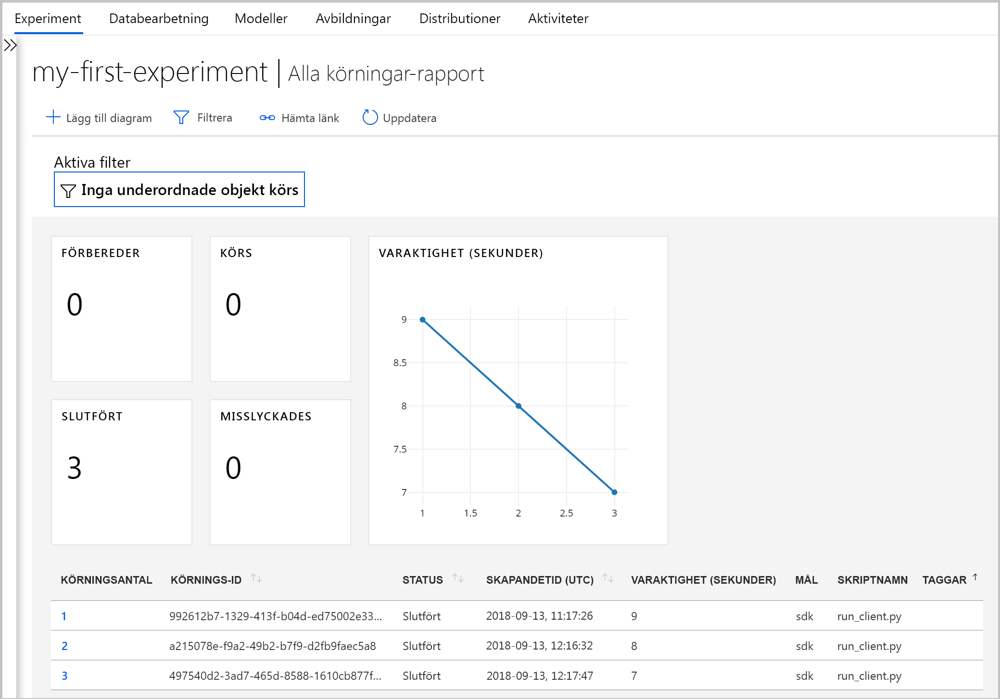
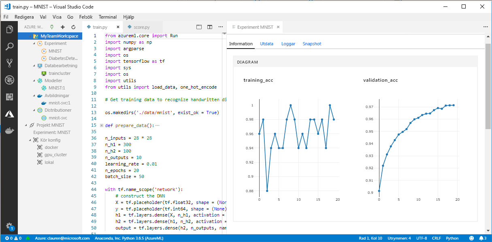

# <a name="what-happened-to-azure-machine-learning-workbench"></a>Vad hände med Azure Machine Learning Workbench?

Azure Machine Learning Workbench-programmet och vissa andra tidiga funktioner togs bort och ersattes i versionen från september 2018 för att frigöra plats för en förbättrad [arkitektur](concept-azure-machine-learning-architecture.md). 

För att förbättra upplevelsen innehåller versionen många viktiga uppdateringar som baseras på feedback från kunder. Grundläggande funktioner från experimentkörningar till modelldistribution har inte förändrats. Men du kan nu använda den robusta <a href="https://aka.ms/aml-sdk" target="_blank">SDK</a> och [Azure CLI](reference-azure-machine-learning-cli.md) för att utföra dina maskininlärningsaktiviteter och pipelines.  

De flesta av de artefakter som skapades i den tidigare versionen av Azure Machine Learning Service lagras i din egen lokala lagring eller molnlagring. Dessa artefakter försvinner aldrig.

I den här artikeln får lära du dig om vad som ändrats och hur det påverkar ditt befintliga arbete med Azure Machine Learning Workbench och dess API:er.

>[!Warning]
>Den här artikeln är inte avsedd för Azure Machine Learning Studio-användare. Den är till för Azure Machine Learning-tjänstkunder som har installerat Workbench-programmet (förhandsversionen) och/eller har konton för experimentering och förhandsgranskning av modellhantering.


## <a name="what-changed"></a>Vad har ändrats?

Den senaste versionen av Azure Machine Learning Service innehåller följande funktioner:
+ En [förenklad Azure-resursmodell](concept-azure-machine-learning-architecture.md).
+ Ett [nytt användargränssnitt för portalen](how-to-track-experiments.md) för att hantera experiment och beräkningsmål.
+ Ett nytt och mer omfattande Python <a href="https://aka.ms/aml-sdk" target="_blank">SDK</a>.
+ Det nya, utökade [Azure CLI-tillägget](reference-azure-machine-learning-cli.md) för maskininlärning.

[Arkitekturen](concept-azure-machine-learning-architecture.md) har gjorts om för enklare användning. I stället för flera Azure-resurser och konton behöver du bara en [Azure Machine Learning-tjänstarbetsyta](concept-azure-machine-learning-architecture.md#workspace). Du kan snabbt skapa arbetsytor i [Azure portal]\((setup-create-workspace.md#portal). Genom att använda en arbetsyta kan flera användare lagra tränings- och distributionsberäkningsmål, modellexperiment, Docker-avbildningar, distribuerade modeller och så vidare.

Även om det finns nya förbättrade CLI- och SDK-klienter i den aktuella versionen, har själva Workbench-skrivbordsprogrammet tagits ur bruk. Experiment kan hanteras i [instrumentpanelen för arbetsytan i Azure-portalen](how-to-track-experiments.md#view-the-experiment-in-the-azure-portal). Använd instrumentpanelen för att hämta din experimenthistorik, hantera beräkningsmål som är kopplade till din arbetsyta, hantera modeller och Docker-avbildningar och även distribuera webbtjänster.

<a name="timeline"></a>

## <a name="support-timeline"></a>Supporttidslinje

Den 9 januari 2019 upphörde stödet för Machine Learning Workbench-, Azure Machine Learning-experimenterings- och modellhanteringskonton, och associerade SDK och CLI har avslutats. 

Alla nya funktioner är tillgängliga med hjälp av detta <a href="https://aka.ms/aml-sdk" target="_blank">SDK</a>, [kommandoradsgränssnittet](reference-azure-machine-learning-cli.md) och [portalen](setup-create-workspace.md#portal).

## <a name="what-about-run-histories"></a>Vad händer med körhistorik?

Äldre körhistorik är inte längre tillgänglig, men du kan fortfarande visa dina körningar i den senaste versionen. 

Körhistorik kallas nu **experiment**. Du kan samla in modellens experiment och utforska dem med hjälp av SDK, CLI eller Azure Portal.

Portalens instrumentpanel för arbetsytor stöds endast i webbläsarna Microsoft Edge, Chrome och Firefox:

[](./media/overview-what-happened-to-workbench/image001.png#lightbox)

Starta utbildning dina modeller och spåra körhistorik som använder den nya CLI och SDK. Hur du gör visas i [Självstudie: träna modeller med Azure Machine Learning-tjänsten](tutorial-train-models-with-aml.md).

## <a name="can-i-still-prep-data"></a>Går det fortfarande att förbereda data?

Dina befintliga dataförberedelsefiler kan inte överföras till den senaste versionen eftersom vi inte längre har Machine Learning Workbench. Däremot kan du fortfarande förbereda datauppsättningar av valfri storlek för modellering.   

Med datauppsättningar i alla storlekar, kan du använda den [databearbetningspaketet för Azure Machine Learning](https://aka.ms/data-prep-sdk) snabbt förbereda dina data för modellering genom att skriva kod för Python. 

Du kan följa [den här självstudien](tutorial-data-prep.md) för att lära dig mer om hur du använder Azure Machine Learning SDK för dataförberedelse.

## <a name="will-projects-persist"></a>Kommer projekt att bevaras?

Du förlorar inte någon kod eller något arbete. I den äldre versionen är projekt molnentiteter med en lokal katalog. I den senaste versionen kopplar du lokala kataloger till Azure Machine Learning Service-arbetsytan med hjälp av en lokal konfigurationsfil. Se ett [diagram över den senaste arkitekturen](concept-azure-machine-learning-architecture.md).

Mycket av projektinnehållet finns redan på den lokala datorn. Så du behöver bara skapa en konfigurationsfil i denna katalog och referera till den i koden för att ansluta till din arbetsyta. Om du vill använda den lokala katalogen som innehåller filer och skript, ange katalogens namn i den ['experiment.submit'](https://docs.microsoft.com/python/api/azureml-core/azureml.core.experiment.experiment?view=azure-ml-py) Python-kommandot eller med hjälp av den `az ml project attach` CLI-kommando.  Exempel:
```python
run = exp.submit(source_directory = script_folder, script = 'train.py', run_config = run_config_system_managed)
```

[Skapa en arbetsyta](setup-create-workspace.md#portal) att komma igång.

## <a name="what-about-my-registered-models-and-images"></a>Vad händer med mina registrerade modeller och bilder?

De modeller som du registrerade i ditt gamla modellregister måste migreras till din nya arbetsyta om du vill fortsätta att använda dem. För att migrera dina modeller hämtar du modellerna och registrerar dem på nytt i den nya arbetsytan. 

Bilder som du skapade i din gamla avbildningsregister kan inte migreras direkt till den nya arbetsytan. I de flesta fall kan modellen distribueras utan att behöva skapa en avbildning. Om det behövs kan du skapa en avbildning för modellen i den nya arbetsytan. Mer information finns i [hantera, registrera, distribuera och övervaka maskininlärningsmodeller](concept-model-management-and-deployment.md).

## <a name="what-about-deployed-web-services"></a>Vad händer med distribuerade webbtjänster?

När nu stödet för det äldre kommandoradsgränssnittet har upphört kan du inte längre distribuera om modeller eller hantera webbtjänster som du ursprungligen har distribuerat med ditt modellhanteringskonto. Dessa webbtjänster kommer dock fortsätta att fungera så länge det finns stöd för Azure Container Service (ACS).

I den senaste versionen distribueras modeller som webbtjänster till Azure Container Instances (ACI) eller Azure Kubernetes Service-kluster (AKS). Du kan även distribuera till FPGA och till Azure IoT Edge. 

Mer information finns i följande artiklar:
+ [Var och hur du distribuerar modeller](how-to-deploy-and-where.md)
+ [Självstudie: Distribuera modeller i Azure Machine Learning-tjänsten](tutorial-deploy-models-with-aml.md)

## <a name="what-about-the-old-sdk-and-cli"></a>Vad gäller för den gamla SDK:n och CLI?

Ja, de fortsätter att fungera fram till januari. Se föregående [tidslinje](#timeline). Vi rekommenderar att du börjar skapa dina nya experiment och modeller med den senaste SDK:n eller CLI.

Genom att använda den nya Python SDK:n i den senaste versionen kan du interagera med Azure Machine Learning Service i alla Python-miljöer. Lär dig hur du installerar den senast <a href="https://aka.ms/aml-sdk" target="_blank">SDK:n</a>. Du kan också använda det uppdaterade [Azure Machine Learning-tillägget](reference-azure-machine-learning-cli.md) med den omfattande uppsättningen `az ml`-kommandon för att interagera med tjänsten i valfri kommandoradmiljö, inklusive Azure Cloud Shell.

## <a name="what-about-visual-studio-code-tools-for-ai"></a>Vad gäller för Visual Studio Code Tools för AI?

I den senaste versionen har tillägget bytt namn till Azure Machine Learning för Visual Studio Code. Det har även utökats och förbättrats för att fungera med föregående nya funktioner.

[](./media/overview-what-happened-to-workbench/vscode-big.png#lightbox)

## <a name="what-about-domain-packages"></a>Vad gäller för domänpaket?

Domänpaketen för visuellt innehåll, textanalys och prognostisering kan inte användas med den senaste versionen av Azure Machine Learning. Du kan dock fortfarande skapa och träna modeller för visuellt innehåll, textanalys och prognostisering med den senaste Azure Machine Learning Python-<a href="https://aka.ms/aml-sdk" target="_blank">SDK:n</a>. Om du vill lära dig mer om att migrera befintliga modeller som skapats med visuellt innehåll-, textanalys- och prognostiseringspaket, kontakta[AML-Packages@microsoft.com](mailto:AML-Packages@microsoft.com).

## <a name="next-steps"></a>Nästa steg

Lär dig mer om den [senaste arkitekturen för Azure Machine Learning Service](concept-azure-machine-learning-architecture.md). 

En översikt över tjänsten finns i [Vad är tjänsten Azure Machine Learning?](overview-what-is-azure-ml.md)

En Snabbstart som visar hur du kör ett skript och utforska körningshistoriken för skriptet med den senaste versionen av Azure Machine Learning-tjänsten, försök [Kom igång med Azure Machine Learning-tjänsten](quickstart-run-cloud-notebook.md).

För en mer ingående beskrivning av det här arbetsflödet kan du följa den [fullständiga självstudien](tutorial-train-models-with-aml.md), som innehåller detaljerade anvisningar för att träna och distribuera modeller med Azure Machine Learning-tjänsten. 
