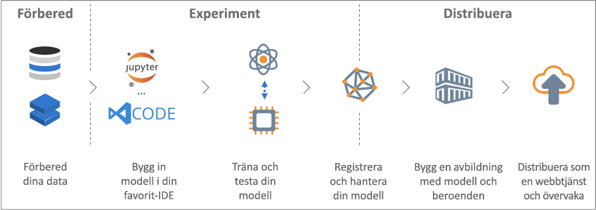

# Vad är tjänsten Azure Machine Learning?

Azure Machine Learning-tjänsten är en molntjänst som du använder för att träna, distribuera, automatisera och hantera maskininlärningsmodeller i den omfattande skala som molnet ger.

## Vad är maskininlärning?

Maskininlärning är en datavetenskapsteknik som gör att datorer kan använda befintliga data för att göra prognoser om framtida beteenden, resultat och trender. Genom att använda maskininlärning kan datorer lära sig utan att vara explicit programmerade.

Prognoser eller förutsägelser från maskininlärning kan göra appar och enheter smartare. När du handlar på nätet kan maskininlärning till exempel användas för att rekommendera andra produkter som du kanske gillar baserat på vad du har köpt. När ditt kreditkort dras används maskininlärning för att jämföra transaktionen med en transaktionsdatabas, vilket gör det lättare att upptäcka bedrägerier. När din robotdammsugare dammsuger ett rum tar den hjälp av maskininlärning för att avgöra om jobbet är klart.

## Vad är tjänsten Azure Machine Learning?

Tjänsten Azure Machine Learning tillhandahåller en molnbaserad miljö som du kan använda för att förbereda data och träna, testa, distribuera, hantera och spåra maskininlärningsmodeller.

[] (./media/overview-what-is-azure-ml/aml.png#lightbox)

Azure Machine Learning-tjänsten har fullständigt stöd för tekniker med öppen källkod. Du kan därför använda tiotusentals Python-paket som är baserade på öppen källkod med komponenter för maskininlärning. Exempel är PyTorch, TensorFlow och scikit-learn.
Stöd för omfattande verktyg gör det enkelt att interaktivt utforska och förbereda data och sedan utveckla och testa modeller. Exempel är [Jupyter-anteckningsböcker](http://jupyter.org) eller tillägget [Azure Machine Learning för Visual Studio Code](https://marketplace.visualstudio.com/items?itemName=ms-toolsai.vscode-ai#overview).
Tjänsten Azure Machine Learning innehåller även funktioner som [automatiserar modellgenereringen och modeljusteringen](tutorial-auto-train-models.md) så att du enkelt och effektivt kan skapa modeller med hög precision.

Genom att använda tjänsten Azure Machine Learning kan du börja träna på den lokala datorn och sedan skala ut till molnet. Tack vare de många tillgängliga [beräkningsmålen](how-to-set-up-training-targets.md), däribland Azure Machine Learning Compute och [Azure Databricks](/azure/azure-databricks/what-is-azure-databricks), och med [tjänster för finjustering av avancerade hyperparametrar](how-to-tune-hyperparameters.md) kan du skapa bättre modeller snabbare genom att använda hela styrkan från molnet.

När du har rätt modell kan du enkelt distribuera den i en container, till exempel Docker. Det är därför enkelt att distribuera till Azure Container Instances eller Azure Kubernetes Service. Du kan också använda containern i dina egna distributioner, antingen lokalt eller i molnet. Mer information finns i artikeln om [hur och var man distribuerar](how-to-deploy-and-where.md).

Du kan hantera de distribuerade modellerna och spåra flera körningar när du experimenterar för att hitta den bästa lösningen.
När modellen har distribuerats kan den returnera förutsägelser i [realtid](how-to-consume-web-service.md) eller [asynkront](how-to-run-batch-predictions.md) på stora mängder data.

Och med avancerade [maskininlärningspipelines](concept-ml-pipelines.md) kan du samarbeta på alla steg för förberedelse av data, modellträning och -utvärdering samt distribution.

## Vad kan jag göra med tjänsten Azure Machine Learning?

Genom att använda <a href="https://aka.ms/aml-sdk" target="_blank">den huvudsakliga Python-SDK:n</a> och <a href="https://aka.ms/data-prep-sdk" target="_blank">SDK för dataförberedelser</a> för Azure Machine Learning samt Python-paket med öppen källkod kan du skapa och själv träna mycket exakta maskininlärnings- och djupinlärningsmodeller på Azure Machine Learning-tjänstens arbetsyta.
Du kan välja bland många maskininlärningskomponenter som är tillgängliga i Python-paket med öppen källkod, såsom följande exempel:

- <a href="https://scikit-learn.org/stable/" target="_blank">Scikit-learn</a>
- <a href="https://www.tensorflow.org" target="_blank">Tensorflow</a>
- <a href="https://pytorch.org" target="_blank">PyTorch</a>
- <a href="https://www.microsoft.com/en-us/cognitive-toolkit/" target="_blank">CNTK</a>
- <a href="http://mxnet.io" target="_blank">MXNet</a>

Azure Machine Learning-tjänsten kan även träna och justera en modell automatiskt.
Ett exempel finns i [Träna en regressionsmodell med automatiserad maskininlärning](tutorial-auto-train-models.md).

När du har en modell kan du bara använda den för att skapa en container, till exempel Docker, som kan distribueras lokalt för testning. När testningen är klar kan du distribuera modellen som en produktionswebbtjänst i antingen Azure Container Instances eller Azure Kubernetes Service. Mer information finns i artikeln om [hur och var man distribuerar](how-to-deploy-and-where.md).

Du kan sedan hantera dina distribuerade modeller med hjälp av [Azure Machine Learning SDK för Python](https://aka.ms/aml-sdk) eller [Azure-portalen](https://portal.azure.com/).
Du kan utvärdera modellmått, träna om och distribuera om nya versioner av modellen samtidigt som du spårar modellens experiment.

Kom igång med tjänsten Azure Machine Learning genom att gå till [Nästa steg](#next-steps).

## Hur skiljer sig tjänsten Azure Machine Learning från Machine Learning Studio?

[Azure Machine Learning Studio](../studio/what-is-ml-studio.md) är en visuell ”dra och släpp”-arbetsyta med samarbetsfunktioner där du kan skapa, testa och distribuera maskininlärningslösningar utan att behöva skriva kod. Den använder fördefinierade och förkonfigurerade maskininlärningsalgoritmer och datahanteringsmoduler.

Använd Machine Learning Studio om du snabbt och enkelt vill experimentera med maskininlärningsmodeller och om de inbyggda maskininlärningsalgoritmerna räcker för dina lösningar.

Använd Machine Learning-tjänsten om du arbetar i en Python-miljö och vill ha mer kontroll över maskininlärningsalgoritmerna eller om du vill använda maskininlärningsbibliotek med öppen källkod.

> [!NOTE]
> Modeller som skapas i Azure Machine Learning Studio kan inte distribueras eller hanteras av Azure Machine Learning-tjänsten.

## Kostnadsfri utvärderingsversion

Om du inte har en Azure-prenumeration kan du skapa ett kostnadsfritt konto innan du börjar. Prova den [kostnadsfria eller betalversionen av Azure Machine Learning-tjänsten](http://aka.ms/AMLFree) i dag.

Du får krediter som du kan använda för att köpa Azure-tjänster. När de är slut kan du behålla kontot och använda [kostnadsfria Azure-tjänster](https://azure.microsoft.com/free/). Ditt kreditkort debiteras aldrig om du inte specifikt ändrar dina inställningar och ber om debitering. Du kan även [aktivera MSDN-prenumerantförmåner](https://azure.microsoft.com/pricing/member-offers/msdn-benefits-details/?WT.mc_id=A261C142F), vilket ger dig krediter varje månad som du kan använda för Azure-betaltjänster.

## Nästa steg

- Skapa en arbetsyta för Machine Learning-tjänsten för att komma igång [med hjälp av Azure-portalen](quickstart-get-started.md) (metoden utan installation) eller [i Python](quickstart-create-workspace-with-python.md) (metoden med SDK-installation).

- Följ de fullständiga självstudierna: 
  + [Träna en modell för bildklassificering med Azure Machine Learning-tjänsten](tutorial-train-models-with-aml.md) 
  + [Förbereda data och använda automatiserad maskininlärning för att automatiskt träna en regressionsmodell](tutorial-data-prep.md)
  
- Förbered dina data med hjälp av [Azure Machine Learning Data Prep SDK](https://aka.ms/data-prep-sdk).

- Lär dig mer om [pipelines för maskininlärning](/azure/machine-learning/service/concept-ml-pipelines) för att skapa, optimera och hantera dina maskininlärningsscenarier.

- Läs den ingående artikeln om [arkitekturen och begrepp för Azure Machine Learning-tjänsten](concept-azure-machine-learning-architecture.md).

- Mer information finns i [andra produkter för maskininlärning från Microsoft](./overview-more-machine-learning.md).
