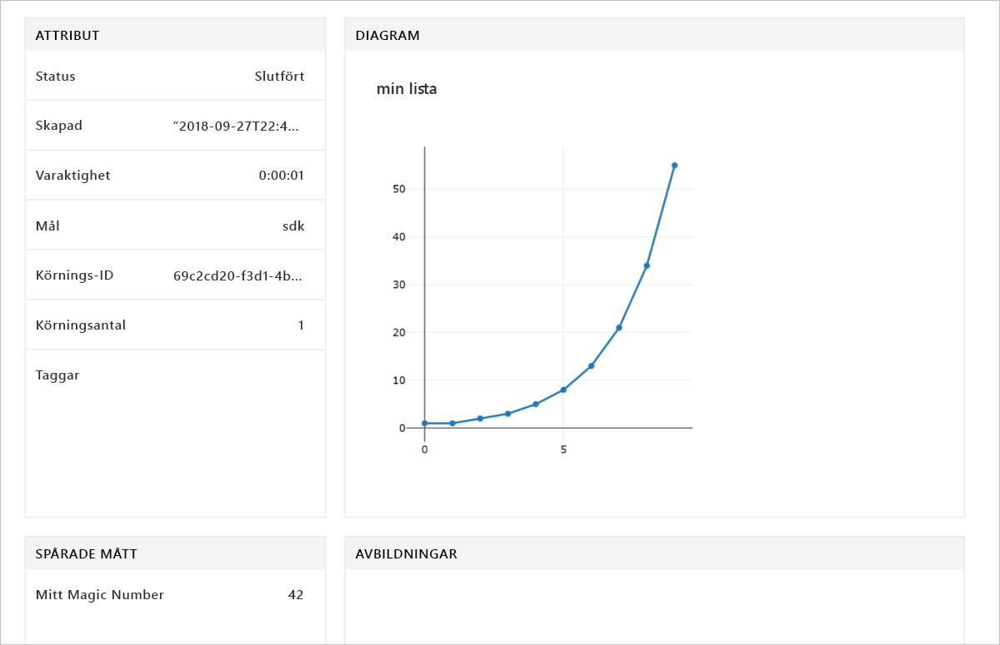

# <a name="quickstart-use-the-python-sdk-to-get-started-with-azure-machine-learning"></a>Snabbstart: Kom igång med Azure Machine Learning med hjälp av Python-SDK:n

I den här artikeln använder du Azure Machine Learning SDK för Python för att skapa och sedan använda en [arbetsyta](concept-azure-machine-learning-architecture.md) för Azure Machine Learning-tjänsten. Den här arbetsytan är själva grunden i det moln som du använder för att experimentera, träna och distribuera maskininlärningsmodeller med Machine Learning. 

Du börjar med att konfigurera din egen Python-miljö och Jupyter Notebook Server. Information om hur du kan köra den utan installation finns i [Snabbstart: Använda Azure-portalen för att komma igång med Azure Machine Learning](quickstart-get-started.md).

> [!VIDEO https://www.microsoft.com/en-us/videoplayer/embed/RE2G9N6]

Den här artikeln innehåller följande avsnitt:
* Installera Python-SDK:n.
* Skapa en arbetsyta i din Azure-prenumeration.
* Skapa en konfigurationsfil för den arbetsytan för senare användning i andra notebooks och skript.
* Skriva kod som loggar värden i arbetsytan.
* Visa de loggade värdena på din arbetsyta.

Du skapar en arbetsyta och en konfigurationsfil som är nödvändiga komponenter för andra självstudier och instruktionsartiklar om Azure Machine Learning. Precis som med andra Azure-tjänster finns det vissa begränsningar och kvoter som är associerade med Machine Learning. [Läs mer om kvoter och hur du begär mer.](how-to-manage-quotas.md)

Följande Azure-resurser läggs automatiskt till din arbetsyta när de är regionalt tillgängliga:
 
- [Azure Container Registry](https://azure.microsoft.com/services/container-registry/)
- [Azure Storage](https://azure.microsoft.com/services/storage/)
- [Azure Application Insights](https://azure.microsoft.com/services/application-insights/) 
- [Azure Key Vault](https://azure.microsoft.com/services/key-vault/)

Om du inte har en Azure-prenumeration kan du skapa ett kostnadsfritt konto innan du börjar. Prova den [kostnadsfria eller betalversionen av Azure Machine Learning-tjänsten](http://aka.ms/AMLFree) i dag.

## <a name="install-the-sdk"></a>Installera SDK:n

> [!IMPORTANT]
> Hoppa över det här avsnittet om du använder en virtuell dator för datavetenskap skapats efter den 27 September 2018.
> Virtuella datorer för datavetenskap som skapats efter det här datumet levereras förinstallerade med Python-SDK:n.

Koden i den här artikeln kräver Azure Machine Learning-SDK-version 1.0.2 eller senare.

Innan du installerar SDK:n rekommenderar vi att du skapar en isolerad Python-miljö. Även om den här artikeln använder [Miniconda](https://conda.io/docs/user-guide/install/index.html) kan du även använda fullständiga [Anaconda](https://www.anaconda.com/) installerat eller [Python virtualenv](https://virtualenv.pypa.io/en/stable/).

### <a name="install-miniconda"></a>Installera Miniconda

[Ladda ned och installera Miniconda](https://conda.io/miniconda.html). Välj Python 3.7 eller senare. Välj inte Python 2.x.

### <a name="create-an-isolated-python-environment"></a>Skapa en isolerad Python-miljö 

1. Öppna ett kommandoradsfönster och skapa sedan en ny conda-miljö med namnet *myenv* med Python 3.6.

    ```shell
    conda create -n myenv -y Python=3.6
    ```

1. Aktivera miljön.

    ```shell
    conda activate myenv
    ```

### <a name="install-the-sdk"></a>Installera SDK:n

I den aktiverade conda-miljön installerar du SDK:n. Den här koden installerar kärnkomponenter för Machine Learning-SDK. Den installerar även en Jupyter Notebook-server i conda-miljön. Installationen tar några minuter att slutföra beroende på datorns konfiguration.

```sh
# Install Jupyter
conda install nb_conda

# Install the base SDK and Jupyter Notebook
pip install azureml-sdk[notebooks]
```

Du kan använda ytterligare nyckelord för att installera andra komponenter i SDK:n:

```sh
# Install the base SDK and auto ml components
pip install azureml-sdk[automl]

# Install the base SDK and the model explainability component
pip install azureml-sdk[explain]

# Install the base SDK and experimental components
pip install azureml-sdk[contrib]
```

Använd istället följande installationskommandot i Azure Databricks-miljön:

```
# Install the base SDK and automl components in the Azure Databricks environment.
# For more information, see https://github.com/Azure/MachineLearningNotebooks/tree/master/databricks.
pip install azureml-sdk[databricks]
```


## <a name="create-a-workspace"></a>Skapa en arbetsyta

1. Du startar Jupyter Notebook genom att ange följande kommando:

    ```shell
    jupyter notebook
    ```

1. I webbläsarfönstret skapar du en ny notebook med hjälp av `Python 3`-standardkernel. 

1. Visa SDK-versionen genom att ange och sedan köra följande Python-kod i en notebook-cell:

   [!code-python[](~/aml-sdk-samples/ignore/doc-qa/quickstart-create-workspace-with-python/quickstart.py?name=import)]

1. Hitta ett värde för `<azure-subscription-id>`-parametern i [prenumerationslistan i Azure Portal](https://ms.portal.azure.com/#blade/Microsoft_Azure_Billing/SubscriptionsBlade). Använda valfri prenumeration där din roll är ägare eller deltagare.

   ```python
   from azureml.core import Workspace
   ws = Workspace.create(name='myworkspace',
                         subscription_id='<azure-subscription-id>', 
                         resource_group='myresourcegroup',
                         create_resource_group=True,
                         location='eastus2' # Or other supported Azure region   
                        )
   ```

   När du kör koden kan du bli uppmanad att logga in på ditt Azure-konto. När du har loggat in cachelagras autentiseringstoken lokalt.

1. Om du vill visa information om arbetsytan, t.ex. associerad lagring, containerregister eller nyckelvalv, anger du följande kod:

    [!code-python[](~/aml-sdk-samples/ignore/doc-qa/quickstart-create-workspace-with-python/quickstart.py?name=getDetails)]


## <a name="write-a-configuration-file"></a>Skriva en konfigurationsfil

Spara informationen om arbetsytan i en konfigurationsfil i den aktuella katalogen. Den här filen kallas *aml_config\config.json*.  

Den här konfigurationsfilen för arbetsyta gör det enkelt att läsa in samma arbetsyta senare. Du kan läsa in den med andra notebooks och skript i samma katalog eller en underkatalog. 

[!code-python[](~/aml-sdk-samples/ignore/doc-qa/quickstart-create-workspace-with-python/quickstart.py?name=writeConfig)]

API-anropet `write_config()` skapar konfigurationsfilen i den aktuella katalogen. Filen *config.json* innehåller följande skript:

```json
{
    "subscription_id": "<azure-subscription-id>",
    "resource_group": "myresourcegroup",
    "workspace_name": "myworkspace"
}
```

## <a name="use-the-workspace"></a>Använda arbetsytan

Skriva en del kod som använder de grundläggande API:erna i SDK:n för att spåra experimentkörningar.

[!code-python[](~/aml-sdk-samples/ignore/doc-qa/quickstart-create-workspace-with-python/quickstart.py?name=useWs)]

## <a name="view-logged-results"></a>Visa loggade resultat
När körningen är klar kan du visa experimentkörningen på Azure-portalen. Om du vill skriva ut en URL som navigerar till resultatet för den senaste körningen använder du följande kod:

```python
print(run.get_portal_url())
```

Använd länken för att visa de loggade värdena på Azure-portalen i webbläsaren.



## <a name="clean-up-resources"></a>Rensa resurser 
>[!IMPORTANT]
>Du kan använda resurserna som du har skapat här som förhandskrav för andra självstudier och instruktionsartiklar om Machine Learning.

Om du inte planerar att använda de resurser som du skapade i den här artikeln kan du ta bort dem så att du undviker eventuella kostnader.

[!code-python[](~/aml-sdk-samples/ignore/doc-qa/quickstart-create-workspace-with-python/quickstart.py?name=delete)]

## <a name="next-steps"></a>Nästa steg

I den här artikeln har du lärt dig att skapa de resurser som du behöver för att experimentera med och distribuera modeller. Du har kört kod i en notebook och du har utforskat körningshistoriken eller koden på arbetsytan i molnet.

För att kunna använda koden med Machine Learning-självstudierna behöver du ytterligare några paket i din miljö.

1. Stäng din notebook i webbläsaren.
1. Stoppa Jupyter Notebook-servern genom att välja Ctrl+C i kommandoradsfönstret.
1. Installera ytterligare paket.

    ```shell
    conda install -y cython matplotlib scikit-learn pandas numpy
    pip install azureml-sdk[automl]
    ```

När du har installerat de här paketen fortsätter du med självstudierna om att träna och distribuera en modell. 

> [!div class="nextstepaction"]
> [Självstudier: Träna en bildklassificeringsmodell](tutorial-train-models-with-aml.md)

Du kan även utforska [mer avancerade exempel på GitHub](https://aka.ms/aml-notebooks).
