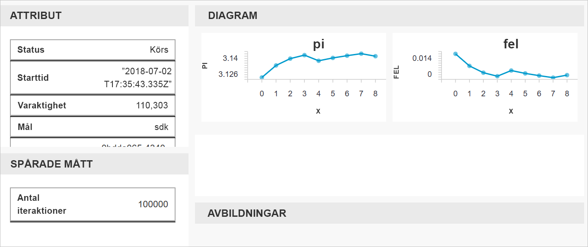

# <a name="quickstart-get-started-with-azure-machine-learning-using-the-cli-extension"></a>Snabbstart: Kom igång med Azure Machine Learning med CLI-tillägget

I den här snabbstarten använder du ett CLI-tillägg för maskininlärning för att komma igång med [Azure Machine Learning-tjänsten](overview-what-is-azure-ml.md) (förhandsversion).

Med hjälp av CLI lär du dig att:

1. Skapa en arbetsyta i din Azure-prenumeration. Arbetsytan används av en eller flera användare för att lagra beräkningsresurser, modeller och distributioner och för att köra historik i molnet.
1. Koppla ett projekt till din arbetsyta.   Ett projekt är en lokal mapp som innehåller de skript och konfigurationsfiler som behövs för att lösa maskininlärningsproblem.  
1. Köra ett Python-skript i projektet för att logga vissa värden i flera iterationer.
1. Visa de loggade värdena i körningshistoriken för din arbetsyta.

> [!NOTE]
> För att underlätta för dig läggs följande Azure-resurser till automatiskt till din arbetsyta om de är tillgängliga i din region: [containerregister](https://azure.microsoft.com/services/container-registry/), [lagring](https://azure.microsoft.com/services/storage/), [programinsikter](https://azure.microsoft.com/services/application-insights/) och [nyckelvalv](https://azure.microsoft.com/services/key-vault/).

De resurser som du skapar kan användas som förutsättningar för andra självstudier och instruktionsartiklar om Azure Machine Learning.

Detta CLI är byggt på den Python-baserade <a href="http://aka.ms/aml-sdk" target="_blank">SDK:n</a> för Azure Machine Learning-tjänsten.

## <a name="prerequisites"></a>Nödvändiga komponenter

Se till att du uppfyller följande förutsättningar innan du börjar med snabbstarten:

+ En Azure-prenumeration. Om du inte har en Azure-prenumeration kan du skapa ett [kostnadsfritt konto](https://azure.microsoft.com/free/?WT.mc_id=A261C142F) innan du börjar.
+ [Python 3.5 eller högre](https://www.python.org/) installerat
+ [Azure CLI](https://docs.microsoft.com/cli/azure/install-azure-cli?view=azure-cli-latest) installerat

## <a name="install-the-cli-extension"></a>Installera CLI-tillägget

Öppna en kommandoradsredigerare på din dator och installera [maskininlärningstillägget för Azure CLI](reference-azure-machine-learning-cli.md).  Det kan ta några minuter för installationen att slutföras.

```azurecli
az extension add azureml-sdk
```

## <a name="install-the-sdk"></a>Installera SDK:n

[!INCLUDE [aml-install-sdk](../../../includes/aml-install-sdk.md)]

## <a name="create-a-resource-group"></a>Skapa en resursgrupp

En resursgrupp är en container som innehåller relaterade resurser för en Azure-lösning. Logga in på Azure med Azure CLI, ange prenumerationen och skapa en resursgrupp.

Öppna en kommandotolk och logga in med Azure CLI-kommandot `az login`. Följ anvisningarna för interaktiv inloggning:
    
   ```azurecli
   az login
   ```

Ange en lista över tillgängliga Azure-prenumerationer och ange vilken du vill använda:
   ```azurecli
   az account list --output table
   az account set --subscription <your-subscription-id>
   az account show
   ```
   där \<your-subscription-id\> är ID-värdet för den prenumeration som du vill använda. Ta inte med hakparenteserna.

Skapa en resursgrupp där arbetsytan ska lagras.
I den här snabbstarten:
   + Namnet på resursgruppen är `docs-aml`.
   + Regionen är `eastus2`. 

   ```azurecli
   az group create -n docs-aml -l eastus2
   ```

## <a name="create-a-workspace-and-a-project-folder"></a>Skapa en arbetsyta och en projektmapp

Öppna kommandotolken och skapa en Azure Machine Learning-arbetsyta under resursgruppen.


   I den här snabbstarten:
   + Arbetsytans namn är `docs-ws`.
   + Resursgruppsnamnet är `docs-aml`

   ```azurecli
   az ml workspace create -n docs-ws -g docs-aml
   ```

I kommandotolken skapar du en mapp på din lokala dator för Azure Machine Learning-projektet.

   ```
   mkdir docs-prj
   cd docs-prj
   ```

## <a name="create-a-python-script"></a>Skapa ett Python-skript

[!INCLUDE [aml-create-script-pi](../../../includes/aml-create-script-pi.md)]

## <a name="run-the-script"></a>Kör skriptet

Koppla mappen till arbetsytan som ett projekt. Argumentet `--history` anger ett namn för körningshistorikfilen som samlar in mätvärden för varje körning.

   ```azurecli
   az ml project attach --history my_history -w docs-ws -g docs-aml
   ```

Kör skriptet på din lokala dator.

   ```azurecli
   az ml run submit -c local pi.py
   ```

   Det här kommandot kör koden och skickar en webblänk till konsolen. Kopiera och klistra in länken i webbläsaren.

Gå till URL:en i en webbläsare. En webbportal visas med resultaten från körningen. Du kan granska resultatet från den här körningen eller från eventuella tidigare körningar.

Portalens instrumentpanel kan endast användas i webbläsarna Edge, Chrome och Firefox.

   

## <a name="clean-up-resources"></a>Rensa resurser

[!INCLUDE [aml-delete-resource-group](../../../includes/aml-delete-resource-group.md)]

## <a name="next-steps"></a>Nästa steg
Nu har du skapat de resurser som krävs för att du ska kunna experimentera och distribuera modeller. Du har även skapat ett projekt, kört ett skript och granskat skriptets körningshistorik.

För mer djupgående beskrivningar av arbetsflödet rekommenderar vi att du går igenom Azure Machine Learning-självstudien om hur du tränar och distribuerar en modell.

> [!div class="nextstepaction"]
> [Självstudie: Skapa, träna och distribuera](tutorial-train-models-with-aml.md)