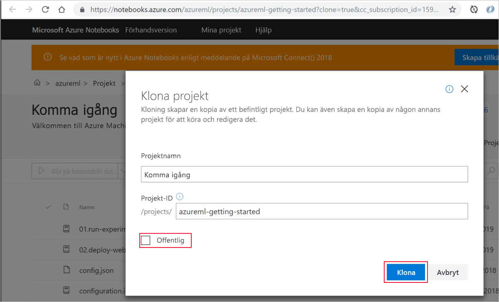
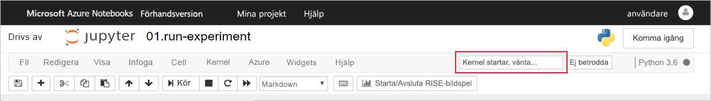

# Snabbstart: Använda Azure-portalen för att komma igång med Azure Machine Learning

Använd Azure-portalen för att skapa en Azure Machine Learning-arbetsyta. Den här arbetsytan är själva grunden i det moln som du använder för att experimentera, träna och distribuera maskininlärningsmodeller med Machine Learning. Den här snabbstarten använder molnresurser och kräver ingen installation. Information om hur du i stället konfigurerar din egen Jupyter Notebooks-server finns i [Snabbstart: Använd Python för att komma igång med Azure Machine Learning](quickstart-create-workspace-with-python.md).  
 
I den här snabbstarten utför du följande åtgärder:

* Skapa en arbetsyta i din Azure-prenumeration.
* Prova den med Python i en Jupyter-anteckningsbok och logga värden över flera iterationer.
* Visa de loggade värdena på din arbetsyta.

Följande Azure-resurser läggs automatiskt till din arbetsyta när de är regionalt tillgängliga:

  - [Azure Container Registry](https://azure.microsoft.com/services/container-registry/)
  - [Azure Storage](https://azure.microsoft.com/services/storage/)
  - [Azure Application Insights](https://azure.microsoft.com/services/application-insights/) 
  - [Azure Key Vault](https://azure.microsoft.com/services/key-vault/)

De resurser som du skapar kan användas som förutsättningar för andra självstudier och instruktionsartiklar om Machine Learning-tjänsten. Som med andra Azure-tjänster finns det begränsningar för vissa resurser som är associerade med Machine Learning. Ett exempel är storleken på beräkningskluster. Läs mer om [standardgränserna och hur du ökar kvoten](how-to-manage-quotas.md).

Om du inte har en Azure-prenumeration kan du skapa ett kostnadsfritt konto innan du börjar. Prova den [kostnadsfria eller betalversionen av Azure Machine Learning-tjänsten](http://aka.ms/AMLFree) idag.

## Skapa en arbetsyta 

[!INCLUDE [aml-create-portal](../../../includes/aml-create-in-portal.md)]

## Använda arbetsytan

> [!VIDEO https://www.microsoft.com/en-us/videoplayer/embed/RE2F9Ad]

Nu kan du lära dig hur en arbetsyta hjälper dig att hantera dina maskininlärningsskript. I det här avsnittet gör du följande:

* Öppna en anteckningsbok i Azure Notebooks.
* Köra kod som skapar vissa loggade värden.
* Visa de loggade värdena på din arbetsyta.

Det här exemplet visar hur arbetsytan kan hjälpa dig att hålla reda på information som genereras i ett skript. 

### Öppna en anteckningsbok 

[Azure Notebooks](https://notebooks.azure.com) tillhandahåller en kostnadsfri molnplattform för Jupyter-anteckningsböcker som är förkonfigurerad med allt du behöver för att köra Machine Learning. Du kan starta den här plattformen från din arbetsyta för att komma igång med Azure Machine Learning-tjänstens arbetsyta.

1. På arbetsytans sida väljer du **Utforska din Azure Machine Learning-tjänstarbetsyta**.

 

1. Välj **Öppna Azure Notebooks** för att testa ditt första experiment i Azure Notebooks.  Azure Notebooks är en separat tjänst som gör att du kan kör Jupyter-anteckningsböcker kostnadsfritt i molnet.  När du använder den här länken till tjänsten läggs information om hur du ansluter till din arbetsyta till i det bibliotek som du skapar i Azure Notebooks.

 

1. Logga in på Azure Notebooks.  Kontrollera att du loggar in med samma konto som du använde för att logga in på Azure-portalen. Din organisation kan kräva [administratörens godkännande](https://notebooks.azure.com/help/signing-up/work-or-school-account/admin-consent) innan du kan logga in.

1. När du har loggat in öppnas en ny flik och en `Clone Library`-fråga visas. När det här biblioteket klonas läser en uppsättning anteckningsböcker och andra filer in på ditt Azure Notebooks-konto.  De här filerna hjälper dig att utforska funktionerna i Azure Machine Learning.

1. Avmarkera **Offentligt** så att du inte delar information om arbetsytan med andra.

1. Välj **Klona**.

 

1. Om du ser att projektstatusen har stoppats klickar du på **Run on Free Computer** (Kör på kostnadsfri dator) för att använda den kostnadsfria anteckningsboksservern.

    

### Köra anteckningsboken

I listan över filer för det här projektet finns en `config.json`-fil. Den här konfigurationsfilen innehåller information om den arbetsyta som du skapade i Azure-portalen.  Den här filen gör att din kod kan ansluta till och lägga till information i arbetsytan.

1. Välj **01.run-experiment.ipynb** för att öppna anteckningsboken.

1. Meddelandefältet uppmanar dig att vänta tills kerneln har startats.  När kerneln är klar försvinner meddelandet.

    

1. När kerneln har startats kör du cellerna en i taget med hjälp av **Skift + RETUR**. Eller så kan du välja **Celler** > **Kör alla** om du vill köra hela anteckningsboken. När du ser en asterisk, __*__, intill en cell innebär det att cellen fortfarande körs. När koden för den cellen är klar visas ett tal. 

1. Följ anvisningarna i anteckningsboken för att autentisera din Azure-prenumeration.

När du har kört alla celler i anteckningsboken kan du visa de loggade värdena på arbetsytan.

## Visa loggade värden

1. Utdata från `run`-cellen innehåller en länk tillbaka till Azure-portalen för att visa experimentresultatet på din arbetsyta. 

    

1. Klicka på **länken till Azure-portalen** för att visa information om körningen på din arbetsyta.  Den här länken öppnar din arbetsyta i Azure-portalen.

1. De linjer med loggade värden som visas skapades automatiskt på arbetsytan. När du loggar flera värden med samma parameter genereras ett diagram automatiskt åt dig.

   

Eftersom koden för att göra en uppskattning av pi använder slumpmässiga värden visar dina diagram olika värden.  

## Rensa resurser 

[!INCLUDE [aml-delete-resource-group](../../../includes/aml-delete-resource-group.md)]

Du kan också behålla resursgruppen men ta bort en enstaka arbetsyta. Visa arbetsytans egenskaper och välj **Ta bort**.

## Nästa steg

Du har skapat nödvändiga resurser för att experimentera med och distribuera modeller. Du har också kört lite kod i en anteckningsbok. Dessutom har du utforskat körningshistoriken från koden på arbetsytan i molnet.

Följ självstudierna om Machine Learning för att träna och distribuera en modell om du vill ha en djupgående arbetsflödesupplevelse:  

> [!div class="nextstepaction"]
> [Självstudier: Träna en bildklassificeringsmodell](tutorial-train-models-with-aml.md)
