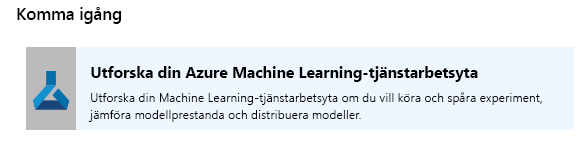
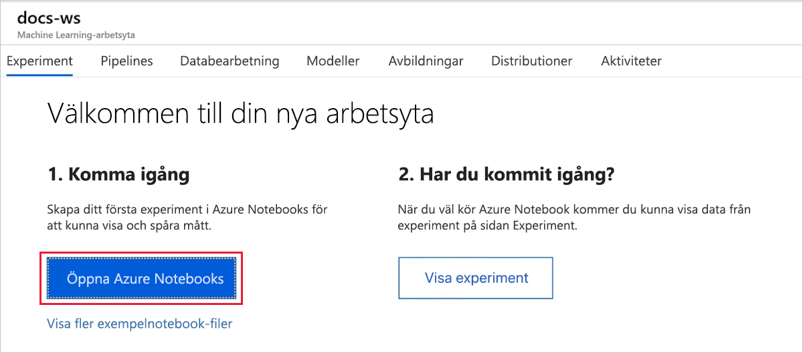
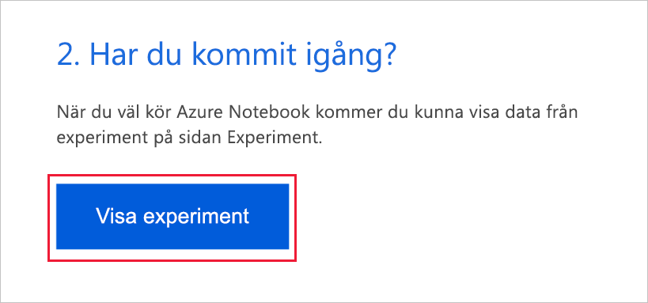
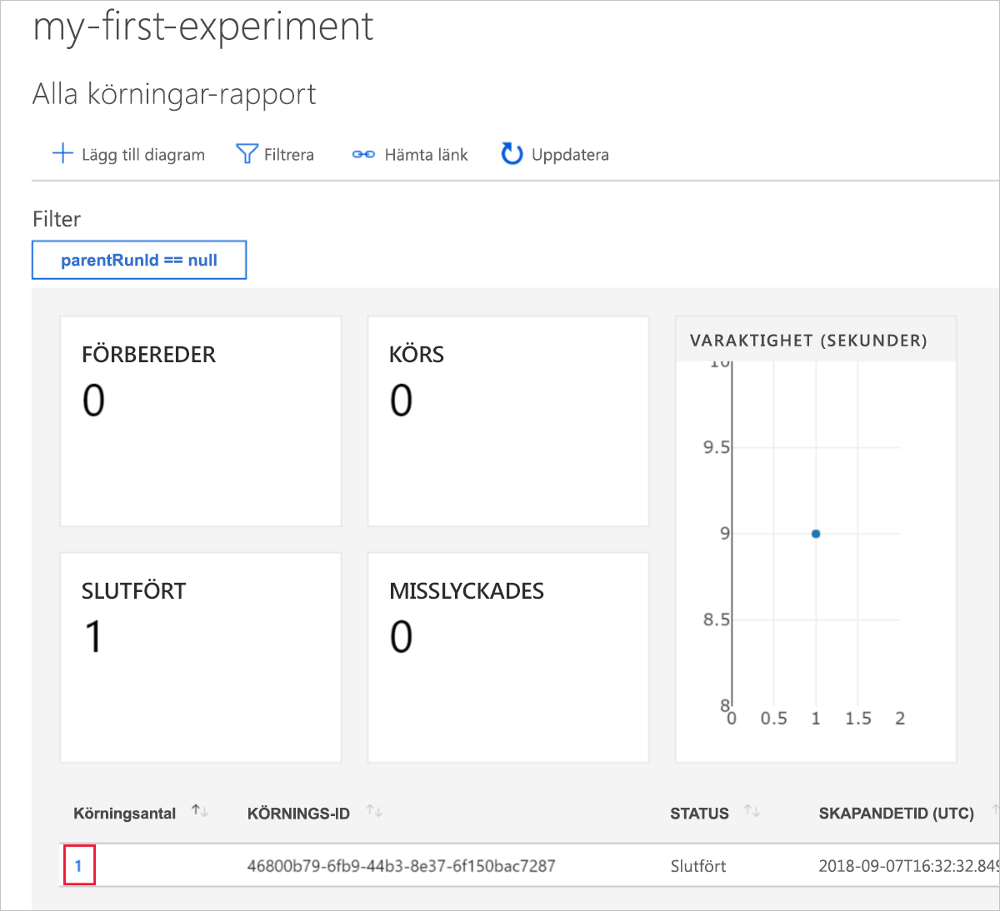
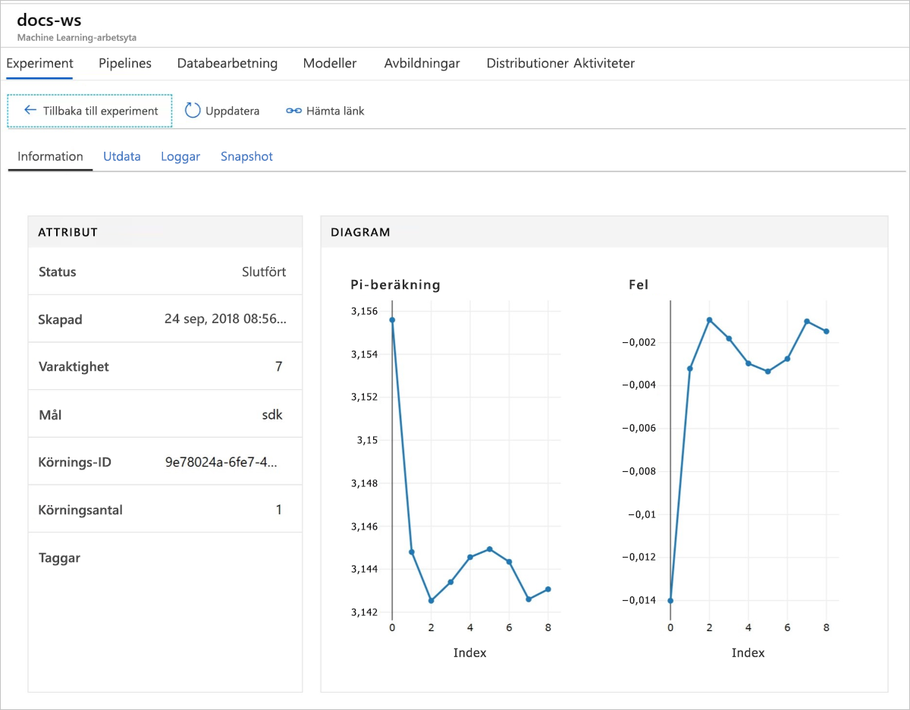

# Snabbstart: Använda Azure-portalen för att komma igång med Azure Machine Learning

I den här snabbstarten ska du använda Azure-portalen för att skapa en Azure Machine Learning-arbetsyta. Den här arbetsytan är själva grunden i det moln som du använder för att experimentera, träna och distribuera maskininlärningsmodeller med Machine Learning. Den här snabbstarten använder molnresurser och kräver ingen installation. Om du istället vill konfigurera en egen Jupyter notebook-server går du till [Snabbstart: Använda Python för att komma igång med Azure Machine Learning](quickstart-create-workspace-with-python.md).

> [!VIDEO https://www.microsoft.com/en-us/videoplayer/embed/RE2F9Ad]

I den här snabbstarten kommer du att göra följande:

* Skapa en arbetsyta i din Azure-prenumeration.
* Prova den med Python i en Azure-anteckningsbok och logga värden över flera iterationer.
* Visa de loggade värdena på din arbetsyta.

Följande Azure-resurser läggs automatiskt till din arbetsyta när de är regionalt tillgängliga:

  - [Azure Container Registry](https://azure.microsoft.com/services/container-registry/)
  - [Azure Storage](https://azure.microsoft.com/services/storage/)
  - [Azure Application Insights](https://azure.microsoft.com/services/application-insights/) 
  - [Azure Key Vault](https://azure.microsoft.com/services/key-vault/)

De resurser som du skapar kan användas som förutsättningar för andra självstudier och instruktionsartiklar om Machine Learning-tjänsten. Som med andra Azure-tjänster finns det begränsningar för vissa resurser som är associerade med Machine Learning. Ett exempel i Azure Batch AI-klusterstorlek. Information om standardgränser och hur du ökar kvoten finns i [den här artikeln](how-to-manage-quotas.md).

Om du inte har en Azure-prenumeration kan du skapa ett [kostnadsfritt konto](https://azure.microsoft.com/free/?WT.mc_id=A261C142F) innan du börjar.

## Skapa en arbetsyta 

[!INCLUDE [aml-create-portal](../../../includes/aml-create-in-portal.md)]

Välj `Explore your Azure Machine Learning service workspace` på sidan för arbetsytan.

 

## Använda arbetsytan

Nu ska vi se hur en arbetsyta hjälper dig att hantera dina maskininlärningsskript. I det här avsnittet får du:

* Öppna en anteckningsbok i Azure Notebooks.
* Köra kod som skapar vissa loggade värden.
* Visa de loggade värdena på din arbetsyta.

Det här exemplet visar hur arbetsytan kan hjälpa dig att hålla reda på information som genereras i ett skript. 

### Öppna en anteckningsbok 

Azure Notebooks tillhandahåller en kostnadsfri molnplattform för Jupyter-anteckningsböcker som är förkonfigurerad med allt du behöver för att köra Machine Learning.  

Välj `Open Azure Notebooks` för att testa ditt första experiment.

 

Din organisation kan kräva [administratörens godkännande](https://notebooks.azure.com/help/signing-up/work-or-school-account/admin-consent) innan du kan logga in.

När du har loggat in öppnas en ny flik och en `Clone Library`-fråga visas. Välj `Clone`

### Köra anteckningsboken

Tillsammans med två anteckningsböcker ser du en `config.json`-fil. Den här konfigurationsfilen innehåller information om arbetsytan som du skapade.  

Välj `01.run-experiment.ipynb` för att öppna anteckningsboken.

Om du vill köra cellerna en i taget använder du `Shift`+`Enter`. Eller välj `Cells` > `Run All` om du vill köra hela anteckningsboken. När du ser en asterisk [*] bredvid en cell körs den. När koden för den cellen är klar visas ett tal. 

När du har slutfört körningen av alla celler i anteckningsboken kan du visa de loggade värdena på arbetsytan.

## Visa loggade värden

När du har kört alla celler i anteckningsboken går du tillbaka till portalsidan.  

Välj `View Experiments`.

Stäng popup-fönstret `Reports`.

Välj `my-first-experiment`.

Visa information om körningen som du precis har utfört. Rulla ned på sidan för att hitta tabellen med körningar. Välj länken för att köra tal.

 

Du ser linjer som skapades automatiskt för de loggade värdena. När du loggar flera värden med samma parameter genereras ett diagram automatiskt åt dig.

   

Eftersom koden för att göra en uppskattning av pi använder slumpmässiga värden visar dina diagram olika värden.  

## Rensa resurser 

[!INCLUDE [aml-delete-resource-group](../../../includes/aml-delete-resource-group.md)]

Du kan också behålla resursgruppen men ta bort en enstaka arbetsyta. Visa arbetsytans egenskaper och välj **Ta bort**.

## Nästa steg

Du har skapat nödvändiga resurser för att experimentera med och distribuera modeller. Du har också kört lite kod i en anteckningsbok. Dessutom har du utforskat körningshistoriken från koden på arbetsytan i molnet.

För mer djupgående beskrivningar av arbetsflödet rekommenderar vi att du går självstudiekurserna om Machine Learning för att träna och distribuera en modell.  

> [!div class="nextstepaction"]
> [Självstudie: Träna en bildklassificeringsmodell](tutorial-train-models-with-aml.md)
