# <a name="quickstart-install-and-get-started-with-azure-machine-learning-services"></a>Snabbstart: Installera och komma igång med Azure Machine Learning-tjänster
Azure Machine Learning-tjänsterna (förhandsversion) är en integrerad lösning från slutpunkt till slutpunkt för avancerade analyser inom dataforskning. Med den här lösningen kan professionella dataforskare få hjälp med att förbereda data, utveckla experiment och distribuera modeller i molnskala.

I den här snabbstarten får du veta hur du:

* Skapa tjänstkonton för Azure Machine Learning-tjänster
* Installera och logga in på Azure Machine Learning Workbench.
* Skapa ett projekt i Workbench
* Köra ett skript i projektet  
* Få åtkomst till kommandoradsgränssnittet (CLI)


Som en del av Microsoft Azure-portföljen kräver Azure Machine Learning-tjänster en Azure-prenumeration. Om du inte har en Azure-prenumeration kan du skapa ett [kostnadsfritt konto](https://azure.microsoft.com/free/?WT.mc_id=A261C142F) innan du börjar.

Du måste dessutom ha rätt behörigheter för att skapa tillgångar som resursgrupper, virtuella datorer med mera. 

<a name="prerequisites"></a>Du kan installera Azure Machine Learning Workbench på följande operativsystem:
- Windows 10 eller Windows Server 2016
- macOS Sierra eller High Sierra

## <a name="create-azure-machine-learning-services-accounts"></a>Skapa konton för Azure Machine Learning-tjänster
Använd Azure Portal till att etablera dina Azure Machine Learning-konton: 
1. Logga in på [Azure-portalen](https://portal.azure.com/) med autentiseringsuppgifterna för den Azure-prenumeration du ska använda. Om du inte har någon Azure-prenumeration kan du skapa ett [kostnadsfritt konto](https://azure.microsoft.com/free/?WT.mc_id=A261C142F) nu. 

   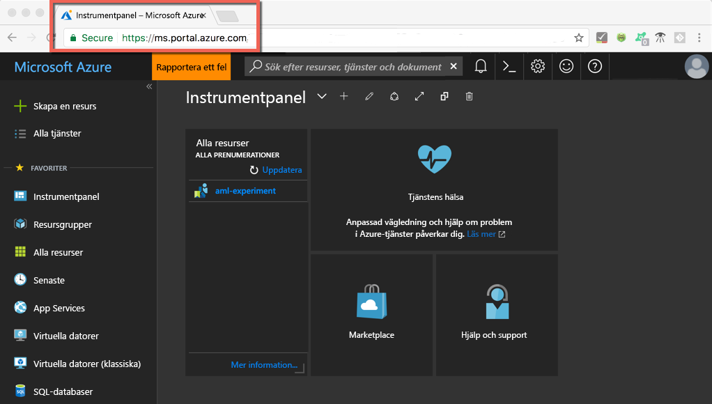

1. Välj knappen **Skapa en resurs** (+) i det övre vänstra hörnet i portalen.

   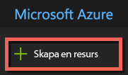

1. Skriv **Machine Learning** i sökfältet. Välj **Machine Learning-experimentering** i sökresultatet. 

   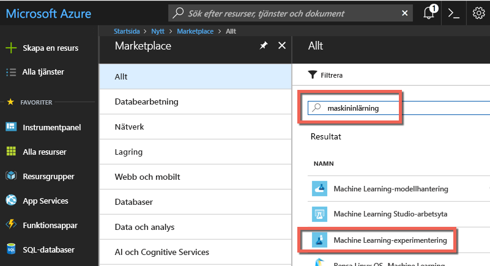

1. I fönstret **Machine Learning-experimentering** bläddrar du längst ned och väljer **Skapa** för att börja definiera experimenteringskontot.  

   

1. I fönstret **ML-experimentering** konfigurerar du ditt Machine Learning-experimenteringskonto. 

   Inställning|Föreslaget värde för självstudien|Beskrivning
   ---|---|---
   Namn på experimenteringskonto | _Unikt namn_ |Ange ett unikt namn som identifierar kontot. Du kan till exempel använda ditt eget namn eller namnet på din avdelning eller ditt projekt. Välj det som bäst identifierar experimentet. Namnet ska bestå av 2 till 32 tecken. Det får endast innehålla alfanumeriska tecken och streck (-). 
   Prenumeration | _Din prenumeration_ |Välj den Azure-prenumeration som ska användas för experimentet. Om du har flera prenumerationer väljer du den prenumeration som resursen ska debiteras till.
   Resursgrupp | _Din resursgrupp_ | Använd en befintlig resursgrupp i din prenumeration eller ange ett namn för att skapa en ny resursgrupp för det här experimenteringskontot. 
   Plats | _Regionen som ligger närmast dina användare_ | Välj den plats som är närmast användarna och dataresurserna.
   Antal platser | 2 | Ange antalet platser. Lär dig hur [platserna påverkar prissättningen](https://azure.microsoft.com/pricing/details/machine-learning/).<br/><br/>I den här snabbstarten behöver du bara två platser. Platser kan läggas till eller tas bort efter behov i Azure-portalen.
   Lagringskonto | _Unikt namn_ | Välj **Skapa nytt** och ange ett namn för att skapa ett [Azure-lagringskonto](https://docs.microsoft.com/azure/storage/common/storage-quickstart-create-account?tabs=portal). Namnet ska innehålla 3–24 tecken och får endast innehålla alfanumeriska tecken. Alternativt kan du välja **Använd befintligt** och välja ett befintligt lagringskonto i listrutan. Lagringskontot är obligatoriskt. Det används för att lagra projektartefakter och köra historikdata. 
   Arbetsyta för experimenteringskonto | IrisGarden<br/>(namnet som används i självstudier) | Ange ett namn på en arbetsyta för det här kontot. Namnet ska bestå av 2 till 32 tecken. Det får endast innehålla alfanumeriska tecken och streck (-). Den här arbetsytan innehåller de verktyg du behöver för att skapa, hantera och publicera experiment.
   Tilldela ägare för arbetsytan | _Ditt konto_ | Välj ditt eget konto som ägare till arbetsytan.
   Skapa modellhanteringskonto | **markering** |Skapa ett konto för modellhantering nu så att resursen är tillgänglig när du vill distribuera och hantera modeller som webbtjänster i realtid. <br/><br/>Även om det är valfritt rekommenderar vi att du skapar modellhanteringskontot samtidigt som experimenteringskontot.
   Kontonamn | _Unikt namn_ | Välj ett unikt namn som identifierar modellhanteringskontot. Du kan till exempel använda ditt eget namn eller namnet på din avdelning eller ditt projekt. Välj det som bäst identifierar experimentet. Namnet ska bestå av 2 till 32 tecken. Det får endast innehålla alfanumeriska tecken och streck (-). 
   Prisnivå för modellhantering | **DEVTEST** | Välj **Ingen prisnivå har valts** för att ange prisnivån för ditt nya modellhanteringskonto. Du kan spara pengar genom att välja prisnivån **DEVTEST**, om den är tillgänglig för din prenumeration (begränsad tillgänglighet). I annat fall väljer du prisnivån S1. Klicka på **Välj** för att spara ditt val av prisnivå. 
   Fäst vid instrumentpanelen | _markering_ | Markera alternativet **Fäst på instrumentpanelen** så att du enkelt kan spåra Machine Learning-experimenteringskontot på instrumentpanelen i Azure Portal.

   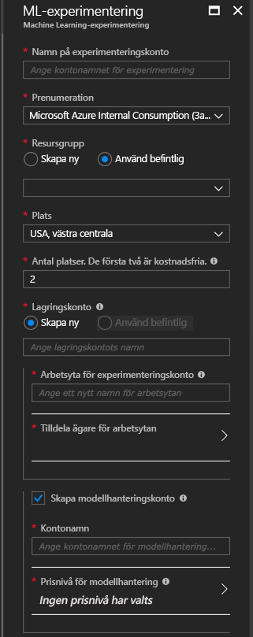

5. Välj **Skapa** för att starta processen att skapa ett experimenteringskonto tillsammans med modellhanteringskontot.

   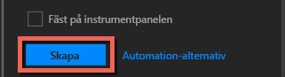

   Det kan ta en stund att skapa ett konto. Du kan kontrollera statusen för distributionen genom att klicka på meddelandeikonen (klockan) i verktygsfältet i Azure Portal.
   
   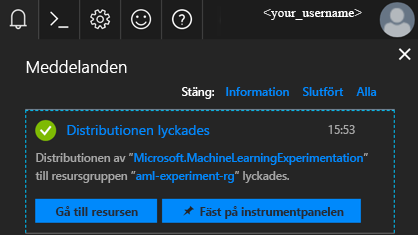


## <a name="install-and-log-in-to-workbench"></a>Installera och logga in på Workbench

Azure Machine Learning Workbench är tillgänglig för Windows eller macOS. Visa en lista med [plattformar som stöds](#prerequisites).

>[!WARNING]
>Installationen kan ta upp till 30 minuter att slutföra. 

1. Ladda ned och starta det senaste installationsprogrammet för Workbench. 
   >[!IMPORTANT]
   >Ladda ned installationsprogrammet till hårddisken och kör programmet därifrån. Kör inte installationsprogrammet direkt i webbläsarens nedladdningswidget.

   **I Windows:** 

   &nbsp;&nbsp;&nbsp;&nbsp;A. Ladda ned [AmlWorkbenchSetup.msi](https://aka.ms/azureml-wb-msi).  <br/>
   &nbsp;&nbsp;&nbsp;&nbsp;B. Dubbelklicka på det nedladdade installationsprogrammet i Utforskaren.

   **I macOS:** 

   &nbsp;&nbsp;&nbsp;&nbsp;A. Ladda ned [AmlWorkbench.dmg](https://aka.ms/azureml-wb-dmg). <br/>
   &nbsp;&nbsp;&nbsp;&nbsp;B. Dubbelklicka på det nedladdade installationsprogrammet i Finder.<br/><br/>

1. Följ anvisningarna på skärmen i installationsprogrammet. 

   **Installationen kan ta upp till 30 minuter att slutföra.**  
   
   | |Installationssökväg till Azure Machine Learning Workbench|
   |--------|------------------------------------------------|
   |Windows|C:\Users\\<user\>\AppData\Local\AmlWorkbench|
   |macOS|/Applications/Azure ML Workbench.app|

   Installationsprogrammet laddar ned och konfigurerar alla beroenden som behövs, till exempel Python, Miniconda och andra relaterade bibliotek. Den här installationen innehåller även Azures plattformsoberoende kommandoradsverktyg, som även kallas Azure CLI.

1. Starta Workbench genom att välja knappen **Launch Workbench** (Starta Workbench) på den sista skärmen i installationsprogrammet. 

   Om du har stängt installationsprogrammet:
   + I Windows startar du **Machine Learning Workbench** med hjälp av genvägen på skrivbordet. 
   + I macOS väljer du **Azure ML Workbench** i startfönstret.

1. På den första skärmen väljer du **Logga in med Microsoft** för att autentisera med Azure Machine Learning Workbench. Använd samma autentiseringsuppgifter som du använde i Azure-portalen för att skapa experimenterings- och modellhanteringskontona. 

   När du har loggat in använder Workbench det första experimenteringskontot som påträffas i dina Azure-prenumerationer och visar alla arbetsytor och projekt som är associerade med det kontot. 

   >[!TIP]
   > Du kan växla till ett annat experimenteringskonto med hjälp av ikonen i det nedre vänstra hörnet i Workbench-fönstret.

## <a name="create-a-project-in-workbench"></a>Skapa ett projekt i Workbench

I Azure Machine Learning är ett projekt en logisk behållare för allt arbete som utförs för att lösa ett problem. Det mappas till en enda mapp på den lokala hårddisken, och du kan lägga till filer eller undermappar till det. 

Här skapar vi ett nytt Workbench-projekt med hjälp av en mall som innehåller [Iris-datamängden](https://en.wikipedia.org/wiki/Iris_flower_data_set). Självstudierna efter den här snabbstarten är beroende av den här informationen för att kunna skapa en modell som beräknar Iris-typen baserat på några av dess fysiska egenskaper.  

1. När Azure Machine Learning Workbench är öppet väljer du plustecknet (+) i fönstret **PROJEKT** och **Nytt projekt**.  

   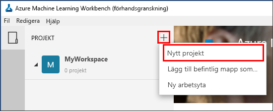

1. Fyll i formulärfälten och välj knappen **Skapa** för att skapa ett nytt projekt i Workbench.

   Fält|Föreslaget värde för självstudien|Beskrivning
   ---|---|---
   Projektnamn | myIris |Ange ett unikt namn som identifierar kontot. Du kan till exempel använda ditt eget namn eller namnet på din avdelning eller ditt projekt. Välj det som bäst identifierar experimentet. Namnet ska bestå av 2 till 32 tecken. Det får endast innehålla alfanumeriska tecken och streck (-). 
   Projektkatalog | c:\Temp\ | Ange i vilken katalogen projektet ska skapas.
   Projektbeskrivning | _lämna tomt_ | Valfritt fält som kan användas för att beskriva projekten.
   URL till GIT-lagringsplats för Visualstudio.com |_lämna tomt_ | Valfritt fält. Ett projekt kan även associeras med en Git-lagringsplats i Visual Studio Team Services för källkontroll och samarbete. [Lär dig hur det konfigureras.](/desktop-workbench/using-git-ml-project#step-3-set-up-a-machine-learning-project-and-git-repo). 
   Vald arbetsyta | IrisGarden (om det finns) | Välj en arbetsyta som du har skapat för ditt experimenteringskonto i Azure Portal. <br/>Om du följde snabbstarten bör du ha en arbetsyta med namnet IrisGarden. Om inte väljer du den som du skapade när du skapade ditt experimenteringskonto eller något annan som du vill använda.
   Projektmall | Klassificera Iris | Mallar innehåller skript och data som du kan använda för att utforska produkten. Den här mallen innehåller de skript och data som behövs för den här snabbstarten och andra självstudier på den här på dokumentationsplatsen. 

   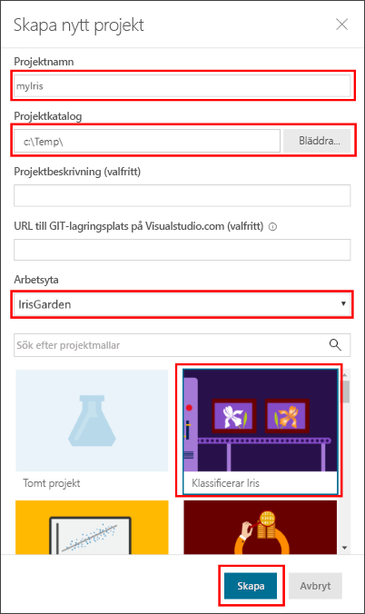
 
 Ett nytt projekt skapas och instrumentpanelen för projektet öppnas med projektet. Nu kan du utforska projektets startsida, datakällor, anteckningsböcker och källkodsfiler. 

>[!TIP]
>Du kan konfigurera att Workbench använder en Python IDE för en smidig dataforskningsutveckling. Du kan sedan interagera med ditt projekt i IDE. [Lär dig mer](../desktop-workbench/how-to-configure-your-ide.md). 

## <a name="run-a-python-script"></a>Köra ett Python-skript

Nu kan du köra skriptet **iris_sklearn.py** på den lokala datorn. Det här skriptet ingår som standard i projektmallen **Klassificera Iris**. Skriptet skapar en modell med [Logistic Regression](https://en.wikipedia.org/wiki/Logistic_regression) från det populära Python-biblioteket [scikit-learn](http://scikit-learn.org/stable/index.html).

1. I kommandofältet överst på sidan **Projektinstrumentpanel** väljer du **local** (lokalt) som körningsmål och **iris_sklearn.py** som det skript som ska köras. Dessa värden är förvalda som standard. 

   Det finns andra filer i exemplet som du kan titta på senare, men i den här snabbstarten är vi bara intresserade av **iris_sklearn.py**. 

   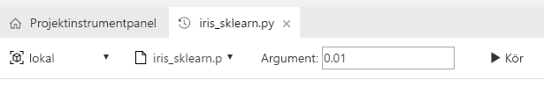

1. Skriv **0.01** i textfältet **Arguments** (Argument). Det här talet motsvarar regulariseringshastigheten och används i skriptet för att ställa in Logistic Regression-modellen. 

1. Välj **Kör** för att starta körningen av skriptet på datorn. Jobbet **iris_sklearn.py** visas omedelbart i panelen **Jobb** till höger så att du kan övervaka skriptkörningen.

   Grattis! Du har nu kört ett Python-skript i Azure Machine Learning Workbench.

1. Upprepa steg 2–3 flera gånger med olika argumentvärden från **0,001** till **10** (till exempel med tiopotens). Varje körning visas i fönstret **Jobb**.

1. Inspektera körningshistoriken genom att välja vyn **Körs** och sedan **iris_sklearn.py** i listan Körs. 

   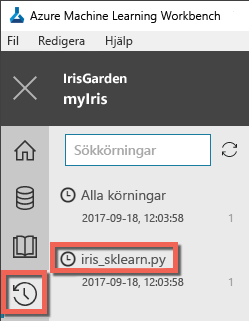

   I den här vyn visas alla körningar som har gjorts på **iris_sklearn.py**. Instrumentpanelen visar också toppmått, en uppsättning standarddiagram och en lista med mått för varje körning. 

1. Du kan anpassa vyn genom att sortera, filtrera och justera konfigurationerna med hjälp av kugghjuls- och filterikonerna.

   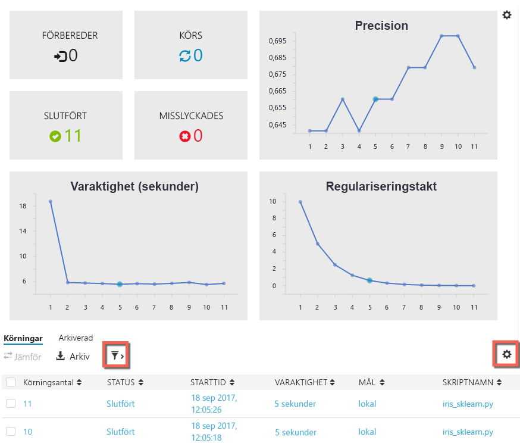

3. Välj en slutförd körning i fönstret Jobb för att se en detaljerad vy av den specifika körningen. Bland den detaljerade informationen finns uppgifter om flera mått, vilka filer som skapades och andra loggar som eventuellt kan komma till användning.

## <a name="start-the-cli"></a>Starta CLI:n

Kommandoradsgränssnittet (CLI) Azure Machine Learning installeras också. Med CLI-gränssnittet får du åtkomst till och kan interagera med dina Azure Machine Learning-tjänster med hjälp av de `az`-kommandon som krävs för att utföra alla uppgifter i ett arbetsflöde för datavetenskap från slutpunkt till slutpunkt. [Läs mer.](../desktop-workbench/tutorial-iris-azure-cli.md)

Du kan starta Azure Machine Learning CLI från verktygsfältet för Workbench med **Arkiv → Öppna kommandotolken**.

Du kan få hjälp med kommandon i Azure Machine Learning CLI med argumentet --help.

```az ml --help```

## <a name="clean-up-resources"></a>Rensa resurser

[!INCLUDE [aml-delete-resource-group](../../../includes/aml-delete-resource-group.md)]

## <a name="next-steps"></a>Nästa steg
Du har nu skapat de Azure Machine Learning-konton som krävs och installerat programmet Azure Machine Learning Workbench. Du har även skapat ett nytt projekt, kört ett skript och utforskat körningshistoriken för skriptet.

Om du vill ha en mer ingående beskrivning av det här arbetsflödet, inklusive hur du distribuerar din Iris-modell som en webbtjänst, kan du följa självstudiekursen *Classifying Iris* (Klassificera Iris). Självstudiekursen innehåller detaljerade steg för [dataförberedelse](../desktop-workbench/tutorial-classifying-iris-part-1.md), [experimentering](../desktop-workbench/tutorial-classifying-iris-part-2.md) och [modellhantering](../desktop-workbench/tutorial-classifying-iris-part-3.md). 

> [!div class="nextstepaction"]
> [Självstudie: Klassificera Iris (del 1)](../desktop-workbench/tutorial-classifying-iris-part-1.md)

>[!NOTE]
> Även om du har skapat modellhanteringskontot är din miljö inte konfigurerad för att distribuera webbtjänster än. Lär dig hur du konfigurerar din [distributionsmiljö](../desktop-workbench/deployment-setup-configuration.md).
