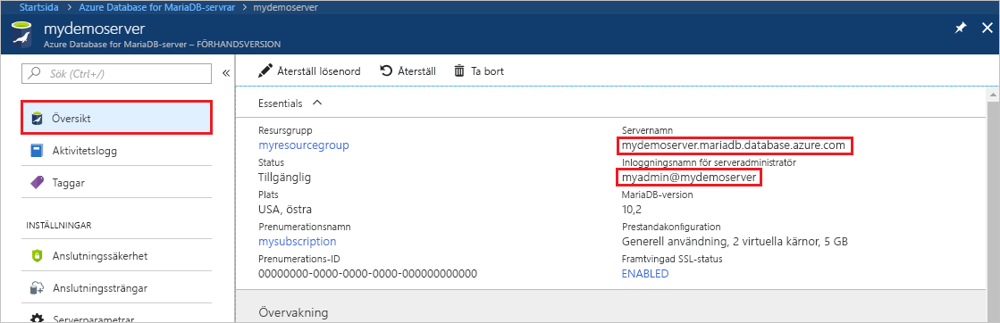
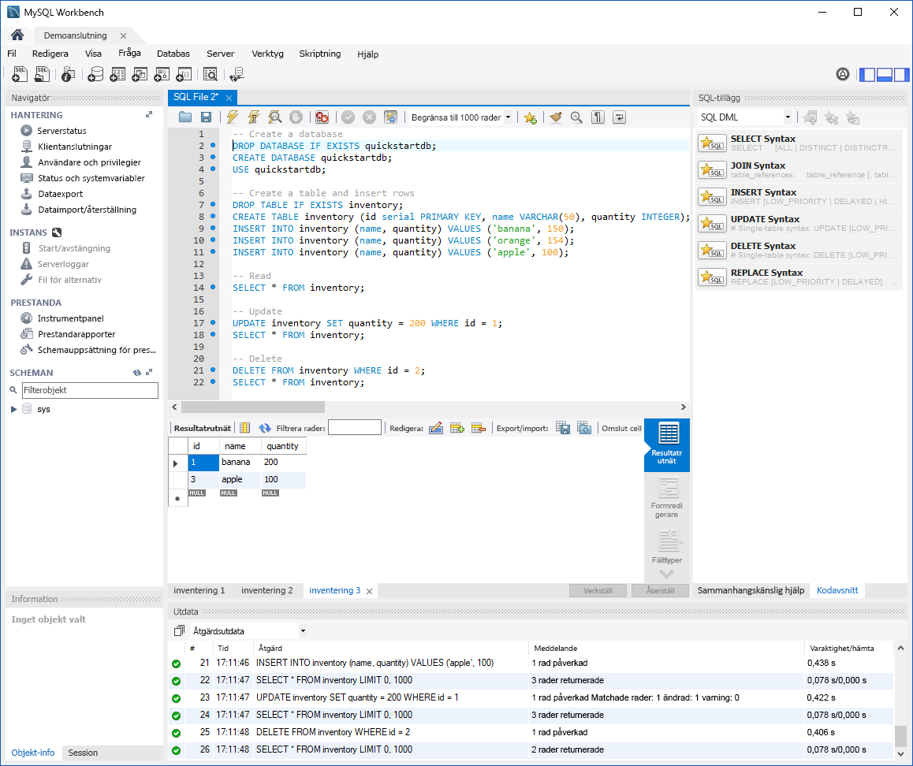

# <a name="quickstart-azure-database-for-mariadb-use-mysql-workbench-to-connect-and-query-data"></a>Snabb start: Azure Database for MariaDB: Använd MySQL Workbench för att ansluta och fråga efter data

Den här snabbstarten visar hur du ansluter till en Azure Database for MariaDB-instans med MySQL Workbench. 

## <a name="prerequisites"></a>Förutsättningar

I den här snabbstarten används de resurser som skapades i någon av följande guider som utgångspunkt:

- [Skapa en Azure Database for MariaDB-server med Azure-portalen](./quickstart-create-mariadb-server-database-using-azure-portal.md)
- [Skapa en Azure Database for MariaDB-server med Azure CLI](./quickstart-create-mariadb-server-database-using-azure-cli.md)

## <a name="install-mysql-workbench"></a>Installera MySQL Workbench

[Ladda ned MySQL Workbench](https://dev.mysql.com/downloads/workbench/) och installera det på din dator.

## <a name="get-connection-information"></a>Hämta anslutningsinformation

Skaffa den information som du behöver för att ansluta till Azure Database för MariaDB-instansen. Du behöver det fullständiga servernamnet och inloggningsuppgifter.

1. Logga in på [Azure-portalen](https://portal.azure.com/).

2. Välj **Alla resurser** på menyn längst till vänster i Azure-portalen. Sök sedan efter den server som du skapade (som **mydemoserver** ).

3. Välj servernamnet.

4. På serverns **översiktssida** noterar du värdena för **Servernamn** och **Inloggningsnamn för serveradministratören**. Om du glömmer lösenordet kan du även återställa det på den här sidan.

   

## <a name="connect-to-the-server-by-using-mysql-workbench"></a>Ansluta till servern med MySQL Workbench

För att ansluta till en Azure Database for MariaDB-server med MySQL Workbench gör du följande:

1. Öppna MySQL Workbench på datorn. 

2. I dialogrutan **Konfigurera ny anslutning** anger du följande information på fliken **Parametrar** :

   | Inställning | Föreslaget värde | Fältbeskrivning |
   |---|---|---|
   |   Anslutningsnamn | **Demoanslutning** | Ange ett namn på anslutningen. |
   | Anslutningsmetod | **Standard (TCP/IP)** | Standard (TCP/IP) är tillräckligt. |
   | Värdnamn | *Server namn* | Ange det servernamnsvärde som du använde när du skapade Azure Database for MariaDB-instansen. Exempelservern är **mydemoserver.mariadb.database.azure.com**. Använd det fullständiga domännamnet (\*.mariadb.database.azure.com) som i det här exemplet. Om du inte kommer ihåg namnet på servern följer du anvisningarna i föregående avsnitt för att hitta anslutningsinformation.  |
   | Port | **3306** | Använd alltid port 3306 när du ansluter till Azure Database för MariaDB. |
   | Användarnamn |  *inloggnings namn för Server administratör* | Ange inloggningen för serveradministratör som du har använt för att skapa Azure Database for MariaDB-instans. Vårt exempel användar namn är **\@ mydemoserver**. Om du inte kommer ihåg inloggningsnamnet som serveradministratör följer du anvisningarna i föregående avsnitt för att hitta anslutningsinformationen. Formatet är *användar namn \@ Server* namn.
   | Lösenord | *ditt lösen ord* | Klicka på knappen **Spara i valvet** för att spara lösenordet. |

   

3. Välj **Testanslutning** för att kontrollera att alla parametrar är rätt konfigurerade. 

4. Välj **OK** för att spara anslutningen. 

5. Under **MySQL-anslutningar** väljer du panelen som motsvarar din server. Vänta tills anslutningen har upprättats.

   En ny SQL-flik öppnas med en tom redigerare där du kan ange dina frågor.
    
   > [!NOTE]
   > SSL-anslutningssäkerhet krävs som standard och framtvingas på Azure Database for MariaDB-servern. Men vanligtvis krävs ingen ytterligare konfiguration med SSL-certifikat för att MySQL Workbench ska ansluta till servern. Vi rekommenderar att du binder ihop SSL CA-certifieringen med MySQL Workbench. Om du vill inaktivera SSL går du till översiktssidan i Azure-portalen och väljer **Anslutningssäkerhet** på menyn. Vid **Framtvinga SSL-anslutning** väljer du **Inaktiverad**.

## <a name="create-table-and-insert-read-update-and-delete-data"></a>Skapa tabell och infoga, läsa, uppdatera och ta bort data

1. Kopiera och klistra in följande SQL-exempelkod på sidan med en tom SQL-flik för att visa exempeldata.

    Den här koden skapar en tom databas med namnet **quickstartdb**. Sedan skapar den en exempeltabell med namnet **inventory**. Koden infogar vissa rader och läser sedan raderna. Den ändrar data med en update-instruktion och läser raderna igen. Koden tar slutligen bort en rad och läser sedan raderna igen.
    
    ```sql
    -- Create a database
    -- DROP DATABASE IF EXISTS quickstartdb;
    CREATE DATABASE quickstartdb;
    USE quickstartdb;
    
    -- Create a table and insert rows
    DROP TABLE IF EXISTS inventory;
    CREATE TABLE inventory (id serial PRIMARY KEY, name VARCHAR(50), quantity INTEGER);
    INSERT INTO inventory (name, quantity) VALUES ('banana', 150);
    INSERT INTO inventory (name, quantity) VALUES ('orange', 154);
    INSERT INTO inventory (name, quantity) VALUES ('apple', 100);
    
    -- Read
    SELECT * FROM inventory;
    
    -- Update
    UPDATE inventory SET quantity = 200 WHERE id = 1;
    SELECT * FROM inventory;
    
    -- Delete
    DELETE FROM inventory WHERE id = 2;
    SELECT * FROM inventory;
    ```

    Skärmbilden visar ett exempel på SQL-koden i MySQL Workbench och utdata efter att den har körts:
    
    

2. Om du vill köra SQL-exempelkoden klickar du på blixtikonen i verktygsfältet på fliken **SQL-fil**.
3. Lägg märke till de tre resultaten med flikar i avsnittet med **rutnätet med resultat** mitt på sidan. 
4. Lägg märke till listan **Output** (Utdata) längst ned på sidan. Status för varje kommando visas. 

I den här snabbstarten har du anslutit till Azure Database for MariaDB med MySQL Workbench, och du har frågat data med hjälp av SQL-språket.

<!--
## Next steps
> [!div class="nextstepaction"]
> [Migrate your database using Export and Import](./concepts-migrate-import-export.md)
-->
