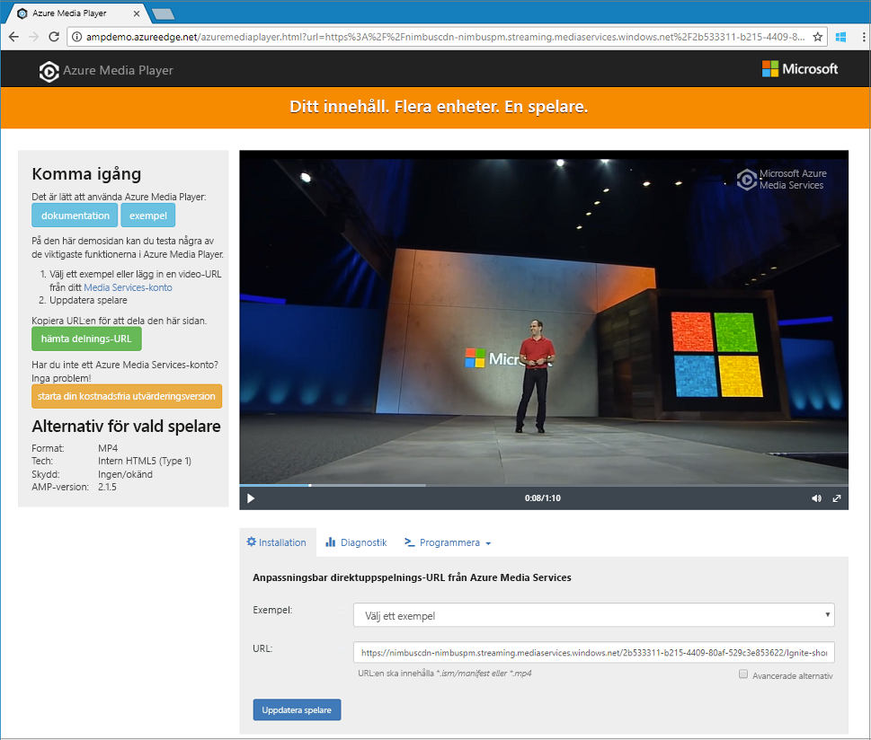

# <a name="quickstart-stream-video-files---cli"></a>Snabbstart: Strömma videofiler – CLI

Den här snabbstarten visar hur du enkelt koda och strömma videor på en rad olika webbläsare och enheter med hjälp av Azure Media Services och Azure CLI. Du kan ange datainnehållet med hjälp av HTTPS eller SAS URL: er eller sökvägar för filer i Azure Blob storage.

I exemplet i den här artikeln kodar innehåll som du gör tillgängliga via en HTTPS-URL. Media Services v3 stöder inte för närvarande Chunked-kodning över HTTPS-adresser.

I slutet av den här snabbstarten kommer du att kunna strömma en video.  



[!INCLUDE [quickstarts-free-trial-note](../../../includes/quickstarts-free-trial-note.md)]

## <a name="create-a-media-services-account"></a>Skapa ett Media Services-konto

Innan du kan kryptera, koda, analysera, hantera och strömma medieinnehåll i Azure, måste du skapa ett Media Services-konto. Kontot måste vara associerad med en eller flera lagringskonton.

Media Services-kontot och alla tillhörande lagringskonton måste vara i samma Azure-prenumeration. Vi rekommenderar att du använder storage-konton som är på samma plats som Media Services-konto för att begränsa kostnader för svarstid och utgående trafik.

### <a name="create-a-resource-group"></a>Skapa en resursgrupp

```azurecli
az group create -n amsResourceGroup -l westus2
```

### <a name="create-an-azure-storage-account"></a>Skapa ett Azure-lagringskonto

I det här exemplet skapar vi en allmänt v2 Standard LRS-konto.

Om du vill experimentera med lagringskonton använder du `--sku Standard_LRS`. När du väljer en SKU för produktionen, Överväg att använda `--sku Standard_RAGRS`, vilket ger geografiska replikering för affärskontinuitet. Mer information finns i [lagringskonton](https://docs.microsoft.com/cli/azure/storage/account?view=azure-cli-latest).
 
```azurecli
az storage account create -n amsstorageaccount --kind StorageV2 --sku Standard_LRS -l westus2 -g amsResourceGroup
```

### <a name="create-an-azure-media-services-account"></a>Skapa ett Azure Media Services-konto

```azurecli
az ams account create --n amsaccount -g amsResourceGroup --storage-account amsstorageaccount -l westus2
```

Du får ett svar som detta:

```
{
  "id": "/subscriptions/<id>/resourceGroups/amsResourceGroup/providers/Microsoft.Media/mediaservices/amsaccount",
  "location": "West US 2",
  "mediaServiceId": "8b569c2e-d648-4fcb-9035-c7fcc3aa7ddf",
  "name": "amsaccount",
  "resourceGroup": "amsResourceGroupTest",
  "storageAccounts": [
    {
      "id": "/subscriptions/<id>/resourceGroups/amsResourceGroup/providers/Microsoft.Storage/storageAccounts/amsstorageaccount",
      "resourceGroup": "amsResourceGroupTest",
      "type": "Primary"
    }
  ],
  "tags": null,
  "type": "Microsoft.Media/mediaservices"
}
```

## <a name="start-the-streaming-endpoint"></a>Starta slutpunkten för direktuppspelning

Följande Azure CLI-kommando startar standard **Sstreaming Endpoint**.

```azurecli
az ams streaming-endpoint start  -n default -a amsaccount -g amsResourceGroup
```

Du får ett svar som detta:

```
az ams streaming-endpoint start  -n default -a amsaccount -g amsResourceGroup
{
  "accessControl": null,
  "availabilitySetName": null,
  "cdnEnabled": true,
  "cdnProfile": "AzureMediaStreamingPlatformCdnProfile-StandardVerizon",
  "cdnProvider": "StandardVerizon",
  "created": "2019-02-06T21:58:03.604954+00:00",
  "crossSiteAccessPolicies": null,
  "customHostNames": [],
  "description": "",
  "freeTrialEndTime": "2019-02-21T22:05:31.277936+00:00",
  "hostName": "amsaccount-usw22.streaming.media.azure.net",
  "id": "/subscriptions/<id>/resourceGroups/amsResourceGroup/providers/Microsoft.Media/mediaservices/amsaccount/streamingendpoints/default",
  "lastModified": "2019-02-06T21:58:03.604954+00:00",
  "location": "West US 2",
  "maxCacheAge": null,
  "name": "default",
  "provisioningState": "Succeeded",
  "resourceGroup": "amsResourceGroup",
  "resourceState": "Running",
  "scaleUnits": 0,
  "tags": {},
  "type": "Microsoft.Media/mediaservices/streamingEndpoints"
}
```

Om slutpunkten för direktuppspelning körs får det här meddelandet:

```
(InvalidOperation) The server cannot execute the operation in its current state.
```

## <a name="create-a-transform-for-adaptive-bitrate-encoding"></a>Skapa en transformering för kodning med anpassningsbar bithastighet

Skapa en **transformering** för att konfigurera vanliga uppgifter för kodning eller analysering av videor. I det här exemplet göra vi med anpassningsbar bithastighet kodning. Sedan skickar vi ett jobb under transformeringen som vi skapade. Jobbet är begäran till Media Services för att tillämpa transformering på given video eller ljud innehåll indata.

```azurecli
az ams transform create --name testEncodingTransform --preset AdaptiveStreaming --description 'a simple Transform for Adaptive Bitrate Encoding' -g amsResourceGroup -a amsaccount
```

Du får ett svar som detta:

```
{
  "created": "2019-02-15T00:11:18.506019+00:00",
  "description": "a simple Transform for Adaptive Bitrate Encoding",
  "id": "/subscriptions/<id>/resourceGroups/amsResourceGroup/providers/Microsoft.Media/mediaservices/amsaccount/transforms/testEncodingTransform",
  "lastModified": "2019-02-15T00:11:18.506019+00:00",
  "name": "testEncodingTransform",
  "outputs": [
    {
      "onError": "StopProcessingJob",
      "preset": {
        "odatatype": "#Microsoft.Media.BuiltInStandardEncoderPreset",
        "presetName": "AdaptiveStreaming"
      },
      "relativePriority": "Normal"
    }
  ],
  "resourceGroup": "amsResourceGroup",
  "type": "Microsoft.Media/mediaservices/transforms"
}
```

## <a name="create-an-output-asset"></a>Skapa en utdatatillgång

Skapa utdata **tillgången** ska användas som kodningsjobbet jobbs effekt.

```azurecli
az ams asset create -n testOutputAssetName -a amsaccount -g amsResourceGroup
```

Du får ett svar som detta:

```
{
  "alternateId": null,
  "assetId": "96427438-bbce-4a74-ba91-e38179b72f36",
  "container": null,
  "created": "2019-02-14T23:58:19.127000+00:00",
  "description": null,
  "id": "/subscriptions/<id>/resourceGroups/amsResourceGroup/providers/Microsoft.Media/mediaservices/amsaccount/assets/testOutputAssetName",
  "lastModified": "2019-02-14T23:58:19.127000+00:00",
  "name": "testOutputAssetName",
  "resourceGroup": "amsResourceGroup",
  "storageAccountName": "amsstorageaccount",
  "storageEncryptionFormat": "None",
  "type": "Microsoft.Media/mediaservices/assets"
}
```

## <a name="start-a-job-by-using-https-input"></a>Starta ett jobb med hjälp av HTTPS-indata

När du skickar in jobb för att bearbeta videor måste du ange var du hittar indatavideon för Media Services. Ett alternativ är att ange en HTTPS-URL som jobbindata, som visas i det här exemplet.

När du kör `az ams job start` kan du applicera en etikett på jobbets utdata. Du kan sedan använda etiketten för att identifiera vad utdatatillgången avser.

- Om du tilldelar ett värde till etiketten ”---utdataresultat till” assetname = etiketten ”.
- Om du inte anger ett värde till etiketten, anger du ”---utdataresultat till” assetname = ”.

  Observera att vi lägger till ”=” till den `output-assets`.

```azurecli
az ams job start --name testJob001 --transform-name testEncodingTransform --base-uri 'https://nimbuscdn-nimbuspm.streaming.mediaservices.windows.net/2b533311-b215-4409-80af-529c3e853622/' --files 'Ignite-short.mp4' --output-assets testOutputAssetName= -a amsaccount -g amsResourceGroup 
```

Du får ett svar som detta:

```
{
  "correlationData": {},
  "created": "2019-02-15T05:08:26.266104+00:00",
  "description": null,
  "id": "/subscriptions/<id>/resourceGroups/amsResourceGroup/providers/Microsoft.Media/mediaservices/amsaccount/transforms/testEncodingTransform/jobs/testJob001",
  "input": {
    "baseUri": "https://nimbuscdn-nimbuspm.streaming.mediaservices.windows.net/2b533311-b215-4409-80af-529c3e853622/",
    "files": [
      "Ignite-short.mp4"
    ],
    "label": null,
    "odatatype": "#Microsoft.Media.JobInputHttp"
  },
  "lastModified": "2019-02-15T05:08:26.266104+00:00",
  "name": "testJob001",
  "outputs": [
    {
      "assetName": "testOutputAssetName",
      "error": null,
      "label": "",
      "odatatype": "#Microsoft.Media.JobOutputAsset",
      "progress": 0,
      "state": "Queued"
    }
  ],
  "priority": "Normal",
  "resourceGroup": "amsResourceGroup",
  "state": "Queued",
  "type": "Microsoft.Media/mediaservices/transforms/jobs"
}
```

### <a name="check-status"></a>Kontrollera status

Kontrollera status för jobbet på fem minuter. Den bör vara ”klar”. Den är inte klar, kontrollerar igen om några minuter. När den är klar går du till nästa steg och skapa en **Strömningspositionerare**.

```azurecli
az ams job show -a amsaccount -g amsResourceGroup -t testEncodingTransform -n testJob001
```

## <a name="create-a-streaming-locator-and-get-a-path"></a>Skapa en positionerare för direktuppspelning och få en sökväg

När kodningen är klar är nästa steg att göra videon i utdatatillgången tillgänglig för uppspelning till klienterna. Om du vill göra detta måste du först skapa en Strömningspositionerare. Skapa sedan strömmande URL: er som klienter kan använda.

### <a name="create-a-streaming-locator"></a>Skapa en positionerare för direktuppspelning

```azurecli
az ams streaming-locator create -n testStreamingLocator --asset-name testOutputAssetName --streaming-policy-name Predefined_ClearStreamingOnly  -g amsResourceGroup -a amsaccount 
```

Du får ett svar som detta:

```
{
  "alternativeMediaId": null,
  "assetName": "output-3b6d7b1dffe9419fa104b952f7f6ab76",
  "contentKeys": [],
  "created": "2019-02-15T04:35:46.270750+00:00",
  "defaultContentKeyPolicyName": null,
  "endTime": "9999-12-31T23:59:59.999999+00:00",
  "id": "/subscriptions/<id>/resourceGroups/amsResourceGroup/providers/Microsoft.Media/mediaservices/amsaccount/streamingLocators/testStreamingLocator",
  "name": "testStreamingLocator",
  "resourceGroup": "amsResourceGroup",
  "startTime": null,
  "streamingLocatorId": "e01b2be1-5ea4-42ca-ae5d-7fe704a5962f",
  "streamingPolicyName": "Predefined_ClearStreamingOnly",
  "type": "Microsoft.Media/mediaservices/streamingLocators"
}
```

### <a name="get-streaming-locator-paths"></a>Hämta streaming positionerare sökvägar

```azurecli
az ams streaming-locator get-paths -a amsaccount -g amsResourceGroup -n testStreamingLocator
```

Du får ett svar som detta:

```
{
  "downloadPaths": [],
  "streamingPaths": [
    {
      "encryptionScheme": "NoEncryption",
      "paths": [
        "/e01b2be1-5ea4-42ca-ae5d-7fe704a5962f/ignite.ism/manifest(format=m3u8-aapl)"
      ],
      "streamingProtocol": "Hls"
    },
    {
      "encryptionScheme": "NoEncryption",
      "paths": [
        "/e01b2be1-5ea4-42ca-ae5d-7fe704a5962f/ignite.ism/manifest(format=mpd-time-csf)"
      ],
      "streamingProtocol": "Dash"
    },
    {
      "encryptionScheme": "NoEncryption",
      "paths": [
        "/e01b2be1-5ea4-42ca-ae5d-7fe704a5962f/ignite.ism/manifest"
      ],
      "streamingProtocol": "SmoothStreaming"
    }
  ]
}
```

Kopiera HTTP live streaming (HLS) sökväg. I det här fallet den har `/e01b2be1-5ea4-42ca-ae5d-7fe704a5962f/ignite.ism/manifest(format=m3u8-aapl)`.

## <a name="build-the-url"></a>Skapa URL: en 

### <a name="get-the-streaming-endpoint-host-name"></a>Hämta värdnamn för strömmande slutpunkt

```azurecli
az ams streaming-endpoint list -a amsaccount -g amsResourceGroup -n default
```
Kopiera värdet `hostName`. I det här fallet den har `amsaccount-usw22.streaming.media.azure.net`.

### <a name="assemble-the-url"></a>Assemblera URL: en

”https://” + &lt;värde för hostName&gt; + &lt;värde för Hls-sökväg&gt;

Här är ett exempel:

`https://amsaccount-usw22.streaming.media.azure.net/7f19e783-927b-4e0a-a1c0-8a140c49856c/ignite.ism/manifest(format=m3u8-aapl)`

## <a name="test-playback-by-using-azure-media-player"></a>Testa uppspelning med hjälp av Azure Media Player

> [!NOTE]
> Om en spelare finns på en HTTPS-webbplats, se till att starta en URL med ”https”.

1. Öppna en webbläsare och gå till [ https://aka.ms/azuremediaplayer/ ](https://aka.ms/azuremediaplayer/).
2. I den **URL** rutan, klistra in den URL som du skapade i föregående avsnitt. Du kan klistra in URL: en i HLS, Dash eller Smooth format. Azure Media Player används automatiskt en lämplig strömningsprotokoll för uppspelning på din enhet.
3. Välj **uppdatera Player**.

>[!NOTE]
>Azure Media Player kan användas vid testning, men bör inte användas i en produktionsmiljö.

## <a name="clean-up-resources"></a>Rensa resurser

Om du inte längre behöver någon av resurserna i resursgruppen, inklusive medietjänster och storage-konton som du skapade för den här snabbstarten får du ta bort resursgruppen.

Kör följande CLI-kommando:

```azurecli
az group delete --name amsResourceGroup
```

## <a name="see-also"></a>Se också

Se [Jobbfelkoder](https://docs.microsoft.com/rest/api/media/jobs/get#joberrorcode).

## <a name="next-steps"></a>Nästa steg

> [CLI-exempel](cli-samples.md)
