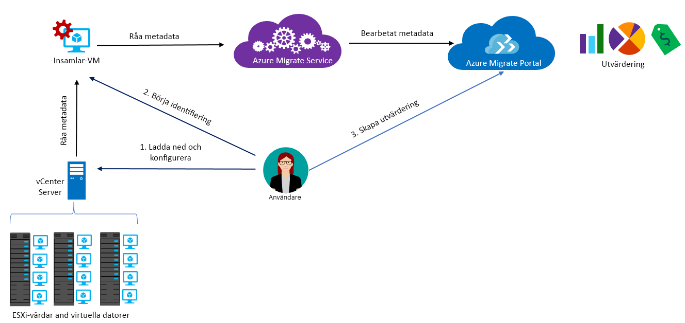

# Om Azure Migrate

Azure Migrate-tjänsten utvärderar lokala arbetsbelastningar för migrering till Azure. Tjänsten utvärderar lokala datorers migreringslämplighet, utför prestandabaserad storleksanpassning och tillhandahåller uppskattningar av vad det kostar att köra lokala datorer i Azure. Om du överväger Lift and Shift-migreringar eller om du är i ett tidigt skede av migreringen är den här tjänsten något för dig. Efter utvärderingen kan du använda tjänster som [Azure Site Recovery](https://docs.microsoft.com/azure/site-recovery/site-recovery-overview) och [Azure Database Migration Service](https://docs.microsoft.com/azure/dms/dms-overview) för att migrera datorerna till Azure.

## Varför ska jag använda Azure Migrate?

Med Azure Migrate får du hjälp med att:

- **Utvärdera Azure-beredskap**: Utvärdera om dina lokala datorer är lämpliga att köra i Azure.
- **Få storleksrekommendationer**: Få storleksrekommendationer för virtuella Azure-datorer baserat på lokala virtuella datorers prestandahistorik.
- **Uppskatta månadskostnader**: Få uppskattade kostnader för att köra lokala virtuella datorer i Azure.  
- **Migrera med hög exakthet**: Visualisera beroenden för lokala datorer för att skapa grupper av datorer som utvärderas och migreras tillsammans.

## Aktuella begränsningar

- För närvarande kan du endast utvärdera lokala virtuella VMware-datorer (VM) för migrering till virtuella Azure-datorer. De virtuella VMware-datorerna måste hanteras av en vCenter Server (version 5.5, 6.0 eller 6.5).
- Om du vill utvärdera virtuella Hyper-datorer och fysiska servrar kan du använda [Distributionshanteraren för Azure Site Recovery](http://aka.ms/asr-dp-hyperv-doc) för Hyper-V och våra [partnerverktyg](https://azure.microsoft.com/migration/partners/) för fysiska datorer.
- Du kan identifiera upp till 1 500 virtuella datorer i en enda identifiering och upp till 1 500 virtuella datorer i ett enda projekt. Dessutom kan du utvärdera upp till 1 500 virtuella datorer i en enda utvärdering.
- Om du vill identifiera en större miljö kan du dela identifieringen och skapa flera projekt. [Läs mer](how-to-scale-assessment.md). Azure Migrate stöder upp till 20 projekt per prenumeration.
- Azure Migrate stöder endast hanterade diskar för migreringsutvärdering.
- Du kan endast skapa ett Azure Migrate-projekt i regionen västra centrala USA. Detta påverkar inte din möjlighet att planera migrering till valfri Azure-målplats. Platsen för ett migreringsprojekt används endast för att lagra metadata som identifieras från den lokala miljön. [Läs mer](https://docs.microsoft.com/azure/migrate/resources-faq#discovery-and-assessment) om metadata som samlas in av Azure Migrate. Insamlade metadata lagras i en av regionerna i den valda [Azure-geografin](https://azure.microsoft.com/global-infrastructure/geographies/):

**Geografi** | **Regioner**
--- | ---
USA | USA, västra centrala, USA, östra

## Vad måste jag betala för?

[Läs mer](https://azure.microsoft.com/pricing/details/azure-migrate/) om priser för Azure Migrate.

## Vad ingår i en utvärdering?

Utvärderingsinställningarna kan anpassas efter dina behov. Utvärderingsegenskaperna sammanfattas i tabellen nedan.

**Egenskap** | **Detaljer**
--- | ---
**Målplats** | Azure-platsen du vill migrera till.  Azure Migrate stöder för närvarande 30 regioner. [Se regioner](https://azure.microsoft.com/global-infrastructure/services/). Målregionen är som standard angiven som USA, västra 2.
**Lagringstyp** | den typ av diskar som du vill tilldela i Azure. Detta gäller när storlekskriteriet är **som lokalt**. Du anger premium (standardinställd) eller standard för hanterad disk som måldisktyp. För prestandabaserat storleksval sker diskstorleksrekommendationen automatiskt baserat på de virtuella datorernas prestanda.
**Ändra storlek på kriterium** | Storleken kan baseras på **prestandahistorik** för lokala virtuella datorer eller **som lokalt** (standard), utan att ta hänsyn till prestandahistorik.
**Azure-erbjudande** | Det [Azure-erbjudande](https://azure.microsoft.com/support/legal/offer-details/) du har registrerat dig för. Azure Migrate beräknar kostnaden enligt detta.
**Azure Hybrid-förmån** | Om du har Software Assurance och är berättigad till [Azure Hybrid-förmån](https://azure.microsoft.com/pricing/hybrid-use-benefit/) med rabatterade kostnader.
**Reserverade instanser** |  Om du har [reserverade instanser](https://azure.microsoft.com/pricing/reserved-vm-instances/) i Azure. Azure Migrate beräknar kostnaden enligt detta.
**VM-drifttid** | Den tid som virtuella datorer körs i Azure. Kostnadsberäkningar görs enligt detta.
**prisnivå** | [Prisnivå (Basic/Standard)](../virtual-machines/windows/sizes-general.md) för Azure-måldatorerna. Om du exempelvis planerar att migrera en produktionsmiljö kan du överväga standardnivån, som tillhandahåller virtuella datorer med låg svarstid men kan kosta mer. Å andra sidan kan du i en testmiljö använda Basic-nivån med längre svarstider och lägre kostnader. Som standard används [standardnivån](../virtual-machines/windows/sizes-general.md).
**Prestandahistorik** | Som standard utvärderar Azure Migrate prestanda för lokala datorer med prestandahistoriken för den sista dagen, med ett percentilvärde på 95 %.
**VM-serie** | Den virtuell dator-serie som används för storleksuppskattningar. Om du till exempel har en produktionsmiljö som du inte planerar att migrera till A-seriens virtuella datorer i Azure kan du utesluta A-serien från listan eller serien. Storleken baseras bara på den valda serien.   
**Komfortfaktor** | Azure Migrate överväger en buffert (komfortfaktor) under utvärderingen. Bufferten tillämpas utöver datorns användningsdata för virtuella datorer (CPU, minne, disk och nätverk). Komfortfaktorn väger in problem som säsongsbaserad användning, kort prestandahistorik och troliga ökningar i kommande användning.   Till exempel resulterar en virtuell dator med 10 kärnor med 20 % användning vanligen i en virtuell dator med 2 kärnor. Med en komfortfaktor på 2.0x blir resultatet istället en virtuell dator med 4 kärnor. Standardkomfortinställningen är 1,3x.

## Hur fungerar Azure Migrate?

1.  Du skapar ett Azure Migrate-projekt.
2.  Azure Migrate använder en lokal virtuell dator som kallas för insamlingsprogram för att upptäcka information om dina lokala datorer. För att skapa programmet laddar du ned en installationsfil i formatet Open Virtualization Appliance (.ova) och importerar den som en virtuell dator på din lokala vCenter-server.
3. Du ansluter till den virtuella datorn via vCenter Server och anger ett nytt lösenord för den vid anslutning.
4. Du kör insamlaren på den virtuella datorn för att inleda identifieringen.
5. Insamlaren samlar in VM-metadata med cmdletar för VMware PowerCLI. Identifierng är agentfri och installerar inte något på VMware-värdar eller virtuella datorer. Insamlade metadata innefattar VM-information (kärnor, minne, diskar, diskstorlekar och nätverksadaptrar). De samlar även in prestandadata för virtuella datorer, däribland CPU- och minnesanvändning, disk-IOPS, diskgenomflöde (Mbit/s) och nätverksutdata (Mbit/s).
5.  Metadata skickas till Azure Migrate-projektet. Du kan visa dem i Azure Portal.
6.  I utvärderingssyfte samlar du de identifierade virtuella datorerna i olika grupper. Du kan exempelvis gruppera virtuella datorer som kör samma program. För mer exakt gruppering kan du använda visualisering av beroenden för att se beroenden för en specifik dator eller för alla datorer i en grupp och sedan ändra gruppen.
7.  När en grupp har definierats kan skapa du en utvärdering för den.
8.  När utvärderingen är klar kan du visa den i portalen eller ladda ned den i Excel-format.

  

## Vilka är portkraven?

I tabellen sammanfattas de portar som behövs för Azure Migrate-kommunikation.

Komponent | Kommunicerar med |  Information
--- | --- |---
Insamlare  | Tjänsten Azure Migrate | Insamlaren ansluter till tjänsten via SSL-port 443.
Insamlare | vCenter Server | Som standard ansluter insamlaren till vCenter-servern på port 443. Om servrarna lyssnar på en annan port konfigurerar du den som en utgående port på VM-insamlaren.
Lokala virtuella datorer | Log Analytics Workspace | [TCP 443] | [Microsoft Monitoring Agent (MMA)](../log-analytics/log-analytics-windows-agent.md) använder TCP-port 443 för att ansluta till Log Analytics. Du behöver bara den här porten om du använder beroendevisualisering, som kräver MMA-agenten.

## Vad händer efter utvärderingen?

När du har utvärderat lokala datorer kan du använda några olika verktyg för att utföra migreringen:

- **Azure Site Recovery**: Du kan använda Azure Site Recovery för att migrera till Azure. Det kan du göra genom att [förbereda Azure-komponenterna](../site-recovery/tutorial-prepare-azure.md) du behöver, bland annat ett lagringskonto och ett virtuellt nätverk. Lokalt [förbereder du VMware-miljön](../site-recovery/vmware-azure-tutorial-prepare-on-premises.md). När allt är förberett konfigurerar och aktiverar du replikering till Azure och migrerar de virtuella datorerna. [Läs mer](../site-recovery/vmware-azure-tutorial.md).
- **Azure Database Migration**: Om de lokala datorerna använder en databas som SQL Server, MySQL eller Oracle kan du använda [Azure Database Migration Service](../dms/dms-overview.md) för att migrera dem till Azure.

## Nästa steg

- [Följ självstudien](tutorial-assessment-vmware.md) för att skapa en utvärdering för en lokal VMware VM.
- [Läs vanliga frågor och svar](resources-faq.md) om Azure Migrate.
