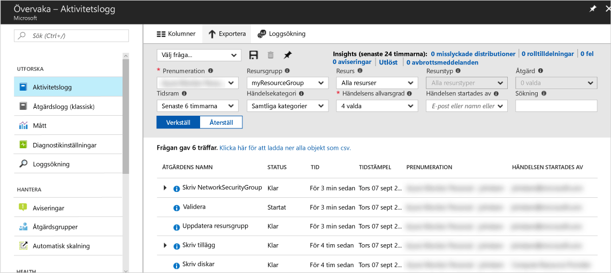
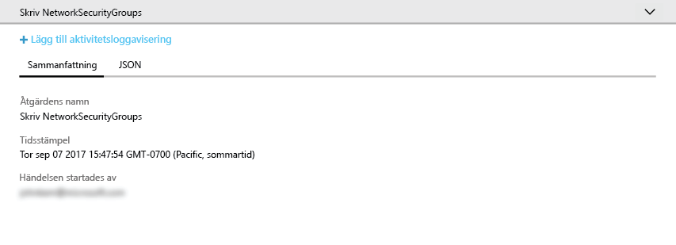
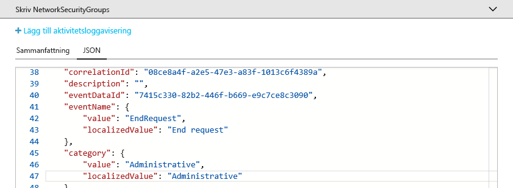
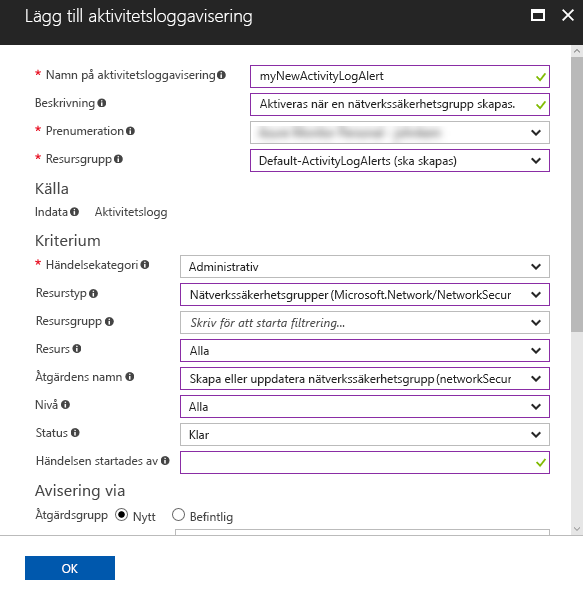
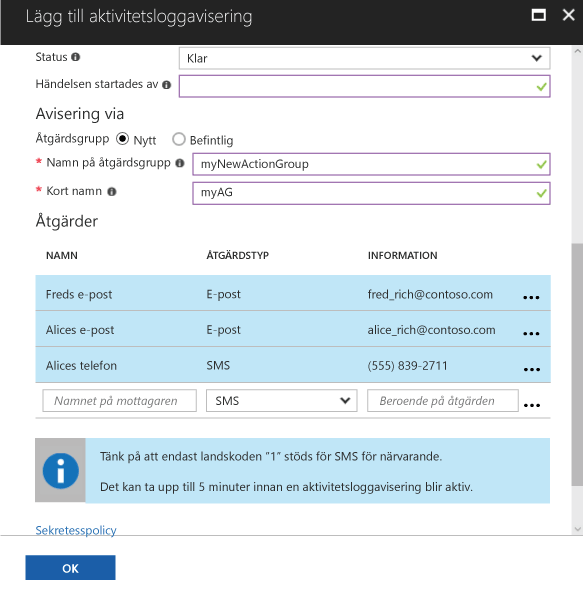

# Granska och ta emot meddelanden om viktiga åtgärder i din Azure-prenumeration

**Azure-aktivitetsloggen** innehåller historik över händelser på prenumerationsnivå i Azure. Loggen visar information om *vem* som har skapat, uppdaterat eller tagit bort *vilka* resurser och *när* det gjordes. Du kan skapa en **aktivitetsloggavisering** så att du får ett e-postmeddelande, SMS eller webhook-meddelande när en aktivitet utförs som matchar dina aviseringsvillkor. Den här snabbstarten visar hur du skapar en enkel nätverkssäkerhetsgrupp, förstår händelser i aktivitetsloggen och skapar en aktivitetsloggaviseringen så att du får ett meddelande när en nätverkssäkerhetsgrupp skapas i framtiden.

Om du inte har en Azure-prenumeration kan du skapa ett [kostnadsfritt](https://azure.microsoft.com/free/) konto innan du börjar.

## Logga in på Azure Portal

Logga in på [Azure-portalen](https://portal.azure.com/).

## Skapa en nätverkssäkerhetsgrupp

1. Klicka på knappen **Skapa en resurs** längst upp till vänster i Azure Portal.

2. Välj **Nätverk** och sedan **Nätverkssäkerhetsgrupp**.

3. Skriv myNetworkSG som **Namn** och skapa en ny resursgrupp med namnet **myResourceGroup**. Klicka på knappen **Skapa**.

    

## Bläddra i aktivitetsloggen i portalen

Nu har en händelse lagts till i aktivitetsloggen som beskriver skapandet av den nya nätverkssäkerhetsgruppen. Identifiera händelsen med hjälp av följande instruktioner.

1. Klicka på knappen **Övervaka** i den vänstra navigeringslistan. Därmed öppnas avsnittet Aktivitetslogg. Avsnittet innehåller historik för alla åtgärder som användare har utfört på resurser i din prenumeration och de kan filtreras efter flera olika egenskaper, till exempel **resursgrupp**, **tidsintervall** och **kategori**.

2. I avsnittet **Aktivitetslogg** klickar du på listrutan **Resursgrupp** och väljer **myResourceGroup**. Ändra värdet i listrutan **Tidsintervall** till **Senaste timmen**. Klicka på **Använd**.

    

3. Klicka på händelsen **Write NetworkSecurityGroups** i händelsetabellen som visas.

## Läsa mer om en händelse i aktivitetsloggen

Avsnittet som visas innehåller grundläggande information om åtgärden som utfördes, till exempel namn och tidsstämpel samt användaren eller programmet som utförde åtgärden.

Klicka på **JSON**-fliken om du vill visa all information om händelsen. Detta innefattar information om användarens eller programmets behörighet att utföra åtgärden, händelsekategorin och nivån samt status för åtgärden.

## Skapa en aktivitetsloggavisering

1. Klicka på fliken **Sammanfattning** för att återgå till händelsesammanfattningen.

2. Klicka på **Lägg till aktivitetsloggavisering** i sammanfattningsavsnittet som visas.

    

3. I avsnittet som visas ger du aktivitetsloggaviseringen ett namn och en beskrivning.

4. Under **Villkor** ser du till att **Händelsekategori** har värdet **Administrativ**, att **Resurstyp** har värdet **Nätverkssäkerhetsgrupper**, att **Åtgärdsnamn** har värdet **Skapa eller uppdatera nätverkssäkerhetsgrupp**, att **Status** har värdet **Lyckades** och att alla andra villkorsfält är tomma eller har värdet **Alla**. Villkoren definierar de regler som används för att avgöra om aviseringen ska aktiveras när en ny händelse visas i aktivitetsloggen.

    

5. Välj **Ny åtgärdsgrupp** under **Meddela via** och ange ett **namn** och ett **kortnamn** för åtgärdsgruppen. Åtgärdsgruppen definierar de åtgärder som vidtas när aviseringen aktiveras (när villkoren matchar en ny händelse).

6. Under **Åtgärder** lägger du till en eller flera åtgärder genom att ange ett **namn** för åtgärden, **åtgärdstyp** (till exempel e-post eller SMS) och **information** för den specifika åtgärdstypen (till exempel en webhook-URL, en e-postadress eller ett SMS-nummer).

    

7. Klicka på **Ok** för att spara aktivitetsloggaviseringen.

## Testa aktivitetsloggaviseringen

> [!NOTE]
> Det tar cirka 10 minuter innan en aktivitetsloggavisering är helt aktiverad. Nya händelser som inträffar innan aktivitetsloggaviseringen är helt aktiverat genererar inte meddelanden.
>
>

Om du vill testa aviseringen upprepar du instruktionerna ovan för att **skapa en nätverkssäkerhetsgrupp**, men ge den här nätverkssäkerhetsgruppen ett annat namn och återanvänd den befintliga resursgruppen. Inom ett par minuter får du ett meddelande om att nätverkssäkerhetsgruppen har skapats.

## Rensa resurser

Ta bort resursgruppen och nätverkssäkerhetsgruppen när de inte längre behövs. Det gör du genom att skriva namnet på resursgruppen som du skapade i sökrutan överst i portalen och klicka på namnet på resursgruppen. I avsnittet som visas klickar du på knappen **Ta bort resursgrupp**, skriver namnet på resursgruppen och klickar på **Ta bort**.

## Nästa steg

I den här snabbstarten har du utfört en åtgärd för att skapa en aktivitetslogghändelse och sedan skapat en aktivitetsloggavisering för att få ett meddelande när åtgärden inträffar igen i framtiden. Sedan testade du aviseringen genom att utföra åtgärden på nytt. Azure tillgängliggör aktivitetslogghändelser från de senaste 90 dagarna. Om du vill spara händelser längre än 90 dagar kan du arkivera aktivitetsloggdata tillsammans med dina övriga övervakningsdata.

> [!div class="nextstepaction"]
> [Arkivera övervakningsdata](./monitor-tutorial-archive-monitoring-data.md)
