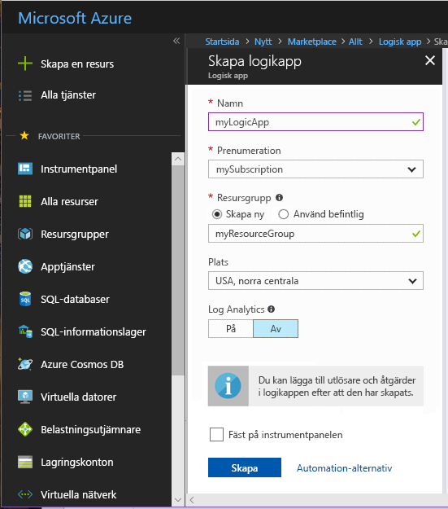
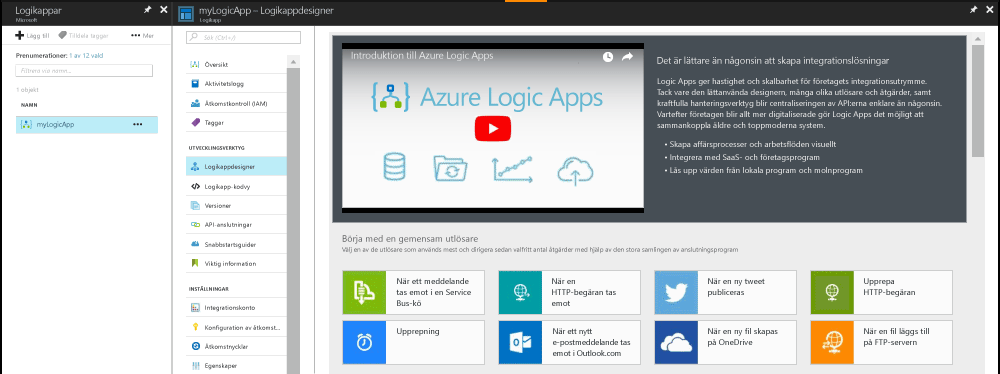
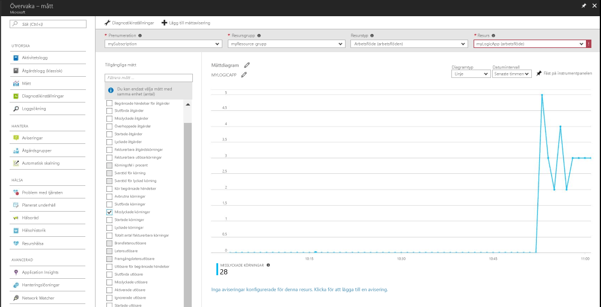
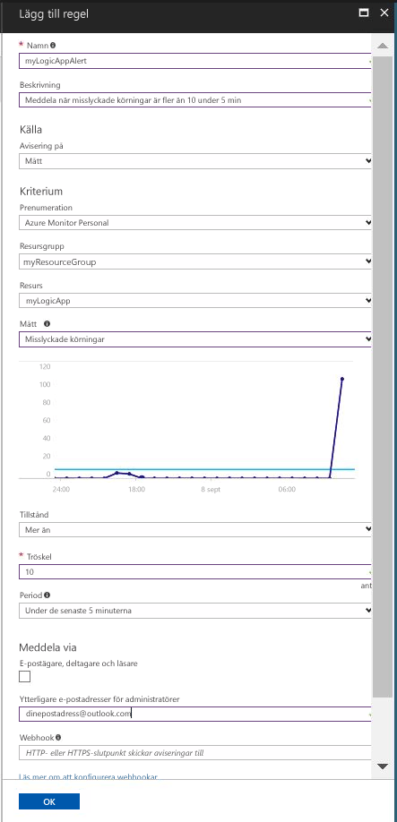

# Ett meddelande när måttvärdet uppfyller ett villkor

Azure-Monitor tillgängliggör mått för många Azure-resurser. De här måtten förmedla prestanda och hälsotillståndet för dessa resurser. I många fall mått peka värden till något är fel med en resurs. Du kan skapa mått aviseringar för att övervaka för onormalt beteende och få en avisering om det inträffar. Den här snabbstartsguide genom att skapa en Logikapp, skapar ett jobb och visualisera mått för logikappen. Därefter skapar en avisering och ta emot ett meddelande för ett mått för resursen Logikapp.

Mer information om mått och mått aviseringar finns [Azure-Monitor mått: översikt](./monitoring-overview-metrics.md) och [översikt över aviseringar i Azure-Monitor](./monitoring-overview-alerts.md). 

Om du inte har en Azure-prenumeration kan du skapa ett [kostnadsfritt](https://azure.microsoft.com/free/) konto innan du börjar.

## Logga in på Azure Portal

Logga in på [Azure Portal](https://portal.azure.com/).

## Skapa en logisk app

1. Klicka på knappen **New** (Nytt) i det övre vänstra hörnet i Azure Portal.

2. Söka efter och välja **Logikapp**. Skapa en ny resursgrupp med namnet **myResourceGroup** använda standardplatsen. Klicka på knappen **Skapa**.

3. Ange information för logiken app och markera den **fäst på instrumentpanelen** alternativet. Klicka på **Skapa** när du är klar.

      

4. Logikappen bör fäst på instrumentpanelen. Navigera till logikappen genom att klicka på den.

5. I panelen Logikapp, Välj den **logik App Designer**

       

6. Ställ in du värden som visas i följande diagram.

    . 

7. I designer väljer den **återkommande** utlösare.

8. Ange ett intervall på 20 och en frekvens som sekund så logikappen utlöses varje 20 sekunder.

9. Klicka på den **nytt steg** och välj **lägga till en åtgärd**.

10. Välj den **HTTP** och välja **HTTP-HTTP-**.

11. Ange den **metoden** som POST och **Uri** till en webbadress som du väljer.

12. Klicka på **Spara**.

## Visa måtten för din logikapp

1. Klicka på den **övervakaren** alternativ i det vänstra navigeringsfönstret.

2. Välj den **mått** fliken, Fyll i den **prenumeration**, **resursgruppen**, **resurstypen** och **resurs** information för din logikapp.

3. Listan över mått, Välj **körs igång**.

4. Ändra den **tidsintervallet** i diagrammet för att visa data för den senaste timmen.

5. Du bör nu se ett diagram rita upp det totala antalet kör logikappen har startats under den senaste timmen.

    

## Skapa en mått för din logikapp

1.  I den övre högra delen av panelen mått klickar du på den **Lägg till mått avisering** knappen.

2. Namnge aviseringen mått 'myLogicAppAlert' och ge en kort beskrivning för aviseringen.

3. Ange den **villkoret** för mått aviseringen som ”större än”, ange den **tröskelvärdet** som ”10” och ange den **Period** som 'under de senaste 5 minuterna'.

4. Slutligen under **ytterligare administratören email(s)** ange din e-postadress. Den här aviseringen gör att du får ett e-postmeddelande om din logikapp har fler än 10 misslyckade körs inom en period på 5 minuter.

    

## Mått aviseringar ska skickas för din logikapp
1. Du bör få ett e-postmeddelande från ”Microsoft Azure varningar, med information om aviseringen är” aktiverad ”inom en liten stund.

2. Gå tillbaka till din logikapp och ändra upprepning utlösaren till intervallet 1 och frekvens för timme.

3. Du bör få ett e-postmeddelande från ”Microsoft Azure-varningar' informerar dig om aviseringen är 'löst' inom några minuter.

## Rensa resurser

Andra snabbstarter i den här samlingen bygger på denna Snabbstart. Om du planerar att fortsätta på att arbeta med efterföljande snabbstarter eller självstudierna inte rensa upp de resurser som skapats i denna Snabbstart. Om du inte planerar att fortsätta kan du använda stegen nedan för att ta bort alla resurser som har skapats i den här snabbstarten i Azure-portalen.

1. I den vänstra menyn i Azure-portalen klickar du på **övervakaren**.

2. Välj den **aviseringar** , hitta aviseringen du skapade i den här snabbstartsguide och klicka på den.

3. Klicka på aviseringen Kontrollpanelen mått **ta bort**.

4. I den vänstra menyn i Azure-portalen, söka efter **Logikapp** och klicka sedan på **logikappar**.

5. I panelen, klickar du på logikappen som du skapade i den här snabbstarten i textrutan och klicka sedan på **ta bort**.

## Nästa steg

Du har lärt dig hur du skapar en avisering om mått för dina resurser i den här snabbstarten. Mer information om mått aviseringar Klicka här för att vår översikt över aviseringar.

> [!div class="nextstepaction"]
> [Azure övervaka prenumeration åtgärd aviseringar](./monitor-quick-audit-notify-action-in-subscription.md )
