# Kom igång med Azure Monitor
Azure Monitor är plattformstjänst som tillhandahåller en enda källa för övervakning av Azure-resurser. Med Azure-Monitor kan du visualisera, fråga, vidarebefordra, arkivera och annars utför en åtgärd på mått och loggar som kommer från resurser i Azure. Du kan arbeta med data med med hjälp av Azure portal [PowerShell-Cmdlets för övervakaren](insights-powershell-samples.md), [plattformsoberoende CLI](insights-cli-samples.md), eller [Azure övervakaren REST API: er](https://msdn.microsoft.com/library/dn931943.aspx). I den här artikeln går vi igenom några av de viktigaste komponenterna i Azure Monitor, med portalen för demonstration.

## Genomgång
1. I portalen, går du till **alla tjänster** och Sök efter den **övervakaren** alternativet. Klicka på stjärnikonen för att lägga till det här alternativet i favoritlistan så att det alltid är lättillgängligt från det vänstra navigeringsfältet.

    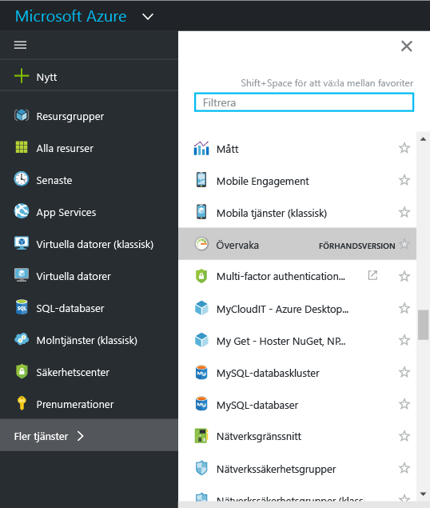
2. Klicka på den **övervakaren** alternativet för att öppna den **övervakaren** sidan. Den här sidan innehåller alla dina övervakning inställningar och data till en samlad vy. Först öppnas den i avsnittet **Aktivitetslogg**.

    

    Azure Monitor har tre grundläggande kategorier av övervakningsdata: **aktivitetsloggen**, **mätvärden** och **diagnostikloggar**.
3. Klicka på **Aktivitetslogg** så att avsnittet för aktivitetslogg visas.

    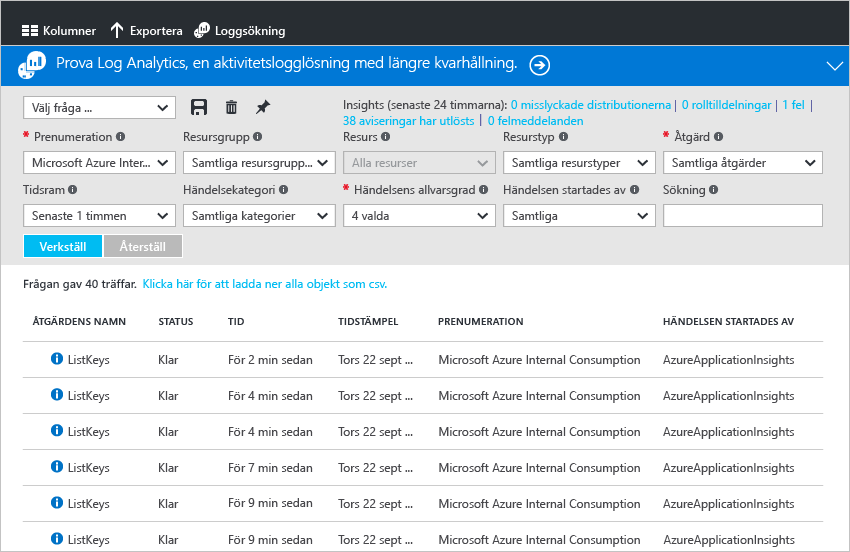

    I [**aktivitetsloggen**](monitoring-overview-activity-logs.md) beskrivs alla åtgärder som utförts på resurser i din prenumeration. Med aktivitetsloggen kan du bestämma ”vad, vem och när” för att skapa, uppdatera eller ta bort resurser i din prenumeration. Aktivitetsloggen anger exempelvis när en webbapp har stoppats och vem som stoppade den. Händelser i aktivitetsloggen finns lagrade i plattformen och kan frågas i 90 dagar.

    Du kan skapa och spara frågor för vanliga filter och fästa de viktigaste frågorna till en instrumentpanel i portalen så att du alltid vet om det har inträffat några händelser som uppfyller dina kriterier.
4. Filtrera vyn till en viss resursgrupp under den senaste veckan, och klicka sedan på knappen **Spara**. Namnge din fråga. 

    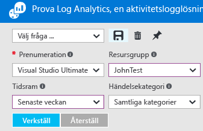
5. Klicka nu på knappen **Fäst**.

    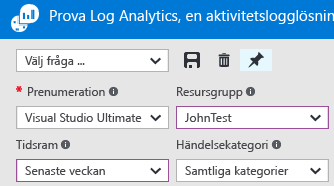

    De flesta vyer i den här genomgången kan vara fästa på en instrumentpanel. På så sätt kan du skapa en enskild informationskälla för användningsdata i dina tjänster.
6. Gå tillbaka till instrumentpanelen. Du kan nu se att frågan (och antal resultat) visas på instrumentpanelen. Detta är användbart om du vill se alla åtgärder för hög-profil som har genomförts nyligen i din prenumeration, till exempel en ny roll har tilldelats eller en virtuell dator har tagits bort.

    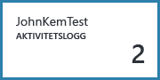
7. Återgå till panelen **Monitor** och klicka på avsnittet **Mått**. Du måste först markera en resurs genom filtrering och markera med hjälp av alternativen listrutan överst på sidan.

    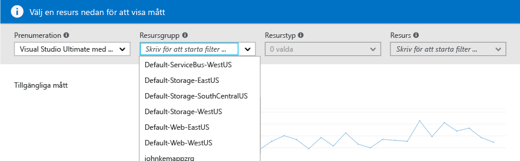

    Alla Azure-resurser genererar [**mätvärden**](monitoring-overview-metrics.md). I den här vyn samlas alla mått på en och samma plats så att du lätt kan förstå hur dina resurser arbetar. Dessutom Kolla in våra varumärken [nytt mått diagram upplevelse](https://aka.ms/azuremonitor/new-metrics-charts) genom att klicka på den **mått (förhandsgranskning)** fliken.
8. När du har valt en resurs, visas alla tillgängliga mått till vänster på sidan. Du kan göra diagram över flera mått samtidigt genom att välja mått och ändra intervallet för diagrammets typ och tid. Du kan också visa alla måttaviseringar på den här resursen.

    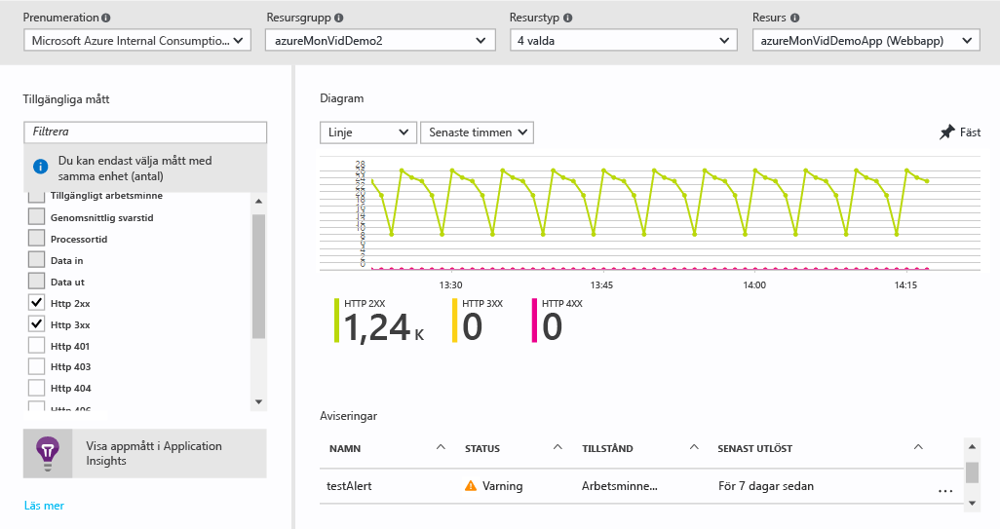

   > [!NOTE]
   > Vissa mått är bara tillgängliga om du aktiverar [Application Insights](../application-insights/app-insights-overview.md) och/eller Windows eller Linux Azure-diagnostik på din resurs.
   >
   >
9. När du är nöjd med diagrammet kan du använda knappen **Fäst** för att fästa den på instrumentpanelen.
10. Gå tillbaka till **övervakaren** och på **diagnostikloggar**.

    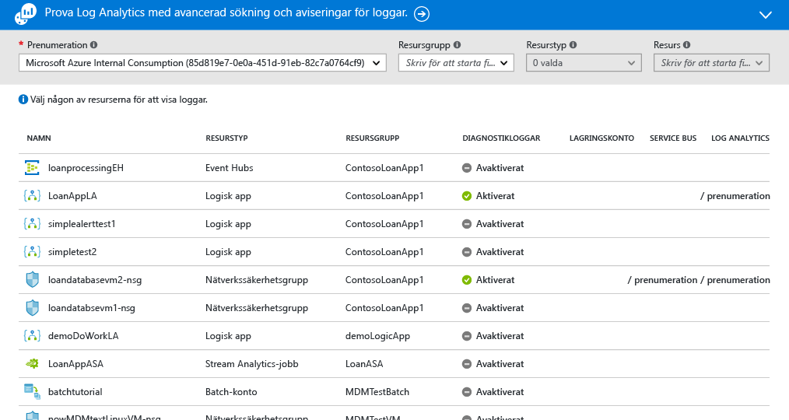

    [**Diagnostikloggar**](monitoring-overview-of-diagnostic-logs.md) är loggar som genereras *av* en källa som tillhandahåller data om användningen av just den resursen. Till exempel är loggarna Network Security Group Rule Counters (regelräknare för nätverkssäkerhetsgrupp) och logikappsarbetsflöde båda typer av diagnostikloggar. Du kan lagra loggarna på ett lagringskonto, strömma till en händelsehubb och/eller skicka till [Log Analytics](../log-analytics/log-analytics-overview.md). Log Analytics är Microsofts produkt för driftsinformation för avancerad sökning och avisering.

    I portalen kan du visa och filtrera en lista över alla resurser i din prenumeration för att identifiera om de har aktiverat diagnostikloggar.
11. Klicka på en resurs i sidan diagnostikloggar. Om diagnostikloggar lagras på ett lagringskonto visas en lista med timloggar som du kan ladda ned direkt.

    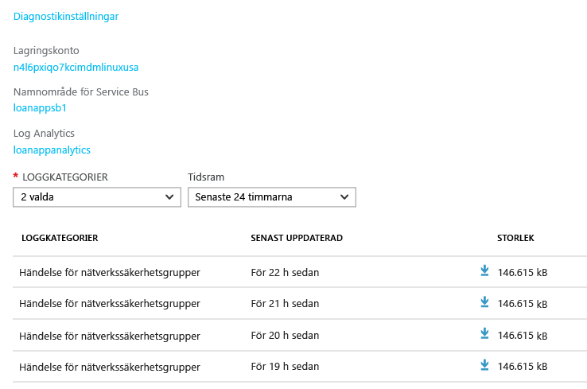

    Du kan också klicka på **Diagnostikinställningar**. Då kan du konfigurera eller ändra inställningarna för arkivering till ett lagringskonto, strömma till Event Hubs eller skicka till en Log Analytics-arbetsyta.

    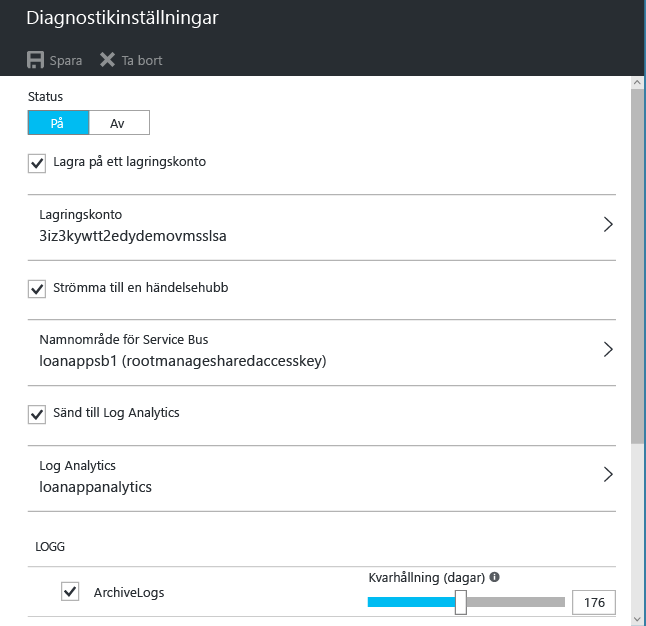

    Om du har registrerat diagnostikloggar till Log Analytics kan du sedan söka efter den i avsnittet **Loggsökning** i portalen.
12. Navigera till den **aviseringar** på sidan för övervakaren.

    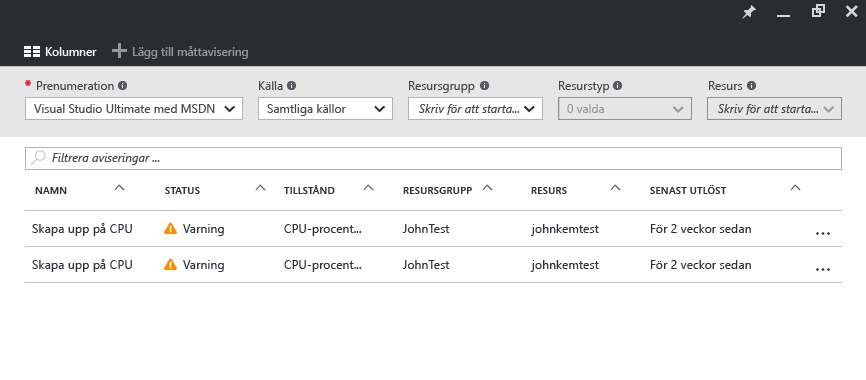

    Här kan du hantera alla [**aviseringar**](monitoring-overview-alerts.md) på dina Azure-resurser. Detta inkluderar aviseringar på mått, aktivitet logghändelser, webbtester med Application Insights (platser) och proaktiv diagnostik i Application Insights. Aviseringar kan utlösa e-postmeddelanden eller en HTTP POST till en webhook-webbadress.
13. Klicka på **Add metric alert** (Lägg till måttavisering) för att skapa en avisering.

    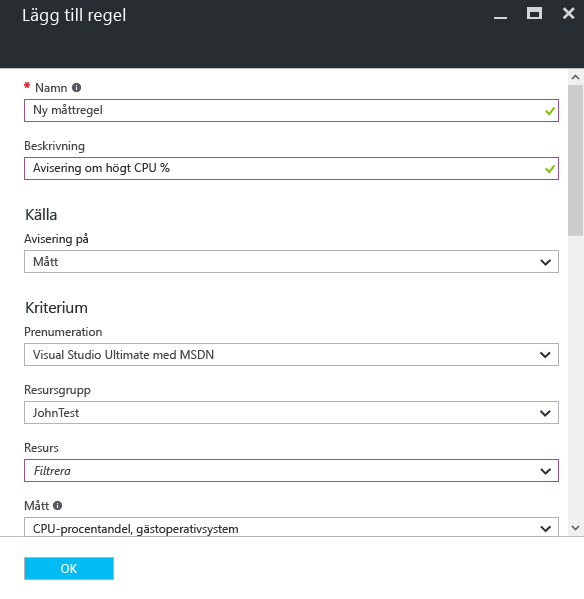

    Du kan sedan fästa en avisering i din instrumentpanel och enkelt se dess tillstånd när som helst.

    Azure-Monitor också har nu [ **nära realtid mått aviseringar**](https://aka.ms/azuremonitor/near-real-time-alerts)(förhandsversion) som kan utvärderas med en frekvens som är så låg som varje minut!
    
14. I avsnittet Monitor finns också länkar till [Application Insights](../application-insights/app-insights-overview.md)-program och [Log Analytics](../log-analytics/log-analytics-overview.md)-hanteringslösningar. Dessa andra Microsoft-produkter har djupgående integrering med Azure Monitor.
15. Om du inte använder Application Insights eller Log Analytics finns en risk för att Azure Monitor har ett samarbete med dina aktuella produkter för övervakning, loggning och aviseringar. På vår [partnersida](monitoring-partners.md) finns en fullständig lista och instruktioner för hur du integrerar.

Genom att följa de här stegen och fästa alla relevanta paneler vid en instrumentpanel kan du skapa omfattande vyer över programmet och infrastrukturen som den här:

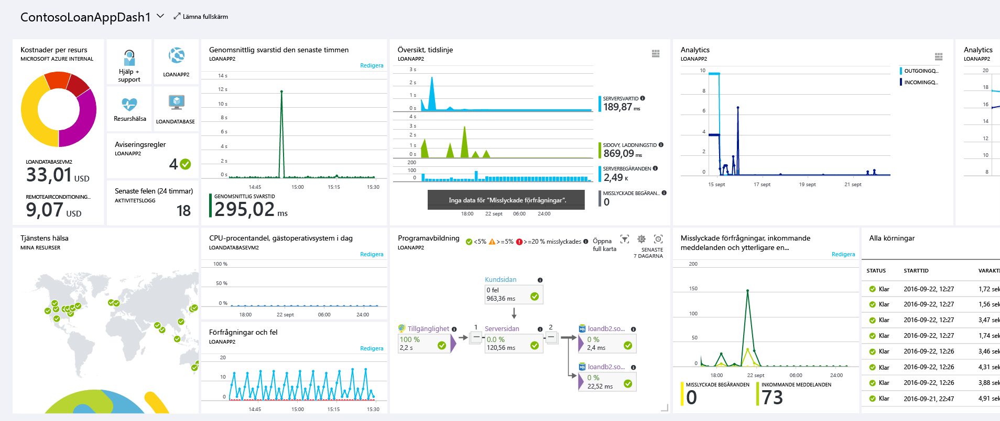

## Nästa steg
* Läs [Översikt över Azure Monitor](monitoring-overview.md)
