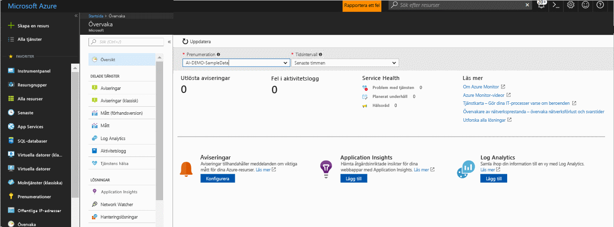
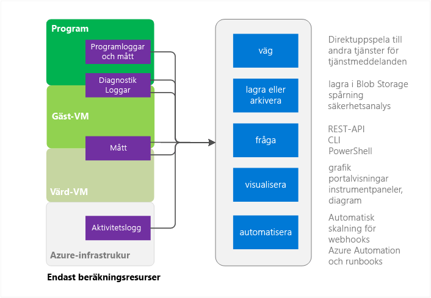
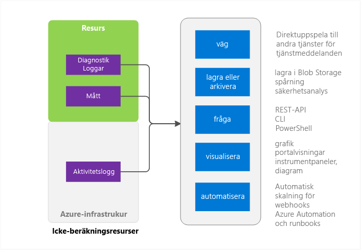

# Översikt över Azure Övervakare
Den här artikeln innehåller en översikt över Azure-Monitor-tjänsten i Microsoft Azure. Det beskriver vad Azure-Monitor finns och innehåller länkar till ytterligare information om hur du använder Azure-Monitor.  Om du föredrar en videointroduktion finns i nästa steg länkarna längst ned i den här artikeln. 

## Övervakare för Azure och Microsoft har andra övervakning produkter
Azure övervakning ger grundläggande infrastruktur mått och loggfiler för de flesta tjänster i Microsoft Azure. Azure-tjänster som inte ännu placerar sina data till Azure-Monitor lägger det i framtiden.

Microsoft levererar ytterligare produkter och tjänster som erbjuder ytterligare övervakningsfunktioner för utvecklare, DevOps eller IT-Ops som också har lokala installationer. En översikt och förståelse av hur dessa olika produkter och tjänster tillsammans finns [övervakning i Microsoft Azure](monitoring-overview.md).

## Portalen översiktssida

Azure övervakaren har en landningssida som hjälper användarna att: 
- Förstå övervakningsfunktionerna som Azure erbjuder.
- Identifiera, konfigurera, och inbyggd Azure-plattformen och premium övervakningsfunktionerna.

Sidan är en startpunkt för navigering, inklusive-boarding. Det visar granskat anmärkningsvärda problem från olika tjänster och används att navigera till dem i kontexten.
 

När du öppnar sidan kan välja du bland de prenumerationer som du har läsbehörighet till. Du kan se för en vald prenumeration:

- **Utlöst aviseringar och avisering källor** – den här tabellen visar sammanfattning inventeringar, varning källor och hur många gånger aviseringar som aktiveras för den valda varaktigheten. Det gäller både äldre och nyare aviseringar. Läs mer om den [nyare Azure aviseringar](monitoring-overview-unified-alerts.md). 
- **Aktiviteten logga fel** – om någon av dina Azure-resurser logghändelser med fel-samma allvarlighetsgrad som du kan visa ett övergripande antal och klicka vidare till sidan aktivitet loggen att undersöka varje händelse.
- **Tjänstens hälsa för Azure** -du kan se en uppräkning av tjänstens hälsa för problem med tjänsters planerade underhållshändelser och hälsa rekommendationerna. Tjänstens hälsa för Azure ger personlig information när problem i Azure-infrastrukturen påverka dina tjänster.  Se [Azure tjänstens hälsa](../service-health/service-health-overview.md) för mer information.  
- **Application Insights** -finns KPI: er för varje AppInsights resurs i den aktuella prenumerationen. KPI: er som är optimerade för programmet för serversidan övervakning över ASP.NET-webbprogram, Java, Node och allmänna programtyper. KPI: er inkluderar mått för förfrågningar, varaktighet för svar, fel och tillgänglighet i procent. 

Om du inte har publicerat till logganalys eller Application Insights, eller om du inte har konfigurerat några Azure-aviseringar i den aktuella prenumerationen, innehåller sidan länkar om du vill påbörja processen-boarding.

## Övervakaren källor som Azure - beräkning delmängd

Här beräknings-tjänster omfattar 
- Cloud Services 
- Virtuella datorer 
- Skaluppsättningar för den virtuella datorn 
- Service Fabric

### Program - diagnostik loggar och programloggarna mått
Program kan köras ovanpå Gästoperativsystem i beräknings-modellen. De genererar en egen uppsättning loggar och mått. Azure övervakaren är beroende av tillägget Azure diagnostics (Windows eller Linux) att samla in de flesta program nivån mått och loggar. De innehåller

* Prestandaräknare
* Programloggar
* Windows-händelseloggar
* Händelsekällan för .NET
* IIS-loggar
* Manifestet baserat ETW
* Krasch minnesdumpar
* Kunden felloggar

Utan diagnostik-tillägg finns bara några mått som CPU-användning. 

### Värd och Gäst-VM mått
Ovanstående beräkningsresurser har en dedikerad värd virtuell dator och operativsystem som de nyttjar. VM-värd och Gäst-OS är motsvarigheten till rot-VM och Gäst-VM i Hyper-V hypervisor-modellen. Du kan samla in mått på båda. Du kan också samla in diagnostik loggar på gästoperativsystemet.   

### Aktivitetslogg
Du kan söka aktivitetsloggen (tidigare kallade drift- eller granskningsloggar) för information om resurs som visas av Azure-infrastrukturen. Loggen innehåller information såsom tider när resurserna skapas eller förstörs.  Mer information finns i [översikt aktivitetsloggen](monitoring-overview-activity-logs.md). 

## Azure övervakaren källor - allt annat

### Resurs - mätvärden och diagnostik loggar
Filer mätvärden och diagnostikfunktionerna loggar variera beroende på resurstypen. Web Apps innehåller till exempel statistik på Disk-i/o och procent CPU. Dessa mått finns inte för en Service Bus-kö som ger mått som kön storlek och meddelandet genomflöde i stället. En lista över filer mätvärden för varje resurs som är tillgänglig på [stöds mått](monitoring-supported-metrics.md). 

### Värd och Gäst-VM mått
Det är inte nödvändigtvis en 1:1-mappning mellan din resurs och en viss värd och Gäst-VM så mått inte är tillgängliga.

### Aktivitetslogg
Aktivitetsloggen är desamma som beräkningsresurser.  

## Används för övervakning av Data
När du samlar in data, kan du göra följande med den i Azure-Monitor.

### Routa
Du kan strömma övervakningsdata till andra platser. 

Exempel:

- Skicka till Application Insights så att du kan använda dess bättre verktyg för visualisering och analys.
- Skicka till Händelsehubbar så att du kan vidarebefordra till verktyg från tredje part. 

### Store och arkivera
Vissa övervakningsdata är redan lagrade och är tillgängliga i Azure-Monitor under en tidsperiod. 
- Mått som lagras i 30 dagar. 
- Aktiviteten loggposter som lagras i 90 dagar. 
- Diagnostik loggar lagras inte alls. 

Om du vill lagra data som är längre än de tider som anges ovan kan du använda någon Azure-lagring. Övervakningsdata sparas i ditt lagringskonto baserat på en bevarandeprincip du anger. Du behöver betala för utrymmet tar i Azure-lagring. 

Några sätt att använda dessa data:

- Du kan ha andra verktyg inom eller utanför Azure läsa den och bearbetar den väl har skrivits.
- Du hämtar data lokalt för ett lokalt arkiv eller ändra din bevarandeprincip i molnet för att skydda data under längre perioder.  
- Du kan lämna data i Azure-lagring på obestämd tid för. 

### Fråga
Du kan använda Azure övervakaren REST-API, mellan plattform kommandoradsgränssnittet (CLI) kommandon, PowerShell-cmdlets eller .NET SDK för att komma åt data i systemet eller Azure storage

Exempel:

* Hämta data för ett anpassat övervakning program som du har skrivit
* Skapa egna frågor och skicka data till ett program från tredje part.

### Visualisera
Visualisera dina övervakningsdata i grafik och diagram hjälper dig att hitta trender snabbare än att slå via själva informationen.  

Några visualiseringen metoderna är:

* Använda Azure-portalen
* Vidarebefordra data till Azure Application Insights
* Vidarebefordra data till Microsoft PowerBI
* Skicka data till verktyg från tredje part visualisering med direktsänd strömning eller genom att läsa verktyget från ett Arkiv i Azure-lagring

### Automatisera
> [!NOTE]
> Som en del av en pågående utvecklingen av aviseringar i Microsoft Azure, nu är en enhetlig miljö för aviseringar tillgänglig. Mer information om [nya Azure aviseringar](monitoring-overview-unified-alerts.md)

Du kan använda övervakningsdata till utlösaren aviseringar eller med hela processer i Azure-aviseringar. Exempel:

* Användningsdata Autoskala compute-instanser uppåt eller nedåt utifrån belastningen för programmet.
* Skicka e-postmeddelanden baserat på villkor som mått eller loggfilen. 
* Anropa en URL (webhook) för att utföra en åtgärd i ett system utanför Azure
* Starta en runbook i Azure automation för att utföra en rad olika uppgifter

## Metoder för att komma åt Azure-Monitor
I allmänhet kan du ändra dataspårning, Routning och hämtning med någon av följande metoder. Inte alla metoder är tillgängliga för alla åtgärder eller -datatyper.

* [Azure Portal](https://portal.azure.com)
* [PowerShell](insights-powershell-samples.md)  
* [Plattformsoberoende kommandoradsgränssnittet (CLI)](insights-cli-samples.md)
* [REST API](https://docs.microsoft.com/rest/api/monitor/)
* [.NET SDK](http://www.nuget.org/packages/Microsoft.Azure.Management.Monitor)

## Nästa steg
Lär dig mer om
- En videogenomgång av bara Azure-Monitor finns på  
[Kom igång med Azure-Monitor](https://channel9.msdn.com/Blogs/Azure-Monitoring/Get-Started-with-Azure-Monitor). 
- En video som förklarar ett scenario där du kan använda Azure-Monitor finns på [utforska Microsoft Azure-övervakning och diagnostik](https://channel9.msdn.com/events/Ignite/2016/BRK2234) och [Azure Övervakare i ett videoklipp från Ignite 2016](https://myignite.microsoft.com/videos/4977).
- Kör genom Azure-Monitor-gränssnitt i [komma igång med Azure-Monitor](monitoring-get-started.md)
- Ställ in den [Azure Diagnostics tillägg](../azure-diagnostics.md) om du försöker att diagnostisera problem i din molntjänst, virtuell dator, virtuella skala anger eller Service Fabric-programmet.
- [Application Insights](https://azure.microsoft.com/documentation/services/application-insights/) om du försöker diagnostiska problem i din App Service Web app.
- [Felsöka Azure Storage](../storage/common/storage-e2e-troubleshooting.md) när du använder Storage-Blobbar, tabeller eller köer
- [Log Analytics](https://azure.microsoft.com/documentation/services/log-analytics/)
