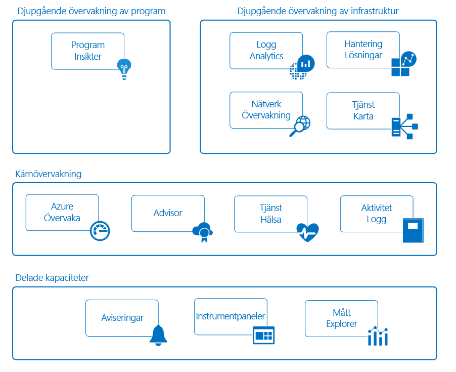

# Övervaka Azure-program och resurser

Övervakning syftar till insamling och analys av data för att avgöra prestanda, hälsotillstånd och tillgänglighet för affärsprogram och resurser som dessa program är beroende av. En effektiv övervakningsstrategi hjälper dig att förstå den detaljerade driften av komponenterna i ditt program. Det hjälper dig också att öka din drifttid genom att meddela dig om kritiska förhållanden så att du kan lösa dem innan de hunnit bli problem.

Azure innehåller flera tjänster som utför en specifik roll eller aktivitet individuellt i övervakningsutrymmet. Tillsammans levererar dessa tjänster en heltäckande lösning för att samla in, analysera och agera utifrån telemetrin från dina program och de Azure-resurser som stöder dem. De kan också användas för att övervaka kritiska lokala resurser så att du får en hybridövervakningsmiljö. Det första steget i att utveckla en fullständig övervakningsstrategi för ditt program är att förstå de verktyg och data som är tillgängliga.

Följande diagram visar en konceptuell översikt över de komponenter som fungerar tillsammans i övervakningen av Azure-resurser. Följande avsnitt beskriver de här komponenterna och tillhandahåller länkar till detaljerad teknisk information.

## Delade funktioner
Kärnan och den djupa övervakningstjänsten dela funktioner som innehåller följande funktioner.

### Aviseringar
[Azure-aviseringar](../monitoring-and-diagnostics/monitoring-overview-alerts.md) informerar dig i förväg om kritiska förhållanden och vidtar eventuella åtgärder. Aviseringsregler kan använda data från flera källor, inklusive mått och loggar. De använder [åtgärdsgrupper](../monitoring-and-diagnostics/monitoring-action-groups.md), som innehåller en unik uppsättning mottagare och åtgärder som svar på en avisering. Du kan, baserat på dina krav, låta aviseringar starta externa åtgärder med hjälp av webhooks och integrera dem med dina ITSM-verktyg.

### Instrumentpaneler
Du kan använda [Azure-instrumentpaneler](../azure-portal/azure-portal-dashboards.md) till att kombinera olika typer av data i ett enda fönster i [Azure Portal](https://portal.azure.com). Därefter kan du dela instrumentpanelen med andra Azure-användare.

Du kan t.ex. skapa en instrumentpanel som kombinerar:
- Paneler som visar ett måttdiagram
- En tabell med aktivitetsloggar
- Ett användningsdiagram från Application Insights
- Utdata från en loggsökning i Log Analytics

Du kan också exportera Log Analytics-data till [Power BI](https://docs.microsoft.com/power-bi/). Där kan du dra nytta av ytterligare visualiseringar. Du kan också göra data tillgängliga för andra i och utanför organisationen.

### Metrics Explorer
[Mått](../monitoring-and-diagnostics/monitoring-overview-metrics.md) är numeriska värden som genererats av en Azure-resurs och som hjälper dig att förstå resursens drift och prestanda. Genom att använda Metrics Explorer kan skicka du mått till Log Analytics för analys med data från andra källor.

## Kärnövervakning
Kärnövervakning ger grundläggande nödvändig övervakning för alla Azure-resurser. Dessa tjänster kräver minimal konfiguration och samlar in kärntelemetri som premiumövervakningstjänsterna använder.    

### Azure Monitor
[Azure-Monitor](../monitoring-and-diagnostics/monitoring-overview-azure-monitor.md) aktiverar kärnövervakning för Azure-tjänster genom att tillåta insamling av [mått](../monitoring-and-diagnostics/monitoring-overview-metrics.md), [aktivitetsloggar](../monitoring-and-diagnostics/monitoring-overview-activity-logs.md) och [diagnostikloggar](../monitoring-and-diagnostics/monitoring-overview-of-diagnostic-logs.md). Aktivitetsloggen ger dig t.ex. information om när nya resurser skapas eller ändras.

Tillgängliga mått tillhandahåller prestandastatistik för olika resurser och även för operativsystemet i en virtuell dator. Du kan visa dessa data med någon av utforskarna i Azure Portal och skapa aviseringar som baseras på måtten. Azure Monitor ger den snabbaste måttpipelinen (från 5 minuter ned till 1 minut), så du bör använda för tidskritiska aviseringar och meddelanden.

Du kan också skicka dessa mätvärden och loggar till Azure Log Analytics för trendanalys och detaljerad analys eller skapa ytterligare aviseringsregler som i förväg meddelar dig om kritiska problem som analysen påvisat.  

> [!NOTE]
> Det går för närvarande inte att skicka flerdimensionella mätvärden till Log Analytics via diagnostikinställningarna. Mått med dimensioner exporteras som tillplattade endimensionella mått som aggregeras över dimensionsvärden.
>
> *Till exempel*: Måttet för inkommande meddelanden i en händelsehubb kan utforskas och läggas till på per-kö-nivå. När mätvärdena exporteras till Log Analytics visas de dock som inkommande meddelanden i alla köer i händelsehubben.
>
>

### Azure Advisor
[Azure Advisor](../advisor/advisor-overview.md) övervakar ständigt din resurskonfiguration och användningstelemetri. Sedan får du anpassade rekommendationer baserade på bästa praxis. Utifrån dessa rekommendationer kan du förbättra prestanda, säkerhet och tillgänglighet för de resurser som stöder dina program.

### Service Health
Hälsotillståndet för programmet vilar på de Azure-tjänster som det är beroende av. [Azure Service Health](../service-health/service-health-overview.md) identifierar eventuella problem med Azure-tjänsterna som kan påverka ditt program. Service Health hjälper dig även att planera för schemalagt underhåll.

### Aktivitetslogg
[Aktivitetsloggen](../monitoring-and-diagnostics/monitoring-overview-activity-logs.md) tillhandahåller data om driften av en Azure-resurs. Den här informationen innehåller:
- Konfigurationsändringar för resursen.
- Service Health-incidenter.
- Rekommendationer om bättre utnyttjande av resursen.
- Information som relaterar till automatiska skalningsåtgärder.

Du kan visa loggar för en viss resurs på dess sida i Azure Portal. Eller så kan du visa loggar från flera resurser i aktivitetsloggsutforskaren.

Du kan också skicka aktivitetsloggposter till Log Analytics. Där kan du analysera loggarna med hjälp av data som samlas in av hanteringslösningar, agenter på virtuella datorer och andra källor.

## Djupövervakningstjänster
Följande Azure-tjänster innehåller omfattande funktioner för att samla in och analysera övervakningsdata på en djupare nivå. Dessa tjänster bygger på kärnövervakning och drar nytta av vanliga funktioner i Azure. De tillhandahåller kraftfull analys med insamlade data, vilket ger dig unika insikter om dina program och om infrastrukturen. De presenterar data i scenariekontexter som är inriktade på olika målgrupper.

## Djupgående programövervakning
### Application Insights
Du kan använda [Azure Application Insights](http://azure.microsoft.com/documentation/services/application-insights) för att övervaka tillgänglighet, prestanda och användning av ditt program, oavsett om den finns i molnet eller lokalt.

Genom att använda ditt program med Application Insights kan du få djupa insikter och implementera DevOps-scenarier. Du kan snabbt identifiera och diagnostisera fel utan att behöva vänta på att en användare rapporterar dem. Du kan göra välgrundade val om underhåll och förbättringar för ditt program med den information som du samlar in.

Application Insights har omfattande verktyg för att interagera med de data som samlas in. Application Insights lagrar data i en gemensam databas. Programmet kan dra nytta av delade funktioner som aviseringar, instrumentpaneler och djupanalys med Log Analytics-frågespråket.

## Djupgående infrastruktursövervakning
### Log Analytics
[Logga Analytics](http://azure.microsoft.com/documentation/services/log-analytics) spelar en central roll i Azure-övervakningen genom att samla in data från en mängd resurser (inklusive verktyg som inte kommer från Microsoft) till en enda databas. Där kan du analysera data med hjälp av ett kraftfullt frågespråk.

Application Insights och Azure Security Center lagrar sina data i Log Analytics-datalagret och använder dess analysmotor. Data samlas också in från Azure Monitor, hanteringslösningar och agenter som installerats på virtuella datorer i molnet eller lokalt. Denna delade funktion hjälper dig att få en komplett bild av din miljö.

### Hanteringslösningar
[Hanteringslösningar](../log-analytics/log-analytics-add-solutions.md) är paketerade uppsättningar av logik som tillhandhåller insikter för vissa program och tjänster. De förlitar sig på Log Analytics när det gäller att lagra och analysera de övervakningsdata som de samlar in.

Hanteringslösningar är tillgängliga från Microsoft och partners och tillhandahåller övervakning för olika Azure-tjänster och tjänster från tredje part. Exempel på övervakningslösningar:
* 
  [Containerövervakning](../log-analytics/log-analytics-containers.md), som hjälper dig att visa och hantera containervärdar.
* [Azure SQL-analys](../log-analytics/log-analytics-azure-sql.md), som samlar in och visualiserar prestandamått för Azure SQL-databaser.

Du kan visa alla tillgängliga hanteringslösningar i Azure Portal på skärmen *Övervakare*.

### Nätverksövervakning
Det finns flera verktyg som arbetar tillsammans för att övervaka olika aspekter av ditt nätverk i Azure eller lokalt.  

[Network Watcher](../network-watcher/network-watcher-monitoring-overview.md) tillhandahåller scenariobaserad övervakning och diagnostik för olika nätverksscenarier i Azure. Funktionen lagrar data i Azures mått- och diagnostikfunktioner för ytterligare analys. Den fungerar med följande lösningar för övervakning av olika aspekter av nätverket.

[Övervakare av nätverksprestanda](../log-analytics/log-analytics-network-performance-monitor.md) är en molnbaserad nätverksövervakningslösning som övervakar anslutningen för offentliga moln, datacentra och lokala miljöer.

[ExpressRoute-övervakning](../expressroute/how-to-npm.md) är en NPM-funktion som övervakar slutpunkt-till-slutpunktsanslutningar och prestanda för Azure ExpressRoute-kretsar.

[DNS-analys](../log-analytics/log-analytics-dns.md) är en lösning som tillhandahåller säkerhets-, prestanda- och driftsrelaterade insikter som baseras på dina DNS-servrar.

[Service Endpoint Monitor](../networking/network-monitoring-overview.md) testar programmens nåbarhet och identifierar prestandaflaskhalsar lokalt, i operatörsnätverk, molndatacentra och privata datacentra.

### Tjänstkarta
[Tjänstkarta](../operations-management-suite/operations-management-suite-service-map.md) ger inblickar i din IaaS-miljö genom att analysera virtuella datorer med olika processer och beroenden på andra datorer och i externa processer. Funktionen integrerar händelser, prestandadata och hanteringslösningar i Log Analytics. Du kan sedan visa dessa data i respektive dators kontext och i dess relation till resten av miljön.

Tjänstkarta påminner om [Programavbildning i Application Insights](../application-insights/app-insights-app-map.md). Den fokuserar på de infrastrukturkomponenter som stöder dina program.

## Exempelscenarier
Följande är exempel på hög nivå som illustrerar hur du kan använda olika verktyg för prestandaövervakning i Azure för olika scenarier.

### Övervaka ett webbprogram
Tänk på ett webbprogram som har distribuerats i Azure via Azure App Service, Azure Storage och en SQL-databas. Du börjar genom att öppna [mått](../monitoring-and-diagnostics/monitoring-overview-metrics.md)- och [aktivitetsloggar](../monitoring-and-diagnostics/monitoring-overview-activity-logs.md) för dessa resurser på deras sidor i Azure Portal. Du letar efter viktig information, t.ex. antalet förfrågningar till programmet och den genomsnittliga svarstiden. Du kan också identifiera ändringar i konfigurationen.

Sedan går du till övervakaren i portalen för att visa mått och loggar för de olika resurserna tillsammans. När du fastställer standardparametrarna för måtten [skapar du aviseringsregler](../monitoring-and-diagnostics/monitoring-overview-unified-alerts.md). Dessa regler meddelar dig i förväg när t.ex. den genomsnittliga svarstiden överskrider ett visst tröskelvärde. Om du vill få en snabb överblick över dina dagliga programprestanda kan skapa du en Azure-instrumentpanel som visar måttdiagram som representerar viktiga KPI:er.

Om du vill utföra djupare övervakning av programmet [konfigurerar du det för Application Insights](../application-insights/quick-monitor-portal.md). Nu kan du samla in ytterligare data som ger fler insikter om programmets drift och prestanda. Application Insights identifierar de underliggande relationerna mellan komponenter i din app. Funktionen kan användas för visuell representation via [Programavbildning](../application-insights/app-insights-app-map.md) tillsammans med [slutpunkt-till-slutpunktsspårning](../application-insights/app-insights-transaction-diagnostics.md) som diagnostiserar exakt den komponent, det beroende eller det undantag där ett problem har uppstått.

Du skapar [tillgänglighetstester](../application-insights/app-insights-monitor-web-app-availability.md) så att du i förväg kan testa programmet från olika regioner. Som stöd för dina utvecklare kan du [aktivera profileraren](../application-insights/enable-profiler-compute.md) så att du kan spåra förfrågningar och eventuella undantag till en specifik kodrad. Om du vill få ytterligare insyn i de tjänster som används i ditt program, kan du lägga till [SQL Analytics-lösningen](../log-analytics/log-analytics-azure-sql.md) för att samla in ytterligare data i Log Analytics.

Senare vill du kanske undersöka grundorsaken till de perioder när platsens prestanda har fallit under ett visst tröskelvärde. Du skriver en fråga med hjälp av Log Analytics. Det hjälper dig att korrelera användnings- och prestandadata som samlas in av Application Insights med konfigurations- och prestandadata för alla de Azure-resurser som stöder ditt program.

### Övervaka virtuella datorer
Du har en blandning av virtuella Windows- och Linux-datorer som körs i Azure. Du använder Azure Monitor för att visa [aktivitetsloggar](../monitoring-and-diagnostics/monitoring-overview-activity-logs.md) och [värdnivåmått](../monitoring-and-diagnostics/monitoring-overview-metrics.md). Du lägger till [Azure Diagnostics-tillägget](../virtual-machines/linux/tutorial-monitoring.md#install-diagnostics-extension) till de virtuella datorerna för att samla in statistik från gästoperativsystemet. Sedan skapar du [aviseringsregler](../monitoring-and-diagnostics/monitoring-overview-unified-alerts.md) som i förväg meddelar dig om grundläggande mått som processoranvändning och minne överskrider vissa tröskelvärden.

Om du vill samla in mer information om virtuella datorer som kör ett affärsprogram [skapar du en Log Analytics-arbetsyta och aktiverar tillägget för virtuella datorer](../log-analytics/log-analytics-quick-collect-azurevm.md) på varje dator. Du konfigurerar en [samling av olika datakällor](../log-analytics/log-analytics-data-sources.md) för ditt program och [skapar vyer](../log-analytics/log-analytics-view-designer.md) som rapporterar om den dagliga driften och prestanda. Sedan [skapar du aviseringsregler](../monitoring-and-diagnostics/monitoring-overview-unified-alerts.md) som meddelar dig när specifika felhändelser tas emot.

Om du vill övervaka den installerade agentens hälsotillstånd måste du lägga till [hanteringslösningen Agenthälsa](../operations-management-suite/oms-solution-agenthealth.md). Om du vill få ytterligare insikter om programmet [lägger du till beroendeagenten](../operations-management-suite/operations-management-suite-service-map-configure.md) till de virtuella datorerna så att du kan lägga till dem i [tjänstkartan](../operations-management-suite/operations-management-suite-service-map.md). Tjänstkartan identifierar viktiga processer och identifierar anslutningar mellan datorer och andra tjänster.

Efter ett rapporterat avbrott använder du tjänstkartan för att genomföra säkerhetskontroller som identifierar vilka specifika datorer som drabbats av problemet. Du kan sedan skapa en [fråga till Log Analytics-data](../log-analytics/log-analytics-log-search-new.md) som identifierar problemet i framtiden. Och du skapar en aviseringsregel som meddelar dig i förväg när villkoret har identifierats.

## Nästa steg
Läs mer om:

* [Azure Monitor](https://azure.microsoft.com/services/monitor/) om du vill komma igång med att övervaka mått och aviseringar.
* [Application Insights](https://azure.microsoft.com/documentation/services/application-insights/) om du försöker diagnostisera problem i din App Service-webbapp.
* [Log Analytics](https://azure.microsoft.com/documentation/services/log-analytics/) om du vill analysera insamlade övervakningsdata och loggar.
