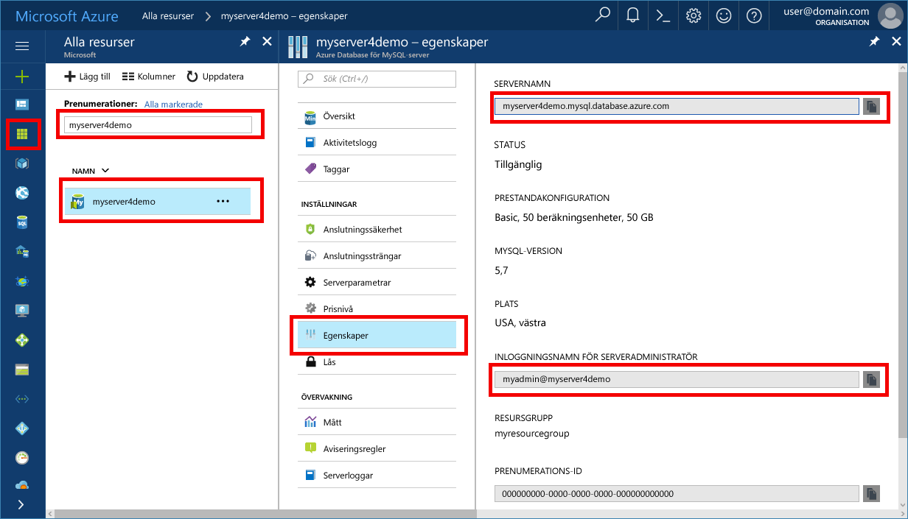

# <a name="azure-database-for-mysql-use-connectorc-to-connect-and-query-data"></a>Azure Database för MySQL: Använda Connector/C++ för att ansluta och fråga efter data
Den här snabbstarten visar hur du ansluter till en Azure Database för MySQL med hjälp av ett C++-program. Den visar hur du använder SQL-instruktioner för att fråga, infoga, uppdatera och ta bort data i databasen. I den här artikeln förutsätter vi att du har kunskaper om C++ och att du inte har arbetat med Azure Database för MySQL tidigare.

## <a name="prerequisites"></a>Krav
I den här snabbstarten används de resurser som skapades i någon av följande guider som utgångspunkt:
- [Skapa en Azure Database för MySQL med Azure Portal](./quickstart-create-mysql-server-database-using-azure-portal.md)
- [Skapa en Azure Database för MySQL-server med Azure CLI](./quickstart-create-mysql-server-database-using-azure-cli.md)

Du måste också:
- Installera [.NET Framework](https://www.microsoft.com/net/download)
- Installera [Visual Studio](https://www.visualstudio.com/downloads/)
- Installera [MySQL Connector/C++](https://dev.mysql.com/downloads/connector/cpp/) 
- Installera [Boost](http://www.boost.org/)

## <a name="install-visual-studio-and-net"></a>Installera Visual Studio och .NET
I stegen i det här avsnittet förutsätter vi att du har erfarenhet av att utveckla med .NET.

### <a name="windows"></a>**Windows**
1. Installera Visual Studio 2017 Community, en komplett, utbyggbar och kostnadsfri IDE som du kan använda för att skapa moderna program för Android, iOS, Windows, samt webb- och databasprogram och molntjänster. Du kan installera den fullständiga versionen av .NET Framework eller bara.NET Core. Kodsnuttarna i snabbstarten fungerar för båda. Om du redan har Visual Studio installerat på datorn kan du hoppa över de kommande två stegen.
   - Ladda ned [installationsprogrammet för Visual Studio 2017](https://www.visualstudio.com/thank-you-downloading-visual-studio/?sku=Community&rel=15). 
   - Kör installationsprogrammet och följ anvisningarna för att slutföra installationen.

### <a name="configure-visual-studio"></a>**Konfigurera Visual Studio**
1. Från Visual Studio, projektegenskap > konfigurationsegenskaper > C/C++ > länkare > allmänt > ytterligare bibliotekskataloger, lägg till katalogen lib\opt (t.ex.: C:\Program Files (x86)\MySQL\MySQL Connector C++ 1.1.9\lib\opt) av c++ connector.
2. Från Visual Studio, projektegenskap > konfigurationsegenskaper > C/C++ > allmänt > ytterligare inkluderingskataloger
   - Lägg till katalog include/ för c++ connector (t.ex.: C:\Program Files (x86)\MySQL\MySQL Connector C++ 1.1.9\include\)
   - Lägg till Boost-biblioteksrotkatalog (t.ex.: C:\boost_1_64_0\)
3. Från Visual Studio, projektegenskap > konfigurationsegenskaper > C/C++ > länkare > Indata> Ytterligare beroenden, lägger du till mysqlcppconn.lib i textfältet
4. Antingen kopierar du mysqlcppconn.dll från c++ connector-biblioteksmappen i steg 3 till samma katalog som den körbara programfilen eller lägger till den i miljövariabeln så att programmet kan hitta den.

## <a name="get-connection-information"></a>Hämta anslutningsinformation
Skaffa den information som du behöver för att ansluta till Azure Database för MySQL. Du behöver det fullständiga servernamnet och inloggningsuppgifter.

1. Logga in på [Azure-portalen](https://portal.azure.com/).
2. På den vänstra menyn i Azure Portal klickar du på **Alla resurser** och söker efter den server som du nyss skapade, till exempel **myserver4demo**.
3. Klicka på servernamnet.
4. Välj sidan **Egenskaper** för servern. Anteckna **servernamn** och **inloggningsnamnet för serveradministratören**.
 
5. Om du glömmer inloggningsinformationen för servern öppnar du sidan **Översikt** för att se inloggningsnamnet för serveradministratören. Om det behövs kan du återställa lösenordet.

## <a name="connect-create-table-and-insert-data"></a>Ansluta, skapa tabell och infoga data
Använd följande kod för att ansluta och läsa in data med hjälp av SQL-instruktionerna **CREATE TABLE** och **INSERT**. Koden använder klassen sql::Driver med metoden connect() för att upprätta en anslutning till MySQL. Sedan används metoden createStatement() och execute() för att köra databaskommandona. 

Ersätt parametrarna Host, DBName, User och Password med de värden som du angav när du skapade servern och databasen. 

```c++
#include <stdlib.h>
#include <iostream>
#include "stdafx.h"

#include "mysql_connection.h"
#include <cppconn/driver.h>
#include <cppconn/exception.h>
#include <cppconn/prepared_statement.h>
using namespace std;

int main()
{
    sql::Driver *driver;
    sql::Connection *con;
    sql::Statement *stmt;
    sql::PreparedStatement *pstmt;

    try
    {
        driver = get_driver_instance();
        //for demonstration only. never save password in the code!
        con = driver>connect("tcp://myserver4demo.mysql.database.azure.com:3306/quickstartdb", "myadmin@myserver4demo", "server_admin_password");
    }
    catch (sql::SQLException e)
    {
        cout << "Could not connect to database. Error message: " << e.what() << endl;
        system("pause");
        exit(1);
    }

    stmt = con>createStatement();
    stmt>execute("DROP TABLE IF EXISTS inventory");
    cout << "Finished dropping table (if existed)" << endl;
    stmt>execute("CREATE TABLE inventory (id serial PRIMARY KEY, name VARCHAR(50), quantity INTEGER);");
    cout << "Finished creating table" << endl;
    delete stmt;

    pstmt = con>prepareStatement("INSERT INTO inventory(name, quantity) VALUES(?,?)");
    pstmt>setString(1, "banana");
    pstmt>setInt(2, 150);
    pstmt>execute();
    cout << "One row inserted." << endl;

    pstmt>setString(1, "orange");
    pstmt>setInt(2, 154);
    pstmt>execute();
    cout << "One row inserted." << endl;

    pstmt>setString(1, "apple");
    pstmt>setInt(2, 100);
    pstmt>execute();
    cout << "One row inserted." << endl;
    
    delete pstmt;   
    delete con;
    system("pause");
    return 0;

```

## <a name="read-data"></a>Läsa data

Använd följande kod för att ansluta och läsa data med en **SELECT**-SQL-instruktion. Koden använder klassen sql::Driver med metoden connect() för att upprätta en anslutning till MySQL. Sedan används metoden prepareStatement() och executeQuery() för att köra de valda kommandona. Slutligen används metoden next () för att gå vidare till posterna i resultaten. Koden använder sedan getInt() och getString() för att parsa värdena i posten.

Ersätt parametrarna Host, DBName, User och Password med de värden som du angav när du skapade servern och databasen. 

```csharp
#include <stdlib.h>
#include <iostream>
#include "stdafx.h"

#include "mysql_connection.h"
#include <cppconn/driver.h>
#include <cppconn/exception.h>
#include <cppconn/resultset.h>
#include <cppconn/prepared_statement.h>
using namespace std;

int main()
{
    sql::Driver *driver;
    sql::Connection *con;
    sql::PreparedStatement *pstmt;
    sql::ResultSet *result;

    try
    {
        driver = get_driver_instance();
        //for demonstration only. never save password in the code!
        con = driver>connect("tcp://myserver4demo.mysql.database.azure.com:3306/quickstartdb", "myadmin@myserver4demo", "server_admin_password");
    }
    catch (sql::SQLException e)
    {
        cout << "Could not connect to database. Error message: " << e.what() << endl;
        system("pause");
        exit(1);
    }   

//  select  
    pstmt = con>prepareStatement("SELECT * FROM inventory;");
    result = pstmt>executeQuery();  
    
    while (result>next())
        printf("Reading from table=(%d, %s, %d)\n", result>getInt(1), result>getString(2).c_str(), result>getInt(3));   
    
    delete result;
    delete pstmt;   
    delete con;
    system("pause");
    return 0;
}
```

## <a name="update-data"></a>Uppdatera data
Använd följande kod för att ansluta och läsa data med en **UPDATE**-SQL-instruktion. Koden använder klassen sql::Driver med metoden connect() för att upprätta en anslutning till MySQL. Sedan används metoden prepareStatement() och executeQuery() för att köra uppdateringskommandona. 

Ersätt parametrarna Host, DBName, User och Password med de värden som du angav när du skapade servern och databasen. 

```csharp
#include <stdlib.h>
#include <iostream>
#include "stdafx.h"

#include "mysql_connection.h"
#include <cppconn/driver.h>
#include <cppconn/exception.h>
#include <cppconn/prepared_statement.h>
using namespace std;

int main()
{
    sql::Driver *driver;
    sql::Connection *con;
    sql::PreparedStatement *pstmt;

    try
    {
        driver = get_driver_instance();
        //for demonstration only. never save password in the code!
        con = driver>connect("tcp://myserver4demo.mysql.database.azure.com:3306/quickstartdb", "myadmin@myserver4demo", "server_admin_password");
    }
    catch (sql::SQLException e)
    {
        cout << "Could not connect to database. Error message: " << e.what() << endl;
        system("pause");
        exit(1);
    }   

    //update
    pstmt = con>prepareStatement("UPDATE inventory SET quantity = ? WHERE name = ?");
    pstmt>setInt(1, 200);
    pstmt>setString(2, "banana");
    pstmt>executeQuery();
    printf("Row updated\n");
    
    delete con;
    delete pstmt;
    system("pause");
    return 0;
}
```


## <a name="delete-data"></a>Ta bort data
Använd följande kod för att ansluta och läsa data med en **DELETE**-SQL-instruktion. Koden använder klassen sql::Driver med metoden connect() för att upprätta en anslutning till MySQL. Sedan används metoden prepareStatement() och executeQuery() för att köra borttagningskommandona.

Ersätt parametrarna Host, DBName, User och Password med de värden som du angav när du skapade servern och databasen. 

```csharp
#include <stdlib.h>
#include <iostream>
#include "stdafx.h"

#include "mysql_connection.h"
#include <cppconn/driver.h>
#include <cppconn/exception.h>
#include <cppconn/resultset.h>
#include <cppconn/prepared_statement.h>
using namespace std;

int main()
{
    sql::Driver *driver;
    sql::Connection *con;
    sql::PreparedStatement *pstmt;
    sql::ResultSet *result;

    try
    {
        driver = get_driver_instance();
        //for demonstration only. never save password in the code!
        con = driver>connect("tcp://myserver4demo.mysql.database.azure.com:3306/quickstartdb", "myadmin@myserver4demo", "server_admin_password");
    }
    catch (sql::SQLException e)
    {
        cout << "Could not connect to database. Error message: " << e.what() << endl;
        system("pause");
        exit(1);
    }
        
    //delete
    pstmt = con>prepareStatement("DELETE FROM inventory WHERE name = ?");
    pstmt>setString(1, "orange");
    result = pstmt>executeQuery();
    printf("Row deleted\n");    
    
    delete pstmt;
    delete con;
    delete result;
    system("pause");
    return 0;
}
```

## <a name="next-steps"></a>Nästa steg
> [!div class="nextstepaction"]
> [Migrera MySQL-databasen till Azure Database för MySQL med säkerhetskopiering och återställning](concepts-migrate-dump-restore.md)

