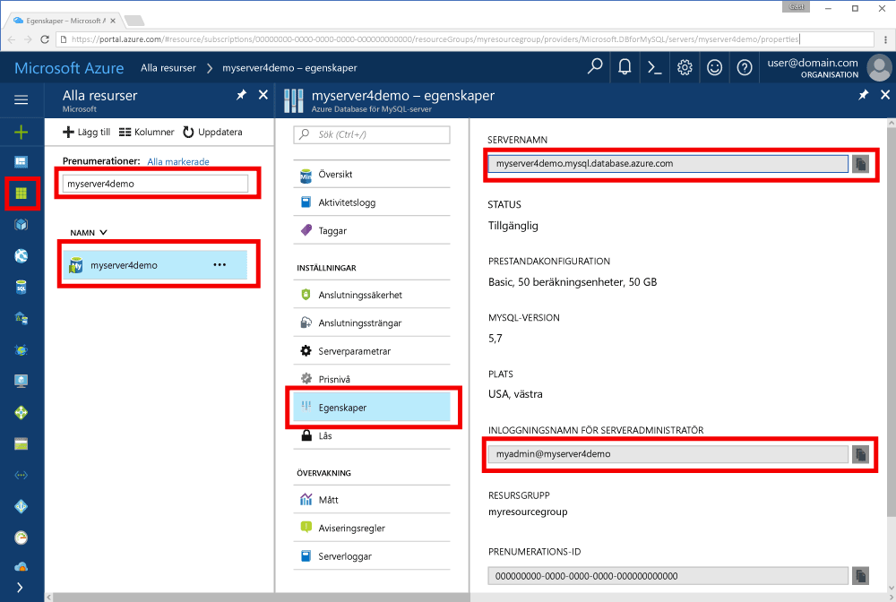

# <a name="azure-database-for-mysql-use-go-language-to-connect-and-query-data"></a>Azure Database för MySQL: Använda språket Go för att ansluta och fråga efter data
Den här snabbstarten visar hur du ansluter till en Azure-databas för MySQL från Windows-, Ubuntu Linux- och Apple macOS plattformar med hjälp av kod som skrivs i den [Gå](https://golang.org/) språk. Den visar hur du använder SQL-instruktioner för att fråga, infoga, uppdatera och ta bort data i databasen. Det här avsnittet förutsätter att du är bekant med utveckling med hjälp av gå och att du har arbetat med Azure-databas för MySQL.

## <a name="prerequisites"></a>Krav
I den här snabbstarten används de resurser som skapades i någon av följande guider som utgångspunkt:
- [Skapa en Azure Database för MySQL med Azure Portal](./quickstart-create-mysql-server-database-using-azure-portal.md)
- [Skapa en Azure Database för MySQL-server med Azure CLI](./quickstart-create-mysql-server-database-using-azure-cli.md)

## <a name="install-go-and-mysql-connector"></a>Installera en anslutningsapp för Go och MySQL
Installera [Gå](https://golang.org/doc/install) och [gå-sql-drivrutin för MySQL](https://github.com/go-sql-driver/mysql#installation) på din dator. Följ stegen i relevant avsnitt beroende på din plattform:

### <a name="windows"></a>Windows
1. [Ladda ned](https://golang.org/dl/) och installera Go för Microsoft Windows enligt [installationsanvisningarna](https://golang.org/doc/install).
2. Starta kommandotolken från Start-menyn.
3. Skapa en mapp för ditt projekt, till exempel. `mkdir  %USERPROFILE%\go\src\mysqlgo`.
4. Ändra katalogen till projektmappen, till exempel `cd %USERPROFILE%\go\src\mysqlgo`.
5. Ange miljövariabeln för GOPATH så att den hänvisar till källkodskatalogen. `set GOPATH=%USERPROFILE%\go`.
6. Installera [go-sql-driver for mysql](https://github.com/go-sql-driver/mysql#installation) genom att köra kommandot `go get github.com/go-sql-driver/mysql`.

   Sammanfattningsvis ska du installera Go och sedan köra dessa kommandon i kommandotolken:
   ```cmd
   mkdir  %USERPROFILE%\go\src\mysqlgo
   cd %USERPROFILE%\go\src\mysqlgo
   set GOPATH=%USERPROFILE%\go
   go get github.com/go-sql-driver/mysql
   ```

### <a name="linux-ubuntu"></a>Linux (Ubuntu)
1. Starta Bash-gränssnittet. 
2. Installera Go genom att köra `sudo apt-get install golang-go`.
3. Skapa en mapp för ditt projekt i arbetskatalogen, t.ex `mkdir -p ~/go/src/mysqlgo/`.
4. ’Ändra katalogen till mappen, till exempel `cd ~/go/src/mysqlgo/`.
5. Ange miljövariabeln GOPATH så att den hänvisar till en giltig källkatalog, exempelvis den aktuella hemkatalogens go-mapp. Kör vid Bash-gränssnitt `export GOPATH=~/go` att lägga till katalogen gå som GOPATH för den aktuella shell-sessionen.
6. Installera [go-sql-driver for mysql](https://github.com/go-sql-driver/mysql#installation) genom att köra kommandot `go get github.com/go-sql-driver/mysql`.

   Sammanfattningsvis ska du köra dessa bash-kommandon:
   ```bash
   sudo apt-get install golang-go
   mkdir -p ~/go/src/mysqlgo/
   cd ~/go/src/mysqlgo/
   export GOPATH=~/go/
   go get github.com/go-sql-driver/mysql
   ```

### <a name="apple-macos"></a>Apple macOS
1. Hämta och installera gå enligt den [Installationsinstruktioner](https://golang.org/doc/install) matchar din plattform. 
2. Starta Bash-gränssnittet.
3. Skapa en mapp för ditt projekt i arbetskatalogen, t.ex `mkdir -p ~/go/src/mysqlgo/`.
4. ’Ändra katalogen till mappen, till exempel `cd ~/go/src/mysqlgo/`.
5. Ange miljövariabeln GOPATH så att den hänvisar till en giltig källkatalog, exempelvis den aktuella hemkatalogens go-mapp. Kör vid Bash-gränssnitt `export GOPATH=~/go` att lägga till katalogen gå som GOPATH för den aktuella shell-sessionen.
6. Installera [go-sql-driver for mysql](https://github.com/go-sql-driver/mysql#installation) genom att köra kommandot `go get github.com/go-sql-driver/mysql`.

   Sammanfattningsvis ska du installera Go och sedan köra dessa bash-kommandon:
   ```bash
   mkdir -p ~/go/src/mysqlgo/
   cd ~/go/src/mysqlgo/
   export GOPATH=~/go/
   go get github.com/go-sql-driver/mysql
   ```

## <a name="get-connection-information"></a>Hämta anslutningsinformation
Skaffa den information som du behöver för att ansluta till Azure Database för MySQL. Du behöver det fullständiga servernamnet och inloggningsuppgifter.

1. Logga in på [Azure-portalen](https://portal.azure.com/).
2. I den vänstra menyn i Azure-portalen klickar du på **alla resurser** och sök sedan efter den server som du har creased (exempelvis **myserver4demo**).
3. Klicka på servernamnet **myserver4demo**.
4. Välj servern **egenskaper** sidan och anteckna sedan en av **servernamn** och **serverinloggningsnamnet för admin**.
 
5. Om du glömmer bort inloggningsinformationen servern navigerar du till den **översikt** om du vill visa serverinloggningsnamnet admin och återställa lösenordet om det behövs.
   

## <a name="build-and-run-go-code"></a>Skapa och köra Go-kod 
1. Om du vill skriva Golang-kod kan du använda en enkel textredigerare, som Anteckningar i Microsoft Windows, [vi](http://manpages.ubuntu.com/manpages/xenial/man1/nvi.1.html#contenttoc5)eller [Nano](https://www.nano-editor.org/) i Ubuntu eller TextEdit i macOS. Om du föredrar en rikare interaktiva Development Environment (IDE) försök [Gogland](https://www.jetbrains.com/go/) av Jetbrains, [Visual Studio Code](https://code.visualstudio.com/) av Microsoft, eller [Atom](https://atom.io/).
2. Klistra in koden gå från nedan i textfiler och spara dem i projektmappen med filnamnstillägget \*.go (till exempel Windows sökväg `%USERPROFILE%\go\src\mysqlgo\createtable.go` eller Linux-sökvägen `~/go/src/mysqlgo/createtable.go`).
3. Leta upp den `HOST`, `DATABASE`, `USER`, och `PASSWORD` konstanter i koden, och sedan ersätter exemplet värden med egna värden. 
4. Starta Kommandotolken eller Bash-gränssnitt. Ändra katalog till din projektmapp. I Windows kan du till exempel använda `cd %USERPROFILE%\go\src\mysqlgo\`. I Linux kan du använda `cd ~/go/src/mysqlgo/`.  Några av de IDE-redigerare som nämns erbjuder funktioner för felsökning och körning utan att kräva shell-kommandon.
5. Kör koden genom att skriva kommandot `go run createtable.go` för att kompilera programmet och köra det. 
6. Alternativt bygger du koden till ett internt program, `go build createtable.go`, och kör sedan `createtable.exe` för att köra programmet.

## <a name="connect-create-table-and-insert-data"></a>Ansluta, skapa tabell och infoga data
Använd följande kod för att ansluta till servern, skapa en tabell och läsa in data med hjälp av en **infoga** SQL-instruktionen. 

Koden importerar tre paket: [sql-paketet](https://golang.org/pkg/database/sql/), [go sql driver for mysql](https://github.com/go-sql-driver/mysql#installation) som en drivrutin för att kommunicera med Azure Database för MySQL och [fmt-paketet](https://golang.org/pkg/fmt/) för skrivna indata och utdata på kommandoraden.

Koden anropar metoden [sql. Open()](http://go-database-sql.org/accessing.html) att ansluta till Azure-databas för MySQL och kontrollerar anslutningen med hjälp av metoden [db. Ping()](https://golang.org/pkg/database/sql/#DB.Ping). En [databasreferens](https://golang.org/pkg/database/sql/#DB) som håller anslutningspoolen för databasservern används genomgående. I koden anropas metoden [Exec()](https://golang.org/pkg/database/sql/#DB.Exec) flera gånger för att köra flera DDL-kommandon. Koden använder också [Prepare()](http://go-database-sql.org/prepared.html) och Exec() att köra förberedda instruktioner med olika parametrar för att infoga tre rader. Varje gång används en anpassad checkError()-metoden för att kontrollera om ett fel uppstod och oroa dig om du vill avsluta.

Ersätt konstanterna `host`, `database`, `user` och `password` med egna värden. 

```Go
package main

import (
    "database/sql"
    "fmt"

    _ "github.com/go-sql-driver/mysql"
)

const (
    host     = "myserver4demo.mysql.database.azure.com"
    database = "quickstartdb"
    user     = "myadmin@myserver4demo"
    password = "yourpassword"
)

func checkError(err error) {
    if err != nil {
        panic(err)
    }
}

func main() {

    // Initialize connection string.
    var connectionString = fmt.Sprintf("%s:%s@tcp(%s:3306)/%s?allowNativePasswords=true", user, password, host, database)

    // Initialize connection object.
    db, err := sql.Open("mysql", connectionString)
    checkError(err)
    defer db.Close()

    err = db.Ping()
    checkError(err)
    fmt.Println("Successfully created connection to database.")

    // Drop previous table of same name if one exists.
    _, err = db.Exec("DROP TABLE IF EXISTS inventory;")
    checkError(err)
    fmt.Println("Finished dropping table (if existed).")

    // Create table.
    _, err = db.Exec("CREATE TABLE inventory (id serial PRIMARY KEY, name VARCHAR(50), quantity INTEGER);")
    checkError(err)
    fmt.Println("Finished creating table.")

    // Insert some data into table.
    sqlStatement, err := db.Prepare("INSERT INTO inventory (name, quantity) VALUES (?, ?);")
    res, err := sqlStatement.Exec("banana", 150)
    checkError(err)
    rowCount, err := res.RowsAffected()
    fmt.Printf("Inserted %d row(s) of data.\n", rowCount)

    res, err = sqlStatement.Exec("orange", 154)
    checkError(err)
    rowCount, err = res.RowsAffected()
    fmt.Printf("Inserted %d row(s) of data.\n", rowCount)

    res, err = sqlStatement.Exec("apple", 100)
    checkError(err)
    rowCount, err = res.RowsAffected()
    fmt.Printf("Inserted %d row(s) of data.\n", rowCount)
    fmt.Println("Done.")
}

```

## <a name="read-data"></a>Läsa data
Använd följande kod för att ansluta och läsa data med hjälp av en **Välj** SQL-instruktionen. 

Koden importerar tre paket: [sql-paketet](https://golang.org/pkg/database/sql/), [go sql driver for mysql](https://github.com/go-sql-driver/mysql#installation) som en drivrutin för att kommunicera med Azure Database för MySQL och [fmt-paketet](https://golang.org/pkg/fmt/) för skrivna indata och utdata på kommandoraden.

I koden anropas metoden [sql.Open()](http://go-database-sql.org/accessing.html) för att ansluta till Azure Database för MySQL. Anslutningen kontrolleras med hjälp av metoden [db.Ping()](https://golang.org/pkg/database/sql/#DB.Ping). En [databasreferens](https://golang.org/pkg/database/sql/#DB) som håller anslutningspoolen för databasservern används genomgående. Koden anropar [Query()](https://golang.org/pkg/database/sql/#DB.Query)-metoden för att köra det valda kommandot. Sedan kör den [Next()](https://golang.org/pkg/database/sql/#Rows.Next) att gå igenom resultatuppsättningen och [Scan()](https://golang.org/pkg/database/sql/#Rows.Scan) för att parsa kolumnvärdena och sparar värdet i variabler. Varje gång använda en anpassad checkError()-metod för att kontrollera om ett fel har uppstått, och i så fall avslutas körningen direkt.

Ersätt konstanterna `host`, `database`, `user` och `password` med egna värden. 

```Go
package main

import (
    "database/sql"
    "fmt"

    _ "github.com/go-sql-driver/mysql"
)

const (
    host     = "myserver4demo.mysql.database.azure.com"
    database = "quickstartdb"
    user     = "myadmin@myserver4demo"
    password = "yourpassword"
)

func checkError(err error) {
    if err != nil {
        panic(err)
    }
}

func main() {

    // Initialize connection string.
    var connectionString = fmt.Sprintf("%s:%s@tcp(%s:3306)/%s?allowNativePasswords=true", user, password, host, database)

    // Initialize connection object.
    db, err := sql.Open("mysql", connectionString)
    checkError(err)
    defer db.Close()

    err = db.Ping()
    checkError(err)
    fmt.Println("Successfully created connection to database.")

    // Variables for printing column data when scanned.
    var (
        id       int
        name     string
        quantity int
    )

    // Read some data from the table.
    rows, err := db.Query("SELECT id, name, quantity from inventory;")
    checkError(err)
    defer rows.Close()
    fmt.Println("Reading data:")
    for rows.Next() {
        err := rows.Scan(&id, &name, &quantity)
        checkError(err)
        fmt.Printf("Data row = (%d, %s, %d)\n", id, name, quantity)
    }
    err = rows.Err()
    checkError(err)
    fmt.Println("Done.")
}
```

## <a name="update-data"></a>Uppdatera data
Använd följande kod för att ansluta och uppdatera data med en **UPDATE**-SQL-instruktion. 

Koden importerar tre paket: [sql-paketet](https://golang.org/pkg/database/sql/), [go sql driver for mysql](https://github.com/go-sql-driver/mysql#installation) som en drivrutin för att kommunicera med Azure Database för MySQL och [fmt-paketet](https://golang.org/pkg/fmt/) för skrivna indata och utdata på kommandoraden.

I koden anropas metoden [sql.Open()](http://go-database-sql.org/accessing.html) för att ansluta till Azure Database för MySQL. Anslutningen kontrolleras med hjälp av metoden [db.Ping()](https://golang.org/pkg/database/sql/#DB.Ping). En [databasreferens](https://golang.org/pkg/database/sql/#DB) som håller anslutningspoolen för databasservern används genomgående. Koden anropar [Exec()](https://golang.org/pkg/database/sql/#DB.Exec)-metoden för att köra uppdateringskommandot. Varje gång använda en anpassad checkError()-metod för att kontrollera om ett fel har uppstått, och i så fall avslutas körningen direkt.

Ersätt konstanterna `host`, `database`, `user` och `password` med egna värden. 

```Go
package main

import (
    "database/sql"
    "fmt"

    _ "github.com/go-sql-driver/mysql"
)

const (
    host     = "myserver4demo.mysql.database.azure.com"
    database = "quickstartdb"
    user     = "myadmin@myserver4demo"
    password = "yourpassword"
)

func checkError(err error) {
    if err != nil {
        panic(err)
    }
}

func main() {

    // Initialize connection string.
    var connectionString = fmt.Sprintf("%s:%s@tcp(%s:3306)/%s?allowNativePasswords=true", user, password, host, database)

    // Initialize connection object.
    db, err := sql.Open("mysql", connectionString)
    checkError(err)
    defer db.Close()

    err = db.Ping()
    checkError(err)
    fmt.Println("Successfully created connection to database.")

    // Modify some data in table.
    rows, err := db.Exec("UPDATE inventory SET quantity = ? WHERE name = ?", 200, "banana")
    checkError(err)
    rowCount, err := rows.RowsAffected()
    fmt.Printf("Deleted %d row(s) of data.\n", rowCount)
    fmt.Println("Done.")
}
```

## <a name="delete-data"></a>Ta bort data
Använd följande kod för att ansluta och ta bort data med en **DELETE**-SQL-instruktion. 

Koden importerar tre paket: [sql-paketet](https://golang.org/pkg/database/sql/), [go sql driver for mysql](https://github.com/go-sql-driver/mysql#installation) som en drivrutin för att kommunicera med Azure Database för MySQL och [fmt-paketet](https://golang.org/pkg/fmt/) för skrivna indata och utdata på kommandoraden.

I koden anropas metoden [sql.Open()](http://go-database-sql.org/accessing.html) för att ansluta till Azure Database för MySQL. Anslutningen kontrolleras med hjälp av metoden [db.Ping()](https://golang.org/pkg/database/sql/#DB.Ping). En [databasreferens](https://golang.org/pkg/database/sql/#DB) som håller anslutningspoolen för databasservern används genomgående. Koden anropar den [Exec()](https://golang.org/pkg/database/sql/#DB.Exec)-metod som används för att köra borttagningskommandot. Varje gång använda en anpassad checkError()-metod för att kontrollera om ett fel har uppstått, och i så fall avslutas körningen direkt.

Ersätt konstanterna `host`, `database`, `user` och `password` med egna värden. 

```Go
package main

import (
    "database/sql"
    "fmt"
    _ "github.com/go-sql-driver/mysql"
)

const (
    host     = "myserver4demo.mysql.database.azure.com"
    database = "quickstartdb"
    user     = "myadmin@myserver4demo"
    password = "yourpassword"
)

func checkError(err error) {
    if err != nil {
        panic(err)
    }
}

func main() {

    // Initialize connection string.
    var connectionString = fmt.Sprintf("%s:%s@tcp(%s:3306)/%s?allowNativePasswords=true", user, password, host, database)

    // Initialize connection object.
    db, err := sql.Open("mysql", connectionString)
    checkError(err)
    defer db.Close()

    err = db.Ping()
    checkError(err)
    fmt.Println("Successfully created connection to database.")

    // Modify some data in table.
    rows, err := db.Exec("DELETE FROM inventory WHERE name = ?", "orange")
    checkError(err)
    rowCount, err := rows.RowsAffected()
    fmt.Printf("Deleted %d row(s) of data.\n", rowCount)
    fmt.Println("Done.")
}
```

## <a name="next-steps"></a>Nästa steg
> [!div class="nextstepaction"]
> [Migrera din databas med Exportera och importera](./concepts-migrate-import-export.md)
