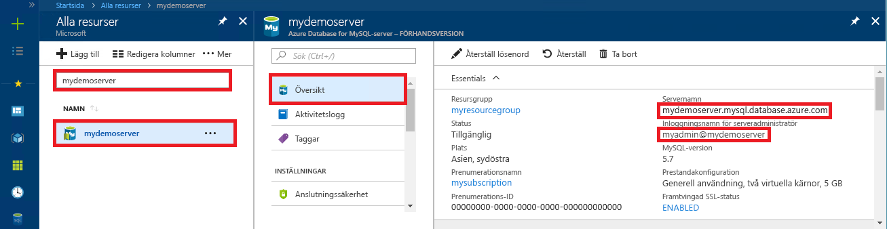

# <a name="azure-database-for-mysql-use-java-to-connect-and-query-data"></a>Azure Database for MySQL: Använda Java för att ansluta och skicka frågor till data
Den här snabbstarten visar hur du ansluter till en Azure Database for MySQL med hjälp av ett Java-program och JDBC-drivrutinen [MySQL Connector/J](https://dev.mysql.com/downloads/connector/j/). Den visar hur du använder SQL-instruktioner för att fråga, infoga, uppdatera och ta bort data i databasen. Den här artikeln förutsätter att du är van att utveckla i Java och att du saknar erfarenhet av Azure Database for MySQL.

Det finns många andra exempel och exempelkod på [sidan med exempel för MySQL Connector](https://dev.mysql.com/doc/connector-j/5.1/en/connector-j-examples.html).

## <a name="prerequisites"></a>Förutsättningar
1. I den här snabbstarten används de resurser som skapades i någon av följande guider som utgångspunkt:
   - [Skapa en Azure Database för MySQL med Azure Portal](./quickstart-create-mysql-server-database-using-azure-portal.md)
   - [Skapa en Azure Database för MySQL-server med Azure CLI](./quickstart-create-mysql-server-database-using-azure-cli.md)

2. Se till att säkerhetsinställningarna för Azure Database för MySQL-anslutning konfigureras med brandväggen öppen och att SSL-inställningarna justeras så att programmet kan ansluta.

3. Hämta MySQL Connector/J-anslutningen på något av följande sätt:
   - Använd Maven-paketet [mysql-connector-java](https://search.maven.org/#search%7Cga%7C1%7Cg%3A%22mysql%22%20AND%20a%3A%22mysql-connector-java%22) för att inkludera [mysql-beroendet](https://mvnrepository.com/artifact/mysql/mysql-connector-java/5.1.6) i POM-filen för projektet.
   - Ladda ned JDBC-drivrutinen [MySQL Connector/J](https://dev.mysql.com/downloads/connector/j/) och lägg till JDBC-jar-filen (till exempel mysql-connector-java-5.1.42-bin.jar) i appens klassökväg. Om du har problem med klassökvägar kan du läsa dokumentationen för miljön för information om klassens sökväg, till exempel [Apache Tomcat](https://tomcat.apache.org/tomcat-7.0-doc/class-loader-howto.html) eller [Java SE](https://docs.oracle.com/javase/7/docs/technotes/tools/windows/classpath.html)

## <a name="get-connection-information"></a>Hämta anslutningsinformation
Skaffa den information som du behöver för att ansluta till Azure Database för MySQL. Du behöver det fullständiga servernamnet och inloggningsuppgifter.

1. Logga in på [Azure-portalen](https://portal.azure.com/).
2. På den vänstra menyn i Azure Portal klickar du på **Alla resurser**. Sök sedan efter den server som du skapade (till exempel **mydemoserver**).
3. Klicka på servernamnet.
4. På serverpanelen **Översikt** antecknar du **Servernamn** och **Inloggningsnamn för serveradministratören**. Om du glömmer lösenordet kan du även återställa det på den här panelen.
 

## <a name="connect-create-table-and-insert-data"></a>Ansluta, skapa tabell och infoga data
Använd följande kod för att ansluta och läsa in data med hjälp av en funktion med en **INSERT**-SQL-instruktion. Metoden [getConnection()](https://dev.mysql.com/doc/connector-j/5.1/en/connector-j-usagenotes-connect-drivermanager.html) används för att ansluta till MySQL. Metoderna [createStatement()](https://dev.mysql.com/doc/connector-j/5.1/en/connector-j-usagenotes-statements.html) och execute() används för att släppa och skapa tabellen. Objektet prepareStatement används för att skapa infogningskommandon och setString() och setInt() används för att binda parametervärdena. Metoden executeUpdate() infogar värdena genom att kommandot körs för varje uppsättning parametrar. 

Ersätt parametrarna host, database, user och password med de värden som du angav när du skapade din server och databas.

```java
import java.sql.*;
import java.util.Properties;

public class CreateTableInsertRows {

    public static void main (String[] args)  throws Exception
    {
        // Initialize connection variables. 
        String host = "mydemoserver.mysql.database.azure.com";
        String database = "quickstartdb";
        String user = "myadmin@mydemoserver";
        String password = "<server_admin_password>";

        // check that the driver is installed
        try
        {
            Class.forName("com.mysql.jdbc.Driver");
        }
        catch (ClassNotFoundException e)
        {
            throw new ClassNotFoundException("MySQL JDBC driver NOT detected in library path.", e);
        }

        System.out.println("MySQL JDBC driver detected in library path.");

        Connection connection = null;

        // Initialize connection object
        try
        {
            String url = String.format("jdbc:mysql://%s/%s", host, database);

            // Set connection properties.
            Properties properties = new Properties();
            properties.setProperty("user", user);
            properties.setProperty("password", password);
            properties.setProperty("useSSL", "true");
            properties.setProperty("verifyServerCertificate", "true");
            properties.setProperty("requireSSL", "false");

            // get connection
            connection = DriverManager.getConnection(url, properties);
        }
        catch (SQLException e)
        {
            throw new SQLException("Failed to create connection to database.", e);
        }
        if (connection != null) 
        { 
            System.out.println("Successfully created connection to database.");
        
            // Perform some SQL queries over the connection.
            try
            {
                // Drop previous table of same name if one exists.
                Statement statement = connection.createStatement();
                statement.execute("DROP TABLE IF EXISTS inventory;");
                System.out.println("Finished dropping table (if existed).");
    
                // Create table.
                statement.execute("CREATE TABLE inventory (id serial PRIMARY KEY, name VARCHAR(50), quantity INTEGER);");
                System.out.println("Created table.");
                
                // Insert some data into table.
                int nRowsInserted = 0;
                PreparedStatement preparedStatement = connection.prepareStatement("INSERT INTO inventory (name, quantity) VALUES (?, ?);");
                preparedStatement.setString(1, "banana");
                preparedStatement.setInt(2, 150);
                nRowsInserted += preparedStatement.executeUpdate();

                preparedStatement.setString(1, "orange");
                preparedStatement.setInt(2, 154);
                nRowsInserted += preparedStatement.executeUpdate();

                preparedStatement.setString(1, "apple");
                preparedStatement.setInt(2, 100);
                nRowsInserted += preparedStatement.executeUpdate();
                System.out.println(String.format("Inserted %d row(s) of data.", nRowsInserted));
    
                // NOTE No need to commit all changes to database, as auto-commit is enabled by default.
    
            }
            catch (SQLException e)
            {
                throw new SQLException("Encountered an error when executing given sql statement.", e);
            }       
        }
        else {
            System.out.println("Failed to create connection to database.");
        }
        System.out.println("Execution finished.");
    }
}

```

## <a name="read-data"></a>Läsa data
Använd följande kod för att läsa in data med en **SELECT**-SQL-instruktion. Metoden [getConnection()](https://dev.mysql.com/doc/connector-j/5.1/en/connector-j-usagenotes-connect-drivermanager.html) används för att ansluta till MySQL. Metoderna [createStatement()](https://dev.mysql.com/doc/connector-j/5.1/en/connector-j-usagenotes-statements.html) och executeQuery() används för att ansluta och köra select-instruktionen. Resultaten bearbetas med ett [ResultSet](https://docs.oracle.com/javase/tutorial/jdbc/basics/retrieving.html)-objekt. 

Ersätt parametrarna host, database, user och password med de värden som du angav när du skapade din server och databas.

```java
import java.sql.*;
import java.util.Properties;

public class ReadTable {

    public static void main (String[] args)  throws Exception
    {
        // Initialize connection variables.
        String host = "mydemoserver.mysql.database.azure.com";
        String database = "quickstartdb";
        String user = "myadmin@mydemoserver";
        String password = "<server_admin_password>";

        // check that the driver is installed
        try
        {
            Class.forName("com.mysql.jdbc.Driver");
        }
        catch (ClassNotFoundException e)
        {
            throw new ClassNotFoundException("MySQL JDBC driver NOT detected in library path.", e);
        }

        System.out.println("MySQL JDBC driver detected in library path.");

        Connection connection = null;

        // Initialize connection object
        try
        {
            String url = String.format("jdbc:mysql://%s/%s", host, database);

            // Set connection properties.
            Properties properties = new Properties();
            properties.setProperty("user", user);
            properties.setProperty("password", password);
            properties.setProperty("useSSL", "true");
            properties.setProperty("verifyServerCertificate", "true");
            properties.setProperty("requireSSL", "false");
            
            // get connection
            connection = DriverManager.getConnection(url, properties);
        }
        catch (SQLException e)
        {
            throw new SQLException("Failed to create connection to database", e);
        }
        if (connection != null) 
        { 
            System.out.println("Successfully created connection to database.");
        
            // Perform some SQL queries over the connection.
            try
            {
    
                Statement statement = connection.createStatement();
                ResultSet results = statement.executeQuery("SELECT * from inventory;");
                while (results.next())
                {
                    String outputString = 
                        String.format(
                            "Data row = (%s, %s, %s)",
                            results.getString(1),
                            results.getString(2),
                            results.getString(3));
                    System.out.println(outputString);
                }
            }
            catch (SQLException e)
            {
                throw new SQLException("Encountered an error when executing given sql statement", e);
            }       
        }
        else {
            System.out.println("Failed to create connection to database."); 
        }
        System.out.println("Execution finished.");
    }
}
```

## <a name="update-data"></a>Uppdatera data
Använd följande kod för att ändra data med en **UPDATE**-SQL-instruktion. Metoden [getConnection()](https://dev.mysql.com/doc/connector-j/5.1/en/connector-j-usagenotes-connect-drivermanager.html) används för att ansluta till MySQL. Metoderna [prepareStatement()](https://docs.oracle.com/javase/tutorial/jdbc/basics/prepared.html) och executeUpdate() används för att förbereda och köra update-instruktionen. 

Ersätt parametrarna host, database, user och password med de värden som du angav när du skapade din server och databas.

```java
import java.sql.*;
import java.util.Properties;

public class UpdateTable {
    public static void main (String[] args)  throws Exception
    {
        // Initialize connection variables. 
        String host = "mydemoserver.mysql.database.azure.com";
        String database = "quickstartdb";
        String user = "myadmin@mydemoserver";
        String password = "<server_admin_password>";

        // check that the driver is installed
        try
        {
            Class.forName("com.mysql.jdbc.Driver");
        }
        catch (ClassNotFoundException e)
        {
            throw new ClassNotFoundException("MySQL JDBC driver NOT detected in library path.", e);
        }
        System.out.println("MySQL JDBC driver detected in library path.");

        Connection connection = null;

        // Initialize connection object
        try
        {
            String url = String.format("jdbc:mysql://%s/%s", host, database);
            
            // set up the connection properties
            Properties properties = new Properties();
            properties.setProperty("user", user);
            properties.setProperty("password", password);
            properties.setProperty("useSSL", "true");
            properties.setProperty("verifyServerCertificate", "true");
            properties.setProperty("requireSSL", "false");

            // get connection
            connection = DriverManager.getConnection(url, properties);
        }
        catch (SQLException e)
        {
            throw new SQLException("Failed to create connection to database.", e);
        }
        if (connection != null) 
        { 
            System.out.println("Successfully created connection to database.");
        
            // Perform some SQL queries over the connection.
            try
            {
                // Modify some data in table.
                int nRowsUpdated = 0;
                PreparedStatement preparedStatement = connection.prepareStatement("UPDATE inventory SET quantity = ? WHERE name = ?;");
                preparedStatement.setInt(1, 200);
                preparedStatement.setString(2, "banana");
                nRowsUpdated += preparedStatement.executeUpdate();
                System.out.println(String.format("Updated %d row(s) of data.", nRowsUpdated));
    
                // NOTE No need to commit all changes to database, as auto-commit is enabled by default.
            }
            catch (SQLException e)
            {
                throw new SQLException("Encountered an error when executing given sql statement.", e);
            }       
        }
        else {
            System.out.println("Failed to create connection to database.");
        }
        System.out.println("Execution finished.");
    }
}
```

## <a name="delete-data"></a>Ta bort data
Använd följande kod för att ta bort data med en **DELETE**-SQL-instruktion. Metoden [getConnection()](https://dev.mysql.com/doc/connector-j/5.1/en/connector-j-usagenotes-connect-drivermanager.html) används för att ansluta till MySQL.  Metoderna [prepareStatement()](https://docs.oracle.com/javase/tutorial/jdbc/basics/prepared.html) och executeUpdate() används för att förbereda och köra update-instruktionen. 

Ersätt parametrarna host, database, user och password med de värden som du angav när du skapade din server och databas.

```java
import java.sql.*;
import java.util.Properties;

public class DeleteTable {
    public static void main (String[] args)  throws Exception
    {
        // Initialize connection variables.
        String host = "mydemoserver.mysql.database.azure.com";
        String database = "quickstartdb";
        String user = "myadmin@mydemoserver";
        String password = "<server_admin_password>";
        
        // check that the driver is installed
        try
        {
            Class.forName("com.mysql.jdbc.Driver");
        }
        catch (ClassNotFoundException e)
        {
            throw new ClassNotFoundException("MySQL JDBC driver NOT detected in library path.", e);
        }

        System.out.println("MySQL JDBC driver detected in library path.");

        Connection connection = null;

        // Initialize connection object
        try
        {
            String url = String.format("jdbc:mysql://%s/%s", host, database);
            
            // set up the connection properties
            Properties properties = new Properties();
            properties.setProperty("user", user);
            properties.setProperty("password", password);
            properties.setProperty("useSSL", "true");
            properties.setProperty("verifyServerCertificate", "true");
            properties.setProperty("requireSSL", "false");
            
            // get connection
            connection = DriverManager.getConnection(url, properties);
        }
        catch (SQLException e)
        {
            throw new SQLException("Failed to create connection to database", e);
        }
        if (connection != null) 
        { 
            System.out.println("Successfully created connection to database.");
        
            // Perform some SQL queries over the connection.
            try
            {
                // Delete some data from table.
                int nRowsDeleted = 0;
                PreparedStatement preparedStatement = connection.prepareStatement("DELETE FROM inventory WHERE name = ?;");
                preparedStatement.setString(1, "orange");
                nRowsDeleted += preparedStatement.executeUpdate();
                System.out.println(String.format("Deleted %d row(s) of data.", nRowsDeleted));
    
                // NOTE No need to commit all changes to database, as auto-commit is enabled by default.
            }
            catch (SQLException e)
            {
                throw new SQLException("Encountered an error when executing given sql statement.", e);
            }       
        }
        else {
            System.out.println("Failed to create connection to database.");
        }
        System.out.println("Execution finished.");
    }
}
```

## <a name="next-steps"></a>Nästa steg
Det finns många andra exempel och exempelkod på [sidan med exempel för MySQL Connector/J](https://dev.mysql.com/doc/connector-j/5.1/en/connector-j-examples.html).

> [!div class="nextstepaction"]
> [Migrera MySQL-databasen till Azure Database för MySQL med säkerhetskopiering och återställning](concepts-migrate-dump-restore.md)
