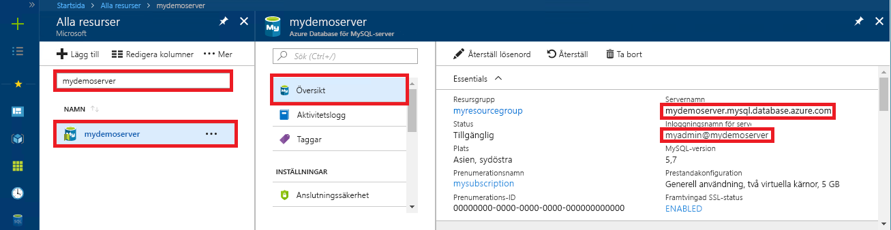

# <a name="azure-database-for-mysql-use-nodejs-to-connect-and-query-data"></a>Azure Database för MySQL: Använda Node.js för att ansluta och fråga efter data
Den här snabbstarten visar hur du ansluter till en Azure Database för MySQL med hjälp av ett [Node.js](https://nodejs.org/)-program från plattformar med Windows, Ubuntu Linux och Mac. Den visar hur du använder SQL-instruktioner för att fråga, infoga, uppdatera och ta bort data i databasen. Det här avsnittet förutsätter att du är van att utveckla i Node.js och att du saknar erfarenhet av Azure Database for MySQL.

## <a name="prerequisites"></a>Nödvändiga komponenter
I den här snabbstarten används de resurser som skapades i någon av följande guider som utgångspunkt:
- [Skapa en Azure Database för MySQL med Azure Portal](./quickstart-create-mysql-server-database-using-azure-portal.md)
- [Skapa en Azure Database för MySQL-server med Azure CLI](./quickstart-create-mysql-server-database-using-azure-cli.md)

Du måste också:
- Installera [Node.js](https://nodejs.org) runtime.
- Installera [mysql](https://www.npmjs.com/package/mysql)-paketet för att ansluta till MySQL från Node.js-programmet. 

## <a name="install-nodejs-and-the-mysql-connector"></a>Installera Node.js och MySQL Connector
Följ instruktionerna för att installera Node.js beroende på din plattform. Använd npm för att installera mysql-paketet och dess beroenden i projektmappen.

### <a name="windows"></a>**Windows**
1. Besök [hämtningssidan för Node.js](https://nodejs.org/en/download/) och välj sedan önskat alternativ för Windows installeringsverktyg.
2. Skapa en lokal projektmapp som till exempel `nodejsmysql`. 
3. Starta Kommandotolken och ändra sedan katalog till projektmappen, till exempel `cd c:\nodejsmysql\`
4. Kör NPM-verktyget för att installera mysql-biblioteket i projektmappen.

   ```cmd
   cd c:\nodejsmysql\
   "C:\Program Files\nodejs\npm" install mysql
   "C:\Program Files\nodejs\npm" list
   ```

5. Verifiera installationen genom att kontrollera `npm list`-utdatatexten. Versionsnumret kan variera när nya korrigeringsfiler blir tillgängliga.

### <a name="linux-ubuntu"></a>**Linux (Ubuntu)**
1. Ange följande kommandon för att installera **npm** och **Node.js**, en användarvänlig pakethanterare för Node.js.

   ```bash
   sudo apt-get install -y nodejs npm
   ```

2. Kör följande kommandon för att skapa projektmappen `mysqlnodejs` och installera mysql-paketet i den mappen.

   ```bash
   mkdir nodejsmysql
   cd nodejsmysql
   npm install --save mysql
   npm list
   ```
3. Verifiera installationen genom att kontrollera npm-listans utdatatext. Versionsnumret kan variera när nya korrigeringsfiler blir tillgängliga.

### <a name="mac-os"></a>**Mac OS**
1. Ange följande kommandon för att installera **brew**, en användarvänlig pakethanterare för Mac OS X och **Node.js**.

   ```bash
   ruby -e "$(curl -fsSL https://raw.githubusercontent.com/Homebrew/install/master/install)"
   brew install node
   ```
2. Kör följande kommandon för att skapa projektmappen `mysqlnodejs` och installera mysql-paketet i den mappen.

   ```bash
   mkdir nodejsmysql
   cd nodejsmysql
   npm install --save mysql
   npm list
   ```

3. Verifiera installationen genom att kontrollera `npm list`-utdatatexten. Versionsnumret kan variera när nya korrigeringsfiler blir tillgängliga.

## <a name="get-connection-information"></a>Hämta anslutningsinformation
Skaffa den information som du behöver för att ansluta till Azure Database för MySQL. Du behöver det fullständiga servernamnet och inloggningsuppgifter.

1. Logga in på [Azure-portalen](https://portal.azure.com/).
2. På den vänstra menyn i Azure Portal klickar du på **Alla resurser**. Sök sedan efter den server som du skapade (till exempel **mydemoserver**).
3. Klicka på servernamnet.
4. På serverpanelen **Översikt** antecknar du **Servernamn** och **Inloggningsnamn för serveradministratören**. Om du glömmer lösenordet kan du även återställa det på den här panelen.
 

## <a name="running-the-javascript-code-in-nodejs"></a>Kör JavaScript-kod i Node.js
1. Klistra in JavaScript-koden i en textfil och spara sedan filen till en projektmapp med filnamnstillägget .js (till exempel C:\nodejsmysql\createtable.js eller /home/username/nodejsmysql/createtable.js).
2. Starta kommandotolken eller Bash-gränssnittet och byt katalog till din projektmapp (`cd nodejsmysql`).
3. Skriv node-kommandot följt av filnamnet, till exempel `node createtable.js`, för att köra programmet.
4. I Windows, om node-programmet inte finns på sökvägen för miljövariabeln, kan du behöva använda den fullständiga sökvägen för att starta nodprogrammet, till exempel `"C:\Program Files\nodejs\node.exe" createtable.js`

## <a name="connect-create-table-and-insert-data"></a>Ansluta, skapa tabell och infoga data
Använd följande kod för att ansluta och läsa in data med hjälp av SQL-instruktionerna **CREATE TABLE** och **INSERT INTO**.

Metoden [mysql.createConnection()](https://github.com/mysqljs/mysql#establishing-connections) används som gränssnitt med MySQL-servern. Funktionen [connect()](https://github.com/mysqljs/mysql#establishing-connections) används för att etablera anslutningen till servern. Funktionen [query()](https://github.com/mysqljs/mysql#performing-queries) används för att köra SQL-frågor mot en MySQL-databas. 

Ersätt parametrarna `host`, `user`, `password` och `database` med de värden som du angav när du skapade servern och databasen.

```javascript
const mysql = require('mysql');

var config =
{
    host: 'mydemoserver.mysql.database.azure.com',
    user: 'myadmin@mydemoserver',
    password: 'your_password',
    database: 'quickstartdb',
    port: 3306,
    ssl: true
};

const conn = new mysql.createConnection(config);

conn.connect(
    function (err) { 
    if (err) { 
        console.log("!!! Cannot connect !!! Error:");
        throw err;
    }
    else
    {
       console.log("Connection established.");
           queryDatabase();
    }   
});

function queryDatabase(){
       conn.query('DROP TABLE IF EXISTS inventory;', function (err, results, fields) { 
            if (err) throw err; 
            console.log('Dropped inventory table if existed.');
        })
       conn.query('CREATE TABLE inventory (id serial PRIMARY KEY, name VARCHAR(50), quantity INTEGER);', 
            function (err, results, fields) {
                if (err) throw err;
            console.log('Created inventory table.');
        })
       conn.query('INSERT INTO inventory (name, quantity) VALUES (?, ?);', ['banana', 150], 
            function (err, results, fields) {
                if (err) throw err;
            else console.log('Inserted ' + results.affectedRows + ' row(s).');
        })
       conn.query('INSERT INTO inventory (name, quantity) VALUES (?, ?);', ['orange', 154], 
            function (err, results, fields) {
                if (err) throw err;
            console.log('Inserted ' + results.affectedRows + ' row(s).');
        })
       conn.query('INSERT INTO inventory (name, quantity) VALUES (?, ?);', ['apple', 100], 
        function (err, results, fields) {
                if (err) throw err;
            console.log('Inserted ' + results.affectedRows + ' row(s).');
        })
       conn.end(function (err) { 
        if (err) throw err;
        else  console.log('Done.') 
        });
};
```

## <a name="read-data"></a>Läsa data
Använd följande kod för att ansluta och läsa data med SQL-instruktionen **SELECT**. 

Metoden [mysql.createConnection()](https://github.com/mysqljs/mysql#establishing-connections) används som gränssnitt med MySQL-servern. Metoden [connect()](https://github.com/mysqljs/mysql#establishing-connections) används för att etablera anslutningen till servern. Metoden [query()](https://github.com/mysqljs/mysql#performing-queries) används för att köra SQL-frågor mot en MySQL-databas. Resultatmatrisen används för resultat från frågan.

Ersätt parametrarna `host`, `user`, `password` och `database` med de värden som du angav när du skapade servern och databasen.

```javascript
const mysql = require('mysql');

var config =
{
    host: 'mydemoserver.mysql.database.azure.com',
    user: 'myadmin@mydemoserver',
    password: 'your_password',
    database: 'quickstartdb',
    port: 3306,
    ssl: true
};

const conn = new mysql.createConnection(config);

conn.connect(
    function (err) { 
        if (err) { 
            console.log("!!! Cannot connect !!! Error:");
            throw err;
        }
        else {
            console.log("Connection established.");
            readData();
        }   
    });

function readData(){
        conn.query('SELECT * FROM inventory', 
            function (err, results, fields) {
                if (err) throw err;
                else console.log('Selected ' + results.length + ' row(s).');
                for (i = 0; i < results.length; i++) {
                    console.log('Row: ' + JSON.stringify(results[i]));
                }
                console.log('Done.');
            })
       conn.end(
           function (err) { 
                if (err) throw err;
                else  console.log('Closing connection.') 
        });
};
```

## <a name="update-data"></a>Uppdatera data
Använd följande kod för att ansluta och läsa data med SQL-instruktionen **UPDATE**. 

Metoden [mysql.createConnection()](https://github.com/mysqljs/mysql#establishing-connections) används som gränssnitt med MySQL-servern. Metoden [connect()](https://github.com/mysqljs/mysql#establishing-connections) används för att etablera anslutningen till servern. Metoden [query()](https://github.com/mysqljs/mysql#performing-queries) används för att köra SQL-frågor mot en MySQL-databas. 

Ersätt parametrarna `host`, `user`, `password` och `database` med de värden som du angav när du skapade servern och databasen.

```javascript
const mysql = require('mysql');

var config =
{
    host: 'mydemoserver.mysql.database.azure.com',
    user: 'myadmin@mydemoserver',
    password: 'your_password',
    database: 'quickstartdb',
    port: 3306,
    ssl: true
};

const conn = new mysql.createConnection(config);

conn.connect(
    function (err) { 
        if (err) { 
            console.log("!!! Cannot connect !!! Error:");
            throw err;
        }
        else {
            console.log("Connection established.");
            updateData();
        }   
    });

function updateData(){
       conn.query('UPDATE inventory SET quantity = ? WHERE name = ?', [200, 'banana'], 
            function (err, results, fields) {
                if (err) throw err;
                else console.log('Updated ' + results.affectedRows + ' row(s).');
        })
       conn.end(
           function (err) { 
                if (err) throw err;
                else  console.log('Done.') 
        });
};
```

## <a name="delete-data"></a>Ta bort data
Använd följande kod för att ansluta och läsa data med SQL-instruktionen **DELETE**. 

Metoden [mysql.createConnection()](https://github.com/mysqljs/mysql#establishing-connections) används som gränssnitt med MySQL-servern. Metoden [connect()](https://github.com/mysqljs/mysql#establishing-connections) används för att etablera anslutningen till servern. Metoden [query()](https://github.com/mysqljs/mysql#performing-queries) används för att köra SQL-frågor mot en MySQL-databas. 

Ersätt parametrarna `host`, `user`, `password` och `database` med de värden som du angav när du skapade servern och databasen.

```javascript
const mysql = require('mysql');

var config =
{
    host: 'mydemoserver.mysql.database.azure.com',
    user: 'myadmin@mydemoserver',
    password: 'your_password',
    database: 'quickstartdb',
    port: 3306,
    ssl: true
};

const conn = new mysql.createConnection(config);

conn.connect(
    function (err) { 
        if (err) { 
            console.log("!!! Cannot connect !!! Error:");
            throw err;
        }
        else {
            console.log("Connection established.");
            deleteData();
        }   
    });

function deleteData(){
       conn.query('DELETE FROM inventory WHERE name = ?', ['orange'], 
            function (err, results, fields) {
                if (err) throw err;
                else console.log('Deleted ' + results.affectedRows + ' row(s).');
        })
       conn.end(
           function (err) { 
                if (err) throw err;
                else  console.log('Done.') 
        });
};
```

## <a name="next-steps"></a>Nästa steg
> [!div class="nextstepaction"]
> [Migrera din databas med Exportera och importera](./concepts-migrate-import-export.md)
