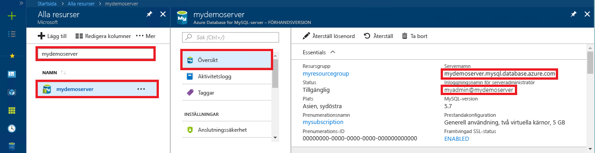

# <a name="azure-database-for-mysql-use-python-to-connect-and-query-data"></a>Azure Database for MySQL: Använda Python för att ansluta och fråga data
Den här snabbstarten visar hur du använder [Python](https://python.org) för att ansluta till en Azure Database för MySQL. SQL-instruktioner används för att fråga, infoga, uppdatera och ta bort data i databasen i Mac OS, Ubuntu Linux och Windows-plattformar. Det här avsnittet förutsätter att du är van att utveckla i Python och att du saknar erfarenhet av Azure Database for MySQL.

## <a name="prerequisites"></a>Nödvändiga komponenter
I den här snabbstarten används de resurser som skapades i någon av följande guider som utgångspunkt:
- [Skapa en Azure Database för MySQL med Azure Portal](./quickstart-create-mysql-server-database-using-azure-portal.md)
- [Skapa en Azure Database för MySQL-server med Azure CLI](./quickstart-create-mysql-server-database-using-azure-cli.md)

## <a name="install-python-and-the-mysql-connector"></a>Installera Python och MySQL Connector
Installera [Python](https://www.python.org/downloads/) och [MySQL Connector för Python](https://dev.mysql.com/downloads/connector/python/) på din egen dator. Följ instruktionerna för din plattform nedan. 

> [!NOTE]
> Den här snabbstarten använder en rå SQL-frågemetod för att ansluta till MySQL för att köra frågor. Om du använder ett webbramverk kan du använda den rekommenderade anslutningstjänsten för dessa ramverk. Till exempel rekommenderas [mysqlclient](https://pypi.org/project/mysqlclient/) för användning med Django.
>

### <a name="windows"></a>Windows
1. Hämta och installera Python 2.7 från [python.org](https://www.python.org/downloads/windows/). 
2. Kontrollera Python-installationen genom att starta Kommandotolken. Kör kommandot `C:\python27\python.exe -V` med -V (versal) för att visa versionsnumret.
3. Installera den Python Connector för MySQL som motsvarar din version av Python från [mysql.com](https://dev.mysql.com/downloads/connector/python/).

### <a name="linux-ubuntu"></a>Linux (Ubuntu)
1. I Linux (Ubuntu) installeras vanligtvis Python som en del av standardinstallationen.
2. Kontrollera Python-installationen genom att starta Bash-gränssnittet. Kör kommandot `python -V` med -V (versal) för att visa versionsnumret.
3. Kontrollera PIP-installationen genom att köra kommandot `pip show pip -V` och se versionsnumret. 
4. PIP kan ingå i vissa versioner av Python. Om PIP inte har installerats kan du installera [PIP](https://pip.pypa.io/en/stable/installing/)-paketet genom att köra kommandot `sudo apt-get install python-pip`.
5. Uppdatera PIP till den senaste versionen genom att köra kommandot `pip install -U pip`.
6. Installera MySQL Connector för Python och dess beroenden med hjälp av PIP-kommandot:

   ```bash
   sudo pip install mysql-connector-python-rf
   ```
 
### <a name="macos"></a>MacOS
1. I Mac OS installeras vanligtvis Python som en del av standardinstallationen av operativsystemet.
2. Kontrollera Python-installationen genom att starta Bash-gränssnittet. Kör kommandot `python -V` med -V (versal) för att visa versionsnumret.
3. Kontrollera PIP-installationen genom att köra kommandot `pip show pip -V` och se versionsnumret.
4. PIP kan ingå i vissa versioner av Python. Om PIP inte har installerats kan du installera [PIP](https://pip.pypa.io/en/stable/installing/)-paketet.
5. Uppdatera PIP till den senaste versionen genom att köra kommandot `pip install -U pip`.
6. Installera MySQL Connector för Python och dess beroenden med hjälp av PIP-kommandot:

   ```bash
   pip install mysql-connector-python-rf
   ``` 

## <a name="get-connection-information"></a>Hämta anslutningsinformation
Skaffa den information som du behöver för att ansluta till Azure Database för MySQL. Du behöver det fullständiga servernamnet och inloggningsuppgifter.

1. Logga in på [Azure-portalen](https://portal.azure.com/).
2. På den vänstra menyn i Azure Portal klickar du på **Alla resurser**. Sök sedan efter den server som du skapade (till exempel **mydemoserver**).
3. Klicka på servernamnet.
4. På serverpanelen **Översikt** antecknar du **Servernamn** och **Inloggningsnamn för serveradministratören**. Om du glömmer lösenordet kan du även återställa det på den här panelen.
 

## <a name="run-python-code"></a>Köra Python-kod
- Klistra in koden i en textfil och spara sedan filen till en projektmapp med filnamnstillägget .py (till exempel C:\pythonmysql\createtable.py eller /home/username/pythonmysql/createtable.py).
- För att köra koden startar du kommandotolken eller bash-gränssnittet. Ändra katalog till din projektmapp, till exempel `cd pythonmysql`. Skriv Python-kommandot följt av filnamnet `python createtable.py` för att köra programmet. Om python.exe inte hittas i Windows kanske du måste ange den fullständiga sökvägen till den körbara filen eller lägga till Python-sökvägen i Path-miljövariabeln. `C:\python27\python.exe createtable.py`

## <a name="connect-create-table-and-insert-data"></a>Ansluta, skapa tabell och infoga data
Använd följande kod för att ansluta till servern, skapa en tabell och läsa in data med hjälp av SQL-instruktionen **INSERT**. 

Biblioteket mysql.connector importeras i koden. Funktionen [connect()](https://dev.mysql.com/doc/connector-python/en/connector-python-api-mysql-connector-connect.html) används för att ansluta till Azure Database för MySQL med [anslutningsargumenten](https://dev.mysql.com/doc/connector-python/en/connector-python-connectargs.html) i config-insamlingen. I koden används en cursor i anslutningen, och metoden [cursor.execute()](https://dev.mysql.com/doc/connector-python/en/connector-python-api-mysqlcursor-execute.html) kör SQL-frågan mot MySQL-databasen. 

Ersätt parametrarna `host`, `user`, `password` och `database` med de värden som du angav när du skapade servern och databasen.

```Python
import mysql.connector
from mysql.connector import errorcode

# Obtain connection string information from the portal
config = {
  'host':'mydemoserver.mysql.database.azure.com',
  'user':'myadmin@mydemoserver',
  'password':'yourpassword',
  'database':'quickstartdb'
}

# Construct connection string
try:
   conn = mysql.connector.connect(**config)
   print("Connection established")
except mysql.connector.Error as err:
  if err.errno == errorcode.ER_ACCESS_DENIED_ERROR:
    print("Something is wrong with the user name or password")
  elif err.errno == errorcode.ER_BAD_DB_ERROR:
    print("Database does not exist")
  else:
    print(err)
else:
  cursor = conn.cursor()

  # Drop previous table of same name if one exists
  cursor.execute("DROP TABLE IF EXISTS inventory;")
  print("Finished dropping table (if existed).")

  # Create table
  cursor.execute("CREATE TABLE inventory (id serial PRIMARY KEY, name VARCHAR(50), quantity INTEGER);")
  print("Finished creating table.")

  # Insert some data into table
  cursor.execute("INSERT INTO inventory (name, quantity) VALUES (%s, %s);", ("banana", 150))
  print("Inserted",cursor.rowcount,"row(s) of data.")
  cursor.execute("INSERT INTO inventory (name, quantity) VALUES (%s, %s);", ("orange", 154))
  print("Inserted",cursor.rowcount,"row(s) of data.")
  cursor.execute("INSERT INTO inventory (name, quantity) VALUES (%s, %s);", ("apple", 100))
  print("Inserted",cursor.rowcount,"row(s) of data.")

  # Cleanup
  conn.commit()
  cursor.close()
  conn.close()
  print("Done.")
```

## <a name="read-data"></a>Läsa data
Använd följande kod för att ansluta och läsa data med SQL-instruktionen **SELECT**. 

Biblioteket mysql.connector importeras i koden. Funktionen [connect()](https://dev.mysql.com/doc/connector-python/en/connector-python-api-mysql-connector-connect.html) används för att ansluta till Azure Database för MySQL med [anslutningsargumenten](https://dev.mysql.com/doc/connector-python/en/connector-python-connectargs.html) i config-insamlingen. I koden används en cursor i anslutningen, och metoden [cursor.execute()](https://dev.mysql.com/doc/connector-python/en/connector-python-api-mysqlcursor-execute.html) kör SQL-instruktionen mot MySQL-databasen. Datarader läses med hjälp av metoden [fetchall()](https://dev.mysql.com/doc/connector-python/en/connector-python-api-mysqlcursor-fetchall.html). Resultatuppsättningen sparas i en samlingsrad och en for-iterator används för att loopa igenom raderna.

Ersätt parametrarna `host`, `user`, `password` och `database` med de värden som du angav när du skapade servern och databasen.

```Python
import mysql.connector
from mysql.connector import errorcode

# Obtain connection string information from the portal
config = {
  'host':'mydemoserver.mysql.database.azure.com',
  'user':'myadmin@mydemoserver',
  'password':'yourpassword',
  'database':'quickstartdb'
}

# Construct connection string
try:
   conn = mysql.connector.connect(**config)
   print("Connection established")
except mysql.connector.Error as err:
  if err.errno == errorcode.ER_ACCESS_DENIED_ERROR:
    print("Something is wrong with the user name or password")
  elif err.errno == errorcode.ER_BAD_DB_ERROR:
    print("Database does not exist")
  else:
    print(err)
else:
  cursor = conn.cursor()

  # Read data
  cursor.execute("SELECT * FROM inventory;")
  rows = cursor.fetchall()
  print("Read",cursor.rowcount,"row(s) of data.")

  # Print all rows
  for row in rows:
    print("Data row = (%s, %s, %s)" %(str(row[0]), str(row[1]), str(row[2])))

  # Cleanup
  conn.commit()
  cursor.close()
  conn.close()
  print("Done.")
```

## <a name="update-data"></a>Uppdatera data
Använd följande kod för att ansluta och uppdatera data med en **UPDATE**-SQL-instruktion. 

Biblioteket mysql.connector importeras i koden.  Funktionen [connect()](https://dev.mysql.com/doc/connector-python/en/connector-python-api-mysql-connector-connect.html) används för att ansluta till Azure Database för MySQL med [anslutningsargumenten](https://dev.mysql.com/doc/connector-python/en/connector-python-connectargs.html) i config-insamlingen. I koden används en cursor i anslutningen, och metoden [cursor.execute()](https://dev.mysql.com/doc/connector-python/en/connector-python-api-mysqlcursor-execute.html) kör SQL-instruktionen mot MySQL-databasen. 

Ersätt parametrarna `host`, `user`, `password` och `database` med de värden som du angav när du skapade servern och databasen.

```Python
import mysql.connector
from mysql.connector import errorcode

# Obtain connection string information from the portal
config = {
  'host':'mydemoserver.mysql.database.azure.com',
  'user':'myadmin@mydemoserver',
  'password':'yourpassword',
  'database':'quickstartdb'
}

# Construct connection string
try:
   conn = mysql.connector.connect(**config)
   print("Connection established")
except mysql.connector.Error as err:
  if err.errno == errorcode.ER_ACCESS_DENIED_ERROR:
    print("Something is wrong with the user name or password")
  elif err.errno == errorcode.ER_BAD_DB_ERROR:
    print("Database does not exist")
  else:
    print(err)
else:
  cursor = conn.cursor()

  # Update a data row in the table
  cursor.execute("UPDATE inventory SET quantity = %s WHERE name = %s;", (200, "banana"))
  print("Updated",cursor.rowcount,"row(s) of data.")

  # Cleanup
  conn.commit()
  cursor.close()
  conn.close()
  print("Done.")
```

## <a name="delete-data"></a>Ta bort data
Använd följande kod för att ansluta och ta bort data med en **DELETE**-SQL-instruktion. 

Biblioteket mysql.connector importeras i koden.  Funktionen [connect()](https://dev.mysql.com/doc/connector-python/en/connector-python-api-mysql-connector-connect.html) används för att ansluta till Azure Database för MySQL med [anslutningsargumenten](https://dev.mysql.com/doc/connector-python/en/connector-python-connectargs.html) i config-insamlingen. I koden används en cursor i anslutningen, och metoden [cursor.execute()](https://dev.mysql.com/doc/connector-python/en/connector-python-api-mysqlcursor-execute.html) kör SQL-frågan mot MySQL-databasen. 

Ersätt parametrarna `host`, `user`, `password` och `database` med de värden som du angav när du skapade servern och databasen.

```Python
import mysql.connector
from mysql.connector import errorcode

# Obtain connection string information from the portal
config = {
  'host':'mydemoserver.mysql.database.azure.com',
  'user':'myadmin@mydemoserver',
  'password':'yourpassword',
  'database':'quickstartdb'
}

# Construct connection string
try:
   conn = mysql.connector.connect(**config)
   print("Connection established.")
except mysql.connector.Error as err:
  if err.errno == errorcode.ER_ACCESS_DENIED_ERROR:
    print("Something is wrong with the user name or password.")
  elif err.errno == errorcode.ER_BAD_DB_ERROR:
    print("Database does not exist.")
  else:
    print(err)
else:
  cursor = conn.cursor()

  # Delete a data row in the table
  cursor.execute("DELETE FROM inventory WHERE name=%(param1)s;", {'param1':"orange"})
  print("Deleted",cursor.rowcount,"row(s) of data.")

  # Cleanup
  conn.commit()
  cursor.close()
  conn.close()
  print("Done.")
```

## <a name="next-steps"></a>Nästa steg
> [!div class="nextstepaction"]
> [Migrera din databas med Exportera och importera](./concepts-migrate-import-export.md)
