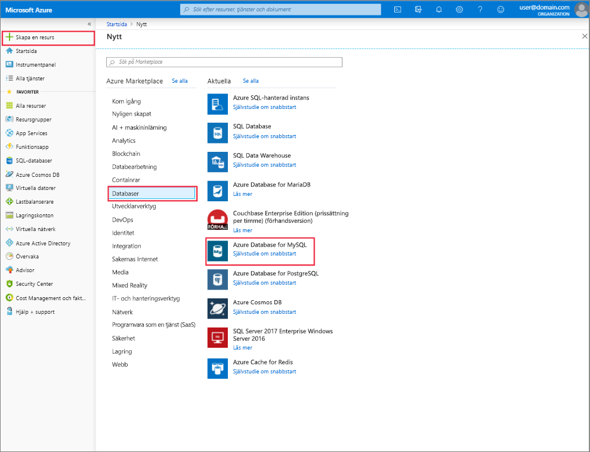

# Skapa och hantera Azure Database för MySQL-server med Azure-portalen
Det här avsnittet beskrivs hur du snabbt kan skapa en ny Azure Database for MySQL-server. Det innehåller även information om hur du hanterar servern med hjälp av Azure portal. Serverhantering innehåller visa information om och databaser, återställer lösenordet, skalning av resurser och tar bort servern.

## Logga in på Azure-portalen
Logga in på [Azure-portalen](https://portal.azure.com).

## Skapa en Azure Database for MySQL-server
Följ stegen nedan för att skapa en Azure Database for MySQL-server med namnet ”mydemoserver”.

1. Klicka på den **skapa en resurs** knappen finns i det övre vänstra hörnet i Azure Portal.

2. På den nya sidan Välj **databaser**, och välj sedan följande på sidan för databaser, **Azure Database for MySQL**.

    > En Azure Database for MySQL-server skapas med en definierad uppsättning [beräknings- och](./concepts-pricing-tiers.md) resurser. Databasen skapas inom en Azure-resursgrupp och i en Azure Database for MySQL-server.

   

3. Fyll i Azure Database for MySQL-formulär med hjälp av följande information:

    | **Formulärfält** | **Fältbeskrivning** |
    |----------------|-----------------------|
    | *Servernamn* | mydemoserver (servernamnet är globalt unikt) |
    | *Prenumeration* | mysubscription (Välj från den nedrullningsbara menyn) |
    | *Resursgrupp* | myresourcegroup (skapa en ny resursgrupp eller Använd en befintlig) |
    | *Välj källa* | Tom (skapa en tom MySQL-server) |
    | *Inloggning för serveradministratör* | myadmin (konfigurera namn på administratörskonto) |
    | *Lösenord* | Ange lösenord för administratörskonto |
    | *Bekräfta lösenord* | bekräfta lösenord för administratörskonto |
    | *Plats* | Sydostasien (Välj mellan Norra Europa och västra USA) |
    | *Version* | 5.7 (väljer Azure Database för MySQL-serverversion) |

4. Klicka på **prisnivå** ange servicenivå för tjänstnivå och prestandanivå för den nya servern. Välj den **generella** fliken. *Gen 5*, *2 virtuella kärnor*, *5 GB*, och *7 dagar* är standardvärdena för **Compute-generering**, **Virtuell kärna** , **Lagring** och **Kvarhållningsperiod för säkerhetskopior**. Du kan lämna dessa skjutreglage som de är. Välj **Geografiskt redundant** bland **redundansalternativen för säkerhetskopiering** om du vill använda geo-redundant lagring för dina serversäkerhetskopior.

   

5. Klicka på **Skapa** för att etablera servern. Etableringen tar några minuter.

    > Välj den **fäst på instrumentpanelen** så att du enkelt kan spåra dina distributioner.

## Uppdatera en Azure Database for MySQL-server
Efter den nya servern har etablerats, har du flera alternativ för att konfigurera den befintliga-servern, inklusive återställa administratörslösenordet och skala upp eller ned servern genom att ändra vCore eller lagring.

### Ändra administratörslösenordet för användare
1. Från servern **översikt**, klickar du på **Återställ lösenord** att visa fönstret för lösenordsåterställning.

   

2. Ange ett nytt lösenord och bekräfta lösenordet i fönstret som visas:

   

3. Klicka på **OK** att spara det nya lösenordet.

### Skala virtuella kärnor upp/ned

1. Klicka på **prisnivå**, som finns under **inställningar**.

2. Ändra den **vCore** inställningen genom att flytta skjutreglaget till din önskade värdet.

    

3. Spara ändringarna genom att klicka på **OK**.

### Skala lagringsutrymme upp

1. Klicka på **prisnivå**, som finns under **inställningar**.

2. Ändra den **Storage** inställningen genom att flytta skjutreglaget till din önskade värdet.

    

3. Spara ändringarna genom att klicka på **OK**.

## Ta bort en Azure Database for MySQL-server

1. Från servern **översikt**, klickar du på den **ta bort** knappen för att öppna bekräftelsefråga delete.

    

2. Skriv namnet på servern i textrutan för dubbla bekräftelse.

    

3. Klicka på den **ta bort** för att bekräfta ta bort servern. Vänta tills ”har tagits bort MySQL-server” pop upp till visas i meddelandefältet.

## Lista över Azure Database for MySQL-databaser
Från servern **översikt**, rulla nedåt tills du ser du databasen som panelen längst ned på sidan. Alla databaser på servern visas i tabellen.

   

## Visa information om en Azure Database for MySQL-server
Klicka på **egenskaper**, som finns under **inställningar** att visa detaljerad information om servern.

## Nästa steg

[Snabbstart: Skapa Azure Database for MySQL-server med Azure-portalen](./quickstart-create-mysql-server-database-using-azure-portal.md)