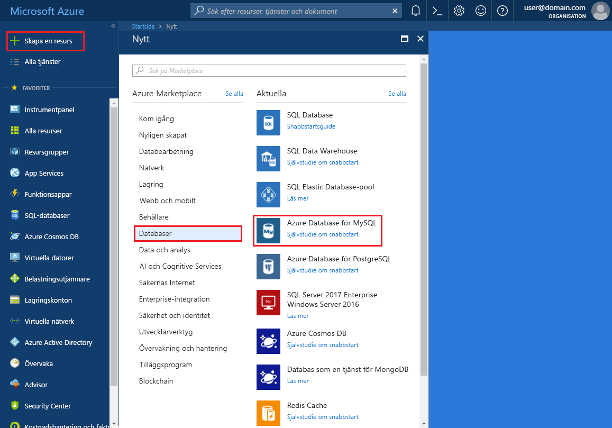
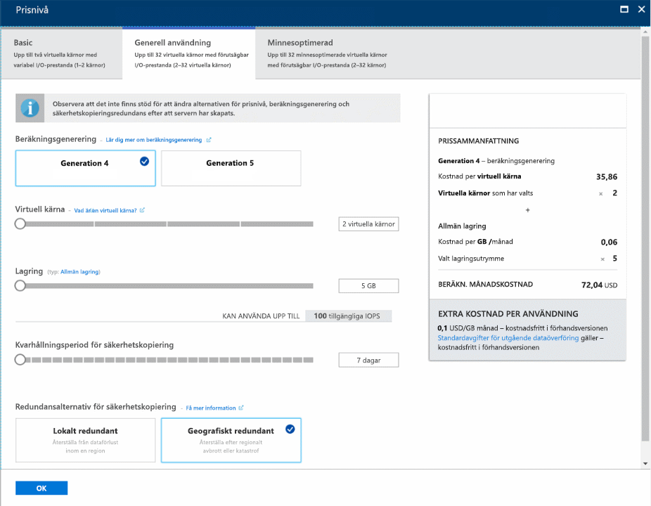
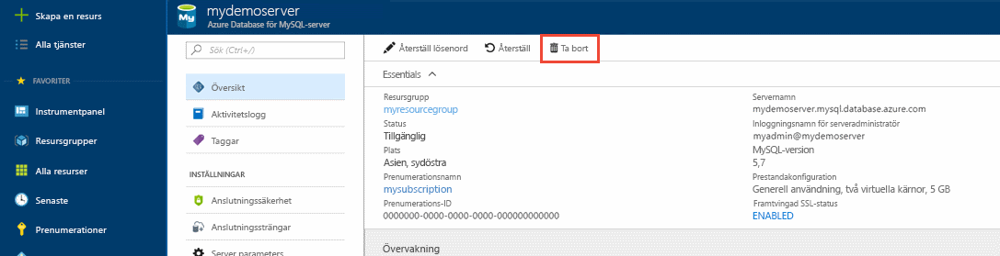

# <a name="create-an-azure-database-for-mysql-server-by-using-the-azure-portal"></a>Skapa en Azure Database för MySQL-server med Azure Portal

Azure Database för MySQL är en hanterad tjänst som du använder för att köra, hantera och skala högtillgängliga MySQL-databaser i molnet. Den här snabbstarten visar hur du skapar en Azure Database for MySQL-server på ungefär fem minuter med Azure Portal.  

Om du inte har en Azure-prenumeration kan du skapa ett [kostnadsfritt Azure-konto](https://azure.microsoft.com/free/) innan du börjar.

## <a name="sign-in-to-the-azure-portal"></a>Logga in på Azure Portal
Öppna webbläsaren och gå sedan till [Azure Portal](https://portal.azure.com/). Ange dina autentiseringsuppgifter och logga in på portalen. Standardvyn är instrumentpanelen.

## <a name="create-an-azure-database-for-mysql-server"></a>Skapa en Azure Database för MySQL-server
Du skapar en Azure Database för MySQL-server med en definierad uppsättning [Compute- och Storage-resurser](./concepts-compute-unit-and-storage.md). Du skapar servern i en [Azure-resursgrupp](../azure-resource-manager/resource-group-overview.md).

Följ de här stegen för att skapa en Azure Database för MySQL-server:

1. Välj knappen **Skapa en resurs** (+) i det övre vänstra hörnet i portalen.

2. Välj **Databaser** > **Azure-databas för MySQL**. Du kan också skriva **MySQL** i sökrutan och leta reda på tjänsten.

   

3. Fyll i formuläret om den nya servern och uppge följande information:
   
   

    **Inställning** | **Föreslaget värde** | **Fältbeskrivning** 
    ---|---|---
    servernamn | Unikt servernamn | Välj ett unikt namn för Azure Database för MySQL-server. Till exempel mydemoserver. Domännamnet *.mysql.database.azure.com* läggs till i det servernamn du anger. Ditt servernamn får bara innehålla gemener, siffror och bindestreck. Det måste innehålla mellan 3 och 63 tecken.
    Prenumeration | Din prenumeration | Välj den Azure-prenumeration som ska användas för servern. Om du har flera prenumerationer väljer du den prenumeration som resursen ska debiteras till.
    Resursgrupp | *myresourcegroup* | Ange ett nytt eller ett befintligt resursgruppnamn.    Resursgrupp|*myresourcegroup*| Ett nytt resursgruppnamn eller ett befintligt namn i prenumerationen.
    Välj källa | *Tom* | Välj *Tom* om du vill skapa en ny server från början. (Du kan välja *Säkerhetskopiering* om du vill skapa en server från en geo-säkerhetskopia av en befintlig Azure Database for MySQL-server).
    inloggning för serveradministratör | myadmin | Ett inloggningskonto som du använder när du ansluter till servern. Inloggningsnamnet för administratören får inte vara **azure_superuser**, **admin**, **administrator**, **root**, **guest** eller **public**.
    Lösenord | *Ditt val* | Ange ett nytt lösenord för serverns administratörskonto. Det måste innehålla mellan 8 och 128 tecken. Lösenordet måste innehålla tecken från tre av följande kategorier: engelska versala bokstäver, engelska gemena bokstäver, siffror (0-9) och icke-alfanumeriska tecken (!, $, #, % osv).
    Bekräfta lösenord | *Ditt val*| Bekräfta administratörslösenordet.
    Plats | *Regionen som ligger närmast dina användare*| Välj den plats som är närmast dina användare eller dina andra Azure-program.
    Version | *Den senaste versionen*| Välj den senaste versionen (om du inte har särskilda behov som gör att du måste ha en annan version).
    Prisnivå | **Generell användning**, **Gen 4**, **2 virtuella kärnor**, **5 GB**, **7 dagar**, **Geografiskt redundant** | Konfigurationerna för beräkning, lagring och säkerhetskopiering för den nya servern. Välj **Prisnivå**. Sedan väljer du fliken **Generell användning**. *Gen 4*, *2 virtuella kärnor*, *5 GB*, och *7 dagar* är standardvärdena för **Compute-generering**, **Virtuell kärna** , **Lagring** och **Kvarhållningsperiod för säkerhetskopior**. Du kan lämna dessa skjutreglage som de är. Välj **Geografiskt redundant** bland **redundansalternativen för säkerhetskopiering** om du vill använda geo-redundant lagring för dina serversäkerhetskopior. Spara den valda prisnivån genom att välja **OK**. På nästa skärmbild visas dessa val.
  
    > [!IMPORTANT]
    > Det användarnamn och lösenord för serveradministration du anger här krävs för inloggning på servern och databaserna senare i den här snabbstarten. Kom ihåg eller skriv ned den här informationen så att du kan använda den senare.
    > 

   

4.  Välj **Skapa** för att etablera servern. Etableringen kan ta upp till 20 minuter.
   
5.  Välj **Aviseringar** (klockikonen) i verktygsfältet för att övervaka distributionsprocessen.
   
  Som standard skapas följande databaser i din server: **information_schema**, **mysql**, **performance_schema** och **sys**.

## <a name="configure-a-server-level-firewall-rule"></a>Konfigurera en brandväggsregel på servernivå

Azure Database för MySQL-tjänsten skapar en brandvägg på servernivå. Den förhindrar att externa program och verktyg ansluter till servern eller databaser på servern, om inte en brandväggsregel konfigureras som öppnar brandväggen för specifika IP-adresser. 

1.   Leta upp servern när distributionen är klar. Om det behövs kan du söka efter den. Välj exempelvis **Alla resurser** på menyn till vänster. Ange sedan servernamnet, till exempel **mydemoserver** och sök efter den nya servern. Välj servernamnet i sökresultatlistan. **Översikt**-sidan för din server öppnas och innehåller alternativ ytterligare konfiguration.

2. På serversidan väljer du **Anslutningssäkerhet**.

3.  Under **Brandväggsregler** väljer du den tomma textrutan i kolumnen **Regelnamn** och börjar skapa brandväggsregeln. 

   I den här snabbstartsguiden ska vi tillåta alla IP-adresser till servern genom att fylla i rutorna i varje kolumn med följande värden:

   Regelnamn | Start-ip | Slut-ip 
   ---|---|---
   AllowAllIps |  0.0.0.0 | 255.255.255.255
   
   

   Det är inte säkert att tillåta alla IP-adresser. Det här exemplet tillhandahålls för enkelhetens skull, men du behöver känna till de exakta IP-adressintervallen om du vill lägga till program och användare i ett verkligt scenario. 

4. Välj **Spara** i det övre verktygsfältet på sidan **Anslutningssäkerhet**. Vänta tills meddelandet visas som talar om att uppdateringen har slutförts innan du fortsätter. 

   > [!NOTE]
   > Anslutningar till Azure Database för MySQL kommunicerar via port 3306. Om du försöker ansluta inifrån ett företagsnätverk kanske utgående trafik via port 3306 inte tillåts. I så fall kan du inte ansluta till servern om inte IT-avdelningen öppnar port 3306.
   > 

## <a name="get-the-connection-information"></a>Hämta anslutningsinformationen
Du behöver det fullständiga servernamnet och inloggningsuppgifterna för administratör för att ansluta till databasservern. Du kan ha antecknat de här värdena tidigare i snabbstartsartikeln. I annat fall hittar du enkelt servernamnet och inloggningsuppgifterna på sidan **Översikt** eller **Egenskaper** för servern på Azure Portal.

Gör så här för att hitta de här värdena: 

1. Öppna serverns **Översikt**-sida. Anteckna **servernamn** och **inloggningsnamnet för serveradministratören**. 

2. Håll markören över varje fält så att kopieringssymbolen visas till höger om texten. Välj kopieringssymbolen för att kopiera värdena.

I det här exemplet är servernamnet **mydemoserver.mysql.database.azure.com** och inloggningen för serveradministratören är **myadmin@mydemoserver**.

## <a name="connect-to-mysql-by-using-the-mysql-command-line-tool"></a>Ansluta till MySQL med mysql-kommandoradsverktyget
Det finns ett antal program du kan använda för att ansluta till Azure Database för MySQL-servern. 

Först använder vi [mysql](https://dev.mysql.com/doc/refman/5.7/en/mysql.html)-kommandoradsverktyget för att visa hur man ansluter till servern. Du kan också använda en webbläsare och Azure Cloud Shell enligt nedan utan att installera ytterligare programvara. Om mysql-verktyget är installerat lokalt kan du ansluta därifrån också.

1. Starta Azure Cloud Shell via terminalikonen (**>_**) överst till höger på Azure Portal.


2.  Azure Cloud Shell öppnas i webbläsaren så att du kan skriva bash shell-kommandon.

   

3. I Cloud Shell-prompten ansluter du till din Azure Database för MySQL-server genom att skriva in mysql-kommandoraden.

    Använd följande format för att ansluta till en Azure Database för MySQL-server med mysql-verktyget:

    ```bash
    mysql --host <fully qualified server name> --user <server admin login name>@<server name> -p
    ```

    Till exempel ansluter följande kommando till vår exempelserver:

    ```azurecli-interactive
    mysql --host mydemoserver.mysql.database.azure.com --user myadmin@mydemoserver -p
    ```

    mysql-parameter |Föreslaget värde|Beskrivning
    ---|---|---
    --host | *Servernamn* | Värdet för servernamn som användes när du tidigare skapade Azure Database för MySQL-server. Exempelservern är **mydemoserver.mysql.database.azure.com**. Använd det fullständiga domännamnet (**\*.mysql.database.azure.com**) som i det här exemplet. Om du inte kommer ihåg namnet på servern följer du anvisningarna i föregående avsnitt för att hitta anslutningsinformation. 
    --användare | *Inloggning för serveradministratör* |Ange det användarnamn för serveradministratörsinloggning som du angav tidigare när du skapade Azure Database för MySQL-server. Om du inte kommer ihåg användarnamnet följer du anvisningarna i föregående avsnitt för att hitta anslutningsinformation. Formatet är *username@servername*.
    -p | *Vänta på uppmaning* |När du uppmanas att ange ett lösenord anger du samma lösenord som när du skapade servern. Observera att det angivna lösenordet inte visas i bash-kommandotolken när du skriver. Välj **Retur** när du har angett lösenordet.

   När du är ansluten visar mysql-verktyget en `mysql>`-kommandotolk där du kan skriva kommandon. 

   Exempel på mysql-utdata:

    ```bash
    Welcome to the MySQL monitor.  Commands end with ; or \g.
    Your MySQL connection id is 65505
    Server version: 5.6.26.0 MySQL Community Server (GPL)
    
    Copyright (c) 2000, 2017, Oracle and/or its affiliates. All rights reserved.
    
    Oracle is a registered trademark of Oracle Corporation and/or its
    affiliates. Other names may be trademarks of their respective
    owners.

    Type 'help;' or '\h' for help. Type '\c' to clear the current input statement.
    
    mysql>
    ```
    > [!TIP]
    > Om brandväggen inte är konfigurerad att tillåta IP-adressen för Azure Cloud Shell uppstår följande fel:
    >
    > ERROR 2003 (28000): Client with IP address 123.456.789.0 is not allowed to access the server. (Klienten med IP-adress 123.456.789.0 har inte tillstånd att ansluta till servern.)
    >
    > Lös felet genom att se till att serverkonfigurationen matchar stegen i avsnittet Konfigurera en brandväggsregel på servernivå i artikeln.

4. Du kan kontrollera att anslutningen fungerar genom att granska serverstatus genom att skriva `status` i kommandotolken mysql>.

    ```sql
    status
    ```

   > [!TIP]
   > Fler kommandon finns i [referenshandboken för MySQL 5.7 – kapitel 4.5.1](https://dev.mysql.com/doc/refman/5.7/en/mysql.html).

5.  Skapa en tom databas i kommandotolken **mysql>** genom att skriva följande kommando:
    ```sql
    CREATE DATABASE quickstartdb;
    ```
    Kommandot kan ta en stund att slutföra. 

    Du kan skapa en eller flera databaser på en Azure Database för MySQL-server. Du kan välja att skapa en databas per server om du vill använda dig av samtliga resurser, eller skapa flera databaser som får dela på resurserna. Det finns ingen gräns för hur många databaser du kan skapa, men flera databaser delar samma serverresurser. 

6. Visa en lista med databaserna i kommandotolken **mysql>** genom att skriva följande kommando:

    ```sql
    SHOW DATABASES;
    ```

7.  Skriv `\q` och välj sedan **Retur** för att avsluta mysql-verktyget. När du är klar kan du stänga Azure Cloud Shell.

Nu har du anslutit till Azure Database för MySQL-server och skapat en tom användardatabas. Fortsätt till nästa avsnitt för en liknande övning. I nästa övning ansluter vi till samma server med ett annat vanligt verktyg, MySQL Workbench.

## <a name="connect-to-the-server-by-using-the-mysql-workbench-gui-tool"></a>Ansluta till servern med användargränssnittsverktyget MySQL Workbench
Gör så här om du vill ansluta till servern med användargränssnittsverktyget MySQL Workbench:

1.  Öppna programmet MySQL Workbench på klientdatorn. Du kan ladda ned och installera MySQL Workbench [här](https://dev.mysql.com/downloads/workbench/).

2. Skapa en ny anslutning. Klicka på plusikonen (+) bredvid rubriken **MySQL-anslutningar**.

3. I dialogrutan **Konfigurera ny anslutning** anger du informationen om serveranslutningen på fliken **Parametrar**. Platshållarvärden visas som ett exempel. Ersätt Värddatornamn, Användarnamn och Lösenord med dina egna värden.

   

    |Inställning |Föreslaget värde|Fältbeskrivning|
    |---|---|---|
     Anslutningsnamn | Demoanslutning | En etikett för anslutningen. |
    Anslutningsmetod | Standard (TCP/IP) | Standard (TCP/IP) är tillräckligt. |
    Värdnamn | *Servernamn* | Det värde för servernamn som du använde tidigare när du skapade Azure Database för MySQL-server. Exempelservern är **mydemoserver.mysql.database.azure.com**. Använd det fullständiga domännamnet (**\*.mysql.database.azure.com**) som i det här exemplet. Om du inte kommer ihåg namnet på servern följer du anvisningarna i föregående avsnitt för att hitta anslutningsinformation.|
     Port | 3306 | Den port som ska användas vid anslutning till din Azure Database för MySQL-server. |
    Användarnamn |  *Inloggning för serveradministratör* | Den inloggningsinformation för serveradministratör som du uppgav tidigare när du skapade Azure Database för MySQL-server. Exempelanvändarnamnet är **myadmin@mydemoserver**. Om du inte kommer ihåg användarnamnet följer du anvisningarna i föregående avsnitt för att hitta anslutningsinformation. Formatet är *username@servername*.
    Lösenord | *Ditt lösenord* | Välj knappen **Spara i valvet...** för att spara lösenordet. |

4. Välj **Testanslutning** för att testa om alla parametrar är rätt konfigurerade. Välj **OK** för att spara anslutningen. 

    > [!NOTE]
    > SSL tillämpas som standard på din server vilket kräver extra konfiguration av anslutningar. Se [Konfigurera SSL-anslutning i din app för säker anslutning till Azure Database för MySQL](./howto-configure-ssl.md) för mer information. Gå till Azure Portal om du vill inaktivera SSL för den här snabbstarten. Välj sedan sidan Anslutningssäkerhet och inaktivera **Framtvinga SSL-anslutning**.

## <a name="clean-up-resources"></a>Rensa resurser
Du kan rensa de resurser som du skapade i snabbstarten på två sätt. Du kan ta bort den [Azure-resursgrupp](../azure-resource-manager/resource-group-overview.md) som innehåller alla resurser i resursgruppen. Om du vill bevara alla andra resurser tar du bara bort en serverresurs.

> [!TIP]
> De andra snabbstarterna i den här samlingen bygger på den här snabbstarten. Rensa inte upp resurserna som du skapade i den här snabbstarten om du tänker fortsätta att arbeta med efterföljande snabbstarter. Om du inte planerar att fortsätta kan du använda följande steg för att ta bort alla resurser som du skapade i den här snabbstarten.
>

Så här tar du bort hela resursgruppen, inklusive den nya servern:

1.  Leta reda på resursgruppen på Azure Portal. Klicka på **Resursgrupper** på den vänstra menyn och sedan på namnet på resursgruppen (**myresourcegroup** i vårt exempel).

2.  Välj **Ta bort** på din resursgruppssida. Skriv sedan namnet på resursgruppen (**myresourcegroup** i vårt exempel) i rutan för att bekräfta borttagningen och klicka sedan på **Ta bort**.

Gör så här om du vill ta bort den nyligen skapade servern:

1.  Leta upp din server i Azure Portal om du inte redan har den öppen. Välj **Alla resurser** på menyn på vänster sida av Azure Portal. Sök sedan efter den server som du skapade.

2.  Välj **Ta bort** på sidan **Översikt**. 

   

3.  Bekräfta namnet på den server som du vill ta bort och visa de databaser under den som påverkas. Ange namnet på servern i rutan (**mydemoserver** i vårt exempel). Välj **Ta bort**.

## <a name="next-steps"></a>Nästa steg

> [!div class="nextstepaction"]
> [Skapa din första Azure-databas för MySQL](./tutorial-design-database-using-portal.md)

