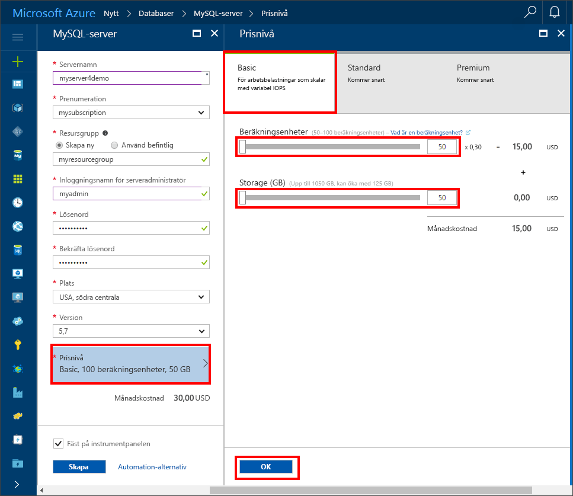

# <a name="create-an-azure-database-for-mysql-server-using-azure-portal"></a>Skapa en Azure Database för MySQL med Azure Portal

Den här artikeln beskriver hur du använder Azure Portal för att skapa ett exempel på en Azure-databas för MySQL-server på fem minuter. 

Om du inte har en Azure-prenumeration kan du skapa ett [kostnadsfritt](https://azure.microsoft.com/free/) konto innan du börjar.

## <a name="log-in-to-azure"></a>Logga in på Azure
Öppna webbläsaren och gå till [Microsoft Azure Portal](https://portal.azure.com/). Ange dina autentiseringsuppgifter för att logga in på portalen. Standardvyn är instrumentpanelen.


## <a name="create-azure-database-for-mysql-server"></a>Skapa en Azure-databas för MySQL-servern

1. Navigera till **Databaser** > **MySQL**. Om du inte hittar Azure Database för MySQL Server under kategorin **Databaser** klickar du på **Visa alla** för att visa alla tillgängliga databastjänster. Du kan också skriva **MySQL** i sökrutan för att snabbt hitta tjänsten.


2. Klicka på ikonen **MySQL** och sedan på **Skapa**.
I vårt exempel ska du fylla i Azure Database för MySQL-sidan med följande information:

| **Formulärfält** | **Fältbeskrivning** |
|----------------|-----------------------|
| *Servernamn* | mysqlserver4demo (servernamnet är globalt unikt) |
| *Prenumeration* | MySQLaaS (välj från listrutan) |
| *Resursgrupp* | myresource (skapa en resursgrupp eller välj en befintlig) |
| *Inloggning för serveradministratör* | myadmin (konfigurera namn på administratörskonto) |
| *Lösenord* | konfigurera lösenord för administratörskonto |
| *Bekräfta lösenord* | bekräfta lösenord för administratörskonto |
| *Plats* | Europa, norra (välj mellan **Europa, norra** och **USA, västra**) |
| *Version* | 5.6 (välj MySQL-serverversion) |
| *Konfigurera prestanda* | Basic (välj **Prestandanivå**, **Compute-enheter**, **Storage** (Minne) och sedan på **OK**) |



Efter några minuter är Azure Database för MySQL-servern etablerad och körs. Du kan klicka på knappen **Aviseringar** (klockikon) på verktygsfältet för att övervaka distribueringsprocessen.

> [!TIP]
> Vi rekommenderar att du lägger Azure-tjänster i samma region och väljer den plats som är närmast dig. Du kan också markera alternativet **Fäst på instrumentpanelen** för att enkelt spåra dina distributioner.

## <a name="configure-the-firewall"></a>Konfigurera brandväggen
Innan du ansluter till Azure-databasen för MySQL från klientdatorer för första gången måste du konfigurera brandväggen och lägga till klientens offentliga nätverks-IP-adress (eller IP-adressintervall) till vitlistan.

1. Klicka på din nyligen skapade server och sedan på **Inställningar**.
  

2. I avsnittet **ALLMÄNT** klickar du på **Brandväggsinställningar**. Du kan klicka på **Lägg till min IP** för att lägga till den lokala datorns IP-adress eller konfigurera ett intervall med IP-adresser. Kom ihåg att klicka på **Spara** när du har skapat reglerna.
  

## <a name="get-connection-information"></a>Hämta anslutningsinformation
Hämta det fullständigt kvalificerade domännamnet för Azure MySQL-servern i Azure Portal. Du använder det fullständigt kvalificerade domännamnet för att ansluta till servern med kommandoradsverktyget **mysql.exe**.

1.    I [Azure Portal](https://portal.azure.com/) klickar du på **Alla resurser** på menyn till vänster och sedan på din Azure-databas för MySQL-servern.

2.    Klicka på **Egenskaper**. Anteckna **SERVERNAMNET** och **INLOGGNING FÖR SERVERADMINISTRATÖR**.
I det här exemplet är servernamnet *mysql4doc.database.windows.net*, och inloggningen för serveradministratören är *mysqladmin@mysql4doc*.

## <a name="connect-to-the-server-using-mysqlexe-command-line-tool"></a>Anslut till servern med kommandoradsverktyget mysqlexe
Du kan skapa flera databaser i en MySQL-server. Det finns ingen gräns för hur många databaser som kan skapas, men flera databaser delar samma serverresurser.  Du ansluter till din server med kommandoradsverktyget **mysql.exe**, öppnar **Azure Cloud Shell** i portalen och anger följande:

1. Anslut till servern med kommandoradsverktyget **mysql**:
```dos
 mysql -h mysqlserver4demo.database.windows.net -u myadmin@mysqlserver4demo -p
```

2. Visa status för servern:
```dos
 mysql> status
```
  

> [!TIP]
> Fler kommandon finns i [referenshandboken för MySQL 5.6 – kapitel 4.5.1](https://dev.mysql.com/doc/refman/5.6/en/mysql.html).

## <a name="connect-to-the-server-using-the-mysql-workbench-gui-tool"></a>Anslut till servern med verktyget MySQL Workbench GUI
1.    Starta programmet MySQL Workbench på klientdatorn. Du kan ladda ned och installera MySQL Workbench [här](https://dev.mysql.com/downloads/workbench/).

2.    I dialogrutan **Konfigurera ny anslutning** anger du följande information på fliken **Parametrar**:

| **Parametrar** | **Beskrivning** |
|----------------|-----------------|
|    *Anslutningsnamn* | ange ett namn på anslutningen (det kan vara vad som helst) |
| *Anslutningsmetod* | välj Standard (TCP/IP) |
| *Värdnamn* | mycliserver.database.windows.net (SERVERNAMNET du antecknade tidigare) |
| *Port* | 3306 |
| *Användarnamn* | myadmin@mycliserver (INLOGGNING FÖR SERVERADMINISTRATÖR som du antecknade tidigare) |
| *Lösenord* | du kan lagra lösenordet för administratörskontot i valvet |


3.    Klicka på **Testanslutning** för att testa om alla parametrar är rätt konfigurerade.

4.    Nu kan du klicka på anslutningen du just skapade för att ansluta till servern.

> SSL tillämpas som standard på din server vilket kräver extra konfiguration för att ansluta ordentligt. Se [Configure SSL connectivity in your application to securely connect to Azure Database for MySQL](./howto-configure-ssl.md) (Konfigurera SSL-anslutning i ditt program för att säkert ansluta till Azure Database för MySQL).  Om du vill avaktivera SSL för den här snabbstarten kan du gå till ”Anslutningssäkerhet” i portalen för att avaktivera tvingande SSL.

## <a name="clean-up-resources"></a>Rensa resurser

Om du inte behöver de här resurserna för en annan snabbstart/självstudie kan du ta bort dem genom att göra följande:

1. På menyn till vänster i Azure Portal klickar du på **Resursgrupper** och sedan på **myresource**. 
2. På sidan med resursgrupper klickar du på **Ta bort**, skriver **myresource** i textrutan och klickar sedan på **Ta bort**.

## <a name="next-steps"></a>Nästa steg

> [!div class="nextstepaction"]
> [Skapa din första Azure-databas för MySQL](./tutorial-design-database-using-portal.md)


