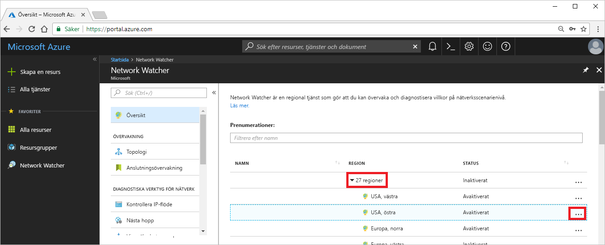
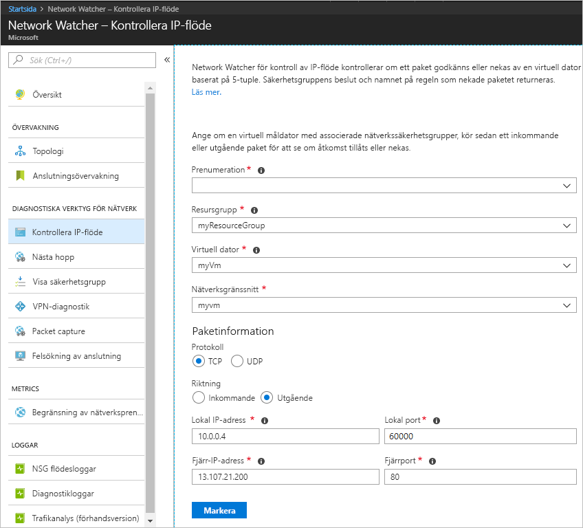
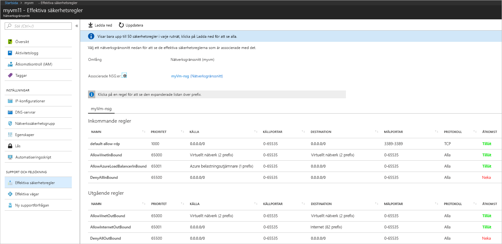
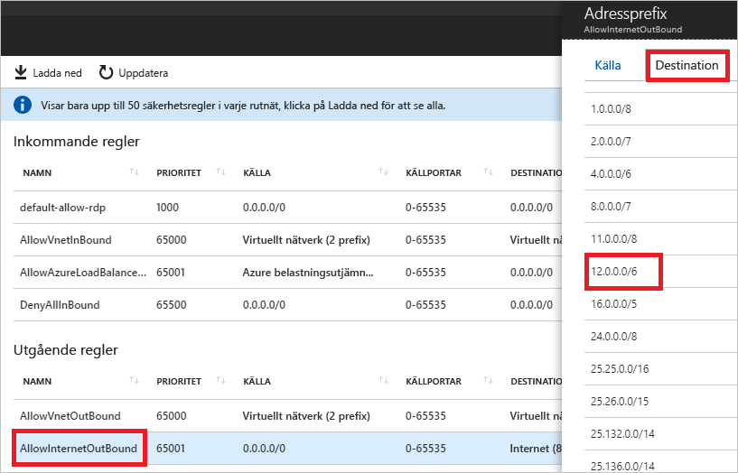

# Snabbstart: Diagnostisera problem med filtreringen av nätverkstrafik på virtuella datorer med hjälp av Azure Portal

I den här snabbstarten ska du distribuera en virtuell dator (VM) och kontrollera kommunikationen till en IP-adress och URL och från en IP-adress. Du lär dig också hur du fastställer orsaken till ett kommunikationsfel och hur du löser problemet.

Om du inte har någon Azure-prenumeration kan du skapa ett [kostnadsfritt konto](https://azure.microsoft.com/free/?WT.mc_id=A261C142F) innan du börjar.

## Logga in på Azure

Logga in på Azure Portal på https://portal.azure.com.

## Skapa en virtuell dator

1. Klicka på **+ Skapa en resurs** längst upp till vänster på Azure Portal.
2. Välj **Compute** och välj sedan **Windows Server 2016 Datacenter** eller en version av **Ubuntu Server**.
3. Ange eller Välj följande information, acceptera standardinställningarna för återstående inställningar och välj sedan **OK**:

    |Inställning|Värde|
    |---|---|
    |Namn|myVm|
    |Användarnamn| Ange ett valfritt användarnamn.|
    |Lösenord| Ange ett valfritt lösenord. Lösen ordet måste vara minst 12 tecken långt och uppfylla de definierade komplexitets kraven.|
    |Prenumeration| Välj din prenumeration.|
    |Resursgrupp| Välj **Skapa ny** och skriv **myResourceGroup**.|
    |Plats| Välj **USA, östra**|

4. Välj en storlek för den virtuella datorn och sedan **Välj**.
5. Acceptera standardinställningarna under **Inställningar** och välj **OK**.
6. Under **Skapa** i **sammanfattningen** väljer du **Skapa** för att starta VM-distributionen. Det tar några minuter att distribuera den virtuella datorn. Vänta tills distributionen av den virtuella datorn är klar innan du fortsätter med nästa steg.

## Testa nätverkskommunikationen

Om du vill testa nätverkskommunikationen med Network Watcher måste du först aktivera en nätverksbevakare i minst en Azure-region. Därefter använder du funktionen Kontrollera IP-flöde i Network Watcher.

### Aktivera nätverksbevakare

Om du redan har en nätverks övervakare aktive rad i minst en region kan du gå vidare till [kontrol lera IP-flödet](#use-ip-flow-verify).

1. Välj **Alla tjänster** i portalen. I **filterrutan** anger du *Network Watcher*. När **Network Watcher** visas i resultatet markerar du det.
2. Aktivera en nätverksbevakare i regionen USA, östra eftersom det var i den regionen som den virtuella datorn distribuerades i ett tidigare steg. Välj **Regioner** för att expandera avsnittet och välj sedan **...** till höger om **USA, östra**, som du ser i följande bild:

    

3. Välj **Aktivera Network Watcher**.

### Använda Kontrollera IP-flöde

När du skapar en virtuell dator tillåter och nekar Azure nätverkstrafik till och från den virtuella datorn som standard. Om du vill kan du åsidosätta standardinställningarna i Azure och tillåta eller neka andra typer av trafik.

1. Välj **Alla tjänster** i portalen. I rutan **alla tjänster** *Filter* anger du *Network Watcher*. När **Network Watcher** visas i resultatet markerar du det.
2. Välj **Kontrollera IP-flöde** under **DIAGNOSTISKA VERKTYG FÖR NÄTVERK**.
3. Välj din prenumeration, ange eller välj följande värden och välj sedan **Kontrollera**, som du ser i bilden nedan:

    |Inställning            |Värde                                                                                              |
    |---------          |---------                                                                                          |
    | Resursgrupp    | Välj myResourceGroup                                                                            |
    | Virtuell dator   | Välj myVm                                                                                       |
    | Nätverksgränssnitt | myvm – Namnet på nätverksgränssnittet som skapades av portalen när du skapade den virtuella datorn är ett annat. |
    | Protokoll          | TCP                                                                                               |
    | Riktning         | Utgående                                                                                          |
    | Lokal IP-adress  | 10.0.0.4                                                                                          |
    | Lokal port      | 60000                                                                                                |
    | Fjärr-IP-adress | 13.107.21.200 – en av adresserna för <www.bing.com>.                                             |
    | Fjärr-IP-adress       | 80                                                                                                |

    

    Resultatet visas efter några sekunder och anger att åtkomsten tillåts på grund av en säkerhetsregel med namnet **AllowInternetOutbound**. När du körde kontrollen skapade Network Watcher automatiskt en nätverksbevakare i regionen USA, östra om du hade en befintlig nätverksbevakare i en annan region än regionen USA, östra innan du körde kontrollen.
4. Utför steg 3 igen, men ändra **Fjärr-IP-adress** till **172.31.0.100**. Resultatet som returneras anger att åtkomsten nekas på grund av en säkerhetsregel med namnet **DefaultOutboundDenyAll**.
5. Utför steg 3 igen, men ändra **Riktning** till **Inkommande**, **Lokal port** till **80** och **Fjärrport** till **60000**. Resultatet som returneras anger att åtkomsten nekas på grund av en säkerhetsregel med namnet **DefaultInboundDenyAll**.

Nu när du vet vilka säkerhetsregler som tillåter eller nekar trafik till eller från en virtuell dator kan du lättare avgöra hur du ska lösa problemet.

## Visa information om en säkerhetsregel

1. Gå igenom de aktiva säkerhetsreglerna för nätverksgränssnittet på den virtuella datorn för att se varför reglerna i steg 3–5 i **Använda Kontrollera IP-flöde** tillåter eller nekar kommunikationen. Skriv *myvm* i sökrutan överst på portalen. Välj nätverksgränssnittet **myvm** (eller namnet på ditt nätverksgränssnitt om du valt ett annat namn) när det visas i sökresultaten.
2. Välj **Gällande säkerhetsregler** under **SUPPORT + FELSÖKNING**, som du ser i följande bild:

    

    I steg 3 i **Använda Kontrollera IP-flöde** såg du att kommunikationen tilläts på grund av regeln **AllowInternetOutbound**. Som du ser i föregående bild är **Internet****MÅL** för regeln. Det är dock oklart hur 13.107.21.200, adressen som du testade i steg 3 i **Använda Kontrollera IP-flöde**, relaterar till **Internet**.
3. Välj regeln **AllowInternetOutBound** och välj sedan **Mål**, som du ser i följande bild:

    

    Ett av prefixen i listan är **12.0.0.0/6**, vilken omfattar IP-adressintervallet 12.0.0.1–15.255.255.254. Eftersom 13.107.21.200 ligger inom det adressintervallet tillåter regeln **AllowInternetOutBound** den utgående trafiken. Dessutom visar bilden i steg 2 inga regler med högre prioritet (lägre nummer) som åsidosätter den här regeln. Stäng rutan **Adressprefix**. Om du vill neka utgående kommunikation till 13.107.21.200 kan du lägga till en säkerhetsregel med högre prioritet, som nekar utgående trafik på port 80 till IP-adressen.
4. När du körde kontrollen för utgående trafik till 172.131.0.100 i steg 4 i **Använda Kontrollera IP-flöde** såg du att regeln **DefaultOutboundDenyAll** nekade kommunikationen. Regeln motsvarar regeln **DenyAllOutBound** i bilden i steg 2 som definierar **0.0.0.0/0** som **MÅL**. Den här regeln nekar utgående kommunikation till 172.131.0.100 eftersom adressen inte ligger inom **MÅL** för någon av de andra **utgående reglerna** i bilden. Om du vill tillåta den utgående kommunikationen kan du lägga till en säkerhetsregel med högre prioritet, som tillåter utgående trafik på port 80 för adressen 172.131.0.100.
5. När du körde kontrollen för inkommande trafik från 172.131.0.100 i steg 5 i **Använda Kontrollera IP-flöde** såg du att regeln **DefaultInboundDenyAll** nekade kommunikationen. Regeln motsvarar regeln **DenyAllInBound** som visas i bilden i steg 2. Regeln **DenyAllInBound** tillämpas eftersom det inte finns någon annan regel med högre prioritet som tillåter inkommande trafik på port 80 till den virtuella datorn från 172.31.0.100. Om du vill tillåta den inkommande kommunikationen kan du lägga till en säkerhetsregel med högre prioritet, som tillåter inkommande trafik på port 80 från 172.31.0.100.

Kontrollerna i den här snabbstarten testade Azure-konfigurationen. Om kontrollerna returnerar förväntat resultat och du fortfarande har problem med nätverket kontrollerar du att det inte finns en brandvägg mellan den virtuella datorn och den slutpunkt som du kommunicerar med, samt att operativsystemet på den virtuella datorn inte har en brandvägg som tillåter eller nekar kommunikationen.

## Rensa resurser

Ta bort resursgruppen, skalningsuppsättningen och alla resurser som den innehåller:

1. Skriv *myResourceGroup* i **sökrutan** överst i portalen. När du ser **myResourceGroup** i sökresultatet väljer du den.
2. Välj **Ta bort resursgrupp**.
3. Skriv *myResourceGroup* i **SKRIV RESURSGRUPPSNAMNET:** och välj **Ta bort**.

## Nästa steg

I den här snabbstarten skapade du en virtuell dator och diagnostiserade filter för inkommande och utgående nätverkstrafik. Du lärde dig att regler för nätverkssäkerhetsgrupper tillåter eller nekar trafik till och från en virtuell dator. Lär dig mer om [säkerhetsregler](../virtual-network/network-security-groups-overview.md?toc=%252fazure%252fnetwork-watcher%252ftoc.json) och hur du [skapar säkerhetsregler](../virtual-network/manage-network-security-group.md?toc=%2fazure%2fnetwork-watcher%2ftoc.json#create-a-security-rule).

Kommunikationen till en virtuell dator kan misslyckas även om rätt trafikfilter används på grund av routningskonfigurationen. Mer information om hur du diagnostiserar problem med VM-routning finns i [Diagnostisera problem med VM-routning](diagnose-vm-network-routing-problem.md). Information om hur du diagnostiserar problem med utgående routning, svarstider och trafikfiltrering med ett verktyg finns i avsnittet om hur du [felsöker anslutningar](network-watcher-connectivity-portal.md).