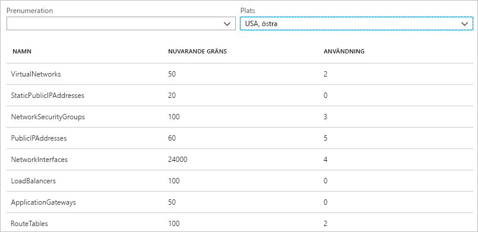
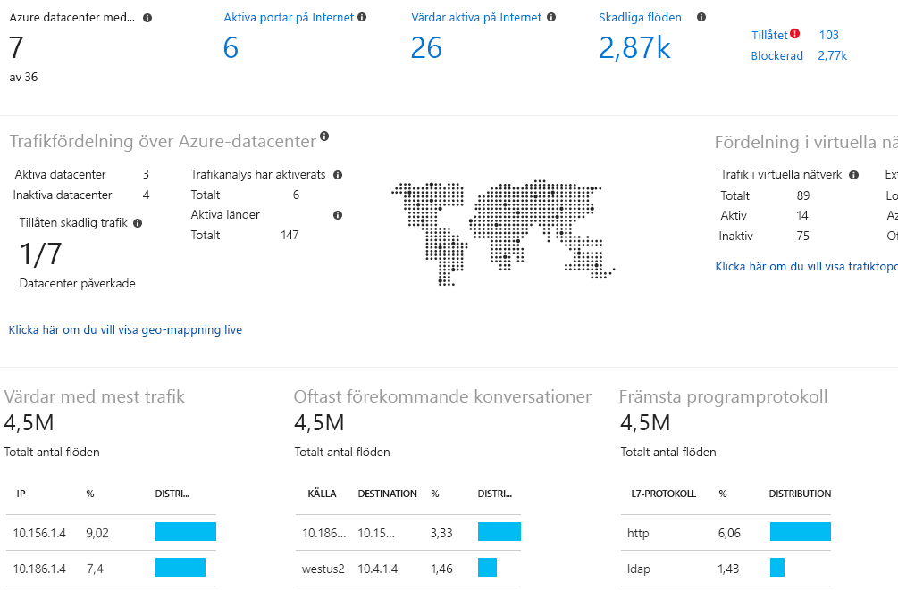

# Vad är Azure Network Watcher?

I Azure Network Watcher finns verktyg för att övervaka, diagnostisera, visa mått samt aktivera eller inaktivera loggar för resurser i ett virtuellt Azure-nätverk. Network Watcher har utformats för att övervaka och reparera nätverks hälsan för IaaS-produkter (Infrastructure-as-a-Service) som innehåller Virtual Machines, virtuella nätverk, programgatewayer, belastnings utjämning osv. OBS! den är inte avsedd för och kommer inte att fungera för PaaS övervakning eller webb analys. 

## Övervakning

### Övervaka kommunikation mellan en virtuell dator och en slutpunkt

Slutpunkterna kan vara en annan virtuell dator (VM), ett fullständigt domännamn (FQDN), en URI (Uniform Resource Identifier) eller en IPv4-adress. *Anslutningsövervakaren* övervakar regelbundet kommunikationen och informerar dig om tillgänglighet, svarstid och ändringar i nätverkstopologin mellan den virtuella datorn och slutpunkten. Du kan till exempel ha en virtuell webbserverdator som kommunicerar med en virtuell databasserverdator. Någon i organisationen kan, utan att du känner till det, tillämpa en anpassad väg eller nätverkssäkerhetsregel på den virtuella webbserverdatorn, den virtuella databasserverdatorn eller undernätet.

Om en slutpunkt inte kan nås, informerar anslutningens felsökning dig om orsaken. Möjliga orsaker är DNS-problem med namnmatchning, CPU, minne eller brandvägg i operativsystemet på en virtuell dator, hopptypen för en anpassad väg, eller en säkerhetsregel för den virtuella datorn eller undernätet i den utgående anslutningen. Läs mer om [säkerhetsregler](../virtual-network/network-security-groups-overview.md?toc=%252fazure%252fnetwork-watcher%252ftoc.json#security-rules) och [hopptyper för vägar](../virtual-network/virtual-networks-udr-overview.md?toc=%2fazure%2fnetwork-watcher%2ftoc.json) i Azure.

Anslutningsövervakaren visar också den minsta, genomsnittliga och högsta svarstid som observerats över tid. När du har sett vilken svarstid en anslutning har, kan du kanske minska svarstiden genom att flytta Azure-resurserna till olika Azure-regioner. Läs mer om hur du avgör [relativa svarstider mellan Azure-regioner och Internetleverantörer](#determine-relative-latencies-between-azure-regions-and-internet-service-providers), samt hur du övervakar kommunikationen mellan en virtuell dator och en slutpunkt med [anslutningsövervakaren](connection-monitor.md). Om du hellre vill testa en anslutning vid en specifik tidpunkt, i stället för att övervaka anslutningen över tid som du gör med anslutningsövervakaren, använder du [anslutningsfelsökning](#connection-troubleshoot).

Övervakaren för nätverksprestanda är en molnbaserad övervakningslösning av hybridnätverk som hjälper dig att övervaka nätverkets prestanda mellan olika punkter i din nätverksinfrastruktur. Du kan också övervaka nätverksanslutningar till tjänsten och programslutpunkterna samt övervaka prestanda för Azure ExpressRoute. Övervakaren för nätverksprestanda identifierar nätverksproblem som blockering av svartlistad trafik, routningsfel och problem som inte kan identifieras med vanliga nätverksövervakningsmetoder. Lösningen genererar aviseringar och meddelar dig när ett tröskelvärde överskrids för en nätverkslänk. Detta säkerställer att problem med nätverksprestanda upptäcks i god tid och att källan till problemet kan ringas in till ett visst nätverkssegment eller enhet. Läs mer om [övervakaren av nätverksprestanda](../azure-monitor/insights/network-performance-monitor.md?toc=%2fazure%2fnetwork-watcher%2ftoc.json).

### Visa resurser i ett virtuellt nätverk och deras relationer

När resurser läggs till i ett virtuellt nätverk, kan det vara svårt att se vad som är resurser i det virtuella nätverket och hur de är relaterade till varandra. Med funktionen *Topologi* kan du skapa ett visuellt diagram av resurserna i ett virtuellt nätverk och relationerna mellan dessa resurser. Följande bild visar ett exempel på ett topologidiagram för ett virtuellt nätverk som har tre undernät, två virtuella datorer, nätverksgränssnitt, offentliga IP-adresser, nätverkssäkerhetsgrupper och routningstabeller, samt relationerna mellan dessa resurser:

Du kan ladda ned en redigerbar version av bilden i svg-format. Läs mer om [topologivyn](view-network-topology.md).

## Diagnostik

### Diagnostisera problem med filtrering av nätverkstrafik till eller från en virtuell dator

När du distribuerar en virtuell dator tillämpar Azure flera standardsäkerhetsregler på den virtuella datorn som tillåter eller nekar trafik till eller från den virtuella datorn. Du kan åsidosätta Azures standardregler eller skapa fler regler. Ibland kan en virtuell dator sluta kommunicera med andra resurser på grund av en säkerhetsregel. Med funktionen *Kontrollera IP-flöde* kan du ange käll- och måladress för IPv4, port, protokoll (TCP eller UDP) och trafikriktning (inkommande eller utgående). Kontrollen av IP-flödet testar sedan kommunikationen och informerar dig om anslutningen lyckas eller misslyckas. Om anslutningen misslyckas visar Kontrollera IP-flöde vilken säkerhetsregel som tillät eller nekade kommunikationen, så att du kan lösa problemet. Lär dig mer om IP-flödesverifiering genom att slutföra kursen [Diagnostisera problem med virtuella nätverkstrafikfilter](diagnose-vm-network-traffic-filtering-problem.md).

### Diagnostisera problem med nätverksroutning från en virtuell dator

När du skapar ett virtuellt nätverk skapar Azure flera utgående standardvägar för nätverkstrafiken. Utgående trafik från alla resurser, till exempel virtuella datorer som distribueras i ett virtuellt nätverk, dirigeras enligt Azures standardvägar. Du kan åsidosätta Azures standardvägar eller skapa fler vägar. Du upptäcker kanske att en virtuell dator inte längre kan kommunicera med andra resurser på grund av en specifik väg. Med funktionen *Nästa hopp* kan du ange en käll- och måladress för IPv4. Nästa hopp testar kommunikationen och informerar dig om vilken typ av nästa hopp som används för att dirigera trafiken. Du kan sedan ta bort, ändra eller lägga till en väg för att lösa routningsproblemet. Läs mer om funktionen [Nästa hopp](diagnose-vm-network-routing-problem.md).

### Diagnostisera utgående anslutningar från en virtuell dator

Med funktionen *Anslutningsfelsökning* kan du testa en anslutning mellan en virtuell dator och en annan virtuell dator, ett fullständigt domännamn, en URI eller en IPv4-adress. Testet returnerar liknande information som returneras när du använder funktionen [Anslutningsövervakaren](#connection-monitor), men testar anslutningen vid en viss tidpunkt i stället för att övervaka den över tid som anslutningsövervakaren gör. Läs mer om hur du felsöker anslutningar med hjälp av [Anslutningsfelsökning](network-watcher-connectivity-overview.md).

### Avbilda paket till och från en virtuell dator

Avancerade alternativ för filtrering och finjusterade kontroller, till exempel möjligheten att ange tid- och storleksbegränsningar, ger flexibilitet. Avbildningen kan lagras i Azure Storage, på den virtuella datorns disk, eller båda. Du kan sedan analysera avbildningsfilen med flera standardanalysverktyg för nätverksavbildning. Läs mer om [paketavbildning](network-watcher-packet-capture-overview.md).

### Diagnostisera problem med en virtuell nätverksgateway från Azure och anslutningar

Virtuella nätverksgatewayer ansluter lokala resurser och virtuella Azure-nätverk. Gatewayer för övervakning och deras anslutningar är viktiga för att säkerställa att kommunikationen inte bryts. Med funktionen *VPN-diagnostik* kan du diagnostisera gatewayer och anslutningar. VPN-diagnostiken diagnostiserar hälsotillståndet för gatewayen eller gateway-anslutningen och informerar dig när en gateway och gateway-anslutning är tillgänglig. Om gatewayen eller anslutningen inte är tillgänglig, visar VPN-diagnostiken varför, så att du kan lösa problemet. Läs mer om VPN-diagnostik genom att slutföra kursen [Diagnostisera kommunikationsproblem mellan nätverk](diagnose-communication-problem-between-networks.md).

### Fastställa relativa svarstider mellan Azure-regioner och Internet-leverantörer

Du kan fråga Network Watcher om svarstidsinformation mellan Azure-regioner och hos Internet-leverantörer. När du känner till svarstiderna mellan Azure-regioner och hos Internet-leverantörer, kan du distribuera dina Azure-resurser för att optimera svarstiden i nätverket. Läs mer om [relativa svarstider](view-relative-latencies.md).

### Visa säkerhetsregler för ett nätverksgränssnitt

De säkerhetsregler som gäller för ett nätverksgränssnitt är en kombination av alla säkerhetsregler som används för nätverksgränssnittet och det undernät som nätverksgränssnittet finns i.  Med funktionen *Säkerhetsgruppvy* ser du alla säkerhetsregler som är tillämpade på nätverksgränssnittet, det undernät som nätverksgränssnittet finns i och de båda tillsammans. När du förstår vilka regler som tillämpas på ett nätverksgränssnitt kan du lägga till, ta bort eller ändra reglerna, om de tillåter eller nekar trafik som du vill ändra. Läs mer om [säkerhetsgruppvyn](network-watcher-security-group-view-overview.md).

## Mått

Det finns [gränser](../azure-resource-manager/management/azure-subscription-service-limits.md?toc=%2fazure%2fnetwork-watcher%2ftoc.json#azure-resource-manager-virtual-networking-limits) för hur många nätverksresurser som du kan skapa i en Azure-prenumeration och region. Om du har nått gränsen kan du inte skapa fler resurser i prenumerationen eller regionen. Funktionen *Prenumerationsgräns för nätverket* innehåller en översikt över hur många av varje nätverksresurs du har distribuerat i en prenumeration och region, samt vilken gräns som finns för resursen. Följande bild visar delar av utdatan för de nätverksresurser som har distribuerats i regionen USA, östra för en exempelprenumeration:

Informationen är användbar när du planerar kommande resursdistributioner.

## Loggar

### Analysera trafiken till eller från en nätverkssäkerhetsgrupp

Nätverkssäkerhetsgrupper (NSG) tillåter eller nekar inkommande eller utgående trafik till ett nätverksgränssnitt på en virtuell dator. Med funktionen *NSG-flödeslogg* kan du logga källans och målets IP-adress, port, protokoll, samt om trafik tillåts eller nekas av en NSG. Du kan analysera loggar med en mängd olika verktyg, till exempel PowerBI och *trafikanalys*. Trafikanalysen ger omfattande visualiseringar av data som skrivs till loggarna för NSG-flödet. Följande bild visar en del av den information och de visualiseringar som trafikanalysen visar från loggdatan för NSG-flödet:

Lär mer om NSG-flödesloggarna genom att slutföra kursen [Logga nätverkstrafik till och från en virtuell dator](network-watcher-nsg-flow-logging-portal.md) och hur du implementerar [trafikanalys](traffic-analytics.md).

### Visa diagnostikloggar för nätverksresurser

Du kan aktivera diagnostisk loggning för Azures nätverksresurser, till exempel nätverkssäkerhetsgrupper, offentliga IP-adresser, lastbalanserare, gatewayer för virtuella nätverk och programgatewayer. Funktionen *Diagnostikloggar* innehåller ett enda gränssnitt som aktiverar och inaktiverar nätverksresursens diagnostikloggar för alla befintliga nätverksresurser som genererar en diagnostiklogg. Du kan visa diagnostikloggar med hjälp av verktyg som Microsoft Power BI och Azure Monitor-loggar. Mer information om att analysera diagnostikloggar för Azure-nätverk finns i [Azure-nätverkslösningar i Azure Monitor-loggar](../azure-monitor/insights/azure-networking-analytics.md?toc=%2fazure%2fnetwork-watcher%2ftoc.json).

## Automatisk aktivering av Network Watcher
När du skapar eller uppdaterar ett virtuellt nätverk i din prenumeration aktiveras Network Watcher automatiskt i din virtuella nätverksregion. Dina resurser påverkas inte av den automatiska aktiveringen av Network Watcher, och inga kostnader tillkommer. Mer information finns i avsnittet om att [skapa Network Watcher](network-watcher-create.md).

## Nästa steg

Nu vet du mer om Azure Network Watcher. Om du vill komma igång med Network Watcher och diagnostisera ett vanligt kommunikationsproblem till och från en virtuell dator kan du använda funktionen Kontrollera IP-flöde. Läs mer i snabbstarten [Diagnostisera problem med filtreringen av nätverkstrafik på virtuella datorer](diagnose-vm-network-traffic-filtering-problem.md).