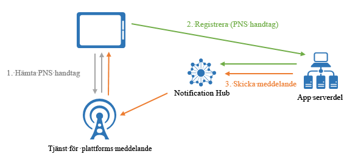

# Vad är Azure Notification Hubs?

Azure Notification Hubs innehåller en lättanvänd och uppskalad push-motor som gör det möjligt för dig att skicka meddelanden till valfri plattform (iOS, Android, Windows, Kindle, Baidu osv) från valfri serverdel (molnet eller lokalt). Notification Hubs fungerar utmärkt för både företags- och konsumentscenarier. Här följer några exempel:

- Skicka meddelanden med senaste nytt till miljontals användare med låg latens.
- Skicka platsbaserade kuponger till intresserade användarsegment.
- Skicka händelserelaterade meddelanden till användare eller grupper med media-/sport-/ekonomi-/spelprogram.
- Skicka innehåll med erbjudanden till program engagera och marknadsföra gentemot kunder.
- Meddela användare om företagshändelser, t.ex. nya meddelanden och arbetsobjekt.
- Skicka koder för multifaktorautentisering.

## Vad är push-meddelanden?

Push-meddelanden är en typ av app-till-användare kommunikation där användarna av mobila appar meddelas om vissa önskad information, vanligtvis i ett popup-meddelande eller dialogruta på en mobil enhet. Användare vanligtvis välja att visa eller stänga meddelandet. Om du väljer de tidigare versionen öppna mobilprogram som förmedlas meddelandet. Vissa meddelanden är silent - levereras i bakgrunden för appen att bearbeta i bakgrunden och vidtar lämpliga åtgärder.

Push-meddelanden är viktiga för konsumentapparna när det gäller att öka engagemanget och användningen, och för företagsapparna när det gäller att kommunicera uppdaterad affärsinformation. Det är bäst att appanvändare kommunikation eftersom den är energieffektiv för mobila enheter, flexibla meddelanden-avsändare och tillgängliga när motsvarande program inte är aktiva.

Mer information om push-meddelanden för några populära plattformar finns i följande avsnitt:

- [Android](https://developer.android.com/guide/topics/ui/notifiers/notifications.html)
- [iOS](https://developer.apple.com/notifications/)
- [Windows](https://msdn.microsoft.com/library/windows/apps/hh779725.aspx)

## Hur fungerar push-meddelanden?

Push-meddelanden levereras via plattformsspecifika infrastrukturer som kallas för *plattformsspecifika meddelandesystem* (Platform Notification Systems, PNS). De erbjuder grundläggande push-funktioner när det gäller att leverera ett meddelande till en enhet med en tillhandahållen referens, och de har inget gemensamt gränssnitt. Om du vill skicka ett meddelande till alla kunder i Android-, iOS- och Windows-versioner av en app, måste utvecklare arbeta med Apple Push Notification Service(APNS) och Firebase Cloud Messaging(FCM) Windows Notification Service(WNS) separat.

På hög nivå fungerar push-tekniken så här:

1. Ett program avgör den vill ta emot meddelande, så den kontaktar PNS för målplattformen där appen körs och begär en unik och tillfällig push-referens. Handtagstypen varierar beroende på systemet (till exempel WNS använder URI: er medan APN använder token).
2. Klientappen lagrar detta handtag i appens serverdel eller providern.
3. Om du vill skicka ett push-meddelande kontaktar appens serverdel pns-systemet genom att använda handtaget till målet för en viss klient-app.
4. PNS-systemet vidarebefordrar meddelandet till den enhet som anges av handtaget.

## Utmaningarna med push-meddelanden

PNS:er är kraftfulla. Det krävs ändå mycket arbete av apputvecklaren för att implementera även de mest grundläggande scenarierna för push-meddelanden, som att sända push-meddelanden till olika användarsegment.

Att skicka meddelanden kräver en komplex infrastruktur som är orelaterad till programmets huvudsakliga affärslogik. Några av de infrastrukturella utmaningarna är:

- **Plattformsberoende**
  - Serverdelen kräver komplexa och svåra att underhålla plattformsberoende logik för att skicka meddelanden till enheter på olika plattformar som inte är ett enhetligt PNSes.
- **Skalning**
  - Enligt PNS-riktlinjerna måste enhetstoken uppdateras varje gång appen startas. Serverdelen innehåller en stor mängd trafik och databasen åtkomst bara för att hålla token som är uppdaterade. När antalet enheter växer till hundratals, tusentals eller miljontals, är kostnaden för att skapa och hantera den här infrastrukturen stora.
  - Merparten av PNS-systemen stöder inte sändning av meddelanden till flera enheter. En enkel sändning till en miljon enheter resulterar i en miljon anrop till PNS-systemen. Att skala den här mängden trafik med minimal svarstid är en intrikat uppgift.
- **Routning**
  - Även om PNS-systemen tillhandahåller ett sätt på vilket man kan skicka meddelanden till enheter, så riktar sig merparten av appmeddelandena till användare eller intressegrupper. Serverdelen måste upprätthålla ett register för att kunna associera enheter till intressegrupper, användare, egenskaper och så vidare. Det här arbetet gör att det tar ännu längre tid att få ut en app på marknaden och att underhållskostnaden ökar.

## Varför ska man använda Azure Notification Hubs?

Meddelandehubbar eliminerar alla komplexitet som är associerade med push-meddelanden på din egen från din app Server. Dess utskalade multiplattform för en push-meddelandeinfrastruktur reducerar den push-relaterade kodningen och förenklar serverdelen. Med Notification Hubs är enheterna enbart ansvariga för att registrera sina PNS-handtag hos en hubb, medan serverdelen skickar meddelanden till användare eller intressegrupper, så som visas på följande bild:

Meddelandehubbar är användningsfärdiga push-motorer med följande fördelar:

- **Plattformsoberoende**
  - Stöd för alla större push-plattformar, inklusive iOS, Android, Windows, Kindle och Baidu.
  - Ett gemensamt gränssnitt för alla plattformar i plattformsspecifika eller plattformsoberoende format med icke plattformsspecifikt arbete.
  - Hantering av enhetshandtag på ett och samma ställe.
- **Serverdelsoberoende**
  - Molnet eller lokalt
  - .NET, Node.js, Java osv.
- **Stor uppsättning av leveransmönster**
  - Sända till en eller flera plattformar: Du kan sända direkt till miljontals enheter på olika plattformar med ett enda API-anrop.
  - Push-överför till enhet: Du kan rikta meddelanden till enskilda enheter.
  - Push-överför till användare: Taggar och mallfunktioner hjälper dig att nå en användares samtliga plattformsoberoende enheter.
  - Push-överför till segment med dynamiska taggar: Taggfunktionen hjälper dig att segmentera enheter och skicka meddelanden till dem efter behov, oavsett om du skickar till ett segment eller ett segmentuttryck (t.ex. aktiv OCH bor i Seattle INTE ny användare). I stället för att vara begränsad till pub-sub kan du uppdatera enhetstaggar var som helst och när som helst.
  - Lokaliserad push-överföring: Mallfunktionen hjälper till att uppnå lokalisering utan att detta påverkar serverdelskoden.
  - Tyst push-överföring: Du kan aktivera push-pull-mönster genom att skicka tysta meddelanden till enheter och utlösa dem när du vill slutföra vissa hämtningar eller åtgärder.
  - Schemalagd push-överföring: Du kan schemalägga utskickning av meddelanden när som helst.
  - Direkt push-överföring: Du kan hoppa över registrering av enheter med Notification Hubs-tjänsten och direkt batchpusha till en lista över enhetsreferenser.
  - Anpassad push-överföring: Enhets-push-variabler hjälper dig att skicka enhetsspecifika personliga push-meddelanden med anpassade nyckelvärdepar.
- **Omfattande telemetri**
  - Allmän telemetri för push, enhet, fel och åtgärder är tillgänglig i Azure Portal och i programmet.
  - Meddelandetelemetri spårar varje push från ditt initiala begäransanrop till Notification Hubs-tjänsten och batchbearbetar bort push-meddelandena.
  - Feedback från plattformsspecifikt meddelandesystem kommunicerar all feedback från det plattformsspecifika meddelandesystemet för att underlätta felsökningen.
- **Skalbarhet**
  - Skicka snabba meddelanden till miljontals enheter utan ändrad arkitektur eller enhetspartitionering.
- **Säkerhet**
  - SAS (Shared Access Secret) eller federerad autentisering.

## Nästa steg

Kom igång med att skapa och använda en meddelandehubb genom att följa [Självstudie: Skicka push-meddelanden till mobila program](notification-hubs-android-push-notification-google-fcm-get-started.md).

[0]: ./media/notification-hubs-overview/registration-diagram.png
[1]: ./media/notification-hubs-overview/notification-hub-diagram.png

[How customers are using Notification Hubs]: https://azure.microsoft.com/services/notification-hubs
[Notification Hubs tutorials and guides]: https://azure.microsoft.com/documentation/services/notification-hubs
[iOS]: https://azure.microsoft.com/documentation/articles/notification-hubs-ios-get-started
[Android]: https://azure.microsoft.com/documentation/articles/notification-hubs-android-get-started
[Windows Universal]: https://azure.microsoft.com/documentation/articles/notification-hubs-windows-store-dotnet-get-started
[Windows Phone]: https://azure.microsoft.com/documentation/articles/notification-hubs-windows-phone-get-started
[Kindle]: https://azure.microsoft.com/documentation/articles/notification-hubs-kindle-get-started
[Xamarin.iOS]: https://azure.microsoft.com/documentation/articles/partner-xamarin-notification-hubs-ios-get-started
[Xamarin.Android]: https://azure.microsoft.com/documentation/articles/partner-xamarin-notification-hubs-android-get-started
[Microsoft.WindowsAzure.Messaging.NotificationHub]: https://msdn.microsoft.com/library/microsoft.windowsazure.messaging.notificationhub.aspx
[Microsoft.ServiceBus.Notifications]: https://msdn.microsoft.com/library/microsoft.servicebus.notifications.aspx
[App Service Mobile Apps]: https://azure.microsoft.com/documentation/articles/app-service-mobile-value-prop/
[templates]: notification-hubs-templates-cross-platform-push-messages.md
[Azure portal]: https://portal.azure.com
[tags]: (https://msdn.microsoft.com/library/azure/dn530749.aspx)
