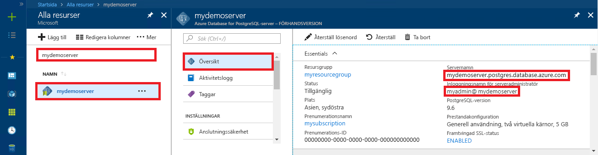

<a id="azure-database-for-postgresql-use-go-language-to-connect-and-query-data" class="xliff"></a>

# Azure Database för PostgreSQL: Använda språket Go för att ansluta och fråga efter data
Den här snabbstarten visar hur du ansluter till en Azure Database för PostgreSQL med hjälp av kod som skrivits i språket [Go](https://golang.org/). Den visar hur du använder SQL-instruktioner för att fråga, infoga, uppdatera och ta bort data i databasen. Den här artikeln förutsätter att du är van att utveckla i Go, men saknar erfarenhet av Azure Database för PostgreSQL.

<a id="prerequisites" class="xliff"></a>

## Krav
I den här snabbstarten används de resurser som skapades i någon av följande guider som utgångspunkt:
- [Skapa DB – Portal](quickstart-create-server-database-portal.md)
- [Skapa DB – Azure CLI](quickstart-create-server-database-azure-cli.md)

<a id="install-go-and-pq" class="xliff"></a>

## Installera Go och pq
- Hämta och installera Go enligt [installationsinstruktionerna](https://golang.org/doc/install) för din plattform.
- Skapa en mapp för ditt projekt, till exempel C:\Postgresql\. Ändra katalogen till projektmappen, till exempel `cd C:\Postgres\`, med hjälp av kommandoraden.
- Hämta [Pure Go Postgres-drivrutinen (pq)](https://github.com/lib/pq) till projektmappen genom att skriva kommandot `go get github.com/lib/pq` när du befinner dig i samma katalog.

<a id="build-and-run-go-code" class="xliff"></a>

## Skapa och köra Go-kod 
- Spara koden i en textfil med tillägget *.go och spara den i din projektmapp, till exempel `C:\postgres\read.go`.
- När du ska köra koden ändrar du katalogen till din projektmapp, `cd postgres`. Skriv sedan kommandot `go run read.go` för att kompilera och köra programmet.
- Bygg koden till ett internt program, `go build read.go`, och kör sedan read.exe för att köra programmet.

<a id="get-connection-information" class="xliff"></a>

## Hämta anslutningsinformation
Hämta den information som du behöver för att ansluta till Azure Database för PostgreSQL. Du behöver det fullständiga servernamnet och inloggningsuppgifter.

1. Logga in på [Azure-portalen](https://portal.azure.com/).
2. På den vänstra menyn i Azure Portal klickar du på **Alla resurser** och söker efter den server som du nyss skapade, till exempel **mypgserver-20170401**.
3. Klicka på servernamnet **mypgserver-20170401**.
4. Välj serverns **översikt**-sida. Anteckna **servernamn** och **inloggningsnamnet för serveradministratören**.
 
5. Om du glömmer inloggningsinformationen för servern öppnar du sidan **Översikt** för att se inloggningsnamnet för serveradministratören. Du kan återställa lösenordet om det behövs.

<a id="connect-and-create-a-table" class="xliff"></a>

## Ansluta och skapa en tabell
Använd följande kod för att ansluta och skapa en tabell med hjälp av **CREATE TABLE**-SQL-instruktionen följt av **INSERT INTO**-SQL-instruktioner för att lägga till rader i tabellen.

Koden importerar tre paket: [sql-paketet](https://golang.org/pkg/database/sql/), [pq-paketet](http://godoc.org/github.com/lib/pq) (som en drivrutin för att kommunicera med Postgres-servern) och [fmt-paketet](https://golang.org/pkg/fmt/) för skrivna indata och utdata på kommandoraden.

I koden anropas metoden [sql.Open()](http://godoc.org/github.com/lib/pq#Open) för att ansluta till Azure Database för PostgreSQL. Anslutningen kontrolleras med hjälp av metoden [db.Ping()](https://golang.org/pkg/database/sql/#DB.Ping). En [databasreferens](https://golang.org/pkg/database/sql/#DB) som håller anslutningspoolen för databasservern används genomgående. I koden anropas metoden [Exec()](https://golang.org/pkg/database/sql/#DB.Exec) flera gånger för att köra flera SQL-kommandon. Varje gång körs en anpassad checkError()-metod för att kontrollera om ett fel har uppstått, och i så fall avslutas körningen.


Ersätt parametrarna `HOST`, `DATABASE`, `USER` och `PASSWORD` med egna värden. 

```go
package main

import (
    "database/sql"
    "fmt"
    _ "github.com/lib/pq"
)

const (
    // Initialize connection constants.
    HOST     = "mypgserver-20170401.postgres.database.azure.com"
    DATABASE = "mypgsqldb"
    USER     = "mylogin@mypgserver-20170401"
    PASSWORD = "<server_admin_password>"
)

func checkError(err error) {
    if err != nil {
        panic(err)
    }
}

func main() {
    // Initialize connection string.
    var connectionString string = fmt.Sprintf("host=%s user=%s password=%s dbname=%s sslmode=require", HOST, USER, PASSWORD, DATABASE)

    // Initialize connection object.
    db, err := sql.Open("postgres", connectionString)
    checkError(err)

    err = db.Ping()
    checkError(err)
    fmt.Println("Successfully created connection to database")

    // Drop previous table of same name if one exists.
    _, err = db.Exec("DROP TABLE IF EXISTS inventory;")
    checkError(err)
    fmt.Println("Finished dropping table (if existed)")

    // Create table.
    _, err = db.Exec("CREATE TABLE inventory (id serial PRIMARY KEY, name VARCHAR(50), quantity INTEGER);")
    checkError(err)
    fmt.Println("Finished creating table")

    // Insert some data into table.
    sql_statement := "INSERT INTO inventory (name, quantity) VALUES ($1, $2);"
    _, err = db.Exec(sql_statement, "banana", 150)
    checkError(err)
    _, err = db.Exec(sql_statement, "orange", 154)
    checkError(err)
    _, err = db.Exec(sql_statement, "apple", 100)
    checkError(err)
    fmt.Println("Inserted 3 rows of data")
}
```

<a id="read-data" class="xliff"></a>

## Läsa data
Använd följande kod för att ansluta och läsa data med en **SELECT**-SQL-instruktion. 

Koden importerar tre paket: [sql-paketet](https://golang.org/pkg/database/sql/), [pq-paketet](http://godoc.org/github.com/lib/pq) (som en drivrutin för att kommunicera med Postgres-servern) och [fmt-paketet](https://golang.org/pkg/fmt/) för skrivna indata och utdata på kommandoraden.

I koden anropas metoden [sql.Open()](http://godoc.org/github.com/lib/pq#Open) för att ansluta till Azure Database för PostgreSQL. Anslutningen kontrolleras med hjälp av metoden [db.Ping()](https://golang.org/pkg/database/sql/#DB.Ping). En [databasreferens](https://golang.org/pkg/database/sql/#DB) som håller anslutningspoolen för databasservern används genomgående. SELECT-frågan körs genom att anropa metoden [db.Query()](https://golang.org/pkg/database/sql/#DB.Query), och resulterande rader förvaras i en variabel av typen [rows](https://golang.org/pkg/database/sql/#Rows). Koden läser kolumndatavärden i den aktuella raden med metoden [rows.Scan()](https://golang.org/pkg/database/sql/#Rows.Scan) och loopar igenom raderna med iteratorn [rows.Next()](https://golang.org/pkg/database/sql/#Rows.Next) tills det inte finns fler rader. Varje rads kolumnvärden skrivs till konsolens utdata. Varje gång körs en anpassad checkError()-metod för att kontrollera om ett fel har uppstått, och i så fall avslutas körningen.

Ersätt parametrarna `HOST`, `DATABASE`, `USER` och `PASSWORD` med egna värden. 

```go
package main

import (
    "database/sql"
    "fmt"
    _ "github.com/lib/pq"
)

const (
    // Initialize connection constants.
    HOST     = "mypgserver-20170401.postgres.database.azure.com"
    DATABASE = "mypgsqldb"
    USER     = "mylogin@mypgserver-20170401"
    PASSWORD = "<server_admin_password>"
)

func checkError(err error) {
    if err != nil {
        panic(err)
    }
}

func main() {

    // Initialize connection string.
    var connectionString string = fmt.Sprintf("host=%s user=%s password=%s dbname=%s sslmode=require", HOST, USER, PASSWORD, DATABASE)

    // Initialize connection object.
    db, err := sql.Open("postgres", connectionString)
    checkError(err)

    err = db.Ping()
    checkError(err)
    fmt.Println("Successfully created connection to database")

    // Read rows from table.
    var id int
    var name string
    var quantity int

    sql_statement := "SELECT * from inventory;"
    rows, err := db.Query(sql_statement)
    checkError(err)

    for rows.Next() {
        switch err := rows.Scan(&id, &name, &quantity); err {
        case sql.ErrNoRows:
            fmt.Println("No rows were returned")
        case nil:
            fmt.Printf("Data row = (%d, %s, %d)\n", id, name, quantity)
        default:
            checkError(err)
        }
    }
}
```

<a id="update-data" class="xliff"></a>

## Uppdatera data
Använd följande kod för att ansluta och uppdatera data med en **UPDATE**-SQL-instruktion.

Koden importerar tre paket: [sql-paketet](https://golang.org/pkg/database/sql/), [pq-paketet](http://godoc.org/github.com/lib/pq) (som en drivrutin för att kommunicera med Postgres-servern) och [fmt-paketet](https://golang.org/pkg/fmt/) för skrivna indata och utdata på kommandoraden.

I koden anropas metoden [sql.Open()](http://godoc.org/github.com/lib/pq#Open) för att ansluta till Azure Database för PostgreSQL. Anslutningen kontrolleras med hjälp av metoden [db.Ping()](https://golang.org/pkg/database/sql/#DB.Ping). En [databasreferens](https://golang.org/pkg/database/sql/#DB) som håller anslutningspoolen för databasservern används genomgående. Koden anropar metoden [Exec()](https://golang.org/pkg/database/sql/#DB.Exec) för att köra SQL-instruktionen som uppdaterar tabellen. En anpassad checkError()-metod körs för att kontrollera om ett fel har uppstått, och i så fall avslutas körningen.

Ersätt parametrarna `HOST`, `DATABASE`, `USER` och `PASSWORD` med egna värden. 
```go
package main

import (
  "database/sql"
  _ "github.com/lib/pq"
  "fmt"
)

const (
    // Initialize connection constants.
    HOST     = "mypgserver-20170401.postgres.database.azure.com"
    DATABASE = "mypgsqldb"
    USER     = "mylogin@mypgserver-20170401"
    PASSWORD = "<server_admin_password>"
)

func checkError(err error) {
    if err != nil {
        panic(err)
    }
}

func main() {
    
    // Initialize connection string.
    var connectionString string = 
        fmt.Sprintf("host=%s user=%s password=%s dbname=%s sslmode=require", HOST, USER, PASSWORD, DATABASE)

    // Initialize connection object.
    db, err := sql.Open("postgres", connectionString)
    checkError(err)

    err = db.Ping()
    checkError(err)
    fmt.Println("Successfully created connection to database")

    // Modify some data in table.
    sql_statement := "UPDATE inventory SET quantity = $2 WHERE name = $1;"
    _, err = db.Exec(sql_statement, "banana", 200)
    checkError(err)
    fmt.Println("Updated 1 row of data")
}
```

<a id="delete-data" class="xliff"></a>

## Ta bort data
Använd följande kod för att ansluta och läsa data med en **DELETE**-SQL-instruktion. 

Koden importerar tre paket: [sql-paketet](https://golang.org/pkg/database/sql/), [pq-paketet](http://godoc.org/github.com/lib/pq) (som en drivrutin för att kommunicera med Postgres-servern) och [fmt-paketet](https://golang.org/pkg/fmt/) för skrivna indata och utdata på kommandoraden.

I koden anropas metoden [sql.Open()](http://godoc.org/github.com/lib/pq#Open) för att ansluta till Azure Database för PostgreSQL. Anslutningen kontrolleras med hjälp av metoden [db.Ping()](https://golang.org/pkg/database/sql/#DB.Ping). En [databasreferens](https://golang.org/pkg/database/sql/#DB) som håller anslutningspoolen för databasservern används genomgående. Koden anropar metoden [Exec()](https://golang.org/pkg/database/sql/#DB.Exec) för att köra SQL-instruktionen som uppdaterar tabellen. En anpassad checkError()-metod körs för att kontrollera om ett fel har uppstått, och i så fall avslutas körningen.

Ersätt parametrarna `HOST`, `DATABASE`, `USER` och `PASSWORD` med egna värden. 
```go
package main

import (
  "database/sql"
  _ "github.com/lib/pq"
  "fmt"
)

const (
    // Initialize connection constants.
    HOST     = "mypgserver-20170401.postgres.database.azure.com"
    DATABASE = "mypgsqldb"
    USER     = "mylogin@mypgserver-20170401"
    PASSWORD = "<server_admin_password>"
)

func checkError(err error) {
    if err != nil {
        panic(err)
    }
}

func main() {
    
    // Initialize connection string.
    var connectionString string = 
        fmt.Sprintf("host=%s user=%s password=%s dbname=%s sslmode=require", HOST, USER, PASSWORD, DATABASE)

    // Initialize connection object.
    db, err := sql.Open("postgres", connectionString)
    checkError(err)

    err = db.Ping()
    checkError(err)
    fmt.Println("Successfully created connection to database")

    // Delete some data from table.
    sql_statement := "DELETE FROM inventory WHERE name = $1;"
    _, err = db.Exec(sql_statement, "orange")
    checkError(err)
    fmt.Println("Deleted 1 row of data")
}
```

<a id="next-steps" class="xliff"></a>

## Nästa steg
> [!div class="nextstepaction"]
> [Migrera databasen med export och import](./howto-migrate-using-export-and-import.md)

