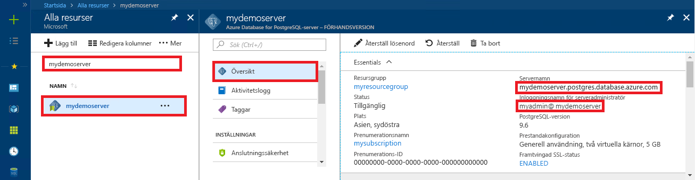

# <a name="azure-database-for-postgresql-use-nodejs-to-connect-and-query-data"></a>Azure Database för PostgreSQL: Använda Node.js för att ansluta och fråga efter data
Den här snabbstarten visar hur du ansluter till en Azure Database for PostgreSQL med hjälp av ett [Node.js](https://nodejs.org/)-program. Den visar hur du använder SQL-instruktioner för att fråga, infoga, uppdatera och ta bort data i databasen. I den här artikeln förutsätter vi att du har kunskaper om Node.js och att du inte har arbetat med Azure Database for PostgreSQL tidigare.

## <a name="prerequisites"></a>Krav
I den här snabbstarten används de resurser som skapades i någon av följande guider som utgångspunkt:
- [Skapa DB – Portal](quickstart-create-server-database-portal.md)
- [Skapa DB – CLI](quickstart-create-server-database-azure-cli.md)

Du måste också:
- Installera [Node.js](https://nodejs.org)

## <a name="install-pg-client"></a>Installera pg-klienten
Installera [pg](https://www.npmjs.com/package/pg), som är en PostgreSQL-klient för Node.js.

Kör du node package manager (npm) för JavaScript från kommandoraden och installera pg-klienten.
```bash
npm install pg
```

Verifiera installationen genom att visa en lista över de paket som har installerats.
```bash
npm list
```

## <a name="get-connection-information"></a>Hämta anslutningsinformation
Hämta den information som du behöver för att ansluta till Azure Database för PostgreSQL. Du behöver det fullständiga servernamnet och inloggningsuppgifter.

1. Logga in på [Azure-portalen](https://portal.azure.com/).
2. Klicka på **Alla resurser** på den vänstra menyn i Azure Portal och leta upp den server som du nyss skapade.
3. Klicka på servernamnet.
4. Välj serverns **översikt**-sida. Anteckna **servernamn** och **inloggningsnamnet för serveradministratören**.
 
5. Om du glömmer inloggningsinformationen för servern öppnar du sidan **Översikt** för att se inloggningsnamnet för serveradministratören. Om det behövs kan du återställa lösenordet.

## <a name="running-the-javascript-code-in-nodejs"></a>Kör JavaScript-kod i Node.js
Du kan köra Node.js från Bash-gränssnittet, terminalen eller Windows kommandotolk genom att skriva `node` och sedan köra JavaScript-exempelkoden interaktivt genom att kopiera och klistra in den i kommandotolken. Du kan också spara JavaScript-koden i en textfil och starta `node filename.js` med namnet som en parameter för att köra den.

## <a name="connect-create-table-and-insert-data"></a>Ansluta, skapa tabell och infoga data
Använd följande kod för att ansluta och läsa in data med hjälp av SQL-instruktionerna **CREATE TABLE** och **INSERT**.
Objektet [pg. Klienten](https://github.com/brianc/node-postgres/wiki/Client) används för gränssnittet med PostgreSQL-server. Funktionen [pg.Client.connect()](https://github.com/brianc/node-postgres/wiki/Client#method-connect) används för att etablera anslutningen till servern. Funktionen [pg. Client.Query()](https://github.com/brianc/node-postgres/wiki/Query) används för att köra SQL-frågor mot en PostgreSQL-databas. 

Ersätt parametrarna host, dbname,user och password med de värden som du angav när du skapade servern och databasen.

```javascript
const pg = require('pg');

const config = {
    host: '<your-db-server-name>.postgres.database.azure.com',
    // Do not hard code your username and password.
    // Consider using Node environment variables.
    user: '<your-db-username>',     
    password: '<your-password>',
    database: '<name-of-database>',
    port: 5432,
    ssl: true
};

const client = new pg.Client(config);

client.connect(err => {
    if (err) throw err;
    else {
        queryDatabase();
    }
});

function queryDatabase() {
    const query = `
        DROP TABLE IF EXISTS inventory;
        CREATE TABLE inventory (id serial PRIMARY KEY, name VARCHAR(50), quantity INTEGER);
        INSERT INTO inventory (name, quantity) VALUES ('banana', 150);
        INSERT INTO inventory (name, quantity) VALUES ('orange', 154);
        INSERT INTO inventory (name, quantity) VALUES ('apple', 100);
    `;

    client
        .query(query)
        .then(() => {
            console.log('Table created successfully!');
            client.end(console.log('Closed client connection'));
        })
        .catch(err => console.log(err))
        .then(() => {
            console.log('Finished execution, exiting now');
            process.exit();
        });
}
```

## <a name="read-data"></a>Läsa data
Använd följande kod för att ansluta och läsa data med en **SELECT**-SQL-instruktion. Objektet [pg. Klienten](https://github.com/brianc/node-postgres/wiki/Client) används för gränssnittet med PostgreSQL-server. Funktionen [pg.Client.connect()](https://github.com/brianc/node-postgres/wiki/Client#method-connect) används för att etablera anslutningen till servern. Funktionen [pg. Client.Query()](https://github.com/brianc/node-postgres/wiki/Query) används för att köra SQL-frågor mot en PostgreSQL-databas. 

Ersätt parametrarna host, dbname,user och password med de värden som du angav när du skapade servern och databasen. 

```javascript
const pg = require('pg');

const config = {
    host: '<your-db-server-name>.postgres.database.azure.com',
    // Do not hard code your username and password.
    // Consider using Node environment variables.
    user: '<your-db-username>',     
    password: '<your-password>',
    database: '<name-of-database>',
    port: 5432,
    ssl: true
};

const client = new pg.Client(config);

client.connect(err => {
    if (err) throw err;
    else { queryDatabase(); }
});

function queryDatabase() {
  
    console.log(`Running query to PostgreSQL server: ${config.host}`);

    const query = 'SELECT * FROM inventory;';

    client.query(query)
        .then(res => {
            const rows = res.rows;

            rows.map(row => {
                console.log(`Read: ${JSON.stringify(row)}`);
            });

            process.exit();
        })
        .catch(err => {
            console.log(err);
        });
}
```

## <a name="update-data"></a>Uppdatera data
Använd följande kod för att ansluta och läsa data med en **UPDATE**-SQL-instruktion. Objektet [pg. Klienten](https://github.com/brianc/node-postgres/wiki/Client) används för gränssnittet med PostgreSQL-server. Funktionen [pg.Client.connect()](https://github.com/brianc/node-postgres/wiki/Client#method-connect) används för att etablera anslutningen till servern. Funktionen [pg. Client.Query()](https://github.com/brianc/node-postgres/wiki/Query) används för att köra SQL-frågor mot en PostgreSQL-databas. 

Ersätt parametrarna host, dbname,user och password med de värden som du angav när du skapade servern och databasen. 

```javascript
const pg = require('pg');

const config = {
    host: '<your-db-server-name>.postgres.database.azure.com',
    // Do not hard code your username and password.
    // Consider using Node environment variables.
    user: '<your-db-username>',     
    password: '<your-password>',
    database: '<name-of-database>',
    port: 5432,
    ssl: true
};

const client = new pg.Client(config);

client.connect(err => {
    if (err) throw err;
    else {
        queryDatabase();
    }
});

function queryDatabase() {
    const query = `
        UPDATE inventory 
        SET quantity= 1000 WHERE name='banana';
    `;

    client
        .query(query)
        .then(result => {
            console.log('Update completed');
            console.log(`Rows affected: ${result.rowCount}`);
        })
        .catch(err => {
            console.log(err);
            throw err;
        });
}
```

## <a name="delete-data"></a>Ta bort data
Använd följande kod för att ansluta och läsa data med en **DELETE**-SQL-instruktion. Objektet [pg. Klienten](https://github.com/brianc/node-postgres/wiki/Client) används för gränssnittet med PostgreSQL-server. Funktionen [pg.Client.connect()](https://github.com/brianc/node-postgres/wiki/Client#method-connect) används för att etablera anslutningen till servern. Funktionen [pg. Client.Query()](https://github.com/brianc/node-postgres/wiki/Query) används för att köra SQL-frågor mot en PostgreSQL-databas. 

Ersätt parametrarna host, dbname,user och password med de värden som du angav när du skapade servern och databasen. 

```javascript
const pg = require('pg');

const config = {
    host: '<your-db-server-name>.postgres.database.azure.com',
    // Do not hard code your username and password.
    // Consider using Node environment variables.
    user: '<your-db-username>',     
    password: '<your-password>',
    database: '<name-of-database>',
    port: 5432,
    ssl: true
};

const client = new pg.Client(config);

client.connect(err => {
    if (err) {
        throw err;
    } else {
        queryDatabase();
    }
});

function queryDatabase() {
    const query = `
        DELETE FROM inventory 
        WHERE name = 'apple';
    `;

    client
        .query(query)
        .then(result => {
            console.log('Delete completed');
            console.log(`Rows affected: ${result.rowCount}`);
        })
        .catch(err => {
            console.log(err);
            throw err;
        });
}
```

## <a name="next-steps"></a>Nästa steg
> [!div class="nextstepaction"]
> [Migrera din databas med Exportera och importera](./howto-migrate-using-export-and-import.md)
