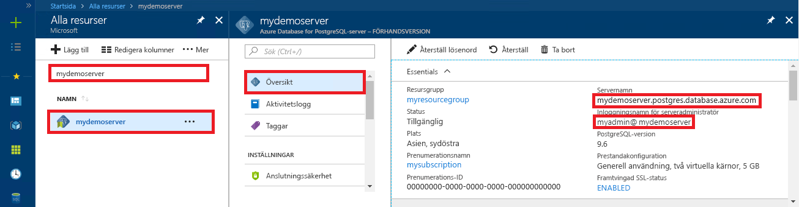

# <a name="azure-database-for-postgresql-use-php-to-connect-and-query-data"></a>Azure Database för PostgreSQL: Använda PHP för att ansluta och fråga efter data
Den här snabbstarten visar hur du ansluter till en Azure Database för PostgreSQL med hjälp av ett [PHP](http://php.net/manual/intro-whatis.php)-program. Den visar hur du använder SQL-instruktioner för att fråga, infoga, uppdatera och ta bort data i databasen. I den här artikeln förutsätter vi att du har kunskaper om PHP och att du inte har arbetat med Azure Database for PostgreSQL tidigare.

## <a name="prerequisites"></a>Nödvändiga komponenter
I den här snabbstarten används de resurser som skapades i någon av följande guider som utgångspunkt:
- [Skapa DB – Portal](quickstart-create-server-database-portal.md)
- [Skapa DB – Azure CLI](quickstart-create-server-database-azure-cli.md)

## <a name="install-php"></a>Installera PHP
Installera PHP på din server, eller skapa en Azure-[webbapp](../app-service/app-service-web-overview.md) som innehåller PHP.

### <a name="windows"></a>Windows
- Hämta [PHP 7.1.4 (x64), ej trådsäker version](http://windows.php.net/download#php-7.1)
- Installera PHP och se [PHP-handboken](http://php.net/manual/install.windows.php) för ytterligare konfiguration
- Koden använder klassen **pgsql** (ext/php_pgsql.dll) som ingår i PHP-installationen. 
- Tillägget **pgsql** aktiveras genom att redigera konfigurationsfilen php.ini, som vanligtvis finns i `C:\Program Files\PHP\v7.1\php.ini`. Konfigurationsfilen ska innehålla en rad med texten `extension=php_pgsql.so`. Om texten inte visas lägger du till den och sparar sedan filen. Om texten finns, men har kommenterats med ett semikolonprefix, avkommenterar du texten genom att ta bort semikolonet.

### <a name="linux-ubuntu"></a>Linux (Ubuntu)
- Hämta [PHP 7.1.4 (x64), ej trådsäker version](http://php.net/downloads.php) 
- Installera PHP och se [PHP-handboken](http://php.net/manual/install.unix.php) för ytterligare konfiguration
- Koden använder klassen **pgsql** (php_pgsql.so). Installera den genom att köra `sudo apt-get install php-pgsql`.
- Tillägget **pgsql** aktiveras genom att redigera konfigurationsfilen `/etc/php/7.0/mods-available/pgsql.ini`. Konfigurationsfilen ska innehålla en rad med texten `extension=php_pgsql.so`. Om texten inte visas lägger du till den och sparar sedan filen. Om texten finns, men har kommenterats med ett semikolonprefix, avkommenterar du texten genom att ta bort semikolonet.

### <a name="macos"></a>MacOS
- Hämta [PHP 7.1.4](http://php.net/downloads.php)
- Installera PHP och se [PHP-handboken](http://php.net/manual/install.macosx.php) för ytterligare konfiguration

## <a name="get-connection-information"></a>Hämta anslutningsinformation
Hämta den information som du behöver för att ansluta till Azure Database för PostgreSQL. Du behöver det fullständiga servernamnet och inloggningsuppgifter.

1. Logga in på [Azure-portalen](https://portal.azure.com/).
2. På den vänstra menyn i Azure Portal klickar du på **Alla resurser**. Sök sedan efter den server som du skapade (till exempel **mydemoserver**).
3. Klicka på servernamnet.
4. På serverpanelen **Översikt** antecknar du **Servernamn** och **Inloggningsnamn för serveradministratören**. Om du glömmer lösenordet kan du även återställa det på den här panelen.
 

## <a name="connect-and-create-a-table"></a>Ansluta och skapa en tabell
Använd följande kod för att ansluta och skapa en tabell med hjälp av **CREATE TABLE**-SQL-instruktionen följt av **INSERT INTO**-SQL-instruktioner för att lägga till rader i tabellen.

Metoden [pg_connect()](http://php.net/manual/en/function.pg-connect.php) anropas för att ansluta till Azure Database för PostgreSQL. Sedan anropas metoden [pg_query()](http://php.net/manual/en/function.pg-query.php) flera gånger för att köra flera kommandon. Varje gång körs metoden [pg_last_error()](http://php.net/manual/en/function.pg-last-error.php) för att kontrollera om ett fel uppstått. Sedan anropas metoden [pg_close()](http://php.net/manual/en/function.pg-close.php) för att stänga anslutningen.

Ersätt parametrarna `$host`, `$database`, `$user` och `$password` med egna värden. 

```php
<?php
    // Initialize connection variables.
    $host = "mydemoserver.postgres.database.azure.com";
    $database = "mypgsqldb";
    $user = "mylogin@mydemoserver";
    $password = "<server_admin_password>";

    // Initialize connection object.
    $connection = pg_connect("host=$host dbname=$database user=$user password=$password") 
        or die("Failed to create connection to database: ". pg_last_error(). "<br/>");
    print "Successfully created connection to database.<br/>";

    // Drop previous table of same name if one exists.
    $query = "DROP TABLE IF EXISTS inventory;";
    pg_query($connection, $query) 
        or die("Encountered an error when executing given sql statement: ". pg_last_error(). "<br/>");
    print "Finished dropping table (if existed).<br/>";

    // Create table.
    $query = "CREATE TABLE inventory (id serial PRIMARY KEY, name VARCHAR(50), quantity INTEGER);";
    pg_query($connection, $query) 
        or die("Encountered an error when executing given sql statement: ". pg_last_error(). "<br/>");
    print "Finished creating table.<br/>";

    // Insert some data into table.
    $name = '\'banana\'';
    $quantity = 150;
    $query = "INSERT INTO inventory (name, quantity) VALUES ($1, $2);";
    pg_query($connection, $query) 
        or die("Encountered an error when executing given sql statement: ". pg_last_error(). "<br/>");

    $name = '\'orange\'';
    $quantity = 154;
    $query = "INSERT INTO inventory (name, quantity) VALUES ($name, $quantity);";
    pg_query($connection, $query) 
        or die("Encountered an error when executing given sql statement: ". pg_last_error(). "<br/>");

    $name = '\'apple\'';
    $quantity = 100;
    $query = "INSERT INTO inventory (name, quantity) VALUES ($name, $quantity);";
    pg_query($connection, $query) 
        or die("Encountered an error when executing given sql statement: ". pg_last_error()). "<br/>";

    print "Inserted 3 rows of data.<br/>";

    // Closing connection
    pg_close($connection);
?>
```

## <a name="read-data"></a>Läsa data
Använd följande kod för att ansluta och läsa data med en **SELECT**-SQL-instruktion. 

 Metoden [pg_connect()](http://php.net/manual/en/function.pg-connect.php) anropas för att ansluta till Azure Database för PostgreSQL. Sedan anropas metoden [pg_query()](http://php.net/manual/en/function.pg-query.php) för att köra SELECT-kommandot, för att förvara resultatet i en resultatuppsättning, och metoden [pg_last_error()](http://php.net/manual/en/function.pg-last-error.php) anropas för att kontrollera om ett fel har uppstått.  För att läsa resultatuppsättningen anropas metoden [pg_fetch_row()](http://php.net/manual/en/function.pg-fetch-row.php) i en loop, en gång per rad, och raddata hämtas i en `$row`-matris med ett datavärde per kolumn i varje matrisposition.  Metoden [pg_free_result()](http://php.net/manual/en/function.pg-free-result.php) anropas för att frigöra resultatuppsättningen. Sedan anropas metoden [pg_close()](http://php.net/manual/en/function.pg-close.php) för att stänga anslutningen.

Ersätt parametrarna `$host`, `$database`, `$user` och `$password` med egna värden. 

```php
<?php
    // Initialize connection variables.
    $host = "mydemoserver.postgres.database.azure.com";
    $database = "mypgsqldb";
    $user = "mylogin@mydemoserver";
    $password = "<server_admin_password>";
    
    // Initialize connection object.
    $connection = pg_connect("host=$host dbname=$database user=$user password=$password")
                or die("Failed to create connection to database: ". pg_last_error(). "<br/>");

    print "Successfully created connection to database. <br/>";

    // Perform some SQL queries over the connection.
    $query = "SELECT * from inventory";
    $result_set = pg_query($connection, $query) 
        or die("Encountered an error when executing given sql statement: ". pg_last_error(). "<br/>");
    while ($row = pg_fetch_row($result_set))
    {
        print "Data row = ($row[0], $row[1], $row[2]). <br/>";
    }

    // Free result_set
    pg_free_result($result_set);

    // Closing connection
    pg_close($connection);
?>
```

## <a name="update-data"></a>Uppdatera data
Använd följande kod för att ansluta och uppdatera data med en **UPDATE**-SQL-instruktion.

Metoden [pg_connect()](http://php.net/manual/en/function.pg-connect.php) anropas för att ansluta till Azure Database för PostgreSQL. Sedan anropas metoden [pg_query()](http://php.net/manual/en/function.pg-query.php) flera gånger för att köra ett kommando, och [pg_last_error()](http://php.net/manual/en/function.pg-last-error.php) anropas för att kontrollera om ett fel uppstått. Sedan anropas metoden [pg_close()](http://php.net/manual/en/function.pg-close.php) för att stänga anslutningen.

Ersätt parametrarna `$host`, `$database`, `$user` och `$password` med egna värden. 

```php
<?php
    // Initialize connection variables.
    $host = "mydemoserver.postgres.database.azure.com";
    $database = "mypgsqldb";
    $user = "mylogin@mydemoserver";
    $password = "<server_admin_password>";

    // Initialize connection object.
    $connection = pg_connect("host=$host dbname=$database user=$user password=$password")
                or die("Failed to create connection to database: ". pg_last_error(). ".<br/>");

    print "Successfully created connection to database. <br/>";

    // Modify some data in table.
    $new_quantity = 200;
    $name = '\'banana\'';
    $query = "UPDATE inventory SET quantity = $new_quantity WHERE name = $name;";
    pg_query($connection, $query) 
        or die("Encountered an error when executing given sql statement: ". pg_last_error(). ".<br/>");
    print "Updated 1 row of data. </br>";

    // Closing connection
    pg_close($connection);
?>
```


## <a name="delete-data"></a>Ta bort data
Använd följande kod för att ansluta och läsa data med en **DELETE**-SQL-instruktion. 

 Metoden [pg_connect()](http://php.net/manual/en/function.pg-connect.php) anropas för att ansluta till Azure Database för PostgreSQL. Sedan anropas metoden [pg_query()](http://php.net/manual/en/function.pg-query.php) flera gånger för att köra ett kommando, och [pg_last_error()](http://php.net/manual/en/function.pg-last-error.php) anropas för att kontrollera om ett fel uppstått. Sedan anropas metoden [pg_close()](http://php.net/manual/en/function.pg-close.php) för att stänga anslutningen.

Ersätt parametrarna `$host`, `$database`, `$user` och `$password` med egna värden. 

```php
<?php
    // Initialize connection variables.
    $host = "mydemoserver.postgres.database.azure.com";
    $database = "mypgsqldb";
    $user = "mylogin@mydemoserver";
    $password = "<server_admin_password>";

    // Initialize connection object.
    $connection = pg_connect("host=$host dbname=$database user=$user password=$password")
            or die("Failed to create connection to database: ". pg_last_error(). ". </br>");

    print "Successfully created connection to database. <br/>";

    // Delete some data from table.
    $name = '\'orange\'';
    $query = "DELETE FROM inventory WHERE name = $name;";
    pg_query($connection, $query) 
        or die("Encountered an error when executing given sql statement: ". pg_last_error(). ". <br/>");
    print "Deleted 1 row of data. <br/>";

    // Closing connection
    pg_close($connection);
?>
```

## <a name="next-steps"></a>Nästa steg
> [!div class="nextstepaction"]
> [Migrera din databas med Exportera och importera](./howto-migrate-using-export-and-import.md)
