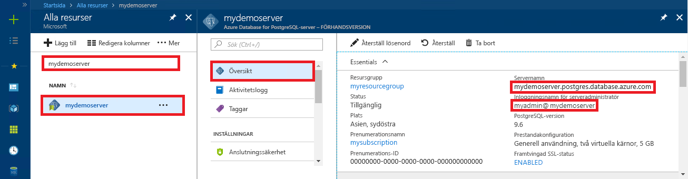

# <a name="azure-database-for-postgresql-use-python-to-connect-and-query-data"></a>Azure Database för PostgreSQL: Använda Python för att ansluta och fråga efter data
Den här snabbstarten visar hur du använder [Python](https://python.org) för att ansluta till en Azure Database för PostgreSQL. Den visar också hur SQL-instruktioner används för att fråga, infoga, uppdatera och ta bort data i databasen i macOS-, Ubuntu Linux- och Windows-plattformar. I den här artikeln förutsätter vi att du har kunskaper om Python och att du inte har arbetat med Azure Database för PostgreSQL tidigare.

## <a name="prerequisites"></a>Krav
I den här snabbstarten används de resurser som skapades i någon av följande guider som utgångspunkt:
- [Skapa DB – Portal](quickstart-create-server-database-portal.md)
- [Skapa DB – CLI](quickstart-create-server-database-azure-cli.md)

Du behöver också:
- [Python](https://www.python.org/downloads/) installerad
- installera [PIP](https://pip.pypa.io/en/stable/installing/)-paketet (pip har redan installerats om du använder Python 2 > = 2.7.9 eller Python 3 > = 3-4-binärfiler som hämtats från [python.org](https://python.org)).

## <a name="install-the-python-connection-libraries-for-postgresql"></a>Installera Python-anslutningsbibliotek för PostgreSQL
Installera paketet [psycopg2](http://initd.org/psycopg/docs/install.html) för att ansluta till och fråga databasen. psycopg2 finns [i PyPI](https://pypi.python.org/pypi/psycopg2/) i form av [WHL](http://pythonwheels.com/)-paket för de flesta vanliga plattformar (Linux, OSX, Windows). Använd pip-installation för att få den binära versionen av modulen, inklusive alla beroenden.

1. Starta ett kommandoradsgränssnitt på din dator:
    - I Linux, starta Bash-gränssnittet.
    - I macOS, starta Terminal.
    - I Windows, starta kommandotolken från Start-menyn.
2. Se till att du använder den senaste versionen av pip genom att köra ett kommando som:
    ```cmd
    pip install -U pip
    ```

3. Kör följande kommando för att installera psycopg2-paketet:
    ```cmd
    pip install psycopg2
    ```

## <a name="get-connection-information"></a>Hämta anslutningsinformation
Hämta den information som du behöver för att ansluta till Azure Database för PostgreSQL. Du behöver det fullständiga servernamnet och inloggningsuppgifter.

1. Logga in på [Azure-portalen](https://portal.azure.com/).
2. I den vänstra menyn i Azure Portal klickar du på **Alla resurser** och söker efter **mypgserver-20170401** (den server som du nyss skapade).
3. Klicka på servernamnet **mypgserver-20170401**.
4. Välj serverns sida **Översikt** och notera **Servernamn** och **Inloggningsnamn för serveradministratören**.
 
5. Om du glömmer inloggningsinformationen för servern öppnar du sidan **Översikt** för att se inloggningsnamnet för serveradministratören. Om det behövs kan du återställa lösenordet.

## <a name="how-to-run-python-code"></a>Så här kör du Python-kod
Det här ämnet innehåller totalt fyra kodexempel som vart och ett utför en viss funktion. Följande anvisningar beskriver hur du skapar en textfil, infogar ett kodblock och sedan sparar filen så att du kan köra den senare. Se till att du skapar fyra olika filer, en för varje kodblock.

- Skapa en ny fil i valfri textredigerare.
- Kopiera och klistra in ett av kodexemplen i följande avsnitt i textfilen. Ersätt parametrarna **host**, **dbname**, **user** och **password** med de värden som du angav när du skapade servern och databasen.
- Spara filen med filnamnstillägget .py (till exempel postgres.py) i projektmappen. Om du kör i Windows, måste du markera UTF-8-kodning när du sparar filen. 
- Starta Kommandotolken, Terminal eller Bash-gränssnitt och ändra katalogen till projektmappen, till exempel `cd postgres`.
-  Skriv Python-kommandot följt av filnamnet, till exempel `Python postgres.py`, för att köra koden.

> [!NOTE]
> Från och med Python version 3 kanske du ser felet `SyntaxError: Missing parentheses in call to 'print'` när du kör kodblocken nedan. Om detta händer, ersätter du varje anrop till kommandot `print "string"` med ett funktionsanrop med parenteser, till exempel `print("string")`.

## <a name="connect-create-table-and-insert-data"></a>Ansluta, skapa tabell och infoga data
Använd följande kod för att ansluta och läsa in data med hjälp av funktionen [psycopg2.connect](http://initd.org/psycopg/docs/connection.html) med en **INSERT**-SQL-instruktion. Funktionen [cursor.execute](http://initd.org/psycopg/docs/cursor.html#execute) används för att köra SQL-frågor mot en PostgreSQL-databas. Ersätt parametrarna host, dbname,user och password med de värden som du angav när du skapade servern och databasen.

```Python
import psycopg2

# Update connection string information obtained from the portal
host = "mypgserver-20170401.postgres.database.azure.com"
user = "mylogin@mypgserver-20170401"
dbname = "mypgsqldb"
password = "<server_admin_password>"
sslmode = "require"

# Construct connection string
conn_string = "host={0} user={1} dbname={2} password={3} sslmode={4}".format(host, user, dbname, password, sslmode)
conn = psycopg2.connect(conn_string) 
print "Connection established"

cursor = conn.cursor()

# Drop previous table of same name if one exists
cursor.execute("DROP TABLE IF EXISTS inventory;")
print "Finished dropping table (if existed)"

# Create table
cursor.execute("CREATE TABLE inventory (id serial PRIMARY KEY, name VARCHAR(50), quantity INTEGER);")
print "Finished creating table"

# Insert some data into table
cursor.execute("INSERT INTO inventory (name, quantity) VALUES (%s, %s);", ("banana", 150))
cursor.execute("INSERT INTO inventory (name, quantity) VALUES (%s, %s);", ("orange", 154))
cursor.execute("INSERT INTO inventory (name, quantity) VALUES (%s, %s);", ("apple", 100))
print "Inserted 3 rows of data"

# Cleanup
conn.commit()
cursor.close()
conn.close()
```

När koden har körts visas utdata på följande sätt:


## <a name="read-data"></a>Läsa data
Använd följande kod för att läsa data som infogats med funktionen [cursor.execute](http://initd.org/psycopg/docs/cursor.html#execute) med **SELECT** SQL-instruktionen. Den här funktionen accepterar en fråga och returnerar en resultatuppsättning som kan upprepas med hjälp av [cursor.fetchall()](http://initd.org/psycopg/docs/cursor.html#cursor.fetchall). Ersätt parametrarna host, dbname,user och password med de värden som du angav när du skapade servern och databasen.

```Python
import psycopg2

# Update connection string information obtained from the portal
host = "mypgserver-20170401.postgres.database.azure.com"
user = "mylogin@mypgserver-20170401"
dbname = "mypgsqldb"
password = "<server_admin_password>"
sslmode = "require"

# Construct connection string
conn_string = "host={0} user={1} dbname={2} password={3} sslmode={4}".format(host, user, dbname, password, sslmode)
conn = psycopg2.connect(conn_string) 
print "Connection established"

cursor = conn.cursor()

# Fetch all rows from table
cursor.execute("SELECT * FROM inventory;")
rows = cursor.fetchall()

# Print all rows
for row in rows:
    print "Data row = (%s, %s, %s)" %(str(row[0]), str(row[1]), str(row[2]))

# Cleanup
conn.commit()
cursor.close()
conn.close()
```

## <a name="update-data"></a>Uppdatera data
Med följande kod uppdaterar du inventarieraden du tidigare lade till med funktionen [cursor.execute](http://initd.org/psycopg/docs/cursor.html#execute) och SQL-instruktionen **UPDATE** . Ersätt parametrarna host, dbname,user och password med de värden som du angav när du skapade servern och databasen.

```Python
import psycopg2

# Update connection string information obtained from the portal
host = "mypgserver-20170401.postgres.database.azure.com"
user = "mylogin@mypgserver-20170401"
dbname = "mypgsqldb"
password = "<server_admin_password>"
sslmode = "require"

# Construct connection string
conn_string = "host={0} user={1} dbname={2} password={3} sslmode={4}".format(host, user, dbname, password, sslmode)
conn = psycopg2.connect(conn_string) 
print "Connection established"

cursor = conn.cursor()

# Update a data row in the table
cursor.execute("UPDATE inventory SET quantity = %s WHERE name = %s;", (200, "banana"))
print "Updated 1 row of data"

# Cleanup
conn.commit()
cursor.close()
conn.close()
```

## <a name="delete-data"></a>Ta bort data
Med följande kod raderar du inventarieobjektet du tidigare lade till med funktionen [cursor.execute](http://initd.org/psycopg/docs/cursor.html#execute) och SQL-instruktionen **DELETE** . Ersätt parametrarna host, dbname,user och password med de värden som du angav när du skapade servern och databasen.

```Python
import psycopg2

# Update connection string information obtained from the portal
host = "mypgserver-20170401.postgres.database.azure.com"
user = "mylogin@mypgserver-20170401"
dbname = "mypgsqldb"
password = "<server_admin_password>"
sslmode = "require"

# Construct connection string
conn_string = "host={0} user={1} dbname={2} password={3} sslmode={4}".format(host, user, dbname, password, sslmode)
conn = psycopg2.connect(conn_string) 
print "Connection established"

cursor = conn.cursor()

# Delete data row from table
cursor.execute("DELETE FROM inventory WHERE name = %s;", ("orange",))
print "Deleted 1 row of data"

# Cleanup
conn.commit()
cursor.close()
conn.close()
```

## <a name="next-steps"></a>Nästa steg
> [!div class="nextstepaction"]
> [Migrera din databas med Exportera och importera](./howto-migrate-using-export-and-import.md)
