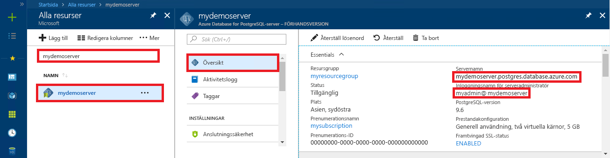

# <a name="azure-database-for-postgresql-use-ruby-to-connect-and-query-data"></a>Azure Database for PostgreSQL: Använda Ruby för att ansluta och fråga mot data
Den här snabbstarten visar hur du ansluter till en Azure Database för PostgreSQL med hjälp av ett [Ruby](https://www.ruby-lang.org)-program. Den visar hur du använder SQL-instruktioner för att fråga, infoga, uppdatera och ta bort data i databasen. I den här artikeln förutsätter vi att du har kunskaper om Ruby och att du inte har arbetat med Azure Database for PostgreSQL tidigare.

## <a name="prerequisites"></a>Nödvändiga komponenter
I den här snabbstarten används de resurser som skapades i någon av följande guider som utgångspunkt:
- [Skapa DB – Portal](quickstart-create-server-database-portal.md)
- [Skapa DB – Azure CLI](quickstart-create-server-database-azure-cli.md)

## <a name="install-ruby"></a>Installera Ruby
Installera Ruby på din egen dator. 

### <a name="windows"></a>Windows
- Hämta och installera den senaste versionen av [Ruby](https://rubyinstaller.org/downloads/).
- På den sista skärmen i MSI-installationsprogrammet markerar du rutan "Run 'ridk install' to install MSYS2 and development toolchain" (Kör ridk install för att installera MSYS2 och utvecklingsverktygskedjan). Klicka sedan på **Slutför** för att starta nästa installationsprogram.
- RubyInstaller2 för Windows Installer startar. Skriv 2 för att installera uppdateringen av MSYS2-lagringsplatsen. När installationen är klar och installationsprompten visas igen stänger du kommandofönstret.
- Starta en ny kommandotolk (cmd) från Start-menyn.
- Testa Ruby-installationen `ruby -v` för att se versionen som installerats.
- Testa Gem-installationen `gem -v` för att se versionen som installerats.
- Skapa PostgreSQL-modulen för Ruby med Gem genom att köra kommandot `gem install pg`.

### <a name="macos"></a>MacOS
- Installera Ruby med Homebrew genom att köra kommandot `brew install ruby`. Fler installationsalternativ finns i [installationsdokumentationen](https://www.ruby-lang.org/en/documentation/installation/#homebrew) för Ruby
- Testa Ruby-installationen `ruby -v` för att se versionen som installerats.
- Testa Gem-installationen `gem -v` för att se versionen som installerats.
- Skapa PostgreSQL-modulen för Ruby med Gem genom att köra kommandot `gem install pg`.

### <a name="linux-ubuntu"></a>Linux (Ubuntu)
- Installera Ruby genom att köra kommandot `sudo apt-get install ruby-full`. Fler installationsalternativ finns i [installationsdokumentationen](https://www.ruby-lang.org/en/documentation/installation/) för Ruby.
- Testa Ruby-installationen `ruby -v` för att se versionen som installerats.
- Installera de senaste uppdateringarna för Gem genom att köra kommandot `sudo gem update --system`.
- Testa Gem-installationen `gem -v` för att se versionen som installerats.
- Installera gcc, make och andra genereringsverktyg genom att köra kommandot `sudo apt-get install build-essential`.
- Installera PostgreSQL-biblioteken genom att köra kommandot `sudo apt-get install libpq-dev`.
- Skapa Ruby pg-modulen med Gem genom att köra kommandot `sudo gem install pg`.

## <a name="run-ruby-code"></a>Köra Ruby-kod 
- Spara koden i en textfil med filtillägget .rb och spara filen i en projektmapp, till exempel `C:\rubypostgres\read.rb` eller `/home/username/rubypostgres/read.rb`
- Om du vill köra koden startar du kommandotolken eller bash-gränssnittet. Ändra katalog till projektmappen `cd rubypostgres` och skriv sedan kommandot `ruby read.rb` för att köra programmet.

## <a name="get-connection-information"></a>Hämta anslutningsinformation
Hämta den information som du behöver för att ansluta till Azure Database för PostgreSQL. Du behöver det fullständiga servernamnet och inloggningsuppgifter.

1. Logga in på [Azure-portalen](https://portal.azure.com/).
2. På den vänstra menyn i Azure Portal klickar du på **Alla resurser**. Sök sedan efter den server som du skapade (till exempel **mydemoserver**).
3. Klicka på servernamnet.
4. På serverpanelen **Översikt** antecknar du **Servernamn** och **Inloggningsnamn för serveradministratören**. Om du glömmer lösenordet kan du även återställa det på den här panelen.
 

## <a name="connect-and-create-a-table"></a>Ansluta och skapa en tabell
Använd följande kod för att ansluta och skapa en tabell med hjälp av **CREATE TABLE**-SQL-instruktionen följt av **INSERT INTO**-SQL-instruktioner för att lägga till rader i tabellen.

I koden används ett  [PG::Connection](https://www.rubydoc.info/gems/pg/PG/Connection)-objekt med konstruktorn [new()](https://www.rubydoc.info/gems/pg/PG%2FConnection:initialize) för att ansluta till Azure Database för PostgreSQL. Sedan anropas metoden [exec()](https://www.rubydoc.info/gems/pg/PG/Connection#exec-instance_method) att köra kommandona DROP, CREATE TABLE och INSERT INTO. Koden söker efter fel med klassen [PG::Error](https://www.rubydoc.info/gems/pg/PG/Error). Sedan anropas metoden [close()](https://www.rubydoc.info/gems/pg/PG/Connection#lo_close-instance_method) för att stänga anslutningen.

Ersätt strängarna `host`, `database`, `user` och `password` med egna värden. 
```ruby
require 'pg'

begin
    # Initialize connection variables.
    host = String('mydemoserver.postgres.database.azure.com')
    database = String('postgres')
    user = String('mylogin@mydemoserver')
    password = String('<server_admin_password>')

    # Initialize connection object.
    connection = PG::Connection.new(:host => host, :user => user, :dbname => database, :port => '5432', :password => password)
    puts 'Successfully created connection to database'

    # Drop previous table of same name if one exists
    connection.exec('DROP TABLE IF EXISTS inventory;')
    puts 'Finished dropping table (if existed).'

    # Drop previous table of same name if one exists.
    connection.exec('CREATE TABLE inventory (id serial PRIMARY KEY, name VARCHAR(50), quantity INTEGER);')
    puts 'Finished creating table.'

    # Insert some data into table.
    connection.exec("INSERT INTO inventory VALUES(1, 'banana', 150)")
    connection.exec("INSERT INTO inventory VALUES(2, 'orange', 154)")
    connection.exec("INSERT INTO inventory VALUES(3, 'apple', 100)")
    puts 'Inserted 3 rows of data.'

rescue PG::Error => e
    puts e.message 
    
ensure
    connection.close if connection
end
```

## <a name="read-data"></a>Läsa data
Använd följande kod för att ansluta och läsa data med en **SELECT**-SQL-instruktion. 

I koden används ett  [PG::Connection](https://www.rubydoc.info/gems/pg/PG/Connection)-objekt med konstruktorn [new()](https://www.rubydoc.info/gems/pg/PG%2FConnection:initialize) för att ansluta till Azure Database för PostgreSQL. Sedan anropas metoden [exec()](https://www.rubydoc.info/gems/pg/PG/Connection#exec-instance_method) för att köra kommandot SELECT för att spara resultatet i en resultatuppsättning. Resultatuppsättningen itereras igenom med loopen `resultSet.each do` som sparar de aktuella radvärdena i variabeln `row`. Koden söker efter fel med klassen [PG::Error](https://www.rubydoc.info/gems/pg/PG/Error). Sedan anropas metoden [close()](https://www.rubydoc.info/gems/pg/PG/Connection#lo_close-instance_method) för att stänga anslutningen.

Ersätt strängarna `host`, `database`, `user` och `password` med egna värden. 

```ruby
require 'pg'

begin
    # Initialize connection variables.
    host = String('mydemoserver.postgres.database.azure.com')
    database = String('postgres')
    user = String('mylogin@mydemoserver')
    password = String('<server_admin_password>')

    # Initialize connection object.
    connection = PG::Connection.new(:host => host, :user => user, :database => dbname, :port => '5432', :password => password)
    puts 'Successfully created connection to database.'

    resultSet = connection.exec('SELECT * from inventory;')
    resultSet.each do |row|
        puts 'Data row = (%s, %s, %s)' % [row['id'], row['name'], row['quantity']]
    end

rescue PG::Error => e
    puts e.message 
    
ensure
    connection.close if connection
end
```

## <a name="update-data"></a>Uppdatera data
Använd följande kod för att ansluta och uppdatera data med en **UPDATE**-SQL-instruktion.

I koden används ett  [PG::Connection](https://www.rubydoc.info/gems/pg/PG/Connection)-objekt med konstruktorn [new()](https://www.rubydoc.info/gems/pg/PG%2FConnection:initialize) för att ansluta till Azure Database för PostgreSQL. Sedan anropas metoden [exec()](https://www.rubydoc.info/gems/pg/PG/Connection#exec-instance_method) för att köra kommandot UPDATE. Koden söker efter fel med klassen [PG::Error](https://www.rubydoc.info/gems/pg/PG/Error). Sedan anropas metoden [close()](https://www.rubydoc.info/gems/pg/PG/Connection#lo_close-instance_method) för att stänga anslutningen.

Ersätt strängarna `host`, `database`, `user` och `password` med egna värden. 

```ruby
require 'pg'

begin
    # Initialize connection variables.
    host = String('mydemoserver.postgres.database.azure.com')
    database = String('postgres')
    user = String('mylogin@mydemoserver')
    password = String('<server_admin_password>')

    # Initialize connection object.
    connection = PG::Connection.new(:host => host, :user => user, :dbname => database, :port => '5432', :password => password)
    puts 'Successfully created connection to database.'

    # Modify some data in table.
    connection.exec('UPDATE inventory SET quantity = %d WHERE name = %s;' % [200, '\'banana\''])
    puts 'Updated 1 row of data.'

rescue PG::Error => e
    puts e.message 
    
ensure
    connection.close if connection
end
```


## <a name="delete-data"></a>Ta bort data
Använd följande kod för att ansluta och läsa data med en **DELETE**-SQL-instruktion. 

I koden används ett  [PG::Connection](https://www.rubydoc.info/gems/pg/PG/Connection)-objekt med konstruktorn [new()](https://www.rubydoc.info/gems/pg/PG%2FConnection:initialize) för att ansluta till Azure Database för PostgreSQL. Sedan anropas metoden [exec()](https://www.rubydoc.info/gems/pg/PG/Connection#exec-instance_method) för att köra kommandot UPDATE. Koden söker efter fel med klassen [PG::Error](https://www.rubydoc.info/gems/pg/PG/Error). Sedan anropas metoden [close()](https://www.rubydoc.info/gems/pg/PG/Connection#lo_close-instance_method) för att stänga anslutningen.

Ersätt strängarna `host`, `database`, `user` och `password` med egna värden. 

```ruby
require 'pg'

begin
    # Initialize connection variables.
    host = String('mydemoserver.postgres.database.azure.com')
    database = String('postgres')
    user = String('mylogin@mydemoserver')
    password = String('<server_admin_password>')

    # Initialize connection object.
    connection = PG::Connection.new(:host => host, :user => user, :dbname => database, :port => '5432', :password => password)
    puts 'Successfully created connection to database.'

    # Modify some data in table.
    connection.exec('DELETE FROM inventory WHERE name = %s;' % ['\'orange\''])
    puts 'Deleted 1 row of data.'

rescue PG::Error => e
    puts e.message 
    
ensure
    connection.close if connection
end
```

## <a name="next-steps"></a>Nästa steg
> [!div class="nextstepaction"]
> [Migrera din databas med Exportera och importera](./howto-migrate-using-export-and-import.md)
