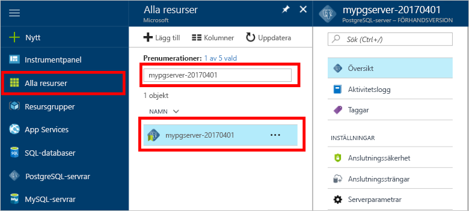

# Säkerhetskopiera och återställa en server i Azure-databas för PostgreSQL med Azure-portalen

## Säkerhetskopieringen sker automatiskt
När du använder Azure-databas för PostgreSQL görs databastjänsten en säkerhetskopia av servern var femte minut. 

Säkerhetskopiorna är tillgängliga för 7 dagar vid användning av grundläggande nivån och 35 dagar när du använder standardnivån. Mer information finns i [Azure-databas för PostgreSQL-servicenivåer](concepts-service-tiers.md)

Med hjälp av funktionen för automatisk säkerhetskopiering kan du återställa servern och alla databaser i en ny server till en tidigare punkt i tidpunkt.

## Återställa i Azure-portalen
Azure PostgreSQL-databas kan du återställa servern till en plats och till att en ny kopia av servern. Du kan använda den här nya servern när du återställer data. 

Till exempel om en tabell av misstag kan släppas kl. tolv idag, du återställa tiden innan på dagen och hämta saknas tabellen och data från den nya kopian av servern.

Följande steg återställa exempelserver till en tidpunkt:
1. Logga in på den [Azure-portalen](https://portal.azure.com/)
2. Hitta din Azure-databas för PostgreSQL-servern. I Azure-portalen klickar du på **alla resurser** från den vänstra menyn och Skriv namnet på servern som **mypgserver 20170401**, för att söka efter din befintliga server. Klicka på servernamnet som listas i sökresultatet. **Översikt**-sidan för din server öppnas och innehåller alternativ ytterligare konfiguration.

   

3. På verktygsfältet i översikt över serverblad **återställa**. Återställ blad öppnas.

   

4. Fyll i formuläret återställning med informationen som krävs:

   
  - **Återställningspunkt**: Välj en i tidpunkt som inträffar innan servern har ändrats.
  - **Målservern**: Ange ett nytt servernamn som du vill återställa.
  - **Plats**: du kan inte välja regionen. Som standard är det samma som källservern.
  - **Prisnivån**: du kan inte ändra det här värdet när du återställer en server. Det är samma som källservern. 

5. Klicka på **OK** att återställa servern att återställa till en tidpunkt. 

6. Leta upp den nya servern som har skapats för att verifiera data har återställts korrekt när återställningen är klar.

## Nästa steg
- [Anslutningsbibliotek för Azure-databas för PostgreSQL](concepts-connection-libraries.md)
