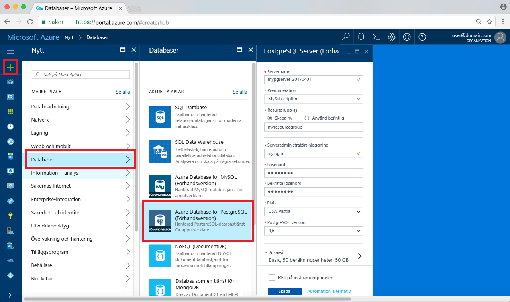
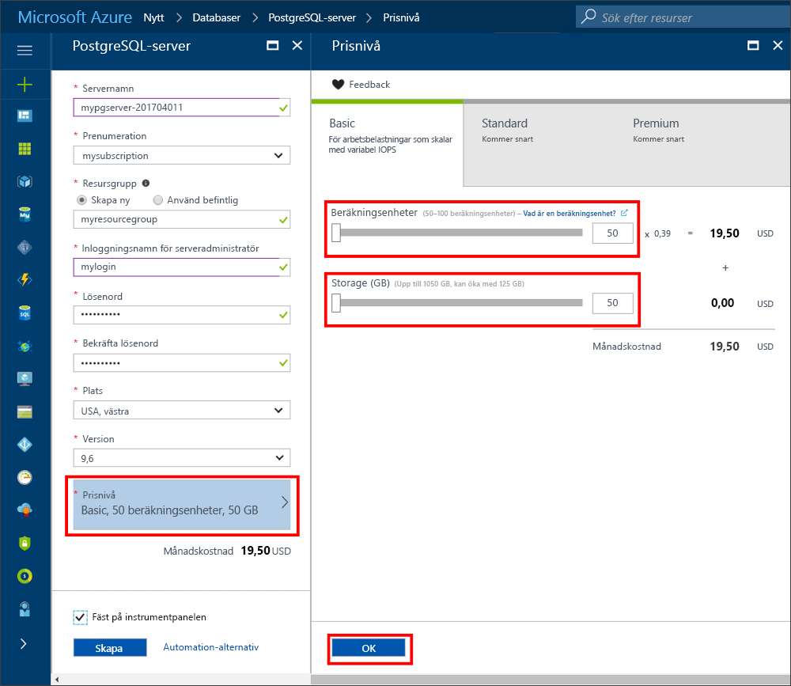
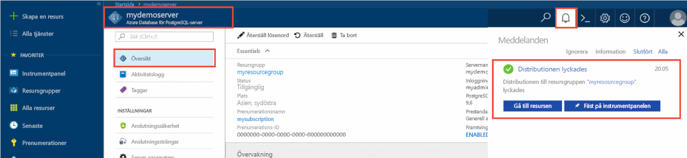
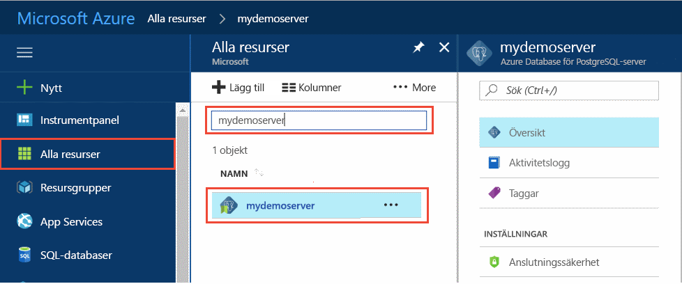
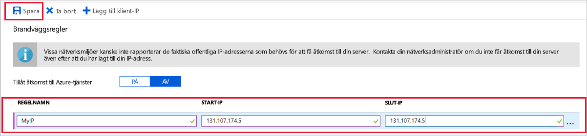
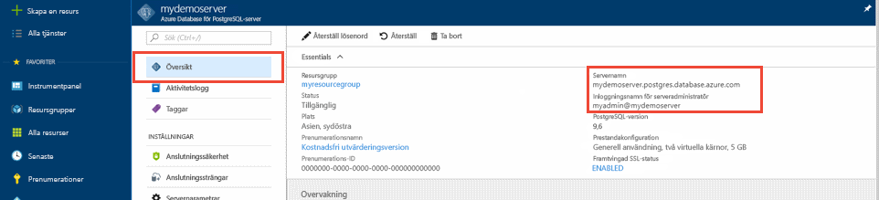
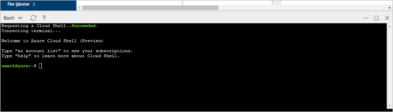
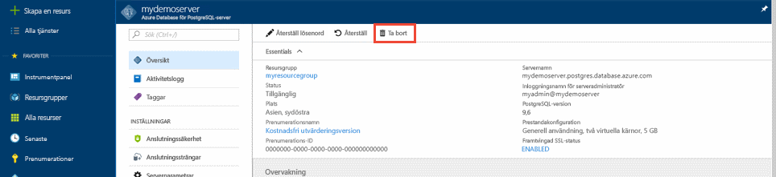

# <a name="create-an-azure-database-for-postgresql-in-the-azure-portal"></a>Skapa en Azure Database för PostgreSQL i Azure-portalen

Azure Database för PostgreSQL är en hanterad tjänst som låter dig köra, hantera och skala högtillgängliga PostgreSQL-databaser i molnet. Den här snabbstarten visar hur du skapar en Azure Database för PostgreSQL-server med Azure-portalen.

Om du inte har en Azure-prenumeration kan du skapa ett [kostnadsfritt](https://azure.microsoft.com/free/) konto innan du börjar.

## <a name="log-in-to-the-azure-portal"></a>Logga in på Azure Portal

Logga in på [Azure-portalen](https://portal.azure.com).

## <a name="create-an-azure-database-for-postgresql"></a>Skapa en Azure Database för PostgreSQL

En Azure Database för PostgreSQL-server skapas med en definierad uppsättning [compute- och lagringsresurser](./concepts-compute-unit-and-storage.md). Servern skapas inom en [Azure-resursgrupp](../azure-resource-manager/resource-group-overview.md).

Följ de här stegen för att skapa en Azure Database för PostgreSQL-server:
1.    Klicka på knappen **New** (Nytt) i det övre vänstra hörnet i Azure Portal.
2.    Välj **databaser** från sidan **Nytt** och välj **Azure Database för PostgreSQL** från sidan **databaser**.
 

3.    Fyll i detaljformuläret för den nya server med följande information, som det visas i föregående bil:
    - Servernamn: **mypgserver-20170401** (namnet på en server mappar till DNS-namnet och behöver därför vara globalt unikt) 
    - Prenumeration: Om du har flera prenumerationer, väljer du lämplig prenumeration där resursen ska finnas eller debiteras till.
    - Resursgrupp: **myresourcegroup**
    - Valfritt inloggningsnamn och lösenord för serveradministratören
    - Plats
    - PostgreSQL-version

  > [!IMPORTANT]
  > Det användarnamn och lösenord för serveradministration du anger här krävs för inloggning på servern och databaserna senare i den här snabbstarten. Kom ihåg eller skriv ned den här informationen så att du kan använda den senare.

4.    Klicka på **Prisnivå** för att ange tjänstenivå och prestandanivå för den nya databasen. I den här snabbstarten väljer du **Basic**-nivå **50 compute-enheter** och **50 GB** lagringsutrymme.
 
5.    Klicka på **OK**.
6.    Klicka på **Skapa** för att etablera servern. Etableringen tar några minuter.

  > [!TIP]
  > Markera alternativet **Fäst på instrumentpanelen** för att enkelt kunna spåra dina distributioner.

7.    Klicka på **Aviseringar** i verktygsfältet för att övervaka distributionsprocessen.
 
   
  Som standard skapas **postgres**-databasen under din server. [Postgres](https://www.postgresql.org/docs/9.6/static/app-initdb.html)-databasen är en standarddatabas som är avsedd för användare, verktyg och tredje parts program. 

## <a name="configure-a-server-level-firewall-rule"></a>Konfigurera en brandväggsregel på servernivå

Azure Database för PostgreSQL-tjänsten skapar en brandvägg på server-nivå. Brandväggen förhindrar att externa program och verktyg ansluter till servern eller databaser på servern, om inte en brandväggsregel konfigureras som öppnar brandväggen för specifika IP-adresser. 

1.    När distributionen är klar, klickar du på **alla resurser** från den vänstra menyn och skriver in namnet **mypgserver-20170401** för att söka efter din nyskapade server. Klicka på servernamnet som listas i sökresultatet. **Översikt**-sidan för din server öppnas och innehåller alternativ ytterligare konfiguration.
 
 

2.    I serverbladet, väljer du **anslutningssäkerhet**. 
3.    Klicka i textrutan under **regelnamn** och lägg till en ny brandväggsregel som vitlistar IP-adressintervallet för anslutningen. I den här snabbstarten tillåter vi alla IP-adresser genom att skriva in **Regelnamn = AllowAllIps**, **Start-IP-adress = 0.0.0.0** och **Slut-IP-adress = 255.255.255.255** och klicka på **spara**. Du kan ställa in en brandväggsregel som omfattar ett IP-intervall för att kunna ansluta från ditt nätverk.

 

4.    Klicka på **spara** och klicka sedan på **X** för att stänga sidan **anslutningssäkerhet**.

  > [!NOTE]
  > Azure PostgreSQL-servern kommunicerar via port 5432. Om du försöker ansluta inifrån ett företagsnätverk, kan utgående trafik via port 5432 bli nekad av nätverkets brandvägg. I så fall kommer du inte att kunna ansluta till din Azure SQL Database-server om inte din IT-avdelning öppnar port 5432.
  >

## <a name="get-the-connection-information"></a>Hämta anslutningsinformationen

När vi skapade vår Azure Database för PostgreSQL-server, skapades även standard-**postgres**-databasen. För att ansluta till din databasserver, måste du ange värddatorinformation och autentiseringsuppgifter för åtkomst.

1. I den vänstra menyn i Azure-portalen, klickar du på **Alla resurser** och söker efter den server som du nyss skapade **mypgserver-20170401**.

  

2. Klicka på servernamnet **mypgserver-20170401**.
3. Välj serverns **översikt**-sida. Anteckna **servernamn** och **inloggningsnamnet för serveradministratören**.

 

## <a name="connect-to-postgresql-database-using-psql-in-cloud-shell"></a>Anslut till PostgreSQL-databasen med psql i Cloud Shell

Nu använder vi psql-kommandoradsverktyget för att ansluta till Azure Database för PostgreSQL-servern. 
1. Starta Azure Cloud Shell via terminalikonen överst i navigeringsfönstret.

   

2. Azure Cloud Shell öppnas i din webbläsare så att du kan skriva bash-kommandon.

   

3. I Cloud Shell-prompten ansluter du till din Azure Database för PostgreSQL-server med psql-kommandona. Följande format används för att ansluta till en Azure Database för PostgreSQL-server med [psql](https://www.postgresql.org/docs/9.6/static/app-psql.html)-verktyget:
   ```bash
   psql --host=<myserver> --port=<port> --username=<server admin login> --dbname=<database name>
   ```

   Följande kommando till exempel, ansluter till standarddatabasen som heter **postgres** på din PostgreSQL-server **mypgserver-20170401.postgres.database.azure.com** med hjälp av autentiseringsuppgifter. Ange ditt lösenord för serveradministratören när du uppmanas till detta.

   ```bash
   psql --host=mypgserver-20170401.postgres.database.azure.com --port=5432 --username=mylogin@mypgserver-20170401 --dbname=postgres
   ```
4.  När du är ansluten till servern, skapar du en blank databas i prompten.
```bash
CREATE DATABASE mypgsqldb;
```

5.  I prompten kör du följande kommando för att växla anslutning till den nyligen skapade databasen **mypgsqldb**.
```bash
\c mypgsqldb
```

## <a name="connect-to-postgresql-database-using-pgadmin"></a>Anslut till PostgreSQL-databasen med pgAdmin

Om du vill ansluta till Azure PostgreSQL-servern med GUI-verktyget _pgAdmin_
1.    Starta _pgAdmin_-programmet på din klientdator. Du kan installera _pgAdmin_ från http://www.pgadmin.org/.
2.    Välj **Lägg till ny Server** från menyn **snabblänkar**.
3.    I dialogrutan **skapa – server** i fliken **allmänt**, anger du ett unikt eget namn för servern, som **Azure PostgreSQL-server**.

4.    I dialogrutan **skapa – server** i fliken **anslutning**, använder du de angivna inställningarna och klickar på **spara**.
   
    - **Värddatornamn/adress**: mypgserver-20170401.postgres.database.azure.com 
        - Fullständigt kvalificerat servernamn.
    - **Port:**  5432
        - Portnummer som används av den här databasservern är 5432.
    - **Underhållsdatabas**: postgres 
        - Systemgenererat standardnamn för databasen.
    - **Användarnamn:** mylogin@mypgserver-20170401 
        - Inloggning för serveradministratören (user@mypgserver) står tidigare i den här snabbstarten.
    - **Lösenord**: det lösenord du angav när du skapade servern tidigare i den här snabbstarten.
    - **SSL-läge**: Kräv
        - Som standard skapas alla Azure PostgreSQL-servrar med SSL tvingande aktiverat. Om du vill inaktivera SSL tvingande, se informationen i [tvingande SSL](./concepts-ssl-connection-security.md).
5.    Klicka på **Spara**.
6.    I webbläsarens vänstra fönster, expanderar du **servergrupper**. Välj din server **Azure PostgreSQL-server**.
7.  Välj den **server** du anslöt till och välj sedan **databaser** under den. 
8.    Högerklicka på **databaser** för att skapa en databas.
9.    Välj ett databasnamn **mypgsqldb** och ägaren för den som inloggning för serveradministratören **mylogin**.
10. Klicka på **spara** för att skapa en tom databas.
11. I **webbläsaren**, expanderar du **servrar**. Expandera servern som du skapade och se databasen **mypgsqldb** under den.
 


## <a name="clean-up-resources"></a>Rensa resurser
Rensa upp alla resurser du skapade i snabbstarten genom att ta bort [Azure-resursgruppen](../azure-resource-manager/resource-group-overview.md).

> [!TIP]
> De andra snabbstarterna i den här samlingen bygger på den här snabbstarten. Om du planerar att fortsätta att arbeta med efterföljande snabbstarter, ska du inte rensa upp resurserna som du skapade i den här snabbstarten. Om du inte planerar att fortsätta kan du använda stegen nedan för att ta bort alla resurser som har skapats i den här snabbstarten i Azure-portalen.

1.    I den vänstra menyn i Azure-portalen, klickar du på **Resursgrupper** och sedan på **myresourcegroup**.
2.    På sidan med dina resursgrupper, klickar du på **ta bort**, skriver in **myresourcegroup** i textrutan och klickar sedan på ta bort.

Om du bara vill ta bort den nyligen skapade servern:
1.    I den vänstra menyn i Azure-portalen, klickar du på PostgreSQL-servrar och söker efter den server som du nyss skapade
2.    I översiktssidan, klickar du på ta bort-knappen i övre panelen 
3.    Kontrollera servernamnet som du vill ta bort och visa de databaser under den som påverkas. Skriv in **mypgserver-20170401** i textrutan och klicka sedan på ta bort.

## <a name="next-steps"></a>Nästa steg
- Migrera din databas med hjälp av [exportera och importera](./howto-migrate-using-export-and-import.md) eller [dumpa och återställ](./howto-migrate-using-dump-and-restore.md).
- Om du vill skapa en Azure Database för PostgreSQL-server med Azure CLI, se [skapa PostgreSQL-server – CLI](./quickstart-create-server-database-azure-cli.md).
- En teknisk översikt finns i [Om Azure Database för PostgreSQL-tjänsten](./overview.md).
