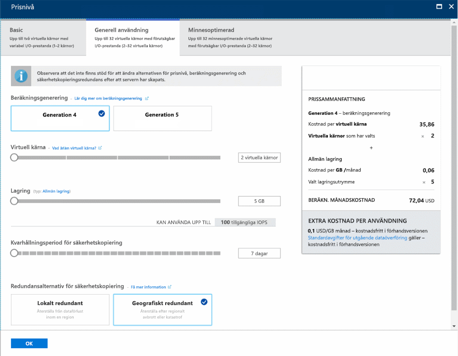

# <a name="tutorial-design-your-first-azure-database-for-postgresql-using-the-azure-portal"></a>Självstudie: Utforma din första Azure Database for PostgreSQL med Azure Portal

Azure Database för PostgreSQL är en hanterad tjänst som låter dig köra, hantera och skala högtillgängliga PostgreSQL-databaser i molnet. I Azure-portalen kan du enkelt hantera servern och utforma en databas.

I den här självstudien använder du Azure-portalen till att:
> [!div class="checklist"]
> * Skapa en Azure Database för PostgreSQL-server
> * Konfigurera serverbrandväggen
> * Använd [**psql**](https://www.postgresql.org/docs/9.6/static/app-psql.html)-verktyget för att skapa en databas
> * Läsa in exempeldata
> * Frågedata
> * Uppdatera data
> * Återställa data

## <a name="prerequisites"></a>Nödvändiga komponenter
Om du inte har en Azure-prenumeration kan du skapa ett [kostnadsfritt](https://azure.microsoft.com/free/) konto innan du börjar.

## <a name="log-in-to-the-azure-portal"></a>Logga in på Azure Portal
Logga in på [Azure-portalen](https://portal.azure.com).

## <a name="create-an-azure-database-for-postgresql"></a>Skapa en Azure Database för PostgreSQL

En Azure Database för PostgreSQL-server skapas med en definierad uppsättning [compute- och lagringsresurser](./concepts-compute-unit-and-storage.md). Servern skapas inom en [Azure-resursgrupp](../azure-resource-manager/resource-group-overview.md).

Följ de här stegen för att skapa en Azure Database för PostgreSQL-server:
1.  Klicka på **Skapa en resurs** längst upp till vänster i Azure-portalen.
2.  Välj **databaser** från sidan **Nytt** och välj **Azure Database för PostgreSQL** från sidan **databaser**.
  

3.  Fyll i formuläret om den nya servern och uppge följande information:

    

    - Servernamn: **mydemoserver** (namnet på en server mappar till DNS-namnet och behöver därför vara globalt unikt) 
    - Prenumeration: Om du har flera prenumerationer, väljer du lämplig prenumeration där resursen ska finnas eller debiteras till.
    - Resursgrupp: **myresourcegroup**
    - Valfritt inloggningsnamn och lösenord för serveradministratören
    - Plats
    - PostgreSQL-version

   > [!IMPORTANT]
   > Det användarnamn och lösenord för serveradministration du anger här krävs för inloggning på servern och databaserna senare i den här självstudien. Kom ihåg eller skriv ned den här informationen så att du kan använda den senare.

4.  Klicka på **Prisnivå** för att ange prisnivån för den nya servern. För den här självstudien väljer du **Generell användning**, **Gen 4** compute-generering, 2 **virtuella kärnor**, 5 GB **lagring** och 7 dagar **kvarhållningsperiod för säkerhetskopior**. Välj redundansalternativet för säkerhetskopiering som heter **Geografiskt redundant** för att göra så att dina automatiska serversäkerhetskopior lagras i geo-redundant lagring.
 

5.  Klicka på **OK**.

6.  Klicka på **Skapa** för att etablera servern. Etableringen tar några minuter.

7.  Klicka på **Aviseringar** i verktygsfältet för att övervaka distributionsprocessen.
 

   > [!TIP]
   > Markera alternativet **Fäst på instrumentpanelen** för att enkelt kunna spåra dina distributioner.

   Som standard skapas **postgres**-databasen under din server. [Postgres](https://www.postgresql.org/docs/9.6/static/app-initdb.html)-databasen är en standarddatabas som är avsedd för användare, verktyg och tredje parts program. 

## <a name="configure-a-server-level-firewall-rule"></a>Konfigurera en brandväggsregel på servernivå

Azure Database for PostgreSQL-tjänsten använder en brandvägg på servernivå. Brandväggen förhindrar som standard att alla externa program och verktyg ansluter till servern eller databaser på servern, om inte en brandväggsregel skapas som öppnar brandväggen för specifika IP-adressintervall. 

1.  När distributionen är färdig klickar du på **Alla resurser** på den vänstra menyn och anger namnet **mydemoserver** för att söka efter servern som du nyss skapade. Klicka på servernamnet som listas i sökresultatet. **Översikt**-sidan för din server öppnas och innehåller alternativ ytterligare konfiguration.

   

2.  På serversidan väljer du **Anslutningssäkerhet**. 

3.  Klicka i textrutan under **regelnamn** och lägg till en ny brandväggsregel som vitlistar IP-adressintervallet för anslutningen. I den här självstudien tillåter vi alla IP-adresser genom att skriva in **Regelnamn = AllowAllIps**, **Start-IP-adress = 0.0.0.0** och **Slut-IP-adress = 255.255.255.255**. Därefter klickar vi på **Spara**. Du kan ställa in en specifik brandväggsregel som omfattar ett mindre IP-intervall för att kunna ansluta från ditt nätverk.

   

4.  Klicka på **Spara** och sedan på **X** för att stänga sidan om **anslutningssäkerhet**.

   > [!NOTE]
   > Azure PostgreSQL-servern kommunicerar via port 5432. Om du försöker ansluta inifrån ett företagsnätverk, kan utgående trafik via port 5432 bli nekad av nätverkets brandvägg. I så fall kommer du inte att kunna ansluta till din Azure SQL Database-server om inte din IT-avdelning öppnar port 5432.
   >

## <a name="get-the-connection-information"></a>Hämta anslutningsinformationen

När du skapade Azure Database for PostgreSQL-servern, skapades även standarddatabasen **postgres**. För att ansluta till din databasserver, måste du ange värddatorinformation och autentiseringsuppgifter för åtkomst.

1. På den vänstra menyn i Azure Portal klickar du på **Alla resurser** och söker efter den server som du nyss skapade.

   

2. Klicka på servernamnet **mydemoserver**.

3. Välj serverns **översikt**-sida. Anteckna **servernamn** och **inloggningsnamnet för serveradministratören**.

   


## <a name="connect-to-postgresql-database-using-psql-in-cloud-shell"></a>Anslut till PostgreSQL-databasen med psql i Cloud Shell

Nu använder vi [psql](https://www.postgresql.org/docs/9.6/static/app-psql.html)-kommandoradsverktyget för att ansluta till Azure Database for PostgreSQL-servern. 
1. Starta Azure Cloud Shell via terminalikonen överst i navigeringsfönstret.

   

2. Azure Cloud Shell öppnas i din webbläsare så att du kan skriva bash-kommandon.

   

3. I Cloud Shell-prompten ansluter du till din Azure Database för PostgreSQL-server med psql-kommandona. Följande format används för att ansluta till en Azure Database för PostgreSQL-server med [psql](https://www.postgresql.org/docs/9.6/static/app-psql.html)-verktyget:
   ```bash
   psql --host=<myserver> --port=<port> --username=<server admin login> --dbname=<database name>
   ```

   Följande kommando ansluter till exempel till standarddatabasen som heter **postgres** på din PostgreSQL-server **mydemoserver.postgres.database.azure.com** med hjälp av autentiseringsuppgifter. Ange ditt lösenord för serveradministratören när du uppmanas till detta.

   ```bash
   psql --host=mydemoserver.postgres.database.azure.com --port=5432 --username=myadmin@mydemoserver --dbname=postgres
   ```

## <a name="create-a-new-database"></a>Skapa en ny databas
När du är ansluten till servern, skapar du en blank databas i prompten.
```bash
CREATE DATABASE mypgsqldb;
```

I prompten kör du följande kommando för att växla anslutning till den nyligen skapade databasen **mypgsqldb**.
```bash
\c mypgsqldb
```
## <a name="create-tables-in-the-database"></a>Skapa tabeller i databasen
Nu när du vet hur du ansluter till Azure Database for PostgreSQL-databasen, kan du utföra några grundläggande uppgifter:

Skapa först en tabell och läs in lite data till den. Nu ska vi skapa en tabell som spårar inventeringsinformation med följande SQL-kod:
```sql
CREATE TABLE inventory (
    id serial PRIMARY KEY, 
    name VARCHAR(50), 
    quantity INTEGER
);
```

Du kan se den nyligen skapade tabellen i listan med tabeller genom att skriva:
```sql
\dt
```

## <a name="load-data-into-the-tables"></a>Läs in data till tabellerna
Nu när du har en tabell kan du infoga lite data i den. Kör följande fråga i den öppna kommandotolken så at du löser in några datarader.
```sql
INSERT INTO inventory (id, name, quantity) VALUES (1, 'banana', 150); 
INSERT INTO inventory (id, name, quantity) VALUES (2, 'orange', 154);
```

Nu har du två rader med exempeldata i inventeringstabellen du skapade tidigare.

## <a name="query-and-update-the-data-in-the-tables"></a>Ställ frågor mot och uppdatera data i tabellerna
Kör följande fråga för att hämta information från inventeringsdatabastabellen. 
```sql
SELECT * FROM inventory;
```

Du kan även uppdatera data i tabellen.
```sql
UPDATE inventory SET quantity = 200 WHERE name = 'banana';
```

Du ser de uppdaterade värdena när du hämtar data.
```sql
SELECT * FROM inventory;
```

## <a name="restore-data-to-a-previous-point-in-time"></a>Återställa data till en tidigare tidpunkt
Anta att du har tagit bort den här tabellen av misstag. Det är inte så enkelt att återställa från den här situationen. Med Azure Database for PostgreSQL kan du gå tillbaka till valfri tidpunkt från vilken du har serversäkerhetskopior (bestäms utifrån kvarhållningsperioden för säkerhetskopior som du konfigurerar) och återställa tidpunkten på en ny server. Du kan använda den nya servern till att återställa dina data. Med följande steg återställs servern **mydemoserver** till en tidpunkt innan inventeringstabellen lades till.

1.  I Azure Database for PostgreSQL på sidan **Översikt** för servern, klickar du på **Återställ** i verktygsfältet. Sidan **Återställ** öppnas.

   

2.  Fyll i formuläret **Återställ** med den information som behövs:

   

   - **Återställningspunkt**: Välj en tidpunkt innan servern ändrades
   - **Målserver**: Ange ett nytt servernamn som du vill återställa till
   - **Plats**: Du kan inte välja region, som standard är det samma som källservern
   - **Prisnivå**: Du kan inte ändra det här värdet när du återställer en server. Det är samma som källservern. 
3.  Klicka på **OK** om du vill [återställa servern till en tidpunkt](./howto-restore-server-portal.md) innan tabellen togs bort. Om du återställer en server till en annan tidpunkt skapas en dubblett av den ursprungliga servern vid den tidpunkt du angav, förutsatt att den infaller inom kvarhållningsperioden för din [prisnivå](./concepts-pricing-tiers.md).

## <a name="next-steps"></a>Nästa steg
I den här självstudien har du lärt dig hur du använder Azure-portalen och andra verktyg för att:
> [!div class="checklist"]
> * Skapa en Azure Database för PostgreSQL-server
> * Konfigurera serverbrandväggen
> * Använd [**psql**](https://www.postgresql.org/docs/9.6/static/app-psql.html)-verktyget för att skapa en databas
> * Läsa in exempeldata
> * Frågedata
> * Uppdatera data
> * Återställa data

Nu ska du lära dig hur du använder Azure CLI till liknande aktiviteter. Gå till följande självstudie: [Utforma din första Azure Database for PostgreSQL med Azure CLI](tutorial-design-database-using-azure-cli.md)
