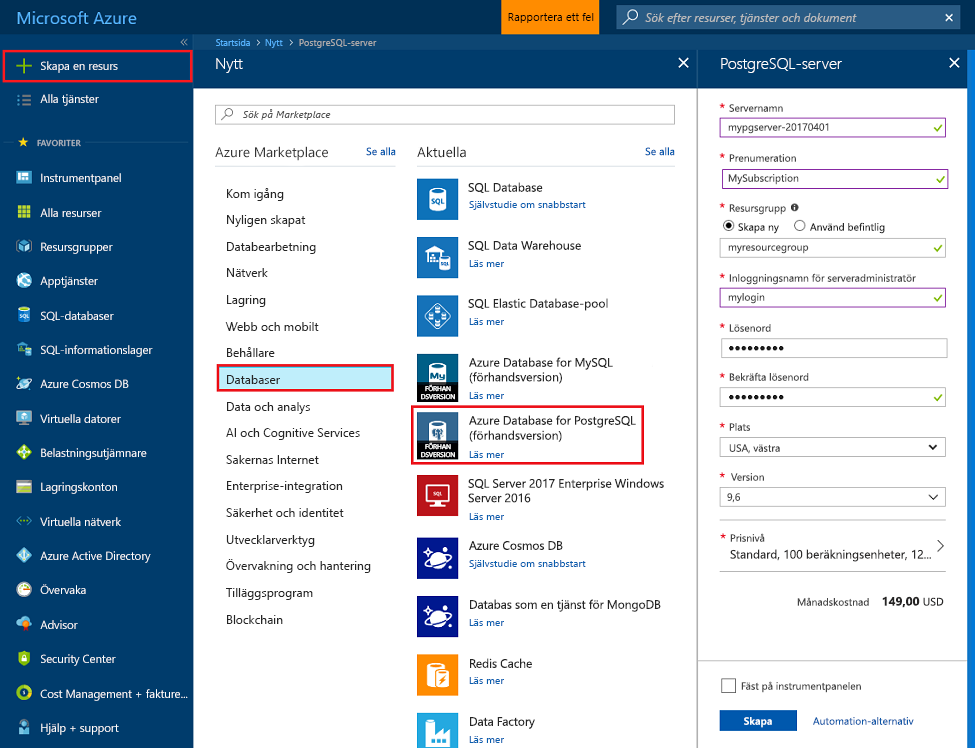
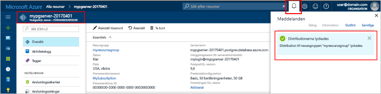
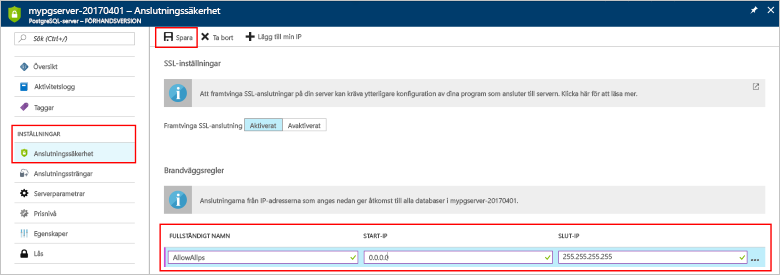
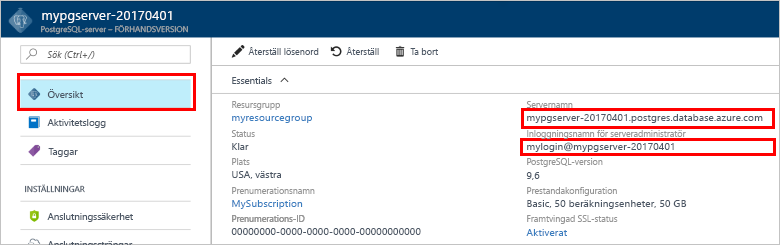
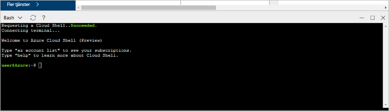

# <a name="design-your-first-azure-database-for-postgresql-using-the-azure-portal"></a>Utforma din första Azure-databas för PostgreSQL med Azure-portalen

Azure Database för PostgreSQL är en hanterad tjänst som låter dig köra, hantera och skala högtillgängliga PostgreSQL-databaser i molnet. Med Azure-portalen kan du enkelt hantera servern och utforma en databas.

I kursen får du använder Azure-portalen att lära dig hur du:
> [!div class="checklist"]
> * Skapa en Azure Database för PostgreSQL
> * Konfigurera server-brandväggen
> * Använd [ **psql** ](https://www.postgresql.org/docs/9.6/static/app-psql.html) verktyg för att skapa en databas
> * Läs in exempeldata
> * Frågedata
> * Uppdatera data
> * Återställa data

## <a name="prerequisites"></a>Krav
Om du inte har en Azure-prenumeration kan du skapa ett [kostnadsfritt](https://azure.microsoft.com/free/) konto innan du börjar.

## <a name="log-in-to-the-azure-portal"></a>Logga in på Azure Portal
Logga in på [Azure-portalen](https://portal.azure.com).

## <a name="create-an-azure-database-for-postgresql"></a>Skapa en Azure Database för PostgreSQL

En Azure Database för PostgreSQL-server skapas med en definierad uppsättning [compute- och lagringsresurser](./concepts-compute-unit-and-storage.md). Servern skapas inom en [Azure-resursgrupp](../azure-resource-manager/resource-group-overview.md).

Följ de här stegen för att skapa en Azure Database för PostgreSQL-server:
1.  Klicka på den **+ ny** knapp hittades i det övre vänstra hörnet i Azure-portalen.
2.  Välj **databaser** från sidan **Nytt** och välj **Azure Database för PostgreSQL** från sidan **databaser**.
 

3.  Fyll i detaljformuläret för den nya server med följande information, som det visas i föregående bil:
    - Servernamn: **mypgserver-20170401** (namnet på en server mappar till DNS-namnet och behöver därför vara globalt unikt) 
    - Prenumeration: Om du har flera prenumerationer, väljer du lämplig prenumeration där resursen ska finnas eller debiteras till.
    - Resursgrupp: **myresourcegroup**
    - Valfritt inloggningsnamn och lösenord för serveradministratören
    - Plats
    - PostgreSQL-version

  > [!IMPORTANT]
  > Det användarnamn och lösenord för serveradministration du anger här krävs för inloggning på servern och databaserna senare i den här snabbstarten. Kom ihåg eller skriv ned den här informationen så att du kan använda den senare.

4.  Klicka på **Prisnivå** för att ange tjänstenivå och prestandanivå för den nya databasen. I den här snabbstarten väljer du **Basic**-nivå **50 compute-enheter** och **50 GB** lagringsutrymme.
 
5.  Klicka på **OK**.
6.  Klicka på **Skapa** för att etablera servern. Etableringen tar några minuter.

  > [!TIP]
  > Markera alternativet **Fäst på instrumentpanelen** för att enkelt kunna spåra dina distributioner.

7.  Klicka på **Aviseringar** i verktygsfältet för att övervaka distributionsprocessen.
 
   
  Som standard skapas **postgres**-databasen under din server. [Postgres](https://www.postgresql.org/docs/9.6/static/app-initdb.html)-databasen är en standarddatabas som är avsedd för användare, verktyg och tredje parts program. 

## <a name="configure-a-server-level-firewall-rule"></a>Konfigurera en brandväggsregel på servernivå

Azure Database för PostgreSQL-tjänsten skapar en brandvägg på server-nivå. Brandväggen förhindrar att externa program och verktyg ansluter till servern eller databaser på servern, om inte en brandväggsregel konfigureras som öppnar brandväggen för specifika IP-adresser. 

1.  När distributionen är klar, klickar du på **alla resurser** från den vänstra menyn och skriver in namnet **mypgserver-20170401** för att söka efter din nyskapade server. Klicka på servernamnet som listas i sökresultatet. **Översikt**-sidan för din server öppnas och innehåller alternativ ytterligare konfiguration.
 
 

2.  I serverbladet, väljer du **anslutningssäkerhet**. 
3.  Klicka i textrutan under **regelnamn** och lägg till en ny brandväggsregel som vitlistar IP-adressintervallet för anslutningen. För den här självstudiekursen kommer vi att alla IP-adresser genom att skriva in **Regelnamnet = AllowAllIps**, **första IP-= 0.0.0.0** och **sista IP = 255.255.255.255** och klicka sedan på **spara** . Du kan ställa in en brandväggsregel som omfattar ett IP-intervall för att kunna ansluta från ditt nätverk.
 
 

4.  Klicka på **spara** och klicka sedan på **X** för att stänga sidan **anslutningssäkerhet**.

  > [!NOTE]
  > Azure PostgreSQL-servern kommunicerar via port 5432. Om du försöker ansluta inifrån ett företagsnätverk, kan utgående trafik via port 5432 bli nekad av nätverkets brandvägg. I så fall kommer du inte att kunna ansluta till din Azure SQL Database-server om inte din IT-avdelning öppnar port 5432.
  >


## <a name="get-the-connection-information"></a>Hämta anslutningsinformationen

När vi skapade vår Azure Database för PostgreSQL-server, skapades även standard-**postgres**-databasen. För att ansluta till din databasserver, måste du ange värddatorinformation och autentiseringsuppgifter för åtkomst.

1. I den vänstra menyn i Azure-portalen, klickar du på **Alla resurser** och söker efter den server som du nyss skapade **mypgserver-20170401**.

  

3. Klicka på servernamnet **mypgserver-20170401**.
4. Välj serverns **översikt**-sida. Anteckna **servernamn** och **inloggningsnamnet för serveradministratören**.

 


## <a name="connect-to-postgresql-database-using-psql-in-cloud-shell"></a>Anslut till PostgreSQL-databasen med psql i Cloud Shell

Nu använder vi psql-kommandoradsverktyget för att ansluta till Azure Database för PostgreSQL-servern. 
1. Starta Azure Cloud Shell via terminalikonen överst i navigeringsfönstret.

   

2. Azure Cloud Shell öppnas i din webbläsare så att du kan skriva bash-kommandon.

   

3. I Cloud Shell-prompten ansluter du till din Azure Database för PostgreSQL-server med psql-kommandona. Följande format används för att ansluta till en Azure Database för PostgreSQL-server med [psql](https://www.postgresql.org/docs/9.6/static/app-psql.html)-verktyget:
   ```bash
   psql --host=<myserver> --port=<port> --username=<server admin login> --dbname=<database name>
   ```

   Följande kommando till exempel, ansluter till standarddatabasen som heter **postgres** på din PostgreSQL-server **mypgserver-20170401.postgres.database.azure.com** med hjälp av autentiseringsuppgifter. Ange ditt lösenord för serveradministratören när du uppmanas till detta.

   ```bash
   psql --host=mypgserver-20170401.postgres.database.azure.com --port=5432 --username=mylogin@mypgserver-20170401 --dbname=postgres
   ```

## <a name="create-a-new-database"></a>Skapa en ny databas
När du är ansluten till servern, skapar du en blank databas i prompten.
```bash
CREATE DATABASE mypgsqldb;
```

I prompten kör du följande kommando för att växla anslutning till den nyligen skapade databasen **mypgsqldb**.
```bash
\c mypgsqldb
```
## <a name="create-tables-in-the-database"></a>Skapa tabeller i databasen
Nu när du vet hur du ansluter till Azure-databasen för PostgreSQL gå vi igenom hur du utför några grundläggande uppgifter.

Vi kan först skapa en tabell och läsa in den med vissa data. Nu ska vi skapa en tabell som spårar inventeringsinformation.
```sql
CREATE TABLE inventory (
    id serial PRIMARY KEY, 
    name VARCHAR(50), 
    quantity INTEGER
);
```

Du kan se den nyligen skapade tabellen i listan över tabvles nu genom att skriva:
```sql
\dt
```

## <a name="load-data-into-the-tables"></a>Läser in data i tabeller
Nu när vi har en tabell kan vi infoga vissa data i den. Kör följande fråga för att infoga vissa rader med data i öppna en kommandotolk-fönster
```sql
INSERT INTO inventory (id, name, quantity) VALUES (1, 'banana', 150); 
INSERT INTO inventory (id, name, quantity) VALUES (2, 'orange', 154);
```

Du har nu två rader med exempeldata i tabellen som du skapade tidigare.

## <a name="query-and-update-the-data-in-the-tables"></a>Fråga efter och uppdatera data i tabeller
Kör följande fråga för att hämta information från databastabellen. 
```sql
SELECT * FROM inventory;
```

Du kan också uppdatera data i tabeller
```sql
UPDATE inventory SET quantity = 200 WHERE name = 'banana';
```

Raden uppdateras i enlighet med detta när du hämtar data.
```sql
SELECT * FROM inventory;
```

## <a name="restore-data-to-a-previous-point-in-time"></a>Återställa data till en tidigare tidpunkt
Anta att du av misstag har tagit bort den här tabellen. Den här situationen är något som du lätt kan återställa från. Azure-databas för PostgreSQL kan du gå tillbaka till någon punkt i tid (i det senaste upp till 7 dagar (grundläggande) och 35 dagar (Standard)) och återställa den här i tidpunkt till en ny server. Du kan använda den här nya servern för att återställa dina data. Följande steg återställa exempelserver till en innan tabellen har lagts till.

1.  Klicka på Azure-databasen för PostgreSQL-sidan för servern **återställa** i verktygsfältet. Den **återställa** öppnas.
  
2.  Fyll i den **återställa** formulär med informationen som krävs:

  
  - **Återställningspunkt**: Välj en i tidpunkt som inträffar innan servern har ändrats
  - **Målservern**: Ange ett nytt servernamn som du vill återställa till
  - **Plats**: du kan inte välja regionen, som standard är det samma som källservern
  - **Prisnivån**: du kan inte ändra det här värdet när du återställer en server. Det är samma som källservern. 
3.  Klicka på **OK** att återställa servern till [återställa till point-in-time](./howto-restore-server-portal.md) innan tabellerna har tagits bort. Återställa en server till en annan tidpunkt skapar en dubblett ny server som den ursprungliga servern från och med punkten tidpunkt du anger under förutsättning att det är inom kvarhållningsperioden för din [tjänstnivån](./concepts-service-tiers.md).

## <a name="next-steps"></a>Nästa steg
I kursen får du har lärt dig hur du använder Azure-portalen och andra verktyg för att:
> [!div class="checklist"]
> * Skapa en Azure Database för PostgreSQL
> * Konfigurera server-brandväggen
> * Använd [ **psql** ](https://www.postgresql.org/docs/9.6/static/app-psql.html) verktyg för att skapa en databas
> * Läs in exempeldata
> * Frågedata
> * Uppdatera data
> * Återställa data

Därefter beskrivs hur du använder Azure CLI gör liknande uppgifter genom att granska den här självstudiekursen: [utforma din första Azure-databas för PostgreSQL med Azure CLI](tutorial-design-database-using-azure-cli.md)
