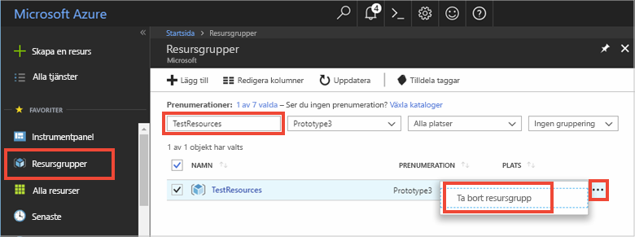

# <a name="quickstart-use-azure-redis-cache-with-a-net-core-app"></a>Snabbstart: Använd Azure Redis Cache med en .NET Core-app


Den här snabbstarten visar hur du kommer igång med Microsoft Azure Redis Cache med .NET Core. Microsoft Azure Redis Cache är baserad på den populära Redis Cache med öppen källkod. Den ger dig tillgång till en säker och dedikerad Redis-cache som hanteras av Microsoft. Ett cacheminne som har skapats med Azure Redis Cache är tillgängligt från alla program i Microsoft Azure.

I den här snabbstarten använder du klienten [StackExchange.Redis](https://github.com/StackExchange/StackExchange.Redis) med C\#-kod i en .NET Core-konsolapp. Du kommer att skapa en cache och konfigurera .NET Core-klientappen. Därefter kommer du att lägga till och uppdatera objekt i cachen. 

Du kan använda valfritt kodredigeringsprogram för att slutföra stegen i den här snabbstarten. [Visual Studio Code](https://code.visualstudio.com/) är dock ett utmärkt alternativ som är tillgängligt på Windows-, macOS- och Linux-plattformar.


[!INCLUDE [quickstarts-free-trial-note](../../includes/quickstarts-free-trial-note.md)]

## <a name="prerequisites"></a>Nödvändiga komponenter

* [.NET SDK 2.0](https://www.microsoft.com/net/learn/get-started/windows) eller senare.
* StackExchange.Redis-klienten kräver [.NET Framework 4 eller senare](https://www.microsoft.com/net/download/dotnet-framework-runtime).

## <a name="create-a-cache"></a>Skapa en cache
[!INCLUDE [redis-cache-create](../../includes/redis-cache-create.md)]

[!INCLUDE [redis-cache-access-keys](../../includes/redis-cache-access-keys.md)]

Anteckna **VÄRDNAMN** och den **Primära** åtkomstnyckeln. Du använder dessa värden senare för att konstruera *CacheConnection*-hemligheten.


## <a name="create-a-console-app"></a>Skapa en konsolapp

Öppna ett nytt kommandofönster och kör följande kommando för att skapa en ny .NET Core-konsolapp:

```
dotnet new console -o Redistest
```

I ditt kommandofönster, ändrar du till den nya *Redistest*-projektkatalogen.


## <a name="add-secret-manager-to-the-project"></a>Lägg till Secret Manager i projektet

I det här avsnittet lägger du till [verktyget Secret Manager](https://docs.microsoft.com/aspnet/core/security/app-secrets) i projektet. Verktyget Secret Manager lagrar känsliga uppgifter för utvecklingsarbete utanför projektträdet. Den här metoden hjälper till att förhindra oavsiktlig delning av apphemligheter i källkoden.

Öppna din *Redistest.csproj*-fil. Lägg till ett `DotNetCliToolReference`-element att inkludera *Microsoft.Extensions.SecretManager.Tools*. Lägg också till ett `UserSecretsId`-elementet enligt nedan och spara filen.

```xml
<Project Sdk="Microsoft.NET.Sdk">

  <PropertyGroup>
    <OutputType>Exe</OutputType>
    <TargetFramework>netcoreapp2.0</TargetFramework>
    <UserSecretsId>Redistest</UserSecretsId>
  </PropertyGroup>
  <ItemGroup>
    <DotNetCliToolReference Include="Microsoft.Extensions.SecretManager.Tools" Version="2.0.0" />
  </ItemGroup>
</Project>
```

Kör följande kommando för att lägga till paketet *Microsoft.Extensions.Configuration.UserSecrets* i projektet:

```
dotnet add package Microsoft.Extensions.Configuration.UserSecrets
```

Kör följande kommando för att återställa dina paket:

```
dotnet restore
```

I ditt kommandofönster, kör du följande kommandon för att lagra en ny hemlighet med namnet *CacheConnection* efter att du ersätter platshållarna (inklusive hakparenteser) för ditt cachenamn och primära åtkomstnyckel:

```
dotnet user-secrets set CacheConnection "<cache name>.redis.cache.windows.net,abortConnect=false,ssl=true,password=<primary-access-key>"
```

Lägg till följande `using`-uttryck i *Program.cs*:

```csharp
using Microsoft.Extensions.Configuration;
```

Lägg till följande medlemmar till `Program`-klassen i *Program.cs*. Den här koden initierar en konfiguration för att komma åt användarhemligheten för redis cache-anslutningssträngen.

```csharp
        private static IConfigurationRoot Configuration { get; set; }
        const string SecretName = "CacheConnection";

        private static void InitializeConfiguration()
        {
            var builder = new ConfigurationBuilder()
                .AddUserSecrets<Program>();

            Configuration = builder.Build();
        }
```

## <a name="configure-the-cache-client"></a>Konfigurera cacheklienten

I det här avsnittet konfigurerar du konsolprogrammet att använda [StackExchange.Redis](https://github.com/StackExchange/StackExchange.Redis)-klienten för .NET.

I kommandofönstret, kör du följande kommando i projektkatalogen *Redistest*:

```
dotnet add package StackExchange.Redis
```

När installationen är klar är *StackExchange.Redis*-cacheklienten tillgänglig för användning med ditt projekt.


## <a name="connect-to-the-cache"></a>Ansluta till cachen

Lägg till följande `using`-uttryck i *Program.cs*:

```csharp
using StackExchange.Redis;
```

Anslutningen till Azure Redis Cache hanteras av `ConnectionMultiplexer`-klassen. Den här klassen ska delas och återanvändas i hela ditt klientprogram. Skapa inte en ny anslutning för varje åtgärd. 

I *Program.cs*, lägger du till följande medlemmar i `Program`-klassen för ditt konsolprogram:

```csharp
        private static Lazy<ConnectionMultiplexer> lazyConnection = new Lazy<ConnectionMultiplexer>(() =>
        {
            string cacheConnection = Configuration[SecretName];
            return ConnectionMultiplexer.Connect(cacheConnection);
        });

        public static ConnectionMultiplexer Connection
        {
            get
            {
                return lazyConnection.Value;
            }
        }
```

Den här metoden för att dela en `ConnectionMultiplexer`-instans i ditt program använder en statisk egenskap som returnerar en ansluten instans. Koden ger ett trådsäkert sätt att endast initiera en enda ansluten `ConnectionMultiplexer`-instans. `abortConnect` är inställt på falskt, vilket innebär att anropet lyckas även om en anslutning till Azure Redis Cache inte etableras. En viktig egenskap i `ConnectionMultiplexer` är att anslutningen till cachen återställs automatiskt när nätverksproblemet eller andra fel har åtgärdats.

Du kommer åt värdet för *CacheConnection*-hemligheten med konfigurationsprovidern för hemlighetshanteraren och används som lösenordsparametern.

## <a name="executing-cache-commands"></a>Kör cachekommandon

I *Program.cs*, lägger du till följande kod för `Main`-proceduren i `Program`-klassen för ditt konsolprogram:

```csharp
        static void Main(string[] args)
        {
            InitializeConfiguration();

            // Connection refers to a property that returns a ConnectionMultiplexer
            // as shown in the previous example.
            IDatabase cache = lazyConnection.Value.GetDatabase();

            // Perform cache operations using the cache object...

            // Simple PING command
            string cacheCommand = "PING";
            Console.WriteLine("\nCache command  : " + cacheCommand);
            Console.WriteLine("Cache response : " + cache.Execute(cacheCommand).ToString());

            // Simple get and put of integral data types into the cache
            cacheCommand = "GET Message";
            Console.WriteLine("\nCache command  : " + cacheCommand + " or StringGet()");
            Console.WriteLine("Cache response : " + cache.StringGet("Message").ToString());

            cacheCommand = "SET Message \"Hello! The cache is working from a .NET Core console app!\"";
            Console.WriteLine("\nCache command  : " + cacheCommand + " or StringSet()");
            Console.WriteLine("Cache response : " + cache.StringSet("Message", "Hello! The cache is working from a .NET Core console app!").ToString());

            // Demostrate "SET Message" executed as expected...
            cacheCommand = "GET Message";
            Console.WriteLine("\nCache command  : " + cacheCommand + " or StringGet()");
            Console.WriteLine("Cache response : " + cache.StringGet("Message").ToString());

            // Get the client list, useful to see if connection list is growing...
            cacheCommand = "CLIENT LIST";
            Console.WriteLine("\nCache command  : " + cacheCommand);
            Console.WriteLine("Cache response : \n" + cache.Execute("CLIENT", "LIST").ToString().Replace("id=", "id="));

            lazyConnection.Value.Dispose();
        }
```

Spara *Program.cs*.

Azure Redis-cacheminnen har ett konfigurerbart antal databaser (16 är standard) som kan användas för att logiskt separera data i ett Redis-cacheminne. Koden ansluter till standarddatabasen DB 0. Mer information finns i [What are Redis databases?](cache-faq.md#what-are-redis-databases) (Vad är Redis-databaser?) och [Default Redis server configuration](cache-configure.md#default-redis-server-configuration) (Standardkonfiguration av Redis-server).

Cacheobjekt kan lagras och hämtas med hjälp av metoderna `StringSet` och `StringGet`.

Redis lagrar de flesta data som Redis-strängar, men dessa strängar kan innehålla flera typer av data, inklusive serialiserade binära data som kan användas när .NET-objekt lagras i cacheminnet.

Kör följande kommando i ditt kommandofönster för att skapa appen:

```
dotnet build
```

Kör sedan appen med följande kommando:

```
dotnet run
```

I exemplet nedan ser du att `Message`-nyckeln tidigare hade ett cachelagrat värde som angavs med Redis-konsolen i Azure-portalen. Appen uppdatera det cachelagrade värdet. Appen körde även kommandona `PING` och `CLIENT LIST`.


## <a name="work-with-net-objects-in-the-cache"></a>Arbeta med .NET-objekt i cachen

Azure Redis Cache kan cachelagra både .NET-objekt och basdatatyper, men .NET-objekt måste serialiseras innan de kan cachelagras. Den här .NET-objektserialiseringen är programutvecklarens ansvar och ger utvecklaren flexibilitet i valet av serialiserare.

Ett enkelt sätt att serialisera objekt är att använda `JsonConvert`-serialiseringsmetoderna i [Newtonsoft.Json](https://www.nuget.org/packages/Newtonsoft.Json/) och serialisera till och från JSON. I det här avsnittet ska du lägga till ett .NET-objekt till cachen.

Kör följande kommando för att lägga till *Newtonsoft.json*-paketet till appen:

```
dotnet add package Newtonsoft.json
```

Lägg till följande `using`-uttryck högst upp i *Program.cs*:

```charp
using Newtonsoft.Json;
```

Lägg till följande `Employee`-klassdefinition i *Program.cs*:

```csharp
        class Employee
        {
            public string Id { get; set; }
            public string Name { get; set; }
            public int Age { get; set; }

            public Employee(string EmployeeId, string Name, int Age)
            {
                this.Id = EmployeeId;
                this.Name = Name;
                this.Age = Age;
            }
        }
```

Längst ned i `Main()`-proceduren i *Program.cs* och innan anropet till `Dispose()`, lägger du till följande kodrader i cachen och hämtar ett serialiserat .NET-objekt:

```csharp
            // Store .NET object to cache
            Employee e007 = new Employee("007", "Davide Columbo", 100);
            Console.WriteLine("Cache response from storing Employee .NET object : " + 
                cache.StringSet("e007", JsonConvert.SerializeObject(e007)));

            // Retrieve .NET object from cache
            Employee e007FromCache = JsonConvert.DeserializeObject<Employee>(cache.StringGet("e007"));
            Console.WriteLine("Deserialized Employee .NET object :\n");
            Console.WriteLine("\tEmployee.Name : " + e007FromCache.Name);
            Console.WriteLine("\tEmployee.Id   : " + e007FromCache.Id);
            Console.WriteLine("\tEmployee.Age  : " + e007FromCache.Age + "\n");
```

Spara *Program.cs* och återskapa appen med följande kommando:

```
dotnet build
```

Kör appen med följande kommando för att testa serialisering av .NET-objekt:

```
dotnet run
```


## <a name="clean-up-resources"></a>Rensa resurser

Om du ska fortsätta till nästa självstudie kan du behålla resurserna som du har skapat i den här självstudien och använda dem igen.

Om du är klar med exempelappen för snabbstart kan du ta bort Azure-resurserna som du skapade i snabbstarten för att undvika kostnader. 

> [!IMPORTANT]
> Det går inte att ångra borttagningen av en resursgrupp och resursgruppen och alla resurser i den tas bort permanent. Kontrollera att du inte av misstag tar bort fel resursgrupp eller resurser. Om du har skapat resurserna som värd för det här exemplet i en befintlig resursgrupp som innehåller resurser som du vill behålla, kan du ta bort varje resurs separat från deras respektive blad istället för att ta bort resursgruppen.
>

Logga in på [Azure Portal](https://portal.azure.com) och klicka på **Resursgrupper**.

Skriv namnet på din resursgrupp i textrutan **Filtrera efter namn...**. Anvisningarna för den här artikeln använde en resursgrupp med namnet *TestResources*. På din resursgrupp i resultatlistan klickar du på **...** och därefter **Ta bort resursgrupp**.



Du blir ombedd att bekräfta borttagningen av resursgruppen. Skriv namnet på din resursgrupp för att bekräfta och klicka på **Ta bort**.

Efter en liten stund tas resursgruppen och resurser som finns i den bort.


<a name="next-steps"></a>

## <a name="next-steps"></a>Nästa steg

I den här snabbstarten du har lärt dig hur du använder Azure Redis Cache från ett .NET Core-program. Fortsätta till nästa snabbstart om du vill använda Redis Cache med en ASP.NET-webbapp.

> [!div class="nextstepaction"]
> [Skapa en ASP.NET-webbapp som använder Azure Redis Cache.](./cache-web-app-howto.md)


