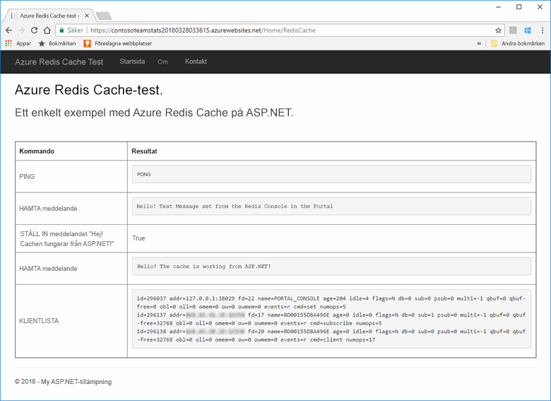
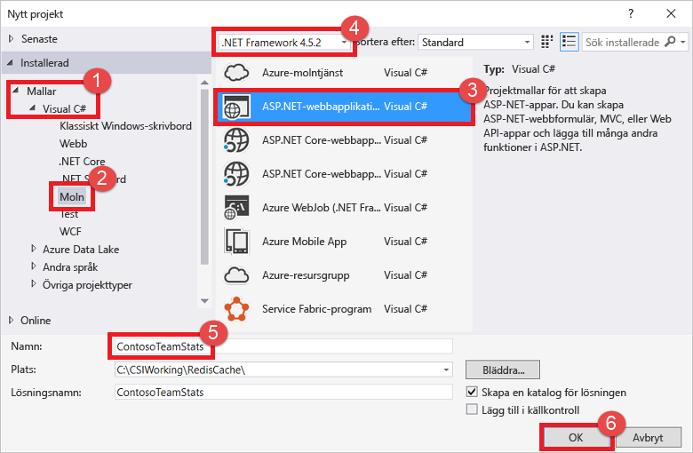
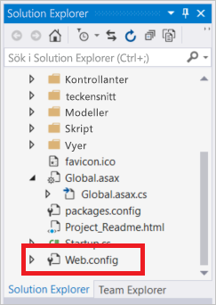
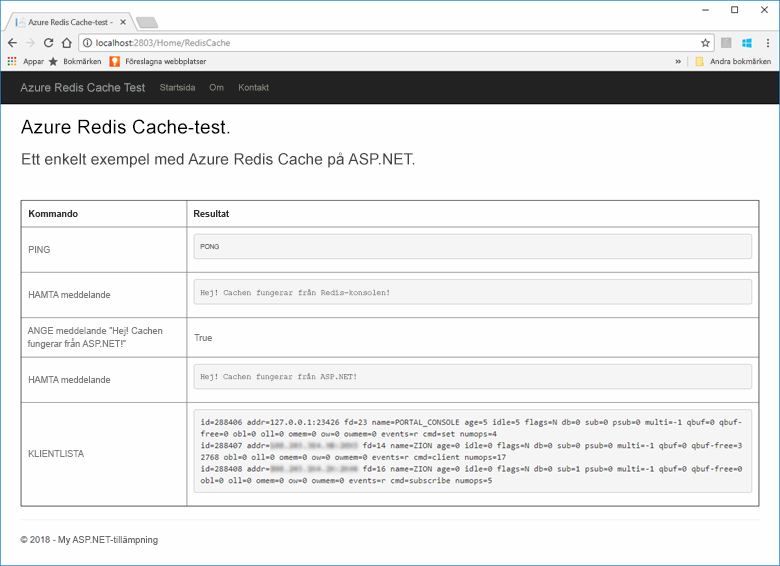
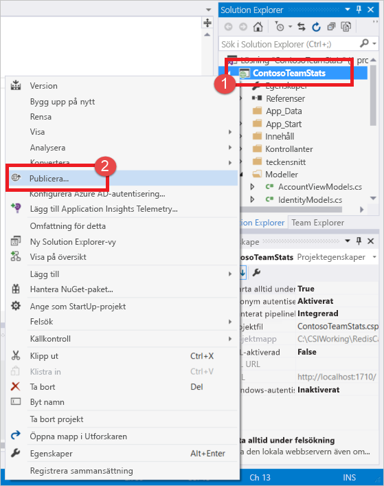
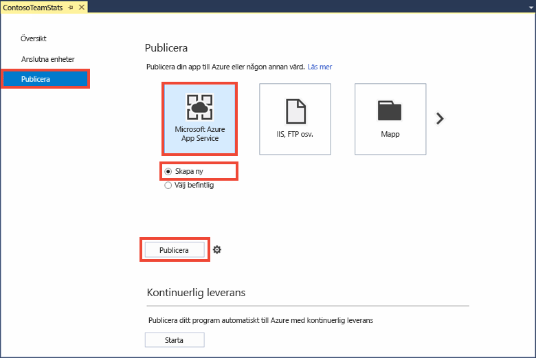
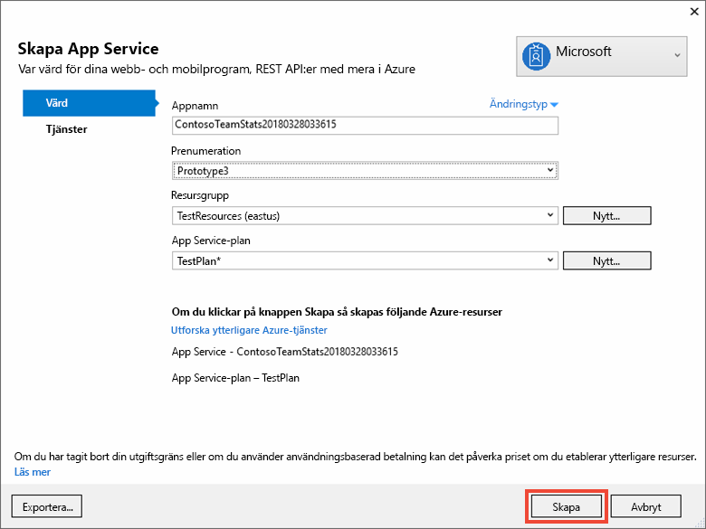
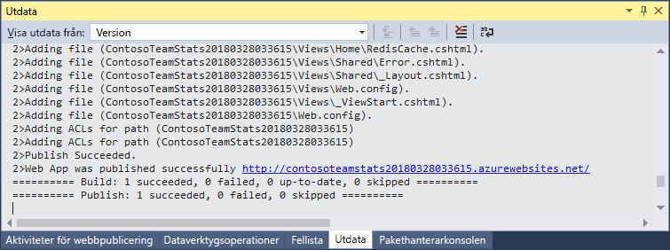
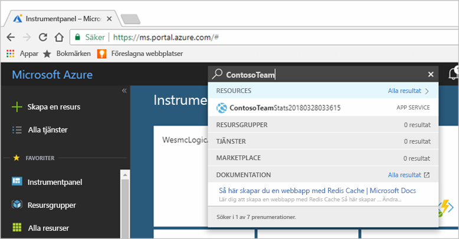
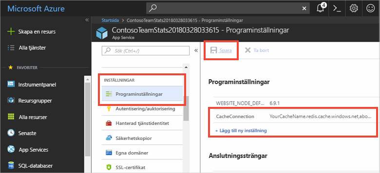

# <a name="quickstart-create-a-aspnet-web-app-with-redis-cache"></a>Snabbstart: Skapa en ASP.NET-webbapp med Redis Cache


## <a name="introduction"></a>Introduktion

I den här snabbstarten får du veta hur du skapar och distribuerar en ASP.NET-webbapp till Azure App Service med hjälp av Visual Studio 2017. Exempelappen ansluter till en Azure Redis Cache för att lagra och hämta data från cachen. När du slutför snabbstarten har du en fungerande webbapp, som finns i Azure, som läser och skriver till Azure Redis Cache.



[!INCLUDE [quickstarts-free-trial-note](../../includes/quickstarts-free-trial-note.md)]

## <a name="prerequisites"></a>Nödvändiga komponenter

För att kunna slutföra den här snabbstarten behöver du följande:

* Installera [Visual Studio 2017](https://www.visualstudio.com/downloads/) med följande arbetsbelastningar:
    * ASP.NET och webbutveckling
    * Azure Development

## <a name="create-the-visual-studio-project"></a>Skapa Visual Studio-projektet

Öppna Visual Studio och klicka på **Arkiv**, **Nytt**, **Projekt**.



Gör följande i dialogrutan Nytt projekt:

1. Expandera noden **Visual C#** i listan **Mallar**
1. Välj **Moln**
1. Klicka på **ASP.NET-webbapp**
1. Kontrollera att **.NET Framework 4.5.2** eller senare har valts
1. Namnge projektet i textrutan **Namn**, i det här exemplet använder vi **ContosoTeamStats**
1. Klicka på **OK**.

Fönstret ASP.NET-webbapp visas:


Välj **MVC** som projekttyp.

Kontrollera att **Ingen autentisering** är angivet i **autentiseringsinställningarna**. Beroende på din version av Visual Studio kan standard anges till något annat. För att ändra detta klickar du på **Ändra autentisering** och väljer **Ingen autentisering**.

Klicka på **OK** för att skapa projektet.

## <a name="create-a-cache"></a>Skapa en cache

Nu ska skapa du cachen för appen.

[!INCLUDE [redis-cache-create](../../includes/redis-cache-create.md)]

[!INCLUDE [redis-cache-access-keys](../../includes/redis-cache-access-keys.md)]

Skapa en fil på datorn med namnet *CacheSecrets.config* och placera den på en plats där den inte checkas in med källkoden för exempelappen. För den här snabbstarten finns filen *CacheSecrets.config* här: *C:\AppSecrets\CacheSecrets.config*.

Redigera filen *CacheSecrets.config* och lägg till följande innehåll:

```xml
<appSettings>
    <add key="CacheConnection" value="<cache-name>.redis.cache.windows.net,abortConnect=false,ssl=true,password=<access-key>"/>
</appSettings>
```

Ersätt `<cache-name>` med din cachens värdnamn.

Ersätt `<access-key>` med primärnyckeln för cachen.

> [!TIP]
> Den sekundära åtkomstnyckeln används under nyckelrotation som en alternativ nyckel medan du återskapar den primära åtkomstnyckeln.
>

Spara filen.

## <a name="update-the-mvc-application"></a>Uppdatera MVC-appen

I det här avsnittet uppdaterar du appen för att stödja en ny vy som visar ett enkelt test mot Azure Redis Cache.

* [Uppdatera web.config-filen med en appinställning för cachen](#Update-the-webconfig-file-with-an-app-setting-for-the-cache)
* [Konfigurera appen till att använda StackExchange.Redis-klienten](#configure-the-application-to-use-stackexchangeredis)
* [Uppdatera HomeController och layout](#update-the-homecontroller-and-layout)
* [Lägga till en ny RedisCache-vy](#add-a-new-rediscache-view)

### <a name="update-the-webconfig-file-with-an-app-setting-for-the-cache"></a>Uppdatera web.config-filen med en appinställning för cachen

När du kör appen lokalt används informationen i *CacheSecrets.config* för att ansluta till Azure Redis Cache-instansen. Du kommer senare att distribuera appen till Azure. Då konfigurerar du en appinställning i Azure som appen kommer att använda för att hämta cachens anslutningsinformation i stället för den här filen. Eftersom *CacheSecrets.config* inte har distribuerats till Azure med din app använder du den bara när du testar appen lokalt. Håll den här informationen så säker som möjligt för att förhindra obehörig åtkomst till cachelagrade data.

I **Solution Explorer** dubbelklickar du på *web.config* för att öppna den.



I *web.config*-filen letar du reda på elementet `<appSetting>` och lägger till följande `file`-attribut. Om du använder ett annat namn eller en annan plats, byter du ut dessa värden mot de som visas i exemplet.

* Innan: `<appSettings>`
* Efter: ` <appSettings file="C:\AppSecrets\CacheSecrets.config">`

ASP.NET-körningsmiljön sammanfogar innehållet i den externa filen med markeringen i `<appSettings>`-elementet. Körningen ignorerar filattributet om det inte går att hitta den angivna filen. Din hemliga information (anslutningssträngen till cachen) ingår inte i källkoden för programmet. När du distribuerar din webbapp till Azure så distribueras inte filen *CacheSecrests.config*.

### <a name="configure-the-application-to-use-stackexchangeredis"></a>Konfigurera programmet till att använda StackExchange.Redis

Konfigurera appen att använda NuGet-paketet i [StackExchange.Redis](https://github.com/StackExchange/StackExchange.Redis) för Visual Studio genom att klicka på **Verktyg > NuGet Package Manager > Package Manager-konsolen**.

Kör följande kommando från fönstret `Package Manager Console`:

```powershell
Install-Package StackExchange.Redis
```

NuGet-paketet hämtar och lägger till de nödvändiga sammansättningsreferenserna för klientprogrammet för att få åtkomst till Azure Redis Cache med cacheklienten StackExchange.Redis. Om du vill använda en starkt krypterad version av `StackExchange.Redis` klientbiblioteket ska du installera paketet `StackExchange.Redis.StrongName`.

### <a name="update-the-homecontroller-and-layout"></a>Uppdatera HomeController och layout

I **Solution Explorer** expanderar du mappen **Controllers** och öppnar filen *HomeController.cs*.

Lägg till följande två `using`-instruktioner överst i filen för att stödja cacheklienten och appinställningarna.

```csharp
using System.Configuration;
using StackExchange.Redis;
```

Lägg till följande metod i klassen `HomeController` för att stödja en ny `RedisCache`-åtgärd som exekverar vissa kommandon mot den nya cachen.

```csharp
    public ActionResult RedisCache()
    {
        ViewBag.Message = "A simple example with Azure Redis Cache on ASP.NET.";

        var lazyConnection = new Lazy<ConnectionMultiplexer>(() =>
        {
            string cacheConnection = ConfigurationManager.AppSettings["CacheConnection"].ToString();
            return ConnectionMultiplexer.Connect(cacheConnection);
        });

        // Connection refers to a property that returns a ConnectionMultiplexer
        // as shown in the previous example.
        IDatabase cache = lazyConnection.Value.GetDatabase();

        // Perform cache operations using the cache object...

        // Simple PING command
        ViewBag.command1 = "PING";
        ViewBag.command1Result = cache.Execute(ViewBag.command1).ToString();

        // Simple get and put of integral data types into the cache
        ViewBag.command2 = "GET Message";
        ViewBag.command2Result = cache.StringGet("Message").ToString();

        ViewBag.command3 = "SET Message \"Hello! The cache is working from ASP.NET!\"";
        ViewBag.command3Result = cache.StringSet("Message", "Hello! The cache is working from ASP.NET!").ToString();

        // Demostrate "SET Message" executed as expected...
        ViewBag.command4 = "GET Message";
        ViewBag.command4Result = cache.StringGet("Message").ToString();

        // Get the client list, useful to see if connection list is growing...
        ViewBag.command5 = "CLIENT LIST";
        ViewBag.command5Result = cache.Execute("CLIENT", "LIST").ToString().Replace(" id=", "\rid=");

        lazyConnection.Value.Dispose();

        return View();
    }
```

I **Solution Explorer** expanderar du mappen **Vyer**>**Delade** och öppna filen *_Layout.cshtml*.

Ersätt:

```csharp
@Html.ActionLink("Application name", "Index", "Home", new { area = "" }, new { @class = "navbar-brand" })
```

Med:

```csharp
@Html.ActionLink("Azure Redis Cache Test", "RedisCache", "Home", new { area = "" }, new { @class = "navbar-brand" })
```

### <a name="add-a-new-rediscache-view"></a>Lägga till en ny RedisCache-vy

I **Solution Explorer** expanderar du mappen **Vyer** och högerklickar sedan på mappen **Start**. Välj **Lägg till** > **Vy...** .

Ange **RedisCache** i dialogrutan Lägg till vy som Vynamn och klicka på **Lägg till**.

Ersätt koden i filen *RedisCache.cshtml* med följande kod:

```csharp
@{
    ViewBag.Title = "Azure Redis Cache Test";
}

<h2>@ViewBag.Title.</h2>
<h3>@ViewBag.Message</h3>
<br /><br />
<table border="1" cellpadding="10">
    <tr>
        <th>Command</th>
        <th>Result</th>
    </tr>
    <tr>
        <td>@ViewBag.command1</td>
        <td><pre>@ViewBag.command1Result</pre></td>
    </tr>
    <tr>
        <td>@ViewBag.command2</td>
        <td><pre>@ViewBag.command2Result</pre></td>
    </tr>
    <tr>
        <td>@ViewBag.command3</td>
        <td><pre>@ViewBag.command3Result</pre></td>
    </tr>
    <tr>
        <td>@ViewBag.command4</td>
        <td><pre>@ViewBag.command4Result</pre></td>
    </tr>
    <tr>
        <td>@ViewBag.command5</td>
        <td><pre>@ViewBag.command5Result</pre></td>
    </tr>
</table>
```

## <a name="run-the-app-locally"></a>Köra appen lokalt

Som standard konfigureras projektet som värd för appen lokalt i [IIS Express](https://docs.microsoft.com/iis/extensions/introduction-to-iis-express/iis-express-overview) för testning och felsökning.

I Visual Studio på menyn klickar du på **Felsök** > **Börja felsöka** för att skapa och starta appen lokalt för testning och felsökning.

I webbläsaren klickar du på **Azure Redis Cache Test** i navigeringsfältet.

I exemplet nedan ser du att `Message`-nyckeln tidigare hade ett cachelagrat värde som angavs med Redis-konsolen i portalen. Appen uppdatera det cachelagrade värdet. Appen körde även kommandona `PING` och `CLIENT LIST`.



## <a name="publish-and-run-in-azure"></a>Publicera och köra i Azure

När du har testat appen lokalt distribuerar du appen till Azure och kör den i molnet.

### <a name="publish-the-app-to-azure"></a>Publicera appen i Azure

Högerklicka på projektnoden i Solution Explorer i Visual Studio och välj **Publicera**.



Klicka på **Microsoft Azure App Service**, välj **Skapa nytt** och klicka på **Publicera**.



Gör följande ändringar i dialogrutan **Skapa App Service**:

| Inställning | Rekommenderat värde | Beskrivning |
| ------- | :---------------: | ----------- |
| **Appnamn** | Använd standard | Appnamnet blir värdnamnet för appen när det distribueras till Azure. Namnet kan ha ett tidsstämpelsuffix som lagts till om det behövs för att göra det unikt. |
| **Prenumeration** | Välj en Azure-prenumeration | Den här prenumerationen debiteras för eventuella relaterade värdkostnader. Om du har flera Azure-prenumerationer kontrollerar du att den önskade prenumerationen har valts.|
| **Resursgrupp** | Använd samma resursgrupp där du har skapat cachen. Till exempel *TestResourceGroup*. | Resursgruppen hjälper dig att hantera alla resurser som en grupp. Senare när du vill ta bort appen kan du ta bort gruppen. |
| **App Service-plan** | Klicka på **Nytt** och skapa en ny App Service-Plan med namnet *TestingPlan*. <br />Använd samma **plats** du använde när du skapade cachen. <br />Välj **Ledigt** som storlek. | En App Service-plan definierar en uppsättning beräkningsresurser för en webbapp att köra med. |



När du har App Service-värdinställningarna klickar du på **Skapa** för att skapa en ny apptjänst för appen.

Övervaka fönstret **Utdata** i Visual Studio för att se statusen för att publicera i Azure. När publiceringen har slutförts loggas URL:en för App Service enligt nedan:



### <a name="add-the-app-setting-for-the-cache"></a>Lägga till appinställningen för cachen

Lägg till en ny appinställning när publiceringen är klar för den nya apptjänsten. Den här inställningen används för att lagra anslutningsinformationen för cachen. Skriv appnamnet i sökfältet längst upp i Azure Portal för att söka efter den nya apptjänsten som du precis har skapat.



Lägg till en ny appinställning med namnet **CacheConnection** som appen ska använda för att ansluta till cachen. Använd samma värde som du har konfigurerat för `CacheConnection` i filen *CacheSecrets.config*. Värdet innehåller cachens värdnamn och åtkomstnyckel.



### <a name="run-the-app-in-azure"></a>Köra appen i Azure

Bläddra till URL:en för App Service i webbläsaren. URL:en visas i resultatet av publiceringsåtgärden i fönstret Utdata i Visual Studio. Den finns också i Azure Portalen på översiktssidan för apptjänsten du har skapat.

Klicka på **Azure Redis Cache-test** i navigeringsfältet att testa cacheåtkomsten.


## <a name="clean-up-resources"></a>Rensa resurser

Om du ska fortsätta till nästa självstudie kan du behålla resurserna som du har skapat i den här självstudien och använda dem igen.

Om du är klar med exempelappen för snabbstart kan du ta bort Azure-resurserna som du skapade i snabbstarten för att undvika kostnader. 

> [!IMPORTANT]
> Det går inte att ångra borttagningen av en resursgrupp och resursgruppen och alla resurser i den tas bort permanent. Kontrollera att du inte av misstag tar bort fel resursgrupp eller resurser. Om du har skapat resurserna som värd för det här exemplet i en befintlig resursgrupp som innehåller resurser som du vill behålla, kan du ta bort varje resurs separat från deras respektive blad istället för att ta bort resursgruppen.
>

Logga in på [Azure Portal](https://portal.azure.com) och klicka på **Resursgrupper**.

Skriv namnet på din resursgrupp i textrutan **Filtrera efter namn...**. Anvisningarna för den här artikeln använde en resursgrupp med namnet *TestResources*. På din resursgrupp i resultatlistan klickar du på **...** och därefter **Ta bort resursgrupp**.


Du blir ombedd att bekräfta borttagningen av resursgruppen. Skriv namnet på din resursgrupp för att bekräfta och klicka på **Ta bort**.

Efter en liten stund tas resursgruppen och resurser som finns i den bort.

## <a name="next-steps"></a>Nästa steg

I nästa kurs får du använda Azure Redis Cache i ett mer verkligt scenario för att förbättra prestandan för en app. Du uppdaterar appen på cachens resultattavla med hjälp av cache-aside-mönstret med ASP.NET och en databas.

> [!div class="nextstepaction"]
> [Skapa en cache-aside-esultattavla för ASP.NET](cache-web-app-cache-aside-leaderboard.md)
