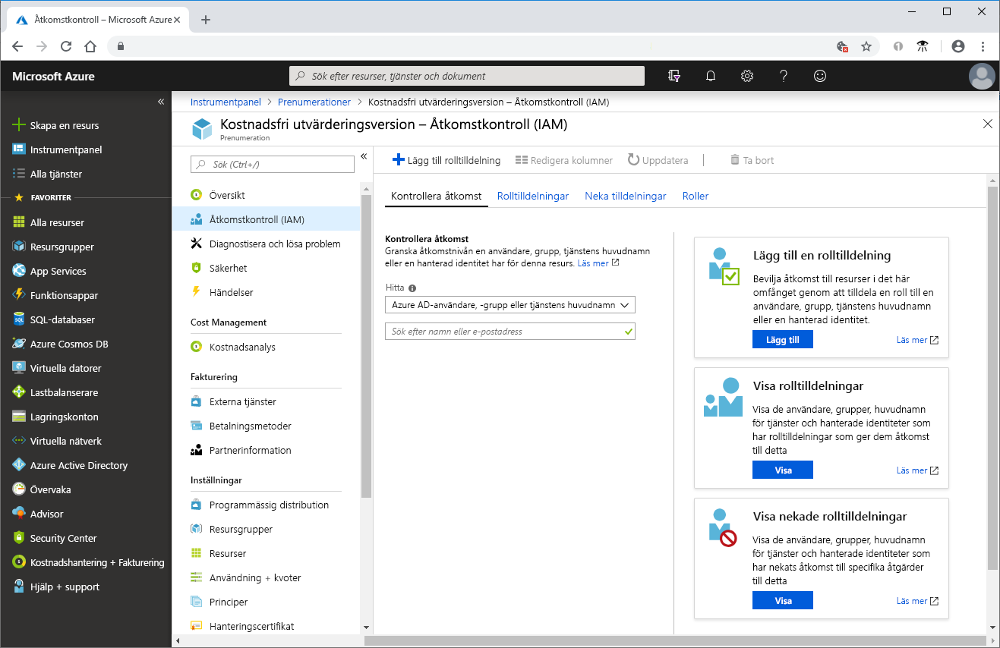
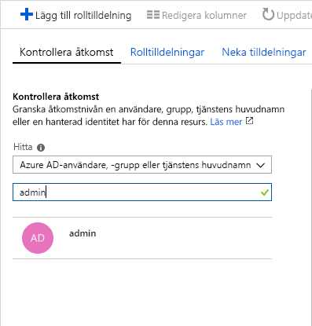
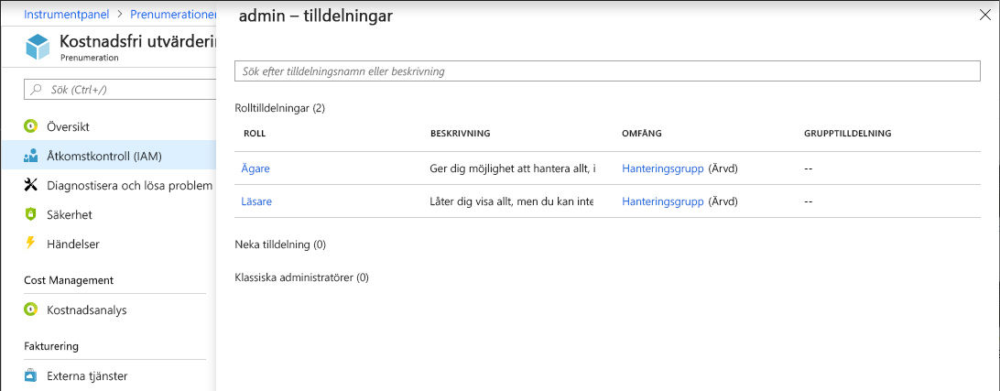

# Snabbstart: Visa den åtkomst som en användare har till Azure-resurser

Du kan använda bladet **Åtkomstkontroll (IAM)** i [rollbaserad åtkomstkontroll (RBAC)](overview.md) för att visa den åtkomst som en användare eller ett annat säkerhetsobjekt har till Azure-resurser. Ibland behöver du dock bara snabbt visa åtkomsten för en enskild användare eller ett annat säkerhetsobjekt. Det enklaste sättet att göra det är att använda funktionen **Kontrollera åtkomst** på Azure-portalen.

## Visa rolltilldelningar

 Du visar åtkomsten för en användare genom att lista användarens rolltilldelningar. Följ dessa steg om du vill visa rolltilldelningar för en enskild användare, grupp, tjänstens huvudnamn eller hanterad identitet i prenumerationsomfånget.

1. I Azure-portalen klickar du på **Alla tjänster** och sedan **Prenumerationer**.

1. Klicka på din prenumeration.

1. Klicka på **Åtkomstkontroll (IAM)**.

1. Klicka på fliken **Kontrollera åtkomst**.

    

1. I listan **Hitta** väljer du den typ av säkerhetsprincip som du vill kontrollera åtkomst för.

1. I sökrutan anger du en sträng för att söka i katalogen efter visningsnamn, e-postadresser eller objektidentifierare.

    

1. Klicka på säkerhetsprincipen för att öppna fönsterrutan **tilldelningar**.

    

    I den här fönsterrutan kan du se de roller som tilldelats till den valda säkerhetsprincipen och omfånget. Om det finns några nekande tilldelningar i det här omfånget eller som ärvts till det här omfånget visas de.

## Nästa steg

> [!div class="nextstepaction"]
> [Självstudier: Bevilja åtkomst för en användare till Azure-resurser med hjälp av RBAC och Azure-portalen](quickstart-assign-role-user-portal.md)
