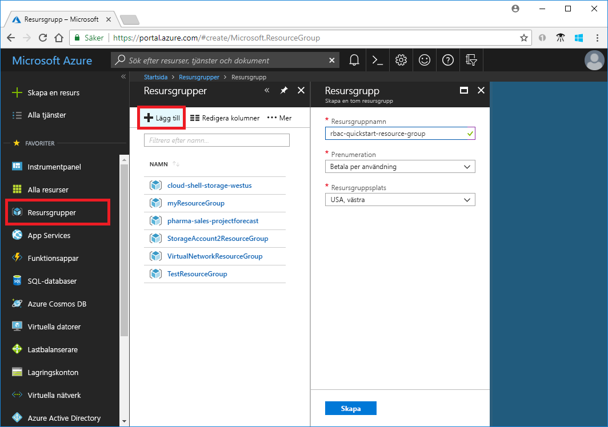
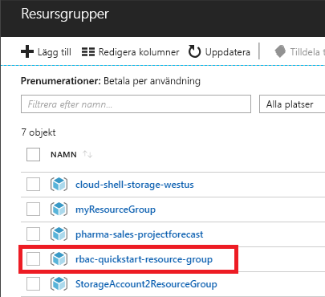
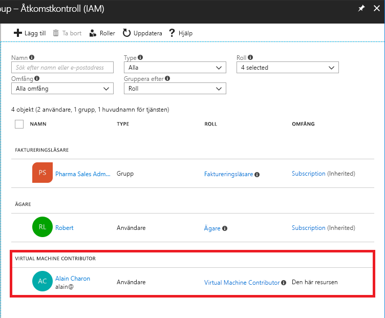
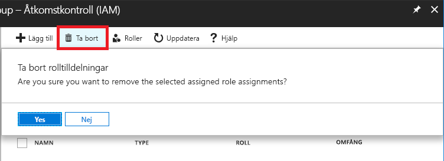
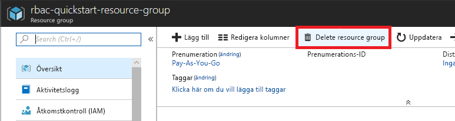

# Självstudier: Bevilja åtkomst för en användare till Azure-resurser med hjälp av RBAC och Azure-portalen

[Rollbaserad åtkomstkontroll (RBAC)](overview.md) är metoden som du använder när du hanterar åtkomst till Azure-resurser. I den här självstudien ger du en användare behörighet att skapa och hantera virtuella datorer i en resursgrupp.

I den här guiden får du lära dig att:

> [!div class="checklist"]
> * Bevilja åtkomst för en användare i ett resursgruppomfång
> * Tar bort åtkomst

Om du inte har en Azure-prenumeration kan du skapa ett [kostnadsfritt konto](https://azure.microsoft.com/free/?WT.mc_id=A261C142F) innan du börjar.

## Logga in på Azure

Logga in på Azure Portal på http://portal.azure.com.

## Skapa en resursgrupp

1. I navigeringslistan klickar du på **Resursgrupper**.

1. Klicka på **Lägg till** för att öppna bladet **Resursgrupp**.

   

1. För **Resursgruppsnamn** anger du **rbac-resource-group**.

1. Välj en prenumeration och en plats.

1. Klicka på **Skapa** för att skapa resursgruppen.

1. Klicka på **Uppdatera** för att uppdatera listan över resursgrupper.

   Den nya resursgruppen visas i listan med resursgrupper.

   

## Bevilja åtkomst

För att skapa åtkomst i RBAC skapar du rolltilldelningar.

1. I listan över **Resursgrupper** klicka du på den nya resursgruppen **rbac-resource-group**.

1. Klicka på **Åtkomstkontroll (IAM)**.

1. Klicka på fliken **Rolltilldelningar** för att visa den aktuella listan med rolltilldelningar.

   

1. Klicka på **Lägg till** > **Lägg till rolltilldelning** för att öppna fönsterrutan Lägg till rolltilldelning.

   Om du inte har behörighet att tilldela roller är alternativet Lägg till rolltilldelning inaktiverat.

   

   

1. I listrutan **Roll** väljer du **Virtuell datordeltagare**.

1. I listan **Välj** väljer du själv eller någon annan användare.

1. Klicka på **Spara** för att skapa rolltilldelningen.

   Efter en liten stund tilldelas användaren rollen Virtuell datordeltagare för resursgruppsomfånget rbac-resource-group.

   

## Tar bort åtkomst

I RBAC kan du ta bort en rolltilldelning för att ta bort åtkomst.

1. I listan över rolltilldelningar lägger du till en bockmarkering intill användaren med rollen Virtuell datordeltagare.

1. Klicka på **Ta bort**.

   

1. I meddelandet om att ta bort rolltilldelningen klickar du på **Ja**.

## Rensa

1. I navigeringslistan klickar du på **Resursgrupper**.

1. Klicka på **rbac-resource-group** för att öppna resursgruppen.

1. Klicka på **Ta bort resursgrupp** för att ta bort resursgruppen.

   

1. På bladet **Är du säker på att du vill ta bort** skriver du resursgruppsnamnet: **rbac-resource-group**.

1. Klicka på **Ta bort** för att ta bort resursgruppen.

## Nästa steg

> [!div class="nextstepaction"]
> [Självstudier: Ge en användare åtkomst till Azure-resurser med RBAC och Azure PowerShell](tutorial-role-assignments-user-powershell.md)

