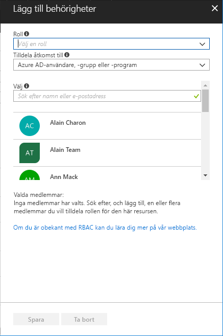

# Snabbstart: Bevilja åtkomst för en användare med RBAC och Azure-portalen

Rollbaserad åtkomstkontroll (RBAC) är sättet som du hanterar åtkomst till resurser i Azure. I den här snabbstarten ger du en användare behörighet att skapa och hantera virtuella datorer i en resursgrupp.

Om du inte har en Azure-prenumeration kan du skapa ett [kostnadsfritt konto](https://azure.microsoft.com/free/?WT.mc_id=A261C142F) innan du börjar.

## Logga in på Azure

Logga in på Azure Portal på http://portal.azure.com.

## Skapa en resursgrupp

1. Visa **resursgrupper** i navigationslistan.

1. Välj **Lägg till** för att öppna bladet **Resursgrupp**.

   

1. För **Resursgruppsnamn** anger du **rbac-quickstart-resource-group**.

1. Välj en prenumeration och en plats.

1. Välj **Skapa** för att skapa resursgruppen.

1. Välj **Uppdatera** för att uppdatera listan över resursgrupper.

   Den nya resursgruppen visas i listan med resursgrupper.

   

## Bevilja åtkomst

För att skapa åtkomst i RBAC skapar du rolltilldelningar.

1. I listan över **Resursgrupper** väljer du den nya resursgruppen **rbac-quickstart-resource-group**.

1. Välj **Åtkomstkontroll (IAM)** för att visa den aktuella listan med rolltilldelningar.

   

1. Välj **Lägg till** för att öppna fönstret **Lägg till behörigheter**.

   Om du inte har behörighet att tilldela roller kan du inte se alternativet **Lägg till**.

   

1. I listrutan **Roll** väljer du **Virtuell datordeltagare**.

1. I listan **Välj** väljer du själv eller någon annan användare.

1. Välj **spara** för att skapa rolltilldelningen.

   Efter en liten stund tilldelas användaren rollen Virtuell datordeltagare för resursgruppsomfånget rbac-quickstart-resource-group.

   

## Tar bort åtkomst

I RBAC kan du ta bort en rolltilldelning för att ta bort åtkomst.

1. I listan över rolltilldelningar lägger du till en bockmarkering intill användaren med rollen Virtuell datordeltagare.

1. Välj **Ta bort**.

   

1. När du ser meddelandet om att ta bort rolltilldelningen väljer du **Ja**.

## Rensa

1. Visa **resursgrupper** i navigationslistan.

1. Välj **rbac-quickstart-resource-group** för att öppna resursgruppen.

1. Välj **Ta bort resursgrupp** för att ta bort resursgruppen.

   

1. På bladet **Är du säker på att du vill ta bort** skriver du resursgruppsnamnet: **rbac-quickstart-resource-group**.

1. Välj **Ta bort** för att ta bort resursgruppen.

## Nästa steg

> [!div class="nextstepaction"]
> [Självstudiekurs: Bevilja åtkomst för en användare med RBAC och PowerShell](tutorial-role-assignments-user-powershell.md)

