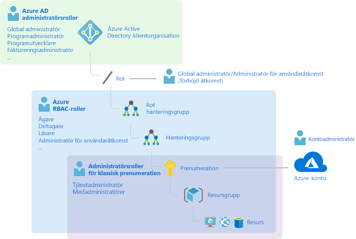
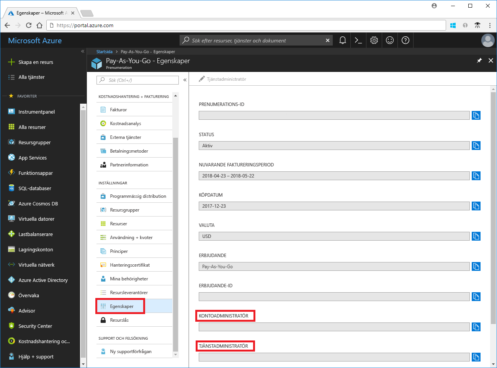
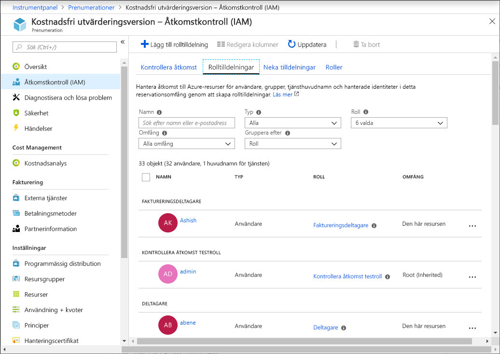
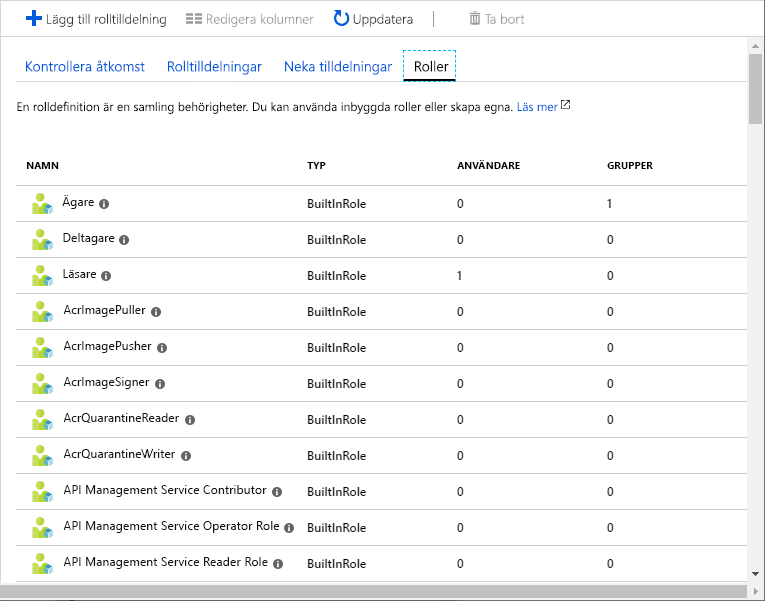
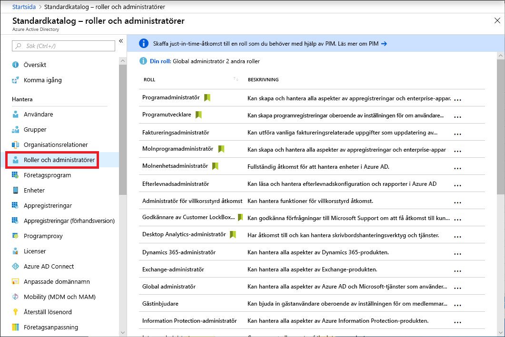
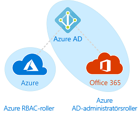

# Administratörsroller för klassiska prenumerationer, Azure RBAC-roller och administratörsroller för Azure AD

Om du är nybörjare på Azure kan det vara lite svårt att förstå de olika rollerna i Azure. Den här artikeln förklarar följande roller och när du ska använda dem:
- Administratörsroller för klassiska prenumerationer
- Roller för rollbaserad åtkomstkontroll i Azure (RBAC)
- Administratörsroller för Azure Active Directory (AD Azure)

## Så är rollerna relaterade

För att bättre förstå rollerna i Azure är det bra att känna till lite av historien. När Azure ursprungligen lanserades hanterades åtkomst till resurser med bara tre administratörsroller: Kontoadministratör, Tjänstadministratör och Medadministratör. Senare lades rollbaserad åtkomstkontroll (RBAC) för Azure-resurser till. Azure RBAC är ett nyare auktoriseringssystem som ger detaljerad åtkomsthantering för Azure-resurser. RBAC innefattar många inbyggda roller, kan tilldelas på olika omfång och gör att du kan skapa egna anpassade roller. För att hantera resurser i Azure AD, som användare, grupper och domäner, finns det flera Azure AD-administratörsroller.

Följande diagram är en övergripande bild av hur administratörsrollerna för klassiska prenumerationer, Azure RBAC-roller samt Azure AD-administratörsrollerna är relaterade.

## Administratörsroller för klassiska prenumerationer

Kontoadministratör, tjänstadministratör och medadministratör är de tre administratörsrollerna för klassiska prenumerationer i Azure. Administratörer för klassiska prenumerationer har fullständig åtkomst till Azure-prenumerationen. De kan hantera resurser med hjälp av Azure-portalen, Azure Resource Manager-API:er och den klassiska distributionsmodellens API:er. Det konto som används för att registrera sig för Azure anges automatiskt som både kontoadministratör och tjänstadministratör. Sedan kan ytterligare medadministratörer läggas till. Tjänstadministratören och medadministratörer har likvärdig åtkomst som användare som har tilldelats rollen Ägare (en Azure RBAC-roll) i prenumerationsomfånget. I följande tabell beskrivs skillnaderna mellan dessa tre administrativa roller för klassiska prenumerationer.

| Klassisk prenumerationsadministratör | Gräns | Behörigheter | Anteckningar |
| --- | --- | --- | --- |
| Kontoadministratör | 1 per Azure-konto | <ul><li>Gå till [Azure-kontocentret](https://account.azure.com/Subscriptions)</li><li>Hantera alla prenumerationer i ett konto</li><li>Skapa nya prenumerationer</li><li>Avbryt prenumerationer</li><li>Ändra faktureringen för en prenumeration</li><li>Ändra tjänstadministratör</li></ul> | Begreppsmässigt är detta faktureringsägaren för prenumerationen. Kontoadministratören har ingen åtkomst till Azure-portalen. |
| Tjänstadministratör | 1 per Azure-prenumeration | <ul><li>Hantera tjänster i [Azure-portalen](https://portal.azure.com)</li><li>Tilldela användare till rollen Medadministratör</li></ul> | Som standard för en ny prenumeration är kontoadministratören också tjänstadministratören. Tjänstadministratören har likvärdig åtkomst som en användare som har tilldelats rollen Ägare i prenumerationsomfånget. Tjänstadministratören har fullständig åtkomst till Azure-portalen. |
| Medadministratör | 200 per prenumeration | <ul><li>Samma åtkomstbehörigheter som tjänstadministratören, men kan inte ändra associationen mellan prenumerationer och Azure-kataloger</li><li>Tilldela användare till rollen Medadministratör, men kan inte ändra tjänstadministratör</li></ul> | Medadministratören har likvärdig åtkomst som en användare som har tilldelats rollen Ägare i prenumerationsomfånget. |

I Azure-portalen kan du se vem som har tilldelats till kontoadministratören och tjänstadministratören genom att visa egenskaperna för din prenumeration.

Information om hur du lägger till eller ändrar administratörer för klassisk prenumeration finns i [Lägg till eller ändra Azure-prenumerationsadministratörer](../billing/billing-add-change-azure-subscription-administrator.md) i dokumentationen för Azure-fakturering.

### Azure-konto och Azure-prenumerationer

Ett Azure-konto representerar en faktureringsrelation. Ett Azure-konto är en användaridentitet, en eller flera Azure-prenumerationer och en associerad uppsättning Azure-resurser. Den person som skapar kontot är kontoadministratör för alla prenumerationer som skapas i det kontot. Den personen är även standardtjänstadministratör för prenumerationen.

Azure-prenumerationer hjälper dig att organisera åtkomst till Azure-resurser. samt styra hur resursanvändningen rapporteras, faktureras och betalas. Olika prenumerationer kan ha olika fakturerings- och betalningskonfiguration, vilket betyder att du kan ha olika faktureringsplaner beroende på kontor, avdelning, projekt och så vidare. Varje tjänst tillhör en prenumeration, och prenumerations-ID kan krävas för programmässiga åtgärder.

Konton och prenumerationer hanteras i [Azure-kontocentret](https://account.azure.com/Subscriptions).

## Azure RBAC-roller

Azure RBAC är ett auktoriseringssystem som bygger på [Azure Resource Manager](../azure-resource-manager/resource-group-overview.md) som ger detaljerad åtkomsthantering till Azure-resurser såsom beräkning och lagring. Azure RBAC har över 70 inbyggda roller. Det finns fyra grundläggande RBAC-roller. De första tre gäller för alla resurstyper:

| Azure RBAC-roll | Behörigheter | Anteckningar |
| --- | --- | --- |
| [Ägare](built-in-roles.md#owner) | <ul><li>Fullständig åtkomst till alla resurser</li><li>Delegera åtkomst till andra</li></ul> | Tjänstadministratören och medadministratörer tilldelas rollen Ägare i prenumerationsomfånget Gäller för alla resurstyper. |
| [Deltagare](built-in-roles.md#contributor) | <ul><li>Skapa och hantera alla typer av Azure-resurser</li><li>Kan inte bevilja åtkomst till andra</li></ul> | Gäller för alla resurstyper. |
| [Läsare](built-in-roles.md#reader) | <ul><li>Visa Azure-resurser</li></ul> | Gäller för alla resurstyper. |
| [Administratör för användaråtkomst](built-in-roles.md#user-access-administrator) | <ul><li>Hantera användaråtkomst till Azure-resurser</li></ul> |  |

Resten av de inbyggda rollerna tillåter hantering av specifika Azure-resurser. Till exempel tillåter rollen [Virtuell datordeltagare](built-in-roles.md#virtual-machine-contributor) att en användare skapar och hanterar virtuella datorer. En lista med alla inbyggda roller finns i [Inbyggda roller för Azure-resurser](built-in-roles.md).

Endast Azure-portalen och Azure Resource Manager-API:er stöder RBAC. Användare, grupper och program som tilldelas RBAC-roller kan inte använda [API:er för Azures klassiska distributionsmodell](../azure-resource-manager/resource-manager-deployment-model.md).

I Azure-portalen visas rolltilldelningar som använder RBAC på bladet **Åtkomstkontroll (IAM)**. Det här bladet finns på flera ställen i portalen, till exempel i hanteringsgrupper, prenumerationer, resursgrupper och olika resurser.

När du klickar på alternativet **Roller** visas listan över inbyggda och anpassade roller.

## Azure AD-administratörsroller

Azure AD-administratörsroller används för att hantera Azure AD-resurser i en katalog som skapa eller redigera användare, tilldela administrativa roller till andra, återställa användarlösenord, hantera användarlicenser och hantera domäner. I följande tabell beskrivs några av de viktigaste Azure AD-administratörsrollerna.

| Azure AD-administratörsroll | Behörigheter | Anteckningar |
| --- | --- | --- |
| [Global administratör](../active-directory/users-groups-roles/directory-assign-admin-roles.md#company-administrator) | <ul><li>Hantera åtkomst till alla administrativa funktioner i Azure Active Directory samt tjänster som federerar till Azure Active Directory</li><li>Tilldela administratörsroller till andra</li><li>Återställa lösenordet för valfri användare och alla andra administratörer</li></ul> | Den person som registrerar sig för Azure Active Directory-klientorganisationen blir en global administratör. |
| [Användaradministratör](../active-directory/users-groups-roles/directory-assign-admin-roles.md#user-account-administrator) | <ul><li>Skapa och hantera alla aspekter av användare och grupper</li><li>Hantera supportbegäranden</li><li>Övervaka tjänstens hälsa</li><li>Ändra lösenord för användare, supportadministratörer och andra användaradministratörer</li></ul> |  |
| [Faktureringsadministratör](../active-directory/users-groups-roles/directory-assign-admin-roles.md#billing-administrator) | <ul><li>Genomför inköp</li><li>Hantera prenumerationer</li><li>Hantera supportbegäranden</li><li>Övervakar tjänstens hälsa</li></ul> |  |

En lista med alla Azure AD-administratörsroller finns i artikeln om [behörigheter för administratörsrollen i Azure Active Directory](../active-directory/users-groups-roles/directory-assign-admin-roles.md).

I Azure-portalen kan du se listan över Azure AD-administratörsroller på bladet **Roller och administratörer**.

## Skillnader mellan Azure RBAC-roller och Azure AD-administratörsroller

På en övergripande nivå kontrollerar Azure RBAC-roller behörigheter för att hantera Azure-resurser, medan Azure AD-administratörsroller kontrollerar behörigheter för att hantera Azure Active Directory-resurser. I följande tabell jämförs några av skillnaderna.

| Azure RBAC-roller | Azure AD-administratörsroller |
| --- | --- |
| Hantera åtkomst till Azure-resurser | Hantera åtkomst till Azure Active Directory-resurser |
| Stöder anpassade roller | Kan inte skapa egna roller |
| Omfånget kan anges på flera nivåer (hanteringsgrupp, prenumeration, resursgrupp och resurs) | Omfånget är på klientorganisationsnivån |
| Rollinformation kan nås i Azure-portalen, Azure CLI, Azure PowerShell, Azure Resource Manager-mallar samt REST API | Rollinformation kan nås i Azure-portalen, Office 365-administrationsportalen, Microsoft Graph samt AzureAD PowerShell |

### Överlappar Azure RBAC-rollerna och Azure AD-administratörsrollerna?

Som standard sträcker sig inte Azure RBAC-roller och Azure AD-administratörsroller över Azure och Azure AD. Men om en global administratör ökar sin åtkomst genom att välja växeln **Global administratör kan hantera Azure-prenumerationer och hanteringsgrupper** i Azure-portalen beviljas den globala administratören rollen [Administratör för användaråtkomst](built-in-roles.md#user-access-administrator) (en RBAC-roll) i alla prenumerationer för en viss klientorganisation. Med rollen Administratör för användaråtkomst kan användaren bevilja åtkomst till Azure-resurser för andra användare. Den här växeln kan vara användbar för att få åtkomst till en prenumeration. Mer information finns i [Öka behörighet som Azure AD-administratör](elevate-access-global-admin.md).

Flera Azure AD-administratörsroller sträcker sig över Azure AD och Microsoft Office 365, till exempel rollerna Global administratör och Användaradministratör. Om du till exempel är medlem i rollen Global administratör har du funktioner för global administratör i Azure AD och Office 365, till exempel att göra ändringar i Microsoft Exchange och Microsoft SharePoint. Som standard har den globala administratören dock inte åtkomst till Azure-resurser.

## Nästa steg

- [Vad är rollbaserad åtkomstkontroll (RBAC) för Azure-resurser?](overview.md)
- [Behörigheter för administratörsrollen i Azure Active Directory](../active-directory/users-groups-roles/directory-assign-admin-roles.md)
- [Lägg till eller ändra Azure-prenumerationsadministratörer](../billing/billing-add-change-azure-subscription-administrator.md)
