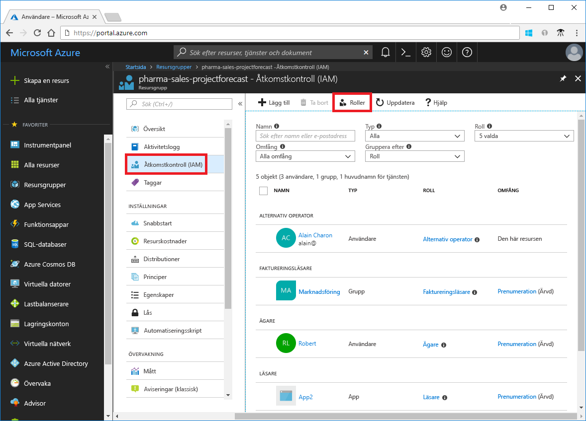
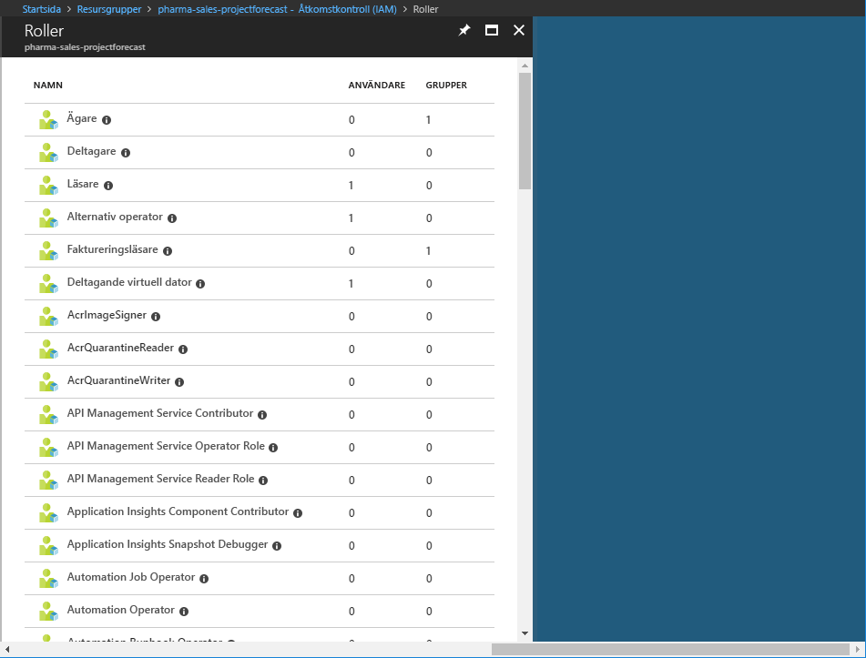

# Förstå de olika rollerna i Azure

Om du är nybörjare på Azure, kan det vara svårt att förstå de olika rollerna i Azure. Den här artikeln hjälper dig att förklara följande roller och när du ska använda varje:
- Administratörsroller för klassiska prenumerationer
- Roller för rollbaserad åtkomst i Azure-åtkomstkontroll (RBAC)
- Azure Active Directory (Azure AD)-administratörsroller

## Hur rollerna som är relaterade

För att bättre förstå roller i Azure, hjälper det att du vet att några av historiken. När Azure gavs ursprungligen, åtkomst till resurser har hanterats med bara tre administratörsroller: kontoadministratör, tjänstadministratör och delad administratör. Senare, rollbaserad åtkomstkontroll (RBAC för Azure-resurser) har lagts till. RBAC i Azure är ett nyare auktoriseringssystem som bygger på [Azure Resource Manager](../azure-resource-manager/resource-group-overview.md) som ger detaljerad åtkomsthantering för Azure-resurser. RBAC innehåller många inbyggda roller, kan tilldelas på olika omfång och kan du skapa dina egna anpassade roller. För att hantera resurser i Azure AD, som användare, grupper och domäner, finns det flera Azure AD-administratörsroller.

Följande diagram är en övergripande bild av hur de klassiska prenumeration administratörsroller, Azure RBAC-roller och Azure AD-administratörsroller är relaterade.

## Klassiska prenumerationsadministratörer

Kontoadministratör, tjänstadministratör och delad administratör finns de tre klassiska prenumeration administratörsroller i Azure. Klassiska prenumerationens administratörer har fullständig åtkomst till Azure-prenumerationen. De kan hantera resurser med hjälp av Azure-portalen, Azure Resource Manager API: er och den klassiska distributionsmodellen API: er. Det konto som används för att registrera dig för Azure anges automatiskt som både kontoadministratören och tjänstadministratören. Sedan kan ytterligare Medadministratörer läggas till. Tjänstadministratören och delade administratörer har motsvarande åtkomst till användare som har tilldelats rollen ägare (en Azure RBAC-roll) prenumerationsområde. I följande tabell beskrivs skillnaderna mellan dessa tre administrativa roller för klassiska prenumerationer.

| Klassisk prenumerationsadministratör | Gräns | Behörigheter | Anteckningar |
| --- | --- | --- | --- |
| Kontoadministratör | 1 per Azure-konto | <ul><li>Åtkomst till den [Azures Kontocenter](https://account.azure.com/Subscriptions)</li><li>Hantera alla prenumerationer i ett konto</li><li>Skapa nya prenumerationer</li><li>Avbryt prenumerationer</li><li>Ändra faktureringen för en prenumeration</li><li>Ändra tjänstadministratör</li></ul> | Den övergripande fakturering ägaren av prenumerationen.|
| Tjänstadministratör | 1 per Azure-prenumeration | <ul><li>Hantera tjänster i den [Azure-portalen](https://portal.azure.com)</li><li>Tilldela användare till rollen Medadministratör</li></ul> | Som standard för en ny prenumeration är kontoadministratören också tjänstadministratör. Tjänstadministratören har motsvarande åtkomst för en användare som har tilldelats rollen ägare prenumerationsområde. |
| Medadministratör | 200 per prenumeration | <ul><li>Samma behörighet som tjänstadministratören, men kan inte ändra associationen mellan prenumerationer och Azure-kataloger</li><li>Tilldela användare till rollen delad administratör, men det går inte att ändra tjänstadministratör</li></ul> | Delad administratör har motsvarande åtkomst för en användare som har tilldelats rollen ägare prenumerationsområde. |

Du kan se vem som har tilldelats kontoadministratören och tjänstadministratören genom att visa egenskaperna för din prenumeration i Azure-portalen.

Information om hur du lägger till eller ändrar prenumerationsadministratörer finns i [Lägg till eller ändra Azure-prenumerationsadministratörer](../billing/billing-add-change-azure-subscription-administrator.md) i dokumentationen för Azure-fakturering.

### Azure-konto och Azure-prenumerationer

Ett Azure-konto representerar en faktureringsrelation. Ett Azure-konto är en användaridentitet, en eller flera Azure-prenumerationer och en associerad uppsättning Azure-resurser. Den person som skapade kontot är kontoadministratör för alla prenumerationer som skapats i det kontot. Den personen är standardalternativet tjänstadministratör för prenumerationen.

Azure-prenumerationer kan du styra åtkomsten till Azure-resurser. samt styra hur resursanvändningen rapporteras, faktureras och betalas. Varje prenumeration kan ha en annan konfiguration för fakturering och betalning så att du kan ha olika faktureringsplaner beroende på office, avdelning, projekt och så vidare. Varje tjänst tillhör en prenumeration och prenumerations-ID kan krävas för programmässig åtgärder.

Konton och prenumerationer som hanteras i den [Azure Kontocenter](https://account.azure.com/Subscriptions).
## Azure RBAC-roller

RBAC i Azure är ett system som ger detaljerad åtkomsthantering för Azure-resurser, till exempel beräkning och lagring. RBAC i Azure innehåller över 60 inbyggda roller. Det finns fyra grundläggande RBAC-roller. De första tre gäller för alla typer av resurser:

| Azure RBAC-roll | Behörigheter | Anteckningar |
| --- | --- | --- |
| [Ägare](built-in-roles.md#owner) | <ul><li>Fullständig åtkomst till alla resurser</li><li>Delegera åtkomst till andra</li></ul> | Tjänstadministratören och Medadministratörer tilldelas ägarrollen prenumerationsområde Gäller för alla typer av resurser. |
| [Deltagare](built-in-roles.md#contributor) | <ul><li>Skapa och hantera alla typer av Azure-resurser</li><li>Det går inte att bevilja åtkomst till andra</li></ul> | Gäller för alla typer av resurser. |
| [Läsare](built-in-roles.md#reader) | <ul><li>Visa Azure-resurser</li></ul> | Gäller för alla typer av resurser. |
| [Administratör för användaråtkomst](built-in-roles.md#user-access-administrator) | <ul><li>Hantera användarnas åtkomst till Azure-resurser</li></ul> |  |

Resten av de inbyggda rollerna kan hanteringen av specifika Azure-resurser. Till exempel den [virtuell Datordeltagare](built-in-roles.md#virtual-machine-contributor) rollen gör att användaren kan skapa och hantera virtuella datorer. En lista över inbyggda roller finns i [inbyggda roller](built-in-roles.md).

Endast Azure-portalen och Azure Resource Manager API: er stöder RBAC. Användare, grupper och program som har tilldelats RBAC-roller kan inte använda den [Azures klassiska distributionsmodell API: er](../azure-resource-manager/resource-manager-deployment-model.md).

I Azure-portalen med RBAC rolltilldelningar som visas i den **åtkomstkontroll (IAM)** bladet. Det här bladet finns i portalen, till exempel prenumerationer, resursgrupper och olika resurser.

När du klickar på den **roller** alternativet, visas i listan över inbyggda och anpassade roller.

## Azure AD-administratörsroller

Azure AD-administratör roller används för att hantera Azure AD-resurser i en katalog som skapa eller redigera användare, tilldela administrativa roller till andra, återställa användarlösenord, hantera användarlicenser och hantera domäner. I följande tabell beskrivs några av de viktigaste Azure AD-administratörsroller.

| Azure AD-administratörsroll | Behörigheter | Anteckningar |
| --- | --- | --- |
| [Global administratör](../active-directory/active-directory-assign-admin-roles-azure-portal.md#company-administrator) | <ul><li>Hantera åtkomst till alla administrativa funktioner i Azure Active Directory, samt tjänster som federera till Azure Active Directory</li><li>Tilldela administratörsroller till andra</li><li>Återställa lösenordet för alla användare och alla andra administratörer</li></ul> | Den person som registrerar sig för Azure Active Directory-klient blir Global administratör. |
| [Användaradministratör](../active-directory/active-directory-assign-admin-roles-azure-portal.md#user-account-administrator) | <ul><li>Skapa och hantera alla aspekter av användare och grupper</li><li>Hantera supportärenden</li><li>Övervaka service health</li><li>Ändra lösenord för användare, supportadministratörer och andra användaradministratörer</li></ul> |  |
| [Supportavdelningsadministratör](../active-directory/active-directory-assign-admin-roles-azure-portal.md#helpdesk-administrator) | <ul><li>Ändra lösenord för användare och andra supportadministratörer</li><li>Hantera tjänstbegäranden</li><li>Övervaka service health</li></ul> |  |
| [Faktureringsadministratör](../active-directory/active-directory-assign-admin-roles-azure-portal.md#billing-administrator) | <ul><li>Gör inköp</li><li>Hantera prenumerationer</li><li>Hantera supportärenden</li><li>Övervaka tjänstens hälsotillstånd</li></ul> |  |

En lista över alla roller för Azure AD-administratör, se [Tilldela administratörsroller i Azure Active Directory](/azure/active-directory/active-directory-assign-admin-roles-azure-portal).

Du kan tilldela Azure AD-administratörsroller i Azure-portalen i **Azure Active Directory** bladet.

## Skillnader mellan Azure RBAC-roller och Azure AD-administratörsroller

På hög nivå styra Azure RBAC-roller behörigheter för att hantera Azure-resurser, medan Azure AD-administratörsroller Kontrollera behörigheter för att hantera resurser i Azure Active Directory. I följande tabell visas några av skillnaderna.

| Azure RBAC-roller | Azure AD-administratörsroller |
| --- | --- |
| Hantera åtkomst till Azure-resurser | Hantera åtkomst till resurser i Azure Active Directory |
| Har stöd för anpassade roller | Det går inte att skapa egna roller |
| Omfånget kan anges på flera nivåer (hanteringsgruppen, prenumeration, resursgrupp, resurs) | Omfånget är på klientnivån |
| Rollinformation kan nås i Azure-portalen, Azure CLI, Azure PowerShell, Azure Resource Manager-mallar, REST API | Rollinformation kan nås i Azure portal, Office 365 admin-administrationsportalen, Microsoft Graph AzureAD PowerShell |

### Azure RBAC-roller och Azure AD-administratörsroller överlappar?

Som standard Azure RBAC-roller och Azure AD-administratörsroller sträcker sig inte Azure och Azure AD. Men om en Global administratör förhöjer åtkomsten genom att välja den **Global administratör kan hantera Azure-prenumerationer och Hanteringsgrupper** växla i Azure-portalen, den globala administratören beviljas den [ Administratör för användaråtkomst](built-in-roles.md#user-access-administrator) rollen (en RBAC-roll) på alla prenumerationer för en viss klient. Rollen Administratör för användaråtkomst kan användaren att bevilja åtkomst till Azure-resurser för andra användare. Den här växeln kan vara användbart att få åtkomst till en prenumeration. Mer information finns i [utöka behörighet som Azure AD-administratör](elevate-access-global-admin.md).

Flera Azure AD-administratör roller span Azure AD och Microsoft Office 365, till exempel rollerna Global administratör och Användaradministratör. Om du är medlem i rollen som Global administratör kan du har funktioner för global administratör i Azure AD och Office 365, till exempel göra ändringar i Microsoft Exchange och Microsoft SharePoint. Men som standard har den globala administratören inte åtkomst till Azure-resurser.

## Nästa steg

- [Vad är rollbaserad åtkomstkontroll (RBAC)?](overview.md)
- [Tilldela administratörsroller i Azure Active Directory](/azure/active-directory/active-directory-assign-admin-roles-azure-portal)
- [Lägga till eller ändra Azure-prenumerationsadministratörer](/azure/billing/billing-add-change-azure-subscription-administrator)
