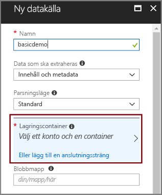
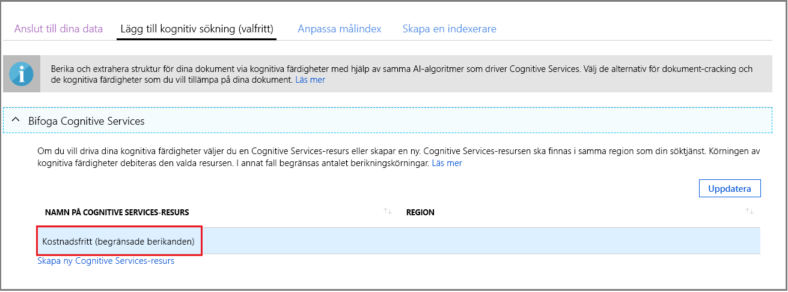
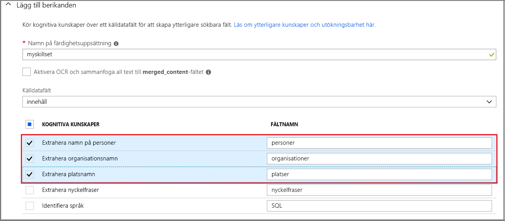
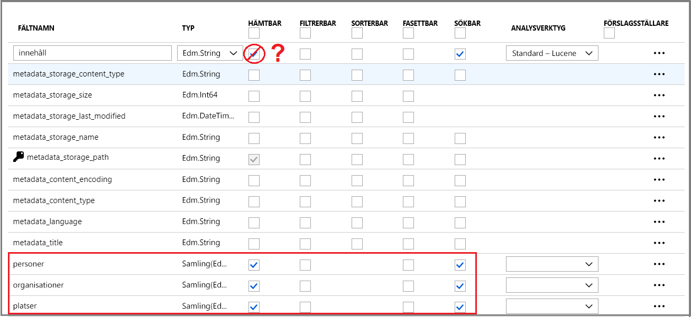
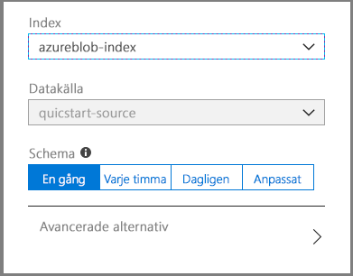
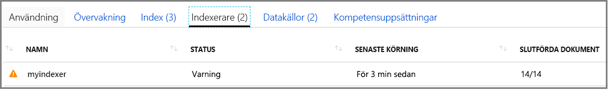
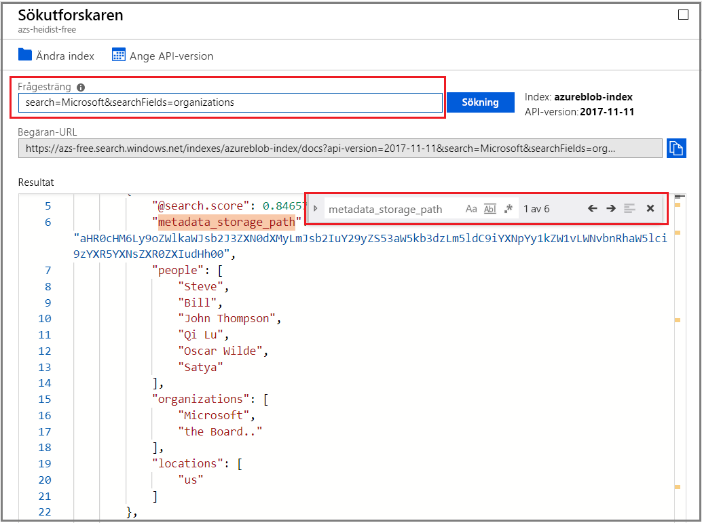

# Snabbstart: Skapa en indexering AI-pipeline med kognitiva funktioner i Azure Search

Azure Search kan integreras med [Cognitive Services](https://azure.microsoft.com/services/cognitive-services/), lägga till innehåll extrahering, naturlig språkbearbetning (NLP) och kunskaper för bearbetning av avbildning till ett Azure Search indexering av pipeline, vilket gör unsearchable eller ostrukturerat innehåll mer sökbara. 

Många resurser för Cognitive Services – till exempel [OCR](cognitive-search-skill-ocr.md), [språkidentifiering](cognitive-search-skill-language-detection.md), [entitetsidentifiering](cognitive-search-skill-entity-recognition.md) för att nämna några få - kan kopplas till en indexeringsprocessen. AI-algoritmer för Cognitive Services används för att hitta mönster, funktioner och egenskaper i källdata, returnera strukturer och textinnehåll som kan användas för textsökningslösningar som bygger på Azure Search.

I den här snabbstarten skapar du din första berikningspipeline i [Azure Portal](https://portal.azure.com) utan att skriva en enda rad med kod:

> [!div class="checklist"]
> * Börja med exempeldata i Azure Blob Storage
> * Konfigurera guiden [**Importera data**](search-import-data-portal.md) för kognitiv indexering och berikning 
> * Kör guiden (en entitetskunskap upptäcker personer, platser och organisationer)
> * Använd [**Sökutforskaren**](search-explorer.md) för att köra frågor mot berikade data

Den här snabbstarten körs på den kostnadsfria tjänsten, men antalet kostnadsfria transaktioner är begränsat till 20 dokument per dag. Om du vill köra den här snabbstarten mer än en gång om dagen, använda en mindre fil så att du kan rymmas i fler körningar.

> [!NOTE]
> När du utökar omfattningen genom att öka frekvensen för bearbetning, att lägga till fler dokument eller att lägga till fler AI-algoritmer, måste du [bifoga en fakturerbar resurs för Cognitive Services](cognitive-search-attach-cognitive-services.md). Avgifter tillkommer när du anropar API: er i Cognitive Services och extrahering av avbildningen som en del av det dokumentknäckning steget i Azure Search. Det finns inga avgifter för textextrahering från dokument.
>
> Körningen av inbyggda färdigheter som ingår debiteras enligt den befintliga [Cognitive Services betala-som-du gå pris](https://azure.microsoft.com/pricing/details/cognitive-services/). Bild extrahering priser beskrivs i den [Azure Search sidan med priser](https://go.microsoft.com/fwlink/?linkid=2042400).

Om du inte har en Azure-prenumeration kan du skapa ett [kostnadsfritt konto](https://azure.microsoft.com/free/?WT.mc_id=A261C142F) innan du börjar.

## Nödvändiga komponenter

[Skapa en Azure Search-tjänst](search-create-service-portal.md) eller [hitta en befintlig tjänst](https://ms.portal.azure.com/#blade/HubsExtension/BrowseResourceBlade/resourceType/Microsoft.Search%2FsearchServices) under din aktuella prenumeration. Du kan använda en kostnadsfri tjänst för den här snabbstarten.

[Cognitive Services](https://azure.microsoft.com/services/cognitive-services/) ger AI. Den här snabbstarten innehåller steg för att lägga till dessa resurser infogade, när du anger pipelinen. Du behöver inte konfigurera konton i förväg.

Azure-tjänster som krävs för att ange indata till för indexering av pipeline. Du kan använda valfri datakälla som stöds av [Azure Search-indexerare](search-indexer-overview.md) förutom Azure Table Storage, vilket inte stöds för indexering av AI. Den här snabbstarten används [Azure Blob storage](https://azure.microsoft.com/services/storage/blobs/) som en behållare för källfilerna för data. 

### Konfigurera Azure Blob Service och läsa in exempeldata

1. [Ladda ned exempeldata](https://1drv.ms/f/s!As7Oy81M_gVPa-LCb5lC_3hbS-4) som består av en liten filuppsättning med olika typer av data. 

1. [Registrera dig för Azure Blob storage](https://docs.microsoft.com/azure/storage/common/storage-quickstart-create-account?tabs=azure-portal), skapa ett lagringskonto, öppna Blob tjänster sidor och skapa en behållare.  Skapa lagringskontot i samma region som Azure Search.

1. I den container du skapade klickar du på **Ladda upp** för att ladda upp de exempelfiler som du laddade ned i ett tidigare steg.

   

## Skapa berikningspipelinen

Gå tillbaka till instrumentpanelsidan i Azure Search och klicka på **Importera data** i kommandofältet för att konfigurera kognitiv berikning i fyra steg.

  

### Steg 1: Skapa en datakälla

I **Anslut till dina data** väljer du **Azure Blob Storage** och väljer kontot och containern som du skapade. Namnge datakällan och lämna standardvärdena för resten av inställningarna. 

  

Fortsätt till nästa sida.

  

### Steg 2: Lägg till kognitiva färdigheter

Nu ska du lägga till berikningssteg till indexeringspipelinen. Om du inte har en resurs för Cognitive Services kan du registrera dig för en kostnadsfri version som ger dig 20 transaktioner per dag. Exempeldata består av 14 filer, så din dagliga allokering kommer främst att användas när du kör den här guiden.

1. Expandera **Bifoga Cognitive Services** för att visa alternativ för resursindelning av API:er för Cognitive Services. För den här självstudiekursen kan du använda den **kostnadsfria** resursen.

   

2. Expandera **Lägg till berikanden** och välj färdigheter som utför bearbetning av naturligt språk. I den här snabbstarten väljer du entitetsigenkänning för personer, organisationer och platser.

   

   Portalen ger inbyggda kunskaper för OCR-bearbetning och textanalys. På portalen körs en kunskapsuppsättning mot ett enda källfält. Det kan verka som ett litet mål, men för Azure-blobar innehåller fältet `content` merparten av blobdokumentet (till exempel ett Word-dokument eller en PowerPoint-presentation). Därför är det här fältet idealiskt, eftersom allt innehåll i en blob finns där.

3. Fortsätt till nästa sida.

   

> [!NOTE]
> Kunskaper för bearbetning av naturligt språk körs på textinnehåll i exempeldatamängden. Eftersom vi inte valde OCR-alternativet bearbetas inte JPEG- och PNG-filerna som finns i exempeldatauppsättningen i den här snabbstarten. 

### Steg 3: Konfigurera indexet

Guiden kan vanligtvis härleda ett standardindex. I det här steget kan du visa det skapade indexets schema och ändra inställningar om det behövs. Nedan hittar du det skapade standardindexet för demo-Blob-datauppsättningen.

I den här snabbstarten passar guidens standardinställningar bra: 

+ Standardnamnet är *azureblob-index* baserat på datakällans typ. 

+ Standardfält baseras på det ursprungliga källdatafältet (`content`), plus utdatafälten (`people`, `organizations` och `locations`) som skapas av den kognitiva pipelinen. Standarddatatyperna härleds från metadata och datasampling.

+ Standardnyckeln är *metadata_storage_path* (det här fältet innehåller unika värden).

+ Standardattributen är **Hämtningsbart** och **Sökbart** i dessa fält. **Sökbar** anger att det går att söka i ett fält. **Hämtbar** betyder att det kan returneras i resultat. Guiden förutsätter att du vill att dessa fält ska vara hämtningsbara och sökbara, eftersom du har skapat dem via en kompetensuppsättning.

  

Observera genomstrykningen och frågetecknet i attributet **Hämtningsbart** i fältet `content`. I textbaserade blobbdokument innehåller fältet `content` den största delen av filen, som skulle kunna köras som tusentals rader. Om du vill skicka filens innehåll till klientkod, ser du till att **Hämtningsbart** förblir markerat. Annars kan du ta bort attributet i `content` om de extraherade elementen (`people`, `organizations` och `locations`) är tillräckliga för dina syften.

Att ett fält markeras som **Hämtningsbart** innebär inte att fältet *måste* finnas i sökresultaten. Du kan detaljstyra sammansättningen av sökresultat med hjälp av frågeparametern **$select** om du vill ange vilka fält som ska inkluderas. I textintensiva fält som `content`, är parametern **$select** din lösning för att dina programanvändare ska få hanterbara sökresultat, samtidigt som du säkerställer att klientkoden har åtkomst till all information som behövs via attributet **Hämtningsbart**.
  
Fortsätt till nästa sida.

  

### Steg 4: Konfigurera indexeraren

Indexeraren är en övergripande resurs som styr indexeringen. Indexeraren definierar datakällans namn, ett målindex och körningsfrekvensen. Slutresultatet av guiden **Importera data** är alltid en indexerare som du kan köra flera gånger.

På sidan **indexerare** kan du acceptera standardnamnet och använda schemaalternativet **Kör en gång** för att köra det direkt. 

  

Klicka på **Skicka** för att skapa och köra indexeraren samtidigt.

## Övervaka indexering

Berikande steg tar längre tid än en typisk textbaserad indexering. Guiden ska öppna listan med indexerare på översiktssidan så att du kan följa förloppet. För självnavigering går du till översikten över sidan och klickar på **indexerare**.

Varningen beror på att JPG- och PNG-filer är bildfiler, och vi utelämnade OCR-kunskaper från denna pipeline. Du hittar också trunkering av meddelanden. Azure Search begränsar extrahering till 32 000 tecken på den kostnadsfria nivån.

  

Eftersom indexeringen och berikningen kan ta tid rekommenderar vi att du börjar med mindre datamängder. 

## Fråga i Sökutforskaren

När ett index har skapats kan du skicka frågor för att returnera dokument från indexet. Använd **Sökutforskaren** i portalen till att köra frågor och visa resultat. 

1. Klicka på **Sökutforskaren** i kommandofältet på söktjänstens instrumentpanelsida.

1. Välj **Ändra index** längst upp och välj det index som du skapade.

1. Ange en söksträng för att fråga indexet, till exempel `search=Microsoft&searchFields=organizations`.

Resultatet returneras i JSON, som kan vara relativt utförligt och svårläst, särskilt i stora dokument som kommer från Azure-blobar. Om det är svårt att överblicka resultatet använder du CTRL-F för att söka i dokument. För den här frågan kan du söka i JSON för specifika villkor. 

Du kan också använda CTRL-F för att se hur många dokument det finns i en viss resultatuppsättning. För Azure-blobar väljer portalen ”metadata_storage_path” som nyckel eftersom varje värde är unikt för dokumentet. Använd CTRL-F och sök efter ”metadata_storage_path” för att se antalet dokument. 

  

## Lärdomar

Nu har du slutfört din första övning i kognitiv berikad indexering. Syftet med den här snabbstarten var att introducera viktiga begrepp och att vägleda dig genom guiden så att du snabbt kan börja skapa lösningar för kognitiv sökning med dina egna data.

Bland de viktigaste lärdomarna som vi hoppas att du tar med dig är beroendet av Azure-datakällor. Berikad kognitiv sökning är bundet till indexerare, och indexerare är Azure- och källspecifika. I den här snabbstarten används Azure Blob Storage, men det går att använda andra Azure-datakällor. Mer information finns i [Indexerare i Azure Search](search-indexer-overview.md).

En annan viktig aspekt är att kunskaper körs på indatafält. På portalen måste du välja ett enda fält för alla kunskaper. I koden kan indata vara andra fält, eller utdata från en överordnad kunskap.

 Indata för en kunskap mappas till ett utdatafält i ett index. Internt konfigurerar portalen [anteckningar](cognitive-search-concept-annotations-syntax.md) och definierar en [kunskapsuppsättning](cognitive-search-defining-skillset.md), som definierar ordningen på åtgärder och det allmänna flödet. Dessa steg är dolda på portalen, men när du börjar skriva kod blir dessa begrepp viktiga.

Slutligen lärde du dig hur du visar resultat genom att fråga indexet. Vad Azure Search erbjuder är i grunden ett sökbart index, som du kan fråga med [enkel](https://docs.microsoft.com/rest/api/searchservice/simple-query-syntax-in-azure-search) eller [utökad frågesyntax](https://docs.microsoft.com/rest/api/searchservice/lucene-query-syntax-in-azure-search). Ett index som innehåller berikade fält är precis som andra fält. Om du vill använda standardanalysverktyg eller [anpassade analysverktyg](search-analyzers.md), [bedömningsprofiler](https://docs.microsoft.com/rest/api/searchservice/add-scoring-profiles-to-a-search-index), [synonymer](search-synonyms.md), [fasetterade filter](search-filters-facets.md), geo-sökning eller andra Azure Search-funktioner kan du självklart göra det.

## Rensa resurser

När du är klar rensar du enklast upp genom att ta bort resursgruppen som innehåller Azure Search och Azure Blob Service.  

Förutsatt att du placerade båda tjänsterna i samma grupp, tar du bort resursgruppen för att permanent ta bort allt i den, inklusive tjänsterna och eventuellt lagrat innehåll som du skapade i den här övningen. På portalen visas resursgruppens namn på översiktssidan för varje tjänst.

## Nästa steg

Beroende på hur du har etablerat resursen Cognitive Services, kan du experimentera med indexering och berikning genom att köra guiden igen med olika kunskaper och källdatafält. Om du vill upprepa stegen tar du bort indexet och indexeraren och återskapar sedan indexeraren med en ny kombination av val.

+ Markera det index som du skapade i **Översikt** > **Index** och klicka sedan på **Ta bort**.

+ Dubbelklicka på panelen **Indexerare** i **Översikt**. Leta upp indexeraren som du skapade och ta bort den.

Alternativt kan du återanvända de exempeldata och tjänster som du skapat och lära dig hur du utför samma åtgärder via programmering i nästa självstudiekurs. 

> [!div class="nextstepaction"]
> [Självstudier: Lär dig mer om REST API:er för kognitiv sökning](cognitive-search-tutorial-blob.md)
