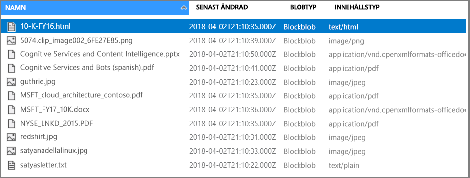

# <a name="c-tutorial-call-cognitive-services-apis-in-an-azure-search-indexing-pipeline"></a>C#Självstudie: Anropa API: er med Cognitive Services i ett Azure Search indexering av pipeline

I den här självstudien har du lärt dig mekaniken bakom att programmera databerikande i Azure Search med *kognitiva kunskaper*. Kunskaper backas upp av språkbearbetning (NLP) och avbildning analysmöjligheter i Cognitive Services. Via kompetens sammansättning och konfiguration, för att extrahera text och text som representerar en bild eller skannade dokument. Du kan också identifiera språk, entiteter, nyckelfraser och mycket mer. Slutresultatet är omfattande ytterligare innehåll i ett Azure Search-index som skapats av en AI-driven indexering av pipeline.

I den här självstudien får använda du .NET SDK för att utföra följande uppgifter:

> [!div class="checklist"]
> * Skapa en indexeringspipeline som berikar källdata på väg till ett index
> * Använda inbyggda kunskaper: optisk teckenläsning, text fusion, språkidentifiering, text-uppdelning, entitetsidentifiering, extrahering av diskussionsämne
> * Lära dig att sammanlänka kunskaper genom att mappa indata till utdata i en kompetens
> * Köra begäranden och granska resultatet
> * Återställa index och indexerare för ytterligare utveckling

Utdata är ett fulltextsökbart index i Azure Search. Du kan förbättra indexet med andra standardfunktioner som [synonymer](search-synonyms.md), [bedömningsprofiler](https://docs.microsoft.com/rest/api/searchservice/add-scoring-profiles-to-a-search-index), [analysverktyg](search-analyzers.md) och [filter](search-filters.md).

Den här självstudien körs på den kostnadsfria tjänsten, men antalet kostnadsfria transaktioner är begränsat till 20 dokument per dag. Om du vill köra den här självstudien mer än en gång i samma dag, kan du använda en mindre fil så att du kan rymmas i fler körningar.

> [!NOTE]
> När du expanderar omfång genom att öka frekvensen för bearbetning, lägga till fler dokument eller att lägga till fler AI-algoritmer, behöver du bifoga en fakturerbar resurs för Cognitive Services. Avgifter tillkommer när du anropar API: er i Cognitive Services och extrahering av avbildningen som en del av det dokumentknäckning steget i Azure Search. Det finns inga avgifter för textextrahering från dokument.
>
> Körningen av inbyggda färdigheter som ingår debiteras enligt den befintliga [Cognitive Services betala-som-du gå pris](https://azure.microsoft.com/pricing/details/cognitive-services/) . Bild extrahering priser beskrivs i den [Azure Search sidan med priser](https://go.microsoft.com/fwlink/?linkid=2042400).

Om du inte har en Azure-prenumeration kan du skapa ett [kostnadsfritt konto](https://azure.microsoft.com/free/?WT.mc_id=A261C142F) innan du börjar.

## <a name="prerequisites"></a>Nödvändiga komponenter

Följande tjänster, verktyg och data som används i den här självstudien. 

[Skapa en Azure Search-tjänst](search-create-service-portal.md) eller [hitta en befintlig tjänst](https://ms.portal.azure.com/#blade/HubsExtension/BrowseResourceBlade/resourceType/Microsoft.Search%2FsearchServices) under din aktuella prenumeration. Du kan använda en kostnadsfri tjänst för den här självstudiekursen.

[Skapa ett Azure storage-konto](https://docs.microsoft.com/azure/storage/common/storage-quickstart-create-account) för att lagra exempeldata.

[Exempeldata](https://1drv.ms/f/s!As7Oy81M_gVPa-LCb5lC_3hbS-4) består av en liten uppsättning olika typer. 

[Installera Visual Studio](https://visualstudio.microsoft.com/) ska användas som IDE.

## <a name="get-a-key-and-url"></a>Hämta en nyckel och URL: en

För att interagera med Azure Search-tjänsten måste tjänstens URL och en åtkomstnyckel. En söktjänst har vanligen båda dessa komponenter, så om du har valt att lägga till Azure Search i din prenumeration följer du bara stegen nedan för att hitta fram till rätt information:

1. [Logga in på Azure-portalen](https://portal.azure.com/), och i din söktjänst **översikt** sidan, hämta URL: en. Här följer ett exempel på hur en slutpunkt kan se ut: `https://mydemo.search.windows.net`.

1. I **inställningar** > **nycklar**, hämta en administratörsnyckel för fullständiga rättigheter på tjänsten. Det finns två utbytbara administratörsnycklar, som angetts för kontinuitet för företag om du behöver förnya ett. Du kan använda antingen den primära eller sekundära nyckeln för förfrågningar för att lägga till, ändra och ta bort objekt.

   

En giltig nyckel upprättar förtroende, i varje begäran, mellan programmet som skickar begäran och tjänsten som hanterar den.

## <a name="prepare-sample-data"></a>Förbereda exempeldata

Berikningspipelinen hämtar data från Azure-datakällor. Källdata måste komma från en datakällstyp som stöds av en [Azure Search-indexerare](search-indexer-overview.md). Azure Table Storage stöds inte för kognitiv sökning. I den här övningen använder vi blogglagring för att demonstrera flera typer av innehåll.

1. [Logga in på Azure-portalen](https://portal.azure.com)navigerar du till ditt Azure storage-konto, klickar du på **Blobar**, och klicka sedan på **+ behållare**.

1. [Skapa en blobbehållare](https://docs.microsoft.com/azure/storage/blobs/storage-quickstart-blobs-portal) som innehåller exempeldata. Du kan ange offentlig åtkomstnivå till någon av dess giltiga värden. Den här självstudien förutsätter att behållarens namn är ”basic-demo-data-pr”.

1. När behållaren har skapats kan du öppna den och välj **överför** i kommandofältet för att ladda upp den [exempeldata](https://1drv.ms/f/s!As7Oy81M_gVPa-LCb5lC_3hbS-4).

   

1. När exempelfilerna har lästs in hämtar du containerns namn och en anslutningssträng för Blob Storage. Kan du göra det genom att gå till ditt lagringskonto i Azure portal, med alternativet **åtkomstnycklar**, och sedan kopiera den **Connection String** fält.

   Anslutningssträngen ska vara en URL som ser ut ungefär så här:

      ```http
      DefaultEndpointsProtocol=https;AccountName=cogsrchdemostorage;AccountKey=<your account key>;EndpointSuffix=core.windows.net
      ```

Det finns andra sätt att ange anslutningssträngen, till exempel att ange en signatur för delad åtkomst. Om du vill veta mer om autentiseringsuppgifter för datakällor kan du läsa [Indexing Azure Blob Storage](search-howto-indexing-azure-blob-storage.md#Credentials) (Indexera Azure Blob Storage).

## <a name="set-up-your-environment"></a>Konfigurera din miljö

Börja genom att öppna Visual Studio och skapa ett nytt Console App-projekt som kan köras på .NET Core.

### <a name="install-nuget-packages"></a>Installera NuGet-paket

Den [Azure Search .NET SDK](https://aka.ms/search-sdk) består av några klientbibliotek som gör att du kan hantera index, datakällor, indexerare och kompetens, samt ladda upp och hantera dokument och köra frågor, allt utan att hantera den information om HTTP och JSON. Dessa klientbibliotek distribueras som NuGet-paket.

För det här projektet måste du installera version 9 av den `Microsoft.Azure.Search` NuGet-paketet och senast `Microsoft.Extensions.Configuration.Json` NuGet-paketet.

Installera den `Microsoft.Azure.Search` NuGet-paketet med Package Manager-konsolen i Visual Studio. Öppna i Package Manager-konsolen väljer **verktyg** > **NuGet-Pakethanteraren** > **Pakethanterarkonsolen**. Om du vill ha kommandot för att köra, navigera till den [Microsoft.Azure.Search NuGet-paketet sidan](https://www.nuget.org/packages/Microsoft.Azure.Search), väljer du version 9 och kopiera kommandot Package Manager. Kör det här kommandot i Package Manager-konsolen.

Installera den `Microsoft.Extensions.Configuration.Json` NuGet-paketet i Visual Studio väljer **verktyg** > **NuGet-Pakethanteraren** > **hantera NuGet-paket för lösningen...** . Välj Bläddra och söka efter den `Microsoft.Extensions.Configuration.Json` NuGet-paketet. När du har hittat den, väljer du paketet, markera projektet, bekräfta versionen är den senaste stabila versionen och sedan väljer installera.

## <a name="add-azure-search-service-information"></a>Lägga till information om Azure Search-tjänsten

För att ansluta till Azure Search-tjänsten behöver du lägga till söktjänstinformation i projektet. Högerklicka på projektet i Solution Explorer och välj **Lägg till** > **nytt objekt...**  . Ge filen namnet `appsettings.json` och välj **Lägg till**. 

Den här filen måste ingå i din utdatakatalog. Om du vill göra det högerklickar du på `appsettings.json` och välj **egenskaper**. Ändra värdet för **kopiera till utdatakatalog** till **kopia av nyare**.

Kopiera den nedan JSON i din nya JSON-filen.

```json
{
  "SearchServiceName": "Put your search service name here",
  "SearchServiceAdminApiKey": "Put your primary or secondary API key here",
  "SearchServiceQueryApiKey": "Put your query API key here",
  "AzureBlobConnectionString": "Put your Azure Blob connection string here",
}
```

Lägg till search-tjänsten och blob storage kontoinformationen.

Du kan hämta din söktjänstinformation från din kontosida för sökning i Azure-portalen. Namnet på kontot blir på huvudsidan och nycklarna kan hittas genom att välja **nycklar**.

Du kan hämta blob anslutningssträngen genom att gå till ditt lagringskonto i Azure-portalen att välja **åtkomstnycklar**, och sedan kopiera den **Connection String** fält.

## <a name="add-namespaces"></a>Lägg till namnområden

Den här självstudien använder många olika typer från olika namnområden. För att kunna använda dessa typer lägger du till följande till `Program.cs`.

```csharp
using System;
using System.Collections.Generic;
using Microsoft.Azure.Search;
using Microsoft.Azure.Search.Models;
using Microsoft.Extensions.Configuration;
```

## <a name="create-a-client"></a>Skapa en klient

Skapa en instans av den `SearchServiceClient` klass.

```csharp
IConfigurationBuilder builder = new ConfigurationBuilder().AddJsonFile("appsettings.json");
IConfigurationRoot configuration = builder.Build();
SearchServiceClient serviceClient = CreateSearchServiceClient(configuration);
```

`CreateSearchServiceClient` skapar en ny `SearchServiceClient` med värden som lagras i programmets konfigurationsfil (appsettings.json).

```csharp
private static SearchServiceClient CreateSearchServiceClient(IConfigurationRoot configuration)
{
   string searchServiceName = configuration["SearchServiceName"];
   string adminApiKey = configuration["SearchServiceAdminApiKey"];

   SearchServiceClient serviceClient = new SearchServiceClient(searchServiceName, new SearchCredentials(adminApiKey));
   return serviceClient;
}
```

> [!NOTE]
> `SearchServiceClient`-klassen hanterar anslutningar till din söktjänst. För att undvika att behöva öppna för många anslutningar bör du försöka dela en enskild instans av `SearchServiceClient` i ditt program om möjligt. Dess metoder är trådsäkra för att möjliggöra den typen av delning.
> 
> 

## <a name="create-a-data-source"></a>Skapa en datakälla

Skapa en ny `DataSource` instans genom att anropa `DataSource.AzureBlobStorage`. `DataSource.AzureBlobStorage` kräver att du anger de namn på datakälla, anslutningssträngen och blob-behållarnamn.

Även om den inte används i den här självstudiekursen definieras även en princip för mjuk borttagning som används för att identifiera borttagna blobar baserat på värdet för en kolumn för mjuk borttagning. Följande princip anser att en blob som ska tas bort om den har en metadata-egenskap `IsDeleted` med värdet `true`.

```csharp
DataSource dataSource = DataSource.AzureBlobStorage(
    name: "demodata",
    storageConnectionString: configuration["AzureBlobConnectionString"],
    containerName: "basic-demo-data-pr",
    deletionDetectionPolicy: new SoftDeleteColumnDeletionDetectionPolicy(
        softDeleteColumnName: "IsDeleted",
        softDeleteMarkerValue: "true"),
    description: "Demo files to demonstrate cognitive search capabilities.");
```

Nu när du har initierats på `DataSource` objekt, skapa datakällan. `SearchServiceClient` har en `DataSources`-egenskap. Den här egenskapen tillhandahåller alla metoder som du behöver för att skapa, visa, uppdatera eller ta bort Azure Search-datakällor.

För begäran lyckas returnerar metoden den datakälla som har skapats. Om det finns ett problem med begäran, till exempel en ogiltig parameter genereras metoden ett undantagsfel.

```csharp
try
{
    serviceClient.DataSources.CreateOrUpdate(dataSource);
}
catch (Exception e)
{
    // Handle the exception
}
```

Eftersom detta var din första begäran ska du kolla Azure-portalen för att bekräfta att datakällan skapades i Azure Search. På söktjänstens instrumentpanelsida verifierar du att panelen Datakällor har ett nytt objekt. Du kan behöva vänta några minuter medan portalsidan uppdateras.

  

## <a name="create-a-skillset"></a>Skapa en kunskapsuppsättning

I det här avsnittet kan du definiera en uppsättning berikande steg som du vill tillämpa på dina data. Varje berikande steget kallas en *färdighet* och stegen för berikande en *kompetens*. Den här självstudien använder [fördefinierade kognitiva kunskaper](cognitive-search-predefined-skills.md) för kunskapsuppsättningen:

+ [Optisk teckenläsning](cognitive-search-skill-ocr.md) att känna igen utskrivna och handskriven text i bildfiler.

+ [Text fusion](cognitive-search-skill-textmerger.md) att konsolidera text från en samling av fält till ett fält.

+ [Språkidentifiering](cognitive-search-skill-language-detection.md) för att identifiera innehållets språk.

+ [Text dela](cognitive-search-skill-textsplit.md) att dela upp stora innehåll i mindre segment innan du anropar diskussionsämne extrahering kunskaper och entiteten erkännande färdigheter. Extrahering av diskussionsämne och entitetsidentifiering acceptera indata högst 50 000 tecken. Några av exempelfilerna måste delas upp för att rymmas inom gränsen.

+ [Entitetsidentifiering](cognitive-search-skill-entity-recognition.md) för att extrahera namnen på organisationer från innehållet i blob-behållaren.

+ [Extrahering av nyckelfraser](cognitive-search-skill-keyphrases.md) för att hämta viktigaste nyckelfraserna.

Under den inledande bearbetning sprickor Azure Search varje dokument att läsa innehåll från olika filformat. Text som hittas från källfilen placeras i ett genererat ```content```-fält, ett för varje dokument. Därför måste ange indata för som ```"/document/content"``` att använda den här texten. 

Utdata kan mappas till ett index som används som indata till en underordnad kunskap, eller både, vilket är fallet med språkkod. I indexet kan en språkkod användas för filtrering. Som indata används språkkoden av textanalyskunskaper för att informera om de språkliga reglerna kring ordnedbrytning.

Mer information om grunderna i kunskapsuppsättningar finns i [Definiera en kunskapsuppsättning](cognitive-search-defining-skillset.md).

### <a name="ocr-skill"></a>OCR färdighet

Den **OCR** färdighet extraherar text från bilder. Kompetensen förutsätter att det finns ett normalized_images fält. Att skapa det här fältet senare under kursen vi kan ange den ```"imageAction"``` konfiguration i indexerardefinitionen för att ```"generateNormalizedImages"```.

```csharp
List<InputFieldMappingEntry> inputMappings = new List<InputFieldMappingEntry>();
inputMappings.Add(new InputFieldMappingEntry(
    name: "image",
    source: "/document/normalized_images/*"));

List<OutputFieldMappingEntry> outputMappings = new List<OutputFieldMappingEntry>();
outputMappings.Add(new OutputFieldMappingEntry(
    name: "text",
    targetName: "text"));

OcrSkill ocrSkill = new OcrSkill(
    description: "Extract text (plain and structured) from image",
    context: "/document/normalized_images/*",
    inputs: inputMappings,
    outputs: outputMappings,
    defaultLanguageCode: OcrSkillLanguage.En,
    shouldDetectOrientation: true);
```

### <a name="merge-skill"></a>Sammanfoga färdighet

I det här avsnittet skapar du en **sammanfoga** färdighet som sammanfogar dokumentet innehållsfältet med texten som producerats av OCR-färdigheter.

```csharp
List<InputFieldMappingEntry> inputMappings = new List<InputFieldMappingEntry>();
inputMappings.Add(new InputFieldMappingEntry(
    name: "text",
    source: "/document/content"));
inputMappings.Add(new InputFieldMappingEntry(
    name: "itemsToInsert",
    source: "/document/normalized_images/*/text"));
inputMappings.Add(new InputFieldMappingEntry(
    name: "offsets",
    source: "/document/normalized_images/*/contentOffset"));

List<OutputFieldMappingEntry> outputMappings = new List<OutputFieldMappingEntry>();
outputMappings.Add(new OutputFieldMappingEntry(
    name: "mergedText",
    targetName: "merged_text"));

MergeSkill mergeSkill = new MergeSkill(
    description: "Create merged_text which includes all the textual representation of each image inserted at the right location in the content field.",
    context: "/document",
    inputs: inputMappings,
    outputs: outputMappings,
    insertPreTag: " ",
    insertPostTag: " ");
```

### <a name="language-detection-skill"></a>Språk identifiering färdighet

Den **språkidentifiering** färdighet identifierar språket i indatatexten och rapporterar en enda språkkod för varje dokument som skickats på begäran. Vi använder utdata från den **språkidentifiering** färdigheter som en del av indata till den **Text dela** färdigheter.

```csharp
List<InputFieldMappingEntry> inputMappings = new List<InputFieldMappingEntry>();
inputMappings.Add(new InputFieldMappingEntry(
    name: "text",
    source: "/document/merged_text"));

List<OutputFieldMappingEntry> outputMappings = new List<OutputFieldMappingEntry>();
outputMappings.Add(new OutputFieldMappingEntry(
    name: "languageCode",
    targetName: "languageCode"));

LanguageDetectionSkill languageDetectionSkill = new LanguageDetectionSkill(
    description: "Detect the language used in the document",
    context: "/document",
    inputs: inputMappings,
    outputs: outputMappings);
```

### <a name="text-split-skill"></a>Text dela färdighet

Den nedan **dela** färdighet ska dela upp text av sidor och begränsa sidlängden till 4 000 tecken enligt `String.Length`. Algoritmen som försöker att dela upp texten i segment som innehåller högst `maximumPageLength` i storlek. I det här fallet algoritmen gör sitt bästa att avbryta meningen för en mening gräns så att storleken på segmentet kan vara något mindre än `maximumPageLength`.

```csharp
List<InputFieldMappingEntry> inputMappings = new List<InputFieldMappingEntry>();
inputMappings.Add(new InputFieldMappingEntry(
    name: "text",
    source: "/document/merged_text"));
inputMappings.Add(new InputFieldMappingEntry(
    name: "languageCode",
    source: "/document/languageCode"));

List<OutputFieldMappingEntry> outputMappings = new List<OutputFieldMappingEntry>();
outputMappings.Add(new OutputFieldMappingEntry(
    name: "textItems",
    targetName: "pages"));

SplitSkill splitSkill = new SplitSkill(
    description: "Split content into pages",
    context: "/document",
    inputs: inputMappings,
    outputs: outputMappings,
    textSplitMode: TextSplitMode.Pages,
    maximumPageLength: 4000);
```

### <a name="entity-recognition-skill"></a>Entiteten erkännande färdighet

Detta `EntityRecognitionSkill` instans har angetts för att identifiera kategorityp `organization`. Den **Entitetsidentifiering** färdighet kan också identifiera kategorityper `person` och `location`.

Lägg märke till att fältet ”kontexten” anges till ```"/document/pages/*"``` med en asterisk, vilket innebär att det berikande steget kallas för varje sida under ```"/document/pages"```.

```csharp
List<InputFieldMappingEntry> inputMappings = new List<InputFieldMappingEntry>();
inputMappings.Add(new InputFieldMappingEntry(
    name: "text",
    source: "/document/pages/*"));
    
List<OutputFieldMappingEntry> outputMappings = new List<OutputFieldMappingEntry>();
outputMappings.Add(new OutputFieldMappingEntry(
    name: "organizations",
    targetName: "organizations"));

List<EntityCategory> entityCategory = new List<EntityCategory>();
entityCategory.Add(EntityCategory.Organization);
    
EntityRecognitionSkill entityRecognitionSkill = new EntityRecognitionSkill(
    description: "Recognize organizations",
    context: "/document/pages/*",
    inputs: inputMappings,
    outputs: outputMappings,
    categories: entityCategory,
    defaultLanguageCode: EntityRecognitionSkillLanguage.En);
```

### <a name="key-phrase-extraction-skill"></a>Färdighet för extrahering av diskussionsämne

Som den `EntityRecognitionSkill` -instans som nyss skapades, den **nyckel diskussionsämne** färdighet anropas för varje sida i dokumentet.

```csharp
List<InputFieldMappingEntry> inputMappings = new List<InputFieldMappingEntry>();
inputMappings.Add(new InputFieldMappingEntry(
    name: "text",
    source: "/document/pages/*"));
inputMappings.Add(new InputFieldMappingEntry(
    name: "languageCode",
    source: "/document/languageCode"));

List<OutputFieldMappingEntry> outputMappings = new List<OutputFieldMappingEntry>();
outputMappings.Add(new OutputFieldMappingEntry(
    name: "keyPhrases",
    targetName: "keyPhrases"));

KeyPhraseExtractionSkill keyPhraseExtractionSkill = new KeyPhraseExtractionSkill(
    description: "Extract the key phrases",
    context: "/document/pages/*",
    inputs: inputMappings,
    outputs: outputMappings);
```

### <a name="build-and-create-the-skillset"></a>Bygg och skapa gruppens kunskaper avgör

Skapa den `Skillset` med de kunskaper som du skapade.

```csharp
List<Skill> skills = new List<Skill>();
skills.Add(ocrSkill);
skills.Add(mergeSkill);
skills.Add(languageDetectionSkill);
skills.Add(splitSkill);
skills.Add(entityRecognitionSkill);
skills.Add(keyPhraseExtractionSkill);

Skillset skillset = new Skillset(
    name: "demoskillset",
    description: "Demo skillset",
    skills: skills);
```

Skapa gruppens kunskaper avgör i din söktjänst.

```csharp
try
{
    serviceClient.Skillsets.CreateOrUpdate(skillset);
}
catch (Exception e)
{
    // Handle exception
}
```

## <a name="create-an-index"></a>Skapa ett index

I det här avsnittet definierar du indexschemat genom att ange vilka fält som ska ingå i det sökbara indexet och sökattributen för varje fält. Fält har en typ och kan ta attribut som bestämmer hur fältet ska användas (sökbart, sorteringsbart och så vidare). Fältnamn i ett index krävs inte för att matcha fältnamn identiskt i källan. I ett senare steg lägger du till fältmappningar i en indexerare för att ansluta källa-mål-fält. För det här steget definiera indexet med fältnamnkonventioner som är relevanta för ditt sökprogram.

Den här övningen använder följande fält och fälttyp:

| fält-namn: | `id`       | innehåll   | languageCode | keyPhrases         | organisationer     |
|--------------|----------|-------|----------|--------------------|-------------------|
| fält-typer: | Edm.String|Edm.String| Edm.String| List<Edm.String>  | List<Edm.String>  |


### <a name="create-demoindex-class"></a>Skapa DemoIndex-klass

Fälten för det här indexet har definierats med en modellklass. Varje egenskap i modellklassen har attribut som avgör motsvarande indexfälts sökrelaterade beteende. 

Vi lägger till modellklassen till en ny C# fil. Högerklicka på projektet och välj **Lägg till** > **nytt objekt...** väljer du ”Class” och namnge filen `DemoIndex.cs`och välj sedan **Lägg till**.

Se till att ange att du vill använda typer från den `Microsoft.Azure.Search` och `Microsoft.Azure.Search.Models` namnområden.

```csharp
using Microsoft.Azure.Search;
using Microsoft.Azure.Search.Models;
```

Lägg till den nedan modellen klassdefinitionen till `DemoIndex.cs` och inkludera den i samma namnområde där du skapar indexet.

```csharp
// The SerializePropertyNamesAsCamelCase attribute is defined in the Azure Search .NET SDK.
// It ensures that Pascal-case property names in the model class are mapped to camel-case
// field names in the index.
[SerializePropertyNamesAsCamelCase]
public class DemoIndex
{
    [System.ComponentModel.DataAnnotations.Key]
    [IsSearchable, IsSortable]
    public string Id { get; set; }

    [IsSearchable]
    public string Content { get; set; }

    [IsSearchable]
    public string LanguageCode { get; set; }

    [IsSearchable]
    public string[] KeyPhrases { get; set; }

    [IsSearchable]
    public string[] Organizations { get; set; }
}
```

Nu när du har definierat en modellklass igen `Program.cs` du kan skapa en Indexdefinition ganska enkelt. Namn för det här indexet kommer att ”demoindex”.

```csharp
var index = new Index()
{
    Name = "demoindex",
    Fields = FieldBuilder.BuildForType<DemoIndex>()
};
```

Under testningen hända att du försöker att skapa indexet mer än en gång. Kontrollera om det index som du håller på att skapa redan finns innan du försöker skapa den på grund av detta.

```csharp
try
{
    bool exists = serviceClient.Indexes.Exists(index.Name);

    if (exists)
    {
        serviceClient.Indexes.Delete(index.Name);
    }

    serviceClient.Indexes.Create(index);
}
catch (Exception e)
{
    // Handle exception
}
```

Om du vill veta mer om att definiera ett index kan du läsa [Create Index (Azure Search REST API)](https://docs.microsoft.com/rest/api/searchservice/create-index) (Skapa index (Azure Search-REST API)).

## <a name="create-an-indexer-map-fields-and-execute-transformations"></a>Skapa en indexerare, mappa fält och köra transformeringar

Hittills har du skapat en datakälla, en kunskapsuppsättning och ett index. De här tre komponenterna blir en del av en [indexerare](search-indexer-overview.md) som sammanför varje del till en enda åtgärd i flera faser. Om du vill sammanfoga dem i en indexerare måste du definiera fältmappningar.

+ FieldMappings bearbetas före kompetens, mappar källfält från datakällan till målfält i ett index. Om fältnamn och typer är samma i båda ändar, krävs ingen mappning.

+ OutputFieldMappings bearbetas efter kompetens, refererar till sourceFieldNames som inte finns tills dokumentknäckning eller funktioner som de skapas. TargetFieldName är ett fält i ett index.

Du kan också använda fältmappningar platta ut datastrukturer förutom anslutning upp indata till utdata. Mer information finns i [avancerad och mappning till ett sökbart index](cognitive-search-output-field-mapping.md).

```csharp
IDictionary<string, object> config = new Dictionary<string, object>();
config.Add(
    key: "dataToExtract",
    value: "contentAndMetadata");
config.Add(
    key: "imageAction",
    value: "generateNormalizedImages");

List<FieldMapping> fieldMappings = new List<FieldMapping>();
fieldMappings.Add(new FieldMapping(
    sourceFieldName: "metadata_storage_path",
    targetFieldName: "id",
    mappingFunction: new FieldMappingFunction(
        name: "base64Encode")));
fieldMappings.Add(new FieldMapping(
    sourceFieldName: "content",
    targetFieldName: "content"));

List<FieldMapping> outputMappings = new List<FieldMapping>();
outputMappings.Add(new FieldMapping(
    sourceFieldName: "/document/pages/*/organizations/*",
    targetFieldName: "organizations"));
outputMappings.Add(new FieldMapping(
    sourceFieldName: "/document/pages/*/keyPhrases/*",
    targetFieldName: "keyPhrases"));
outputMappings.Add(new FieldMapping(
    sourceFieldName: "/document/languageCode",
    targetFieldName: "languageCode"));

Indexer indexer = new Indexer(
    name: "demoindexer",
    dataSourceName: dataSource.Name,
    targetIndexName: index.Name,
    description: "Demo Indexer",
    skillsetName: skillSet.Name,
    parameters: new IndexingParameters(
        maxFailedItems: -1,
        maxFailedItemsPerBatch: -1,
        configuration: config),
    fieldMappings: fieldMappings,
    outputFieldMappings: outputMappings);

try
{
    bool exists = serviceClient.Indexers.Exists(indexer.Name);

    if (exists)
    {
        serviceClient.Indexers.Delete(indexer.Name);
    }

    serviceClient.Indexers.Create(indexer);
}
catch (Exception e)
{
    // Handle exception
}
```

Räkna med att skapa indexeraren tar lite tid att slutföra. Trots att datauppsättningen är liten är analytiska kunskaper beräkningsintensiva. Vissa kunskaper, som bildanalys, är tidskrävande.

> [!TIP]
> När en indexerare skapas anropas pipelinen. Om det uppstår problem med att ansluta till data, mappningsindata eller -utdata eller ordningen på åtgärder visas dem i det här stadiet.

### <a name="explore-creating-the-indexer"></a>Utforska skapar indexeraren

Koduppsättningar ```"maxFailedItems"``` till-1, vilket instruerar indexering-motorn att ignorera fel vid dataimport. Detta är användbart eftersom det finns det så få dokument i demo-datakällan. För en större datakälla skulle du ställa in värdet på större än 0.

Lägg också märke till de ```"dataToExtract"``` är inställd på ```"contentAndMetadata"```. Den här instruktionen anger att indexeraren automatiskt ska extrahera innehållet från olika filformat samt metadata som är relaterade till varje fil.

När innehållet har extraherats kan du ställa in `imageAction` på att extrahera text från avbildningar som hittades i datakällan. Den ```"imageAction"``` inställd ```"generateNormalizedImages"``` konfiguration, kombinerat med OCR-kunskaper och Text sammanfoga färdighet talar om för indexeraren att extrahera text från bilder (till exempel word ”stoppa” från trafik Stop-inloggning) och bädda in den som en del av fältet innehåll. Det här beteendet gäller både avbildningarna som är inbäddade i dokumenten (tänk på en avbildning i en PDF) samt avbildningar som hittas i datakällan, till exempel en JPG-fil.

## <a name="check-indexer-status"></a>Kontrollera status för indexerare

När du har definierat indexeraren körs den automatiskt när du skickar din begäran. Beroende på vilka kognitiva kunskaper du har definierat kan indexeringen ta längre tid än väntat. Om du vill ta reda på om indexeraren körs fortfarande kan använda den `GetStatus` metoden.

```csharp
try
{
    IndexerExecutionInfo demoIndexerExecutionInfo = serviceClient.Indexers.GetStatus(indexer.Name);

    switch (demoIndexerExecutionInfo.Status)
    {
        case IndexerStatus.Error:
            Console.WriteLine("Indexer has error status");
            break;
        case IndexerStatus.Running:
            Console.WriteLine("Indexer is running");
            break;
        case IndexerStatus.Unknown:
            Console.WriteLine("Indexer status is unknown");
            break;
        default:
            Console.WriteLine("No indexer information");
            break;
    }
}
catch (Exception e)
{
    // Handle exception
}
```

`IndexerExecutionInfo` representerar aktuell status och körning historiken för en indexerare.

Varningar är vanliga med vissa källfils- och kunskapskombinationer och är inte alltid tecken på problem. I den här självstudien är varningarna ofarliga (till exempel inga textindata från JPEG-filerna).
 
## <a name="verify-content"></a>Kontrollera innehåll

När indexering är klar kan köra du frågor som returnerar innehållet i enskilda fält. Som standard returnerar Azure Search de 50 bästa resultaten. Exempeldata är små, så standardinställningen fungerar gott och väl. Men när du arbetar med större datamängder kanske du måste inkludera parametrar i frågesträngen för att returnera fler resultat. Instruktioner finns i [How to page results in Azure Search](search-pagination-page-layout.md) (Söka resultat i Azure Search).

Som ett verifieringssteg ska du fråga indexet för alla fält.

```csharp
DocumentSearchResult<DemoIndex> results;

ISearchIndexClient indexClientForQueries = CreateSearchIndexClient(configuration);

try
{
    results = indexClientForQueries.Documents.Search<DemoIndex>("*");
}
catch (Exception e)
{
    // Handle exception
}
```

`CreateSearchIndexClient` skapar en ny `SearchIndexClient` med värden som lagras i programmets konfigurationsfil (appsettings.json). Observera att search service API Frågenyckeln används och inte admin-nyckel.

```csharp
private static SearchIndexClient CreateSearchIndexClient(IConfigurationRoot configuration)
{
   string searchServiceName = configuration["SearchServiceName"];
   string queryApiKey = configuration["SearchServiceQueryApiKey"];

   SearchIndexClient indexClient = new SearchIndexClient(searchServiceName, "demoindex", new SearchCredentials(queryApiKey));
   return indexClient;
}
```

Utdata är indexeringsschema med namn, typ och attribut för varje fält.

Skicka en ny fråga för `"*"` för att returnera hela innehållet i ett enda fält som `organizations`.

```csharp
SearchParameters parameters =
    new SearchParameters
    {
        Select = new[] { "organizations" }
    };

try
{
    results = indexClientForQueries.Documents.Search<DemoIndex>("*", parameters);
}
catch (Exception e)
{
    // Handle exception
}
```

Upprepa detta för ytterligare fält: innehåll, languageCode, keyPhrases och organisationer i den här övningen. Du kan returnera flera fält via `$select` med hjälp av en kommaavgränsad lista.

<a name="reset"></a>

## <a name="reset-and-rerun"></a>Återställa och köra igen

Experimentella tidigt i utvecklingen av är den mest praktiskt metoden för design iterationer att ta bort objekt från Azure Search och tillåta att koden återskapa dem. Resursnamn är unika. Om du tar bort ett objekt kan du återskapa det med samma namn.

Den här självstudien hand tog om söker efter befintliga indexerare och index och ta bort dem om de redan hade funnits så att du kan köra din kod.

Du kan också använda portalen för att ta bort index, indexerare och kompetens.

När koden utvecklas kanske du vill begränsa en strategi för återskapning. Läs mer i informationen om hur du [återskapar ett index](search-howto-reindex.md).

## <a name="takeaways"></a>Lärdomar

Den här självstudien beskrivs de grundläggande stegen för att skapa en avancerad och indexering av pipeline genom att skapa komponenter: en datakälla, kompetens, index och indexerare.

[Fördefinierade kunskaper](cognitive-search-predefined-skills.md) introducerades, tillsammans med en definition av kunskapsuppsättningen och mekanismerna för att sammanlänka kunskaper via in- och utdata. Du har också lärt dig att `outputFieldMappings` i indexerardefinitionen krävs för routningsberikade värden från pipelinen i ett sökbart index på en Azure Search-tjänst.

Slutligen lärde du dig att testa resultat och återställa systemet för ytterligare iterationer. Du har lärt dig att när du utfärdar frågor mot indexet returneras utdata som skapades av pipelinen för berikande indexering. Du har också lärt dig att kontrollera indexerarstatus, och vilka objekt du ska ta bort innan du kör en pipeline igen.

## <a name="clean-up-resources"></a>Rensa resurser

Det snabbaste sättet att rensa upp efter en självstudie är att ta bort resursgruppen som innehåller Azure Search-tjänsten och Azure Blob Service. Förutsatt att du placerade båda tjänsterna i samma grupp, tar du bort resursgruppen för att permanent ta bort allt i den, inklusive tjänsterna och eventuellt lagrat innehåll som du skapade i den här självstudien. På portalen visas resursgruppens namn på översiktssidan för varje tjänst.

## <a name="next-steps"></a>Nästa steg

Anpassa eller utöka pipelinen med anpassade kunskaper. När du skapar en anpassad kunskap och lägger till den i en kunskapsuppsättning kan du publicera text eller bildanalys som du skriver själv.

> [!div class="nextstepaction"]
> [Exempel: skapa en anpassad kunskap](cognitive-search-create-custom-skill-example.md)
