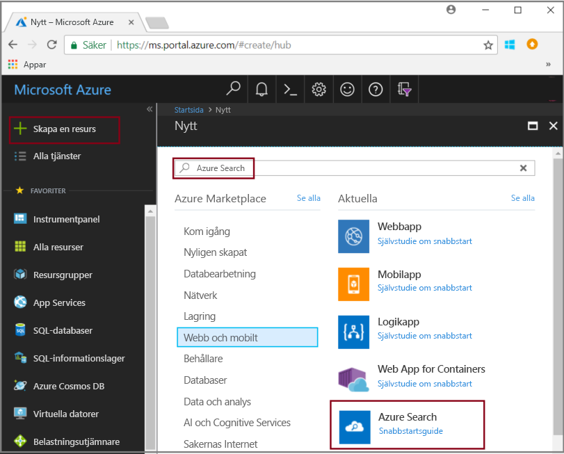
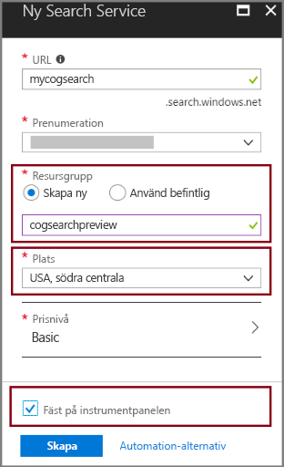

# <a name="tutorial-learn-how-to-call-cognitive-search-apis-preview"></a>Självstudie: Lär dig att anropa API:er för kognitiv sökning (förhandsversion)

I den här självstudien har du lärt dig mekaniken bakom att programmera databerikande i Azure Search med *kognitiva kunskaper*. Kognitiva kunskaper är behandling av naturligt språk (NLP) och bildanalysåtgärder som extraherar text och textrepresentationer av en avbildning, identifiering av språk, enheter, viktiga fraser och mycket mer. Slutresultatet är omfattande ytterligare innehåll i ett Azure Search-index som skapats av en pipeline för en kognitiv sökindexeringspipeline. 

I den här självstudien gör du REST API-anrop för att utföra följande uppgifter:

> [!div class="checklist"]
> * Skapa en indexeringspipeline som berikar källdata på väg till ett index
> * Använd inbyggda färdigheter: entitetsigenkänning, språkidentifiering, textredigering och extrahering av viktiga fraser
> * Lära dig att sammanlänka kunskaper genom att mappa indata till utdata i en kompetens
> * Köra begäranden och granska resultatet
> * Återställa index och indexerare för ytterligare utveckling

Utdata är ett fulltextsökbart index i Azure Search. Du kan förbättra indexet med andra standardfunktioner som [synonymer](search-synonyms.md), [bedömningsprofiler](https://docs.microsoft.com/rest/api/searchservice/add-scoring-profiles-to-a-search-index), [analysverktyg](search-analyzers.md) och [filter](search-filters.md).

Om du inte har en Azure-prenumeration kan du skapa ett [kostnadsfritt konto](https://azure.microsoft.com/free/?WT.mc_id=A261C142F) innan du börjar.

## <a name="prerequisites"></a>Nödvändiga komponenter

Är kognitiv sökning nytt för dig? Läs [”Vad är kognitiv sökning”?](cognitive-search-concept-intro.md) för att bekanta dig eller testa [portalsnabbstarten](cognitive-search-quickstart-blob.md) för en praktisk introduktion till viktiga begrepp.

Använd PowerShell eller ett verktyg för test av webbprogram som Telerik Fiddler eller Postman för att formulera HTTP-begäran om du vill göra REST-anrop till Azure Search. Om verktygen är nya för dig kan du läsa [Utforska REST-API:er för Azure Search med hjälp av Fiddler eller Postman](search-fiddler.md).

Använd [Azure-portalen](https://portal.azure.com/) för att skapa tjänster som används i ett arbetsflöde för slutpunkt till slutpunkt. 

### <a name="set-up-azure-search"></a>Konfigurera Azure Search

Börja med att registrera dig för Azure Search-tjänsten. 

1. Gå till [Azure-portalen](https://portal.azure.com) och logga in med ditt Azure-konto.

1. Klicka på **Skapa en resurs**, sök efter Azure Search och klicka på **Skapa**. Läs [Skapa en Azure Search-tjänst på portalen](search-create-service-portal.md) om det är första gången du konfigurerar en söktjänst.

  

1. För Resursgrupp skapar du en resursgrupp som ska innehålla alla resurser som du skapar i den här självstudien. På så sätt blir det enklare att rensa resurserna när du är klar med självstudien.

1. För Plats väljer du antingen **USA, södra centrala** eller **Västeuropa**. Förhandsversionen är för närvarande endast tillgänglig i dessa regioner.

1. För Prisnivå kan du skapa en **kostnadsfri** tjänst för användning med självstudier och snabbstarter. För djupare analys med egna data väljer du en [betaltjänst](https://azure.microsoft.com/pricing/details/search/) som **Basic** eller **Standard**. 

  En kostnadsfri tjänst är begränsad till 3 index, 16 MB maximal blobstorlek och 2 minuters indexering, vilket är otillräckligt för att dra full nytta av funktionerna i kognitiv sökning. Information om gränserna för olika nivåer finns i [Tjänstbegränsningar](search-limits-quotas-capacity.md).

  > [!NOTE]
  > Kognitiv sökning är tillgängligt i en offentlig förhandsversion. För närvarande kan du köra kunskapsuppsättningar på alla nivåer, inklusive den kostnadsfria nivån. Priserna för den här funktionen kommer att meddelas längre fram.

1. Fäst tjänsten vid instrumentpanelen för snabb åtkomst till tjänstinformation.

  

1. När en tjänst har skapats samlar du in följande information: **URL** från översiktssidan och **api-nyckeln** (antingen primär eller sekundär) på sidan Nycklar.

  

### <a name="set-up-azure-blob-service-and-load-sample-data"></a>Konfigurera Azure Blob-tjänsten och läsa in exempeldata

Berikningspipelinen hämtar data från Azure-datakällor. Källdata måste komma från en datakällstyp som stöds av en [Azure Search-indexerare](search-indexer-overview.md). I den här övningen använder vi blogglagring för att demonstrera flera typer av innehåll.

1. [Hämta exempeldata](https://1drv.ms/f/s!As7Oy81M_gVPa-LCb5lC_3hbS-4). Exempeldata består av en liten filuppsättning av olika typer. 

1. Registrera dig för Azure Blob Storage, skapa ett lagringskonto, logga in i Storage Explorer och skapa en container med namnet `basicdemo`. Anvisningar för alla steg finns i [snabbstarten för Azure Storage Explorer](../storage/blobs/storage-quickstart-blobs-storage-explorer.md).

1. Använd Azure Storage Explorer och klicka på **Ladda upp** i containern `basicdemo` som du skapade för att ladda upp exempeldata.

1. När exempelfilerna har lästs in hämtar du containerns namn och en anslutningssträng för Blob Storage. Det kan du göra genom att gå till lagringskontot i Azure Portal. Gå till **Åtkomstnycklar** och kopiera fältet **Anslutningssträng**.

  Anslutningssträngen ska vara en URL som ser ut ungefär så här:

      ```http
      DefaultEndpointsProtocol=https;AccountName=cogsrchdemostorage;AccountKey=<your account key>;EndpointSuffix=core.windows.net
      ```

Det finns andra sätt att ange anslutningssträngen, till exempel att ange en signatur för delad åtkomst. Om du vill veta mer om autentiseringsuppgifter för datakällor kan du läsa [Indexing Azure Blob Storage](search-howto-indexing-azure-blob-storage.md#Credentials) (Indexera Azure Blob Storage).

## <a name="create-a-data-source"></a>Skapa en datakälla

Nu när dina tjänster och källfiler är förberedda kan du börja samla in komponenterna för din indexeringspipeline. Börja med ett [datakällobjekt](https://docs.microsoft.com/rest/api/searchservice/create-data-source) som talar om för Azure Search hur externa källdata ska hämtas.

För den här självstudien använder du REST API och ett verktyg som kan formulera och skicka HTTP-förfrågningar som PowerShell, Postman eller Fiddler. I begärandehuvudet anger du tjänstnamnet du använde när du skapade Azure Search-tjänsten, och API-nyckeln du genererade för din söktjänst. Ange blobcontainern och anslutningssträngen i frågans brödtext.

### <a name="sample-request"></a>Exempelförfrågan
```http
POST https://[service name].search.windows.net/datasources?api-version=2017-11-11-Preview
Content-Type: application/json  
api-key: [admin key]  
```
#### <a name="request-body-syntax"></a>Begärandetextsyntax
```json
{   
    "name" : "demodata",  
    "description" : "Demo files to demonstrate cognitive search capabilities.",  
    "type" : "azureblob",
    "credentials" :
    { "connectionString" :
      "DefaultEndpointsProtocol=https;AccountName=<your account name>;AccountKey=<your account key>;"
    },  
    "container" : { "name" : "<your blob container name>" }
}  
```
Skicka begäran. Webbtestverktyget bör returnera en statuskod på 201 vilket bekräftar att det lyckats. 

Eftersom detta var din första begäran ska du kolla Azure-portalen för att bekräfta att datakällan skapades i Azure Search. På söktjänstens instrumentpanelsida verifierar du att panelen Datakällor har ett nytt objekt. Du kan behöva vänta några minuter medan portalsidan uppdateras. 

  

Om du ser felet 403 eller 404 ska du kontrollera konstruktionen för begäran: `api-version=2017-11-11-Preview` ska vara på slutpunkten, `api-key` ska vara i rubriken efter `Content-Type` och dess värde måste vara giltigt för en söktjänst. Du kan återanvända rubriken för de kvarvarande stegen i den här självstudien.

> [!TIP]
> Innan du börjar göra allt jobb är det läge att kontrollera att söktjänsten körs på någon av de platser som körs som tillhandahåller förhandsversion: USA, södra centrala eller Europa, västra.

## <a name="create-a-skillset"></a>Skapa en kunskapsuppsättning

I det här steget definierar du en uppsättning med berikningssteg som du vill använda för dina data. Du kallar varje berikande steg för en *kunskap*, och uppsättningen med berikande steg för en *kunskapsuppsättning*. Den här självstudien använder [fördefinierade kognitiva kunskaper](cognitive-search-predefined-skills.md) för kunskapsuppsättningen:

+ [Språkidentifiering](cognitive-search-skill-language-detection.md) för att identifiera innehållets språk.

+ [Textuppdelning](cognitive-search-skill-textsplit.md) för att dela upp stort innehåll i mindre delar innan du anropar färdigheten extrahering av nyckelfraser. Extrahering av nyckelfraser accepterar indata på 50 000 tecken eller mindre. Några av exempelfilerna måste delas upp för att rymmas inom gränsen.

+ 
  [Igenkänning av namngiven enhet](cognitive-search-skill-named-entity-recognition.md) för extrahering av namnen och organisationerna från innehåll i blobcontainern.

+ [Extrahering av nyckelfraser](cognitive-search-skill-keyphrases.md) för att hämta viktigaste nyckelfraserna. 

### <a name="sample-request"></a>Exempelförfrågan
Innan du gör det här REST-anropet ska du komma ihåg att ersätta tjänstens namn och administrationsnyckeln i begäran nedan om ditt verktyg inte bevarar begärandehuvudet mellan anrop. 

Denna begäran skapar en kunskapsuppsättning. Hänvisa till kunskapsuppsättningsnamnet ```demoskillset``` för resten av självstudien.

```http
PUT https://[servicename].search.windows.net/skillsets/demoskillset?api-version=2017-11-11-Preview
api-key: [admin key]
Content-Type: application/json
```
#### <a name="request-body-syntax"></a>Begärandetextsyntax
```json
{
  "description": 
  "Extract entities, detect language and extract key-phrases",
  "skills":
  [
    {
      "@odata.type": "#Microsoft.Skills.Text.NamedEntityRecognitionSkill",
      "categories": [ "Organization" ],
      "defaultLanguageCode": "en",
      "inputs": [
        {
          "name": "text", "source": "/document/content"
        }
      ],
      "outputs": [
        {
          "name": "organizations", "targetName": "organizations"
        }
      ]
    },
    {
      "@odata.type": "#Microsoft.Skills.Text.LanguageDetectionSkill",
      "inputs": [
        {
          "name": "text", "source": "/document/content"
        }
      ],
      "outputs": [
        {
          "name": "languageCode",
          "targetName": "languageCode"
        }
      ]
    },
    {
      "@odata.type": "#Microsoft.Skills.Text.SplitSkill",
      "textSplitMode" : "pages", 
      "maximumPageLength": 4000,
      "inputs": [
      {
        "name": "text",
        "source": "/document/content"
      },
      { 
        "name": "languageCode",
        "source": "/document/languageCode"
      }
    ],
    "outputs": [
      {
            "name": "textItems",
            "targetName": "pages"
      }
    ]
  },
  {
      "@odata.type": "#Microsoft.Skills.Text.KeyPhraseExtractionSkill",
      "context": "/document/pages/*",
      "inputs": [
        {
          "name": "text", "source": "/document/pages/*"
        },
        {
          "name":"languageCode", "source": "/document/languageCode"
        }
      ],
      "outputs": [
        {
          "name": "keyPhrases",
          "targetName": "keyPhrases"
        }
      ]
    }
  ]
}
```

Skicka begäran. Webbtestverktyget bör returnera en statuskod på 201 vilket bekräftar att det lyckats. 

#### <a name="about-the-request"></a>Om begäran

Lägg märke till hur kunskapen för nyckelfrasextrahering används för varje sida. Genom att ange kontexten ```"document/pages/*"``` kör du den här berikaren för varje medlem i dokument-/sidmatrisen (för varje sida i dokumentet).

Varje kunskap körs på innehållet i dokumentet. Under bearbetningen delar Azure Search upp varje dokument för att läsa innehåll från olika filformat. Text som hittas från källfilen placeras i ett genererat ```content```-fält, ett för varje dokument. Ange indata som ```"/document/content"```.

En grafisk representation av kunskapsuppsättningen visas nedan. 


Utdata kan mappas till ett index som används som indata till en underordnad kunskap, eller både, vilket är fallet med språkkod. I indexet kan en språkkod användas för filtrering. Som indata används språkkoden av textanalyskunskaper för att informera om de språkliga reglerna kring ordnedbrytning.

Mer information om grunderna i kunskapsuppsättningar finns i [Definiera en kunskapsuppsättning](cognitive-search-defining-skillset.md).

## <a name="create-an-index"></a>Skapa ett index

I det här avsnittet definierar du indexschemat genom att ange vilka fält som ska ingå i det sökbara indexet och sökattributen för varje fält. Fält har en typ och kan ta attribut som bestämmer hur fältet ska användas (sökbart, sorteringsbart och så vidare). Fältnamn i ett index krävs inte för att matcha fältnamn identiskt i källan. I ett senare steg lägger du till fältmappningar i en indexerare för att ansluta källa-mål-fält. För det här steget definiera indexet med fältnamnkonventioner som är relevanta för ditt sökprogram.

Den här övningen använder följande fält och fälttyp:

| fält-namn: | id       | innehåll   | languageCode | keyPhrases         | organisationer     |
|--------------|----------|-------|----------|--------------------|-------------------|
| fält-typer: | Edm.String|Edm.String| Edm.String| List<Edm.String>  | List<Edm.String>  |


### <a name="sample-request"></a>Exempelförfrågan
Innan du gör det här REST-anropet ska du komma ihåg att ersätta tjänstens namn och administrationsnyckeln i begäran nedan om ditt verktyg inte bevarar begärandehuvudet mellan anrop. 

Denna begäran skapar ett index. Använd indexnamnet ```demoindex``` för resten av självstudien.

```http
PUT https://[servicename].search.windows.net/indexes/demoindex?api-version=2017-11-11-Preview
api-key: [api-key]
Content-Type: application/json
```
#### <a name="request-body-syntax"></a>Begärandetextsyntax

```json
{
  "fields": [
    {
      "name": "id",
      "type": "Edm.String",
      "key": true,
      "searchable": true,
      "filterable": false,
      "facetable": false,
      "sortable": true
    },
    {
      "name": "content",
      "type": "Edm.String",
      "sortable": false,
      "searchable": true,
      "filterable": false,
      "facetable": false
    },
    {
      "name": "languageCode",
      "type": "Edm.String",
      "searchable": true,
      "filterable": false,
      "facetable": false
    },
    {
      "name": "keyPhrases",
      "type": "Collection(Edm.String)",
      "searchable": true,
      "filterable": false,
      "facetable": false
    },
    {
      "name": "organizations",
      "type": "Collection(Edm.String)",
      "searchable": true,
      "sortable": false,
      "filterable": false,
      "facetable": false
    }
  ]
}
```
Skicka begäran. Webbtestverktyget bör returnera en statuskod på 201 vilket bekräftar att det lyckats. 

Om du vill veta mer om att definiera ett index kan du läsa [Create Index (Azure Search REST API)](https://docs.microsoft.com/rest/api/searchservice/create-index) (Skapa index (Azure Search-REST API)).


## <a name="create-an-indexer-map-fields-and-execute-transformations"></a>Skapa en indexerare, mappa fält och köra transformeringar

Hittills har du skapat en datakälla, en kunskapsuppsättning och ett index. De här tre komponenterna blir en del av en [indexerare](search-indexer-overview.md) som sammanför varje del till en enda åtgärd i flera faser. Om du vill sammanfoga dem i en indexerare måste du definiera fältmappningar. Fältmappningar är en del av definitionen och kör transformationerna när du skickar förfrågan.

För icke-berikad indexering anger indexerardefinitionen ett valfritt *fieldMappings*-avsnitt om fältnamnen eller datatyperna inte matchar exakt, eller om du vill använda en funktion.

För kognitiva sökarbetsbelastningar med en berikande pipeline kräver en indexerare *outputFieldMappings*. Dessa mappningar används när en intern process (berikande pipeline) är källan till fältvärden. Beteenden som är unika för *outputFieldMappings* inkluderar möjligheten att hantera komplexa typer som skapas som en del av berikningen (via formarkunskapen). Det kan även finnas många element per dokument (till exempel flera organisationer i ett dokument). Konstruktionen *outputFieldMappings* kan dirigera systemet för att ”platta ut” samlingar med element i en enskild post.

### <a name="sample-request"></a>Exempelförfrågan

Innan du gör det här REST-anropet ska du komma ihåg att ersätta tjänstens namn och administrationsnyckeln i begäran nedan om ditt verktyg inte bevarar begärandehuvudet mellan anrop. 

Ange även namnet på indexeraren. Du kan hänvisa till det som ```demoindexer``` för resten av den här självstudien.

```http
PUT https://[servicename].search.windows.net/indexers/demoindexer?api-version=2017-11-11-Preview
api-key: [api-key]
Content-Type: application/json
```
#### <a name="request-body-syntax"></a>Begärandetextsyntax

```json
{
  "name":"demoindexer", 
  "dataSourceName" : "demodata",
  "targetIndexName" : "demoindex",
  "skillsetName" : "demoskillset",
  "fieldMappings" : [
        {
          "sourceFieldName" : "metadata_storage_path",
          "targetFieldName" : "id",
          "mappingFunction" : 
            { "name" : "base64Encode" }
        },
        {
          "sourceFieldName" : "content",
          "targetFieldName" : "content"
        }
   ],
  "outputFieldMappings" : 
  [
        {
          "sourceFieldName" : "/document/organizations", 
          "targetFieldName" : "organizations"
        },
        {
          "sourceFieldName" : "/document/pages/*/keyPhrases/*", 
          "targetFieldName" : "keyPhrases"
        },
        {
            "sourceFieldName": "/document/languageCode",
            "targetFieldName": "languageCode"
        }      
  ],
  "parameters":
  {
    "maxFailedItems":-1,
    "maxFailedItemsPerBatch":-1,
    "configuration": 
    {
        "dataToExtract": "contentAndMetadata",
        "imageAction": "generateNormalizedImages"
        }
  }
}
```

Skicka begäran. Webbtestverktyget bör returnera en statuskod på 201 vilket bekräftar bearbetningen. 

Förvänta dig att steget kan ta flera minuter att slutföra. Trots att datauppsättningen är liten är analytiska kunskaper beräkningsintensiva. Vissa kunskaper, som bildanalys, är tidskrävande.

> [!TIP]
> När en indexerare skapas anropas pipelinen. Om det uppstår problem med att ansluta till data, mappningsindata eller -utdata eller ordningen på åtgärder visas dem i det här stadiet. Du kan behöva ta bort objekt först om du vill köra pipelinen med kod- eller skriptändringar. Mer information finns i [Reset and re-run](#reset) (Återställa och köra om).

### <a name="explore-the-request-body"></a>Utforska begärantexten

Skriptet ställer in ```"maxFailedItems"```  på -1, vilket instruerar indexeringsmotorn att ignorera fel under dataimport. Detta är användbart eftersom det finns det så få dokument i demo-datakällan. För en större datakälla skulle du ställa in värdet på större än 0.

Observera också ```"dataToExtract":"contentAndMetadata"```-instruktionen i konfigurationsparametrarna. Den här instruktionen anger att indexeraren automatiskt ska extrahera innehållet från olika filformat samt metadata som är relaterade till varje fil. 

När innehållet har extraherats kan du ställa in ```ImageAction``` på att extrahera text från avbildningar som hittades i datakällan. ```"ImageAction":"generateNormalizedImages"``` talar om för indexeraren att den ska extrahera text från avbildningarna (exempelvis ordet ”stopp” från en trafikstoppskylt) och bädda in den som en del av innehållsfältet. Det här beteendet gäller både avbildningarna som är inbäddade i dokumenten (tänk på en avbildning i en PDF) samt avbildningar som hittas i datakällan, till exempel en JPG-fil.

I den här förhandsversionen är ```"generateNormalizedImages"``` det enda giltiga värdet för ```"ImageAction"```.

## <a name="check-indexer-status"></a>Kontrollera status för indexerare

När du har definierat indexeraren körs den automatiskt när du skickar din begäran. Beroende på vilka kognitiva kunskaper du har definierat kan indexeringen ta längre tid än väntat. Skicka följande begäran för att kontrollera indexerarens status om du vill ta reda på om indexeraren fortfarande körs.

```http
GET https://[servicename].search.windows.net/indexers/demoindexer/status?api-version=2017-11-11-Preview
api-key: [api-key]
Content-Type: application/json
```

Svaret anger om indexeraren körs. När indexeringen är klar använder du en annan HTTP GET till STATUS-slutpunkten (enligt ovan) för att se rapporter för eventuella fel och varningar som uppstod under berikandet.  

Varningar är vanliga med vissa källfils- och kunskapskombinationer och är inte alltid tecken på problem. I den här självstudien är varningarna ofarliga (till exempel inga textindata från JPEG-filerna). Du kan granska statussvaret om du vill ha utförlig information om varningar som har genererats under indexeringen.
 
## <a name="verify-content"></a>Kontrollera innehåll

När indexeringen är klar kör du frågor som returnerar innehållet i enskilda fält. Som standard returnerar Azure Search de 50 bästa resultaten. Exempeldata är små, så standardinställningen fungerar gott och väl. Men när du arbetar med större datamängder kanske du måste inkludera parametrar i frågesträngen för att returnera fler resultat. Instruktioner finns i [How to page results in Azure Search](search-pagination-page-layout.md) (Söka resultat i Azure Search).

Som ett verifieringssteg ska du fråga indexet för alla fält.

```http
GET https://[servicename].search.windows.net/indexes/demoindex?api-version=2017-11-11-Preview
api-key: [api-key]
Content-Type: application/json
```

Utdata är indexeringsschema med namn, typ och attribut för varje fält.

Skicka en ny fråga för `"*"` för att returnera hela innehållet i ett enda fält som `organizations`.

```http
GET https://[servicename].search.windows.net/indexes/demoindex/docs?search=*&$select=organizations&api-version=2017-11-11-Preview
api-key: [api-key]
Content-Type: application/json
```

Upprepa detta för ytterligare fält: innehåll, språk, nyckelfraser och organisationer i den här övningen. Du kan returnera flera fält via `$select` med hjälp av en kommaavgränsad lista.

Du kan använda GET eller POST, beroende på frågesträngens komplexitet och längd. Mer information finns i [Query using the REST API](https://docs.microsoft.com/azure/search/search-query-rest-api) (Fråga med REST API).

<a name="access-enriched-document"></a>

## <a name="accessing-the-enriched-document"></a>Åtkomst till det utökade dokumentet

Med kognitiv sökning kan du se strukturen för det berikade dokumentet. Berikade dokument är tillfälliga strukturer som skapas under berikandet. De tas sedan bort när processen är klar.

Om du vill ta en ögonblicksbild av det berikade dokumentet som skapades under indexeringen lägger du till ett fält som heter ```enriched``` i ditt index. Indexeraren placerar automatiskt en strängrepresentation i fältet för alla berikanden för det dokumentet.

Fältet ```enriched``` innehåller en sträng som är en logisk representation av det berikade dokumentet i minnet i JSON.  Fältets värde är emellertid ett giltigt JSON-dokument. Kvoter är undantagna, så du behöver aldrig ersätta `\"` med `"` för att visa dokumenten som formaterad JSON.  

Fältet ```enriched``` är avsett för felsökning, endast för att hjälpa dig att förstå innehållets logiska form som uttryck utvärderas mot. Det kan vara användbart att förstå och felsöka din kunskapsuppsättning.

Upprepa föregående övning, inklusive ett `enriched`-fält för att fånga innehållet i ett berikat dokument:

### <a name="request-body-syntax"></a>Begärandetextsyntax
```json
{
  "fields": [
    {
      "name": "id",
      "type": "Edm.String",
      "key": true,
      "searchable": true,
      "filterable": false,
      "facetable": false,
      "sortable": true
    },
    {
      "name": "content",
      "type": "Edm.String",
      "sortable": false,
      "searchable": true,
      "filterable": false,
      "facetable": false
    },
    {
      "name": "languageCode",
      "type": "Edm.String",
      "searchable": true,
      "filterable": false,
      "facetable": false
    },
    {
      "name": "keyPhrases",
      "type": "Collection(Edm.String)",
      "searchable": true,
      "filterable": false,
      "facetable": false
    },
    {
      "name": "organizations",
      "type": "Collection(Edm.String)",
      "searchable": true,
      "sortable": false,
      "filterable": false,
      "facetable": false
    },
    {
      "name": "enriched",
      "type": "Edm.String",
      "searchable": false,
      "sortable": false,
      "filterable": false,
      "facetable": false
    }
  ]
}
```
<a name="reset"></a>

## <a name="reset-and-rerun"></a>Återställa och köra igen

I de tidiga experimentella stadierna för pipelineutvecklingen är det mest praktiskt för designiterationer att ta bort objekten från Azure Search och låta koden återskapa dem. Resursnamn är unika. Om du tar bort ett objekt kan du återskapa det med samma namn.

Så här indexerar du dokument med de nya definitionerna:

1. Ta bort indexet för att ta bort sparade data. Ta bort indexeraren för att återskapa den på din tjänst.
2. Ändra en kunskapsuppsättning och indexdefinition.
3. Återskapa ett index och en indexerare på tjänsten för att köra pipelinen. 

Du kan använda portalen för att ta bort index och indexerare. Kunskapsuppsättningar kan endast tas bort med ett HTTP-kommando, om du bestämmer dig för att ta bort dem.

```http
DELETE https://[servicename].search.windows.net/skillsets/demoskillset?api-version=2017-11-11-Preview
api-key: [api-key]
Content-Type: application/json
```

Statuskod 204 returneras vid borttagning.

När koden utvecklas kanske du vill begränsa en strategi för återskapning. Läs mer i informationen om hur du [återskapar ett index](search-howto-reindex.md).

## <a name="takeaways"></a>Lärdomar

Den här självstudien visar de grundläggande stegen för att skapa en utökad indexeringspipeline genom att skapa komponentdelar: en datakälla, kunskapsuppsättning, index och indexerare.

[Fördefinierade kunskaper](cognitive-search-predefined-skills.md) introducerades, tillsammans med en definition av kunskapsuppsättningen och mekanismerna för att sammanlänka kunskaper via in- och utdata. Du har också lärt dig att `outputFieldMappings` i indexerardefinitionen krävs för routningsberikade värden från pipelinen i ett sökbart index på en Azure Search-tjänst.

Slutligen lärde du dig att testa resultat och återställa systemet för ytterligare iterationer. Du har lärt dig att när du utfärdar frågor mot indexet returneras utdata som skapades av pipelinen för berikande indexering. I den här versionen finns det en mekanism för att visa interna konstruktioner (berikade dokument som skapats av systemet). Du har också lärt dig att kontrollera indexerarstatus, och vilka objekt du ska ta bort innan du kör en pipeline igen.

## <a name="clean-up-resources"></a>Rensa resurser

Det snabbaste sättet att rensa upp efter en självstudie är att ta bort resursgruppen som innehåller Azure Search-tjänsten och Azure Blob Service. Förutsatt att du placerade båda tjänsterna i samma grupp, tar du bort resursgruppen för att permanent ta bort allt i den, inklusive tjänsterna och eventuellt lagrat innehåll som du skapade i den här självstudien. På portalen visas resursgruppens namn på översiktssidan för varje tjänst.

## <a name="next-steps"></a>Nästa steg

Anpassa eller utöka pipelinen med anpassade kunskaper. När du skapar en anpassad kunskap och lägger till den i en kunskapsuppsättning kan du publicera text eller bildanalys som du skriver själv. 

> [!div class="nextstepaction"]
> [Exempel: skapa en anpassad kunskap](cognitive-search-create-custom-skill-example.md)
