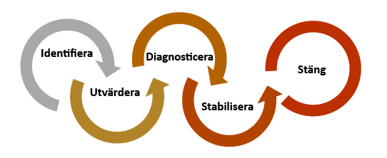
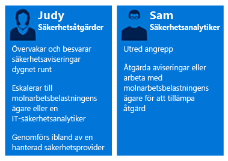
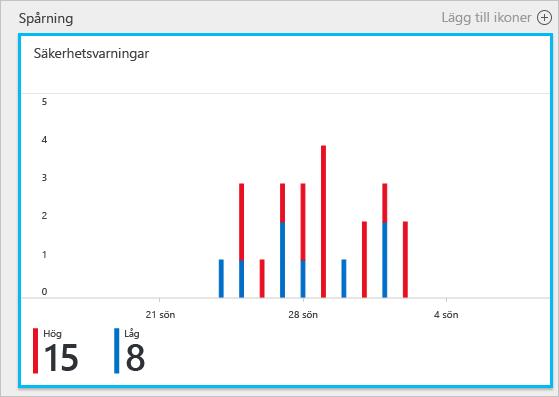
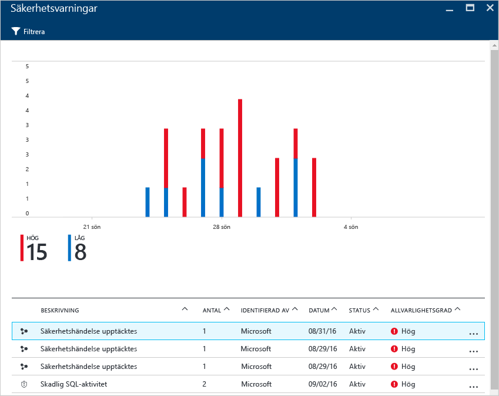
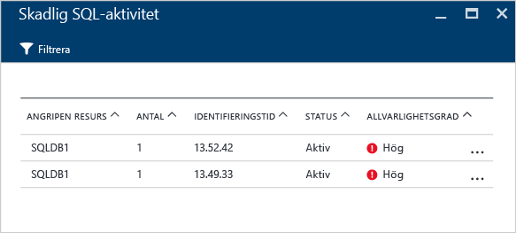
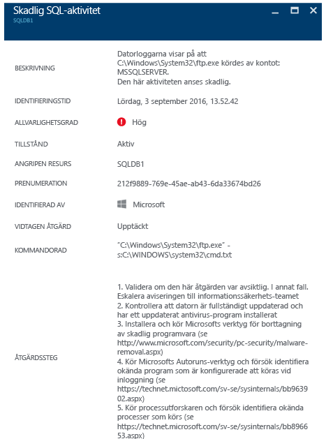

# Använda Azure Security Center vid incidenthantering
Många organisationer lär sig att reagera på säkerhetsincidenter först när de har drabbats av en attack. För att minska kostnaderna och skadorna är det viktigt att ha en incidenthanteringsplan på plats innan en attack äger rum. Azure Security Center kan användas i olika faser av en incidenthantering.

## Planering av incidenthantering
En effektiv plan är beroende av tre grundfunktioner: förmågan att skydda, identifiera och svara på hot. Skydd handlar om att förhindra incidenter, identifiering om att upptäcka hot tidigt och svar om att avlägsna angriparen och återställa systemen för att minimera påverkan av ett intrång.

I den här artikeln används säkerhetsstegen för incidenthantering från artikeln [Microsoft Azure Security Response in the Cloud (Microsoft Azure Security Response i molnet)](https://gallery.technet.microsoft.com/Azure-Security-Response-in-dd18c678) enligt följande diagram:

Du kan använda Security Center under stegen för identifiering, utvärdering och diagnostisering. Här visas ett exempel på hur Security Center kan vara användbart vid de tre första incidenthanteringsstegen:

* **Identifiera**: Visa den första indikationen i en händelseundersökning.
  * Exempel: Visa den första verifiering om att en säkerhetsavisering med hög prioritet aktiverades i instrumentpanelen till Security Center.
* **Utvärdera**: Utför en första utvärdering för att få mer information om den misstänkta aktiviteten.
  * Exempel: Hämta mer information om säkerhetsaviseringen.
* **Diagnostisera**: Utföra en teknisk undersökning och identifiera strategier för inneslutning, åtgärder och bugglösning.
  * Exempel: Följ anvisningarna för reparation som beskrivs i Security Center i säkerhetsvarningen.

Scenariot nedan visar hur du använder Security Center till identifiering, utvärdering och diagnostisering/hantering vid en säkerhetsincident. I Security Center är en [säkerhetsincident](security-center-incident.md) en sammanställning av alla aviseringar för en resurs som överensstämmer med särskilda [händelsekedje](https://blogs.technet.microsoft.com/office365security/addressing-your-cxos-top-five-cloud-security-concerns/)mönster. Incidenterna vas på panelen och bladet [Säkerhetsaviseringar](security-center-managing-and-responding-alerts.md). En incident visar en lista över relaterade aviseringar så att du kan få mer information om varje förekomst. Security Center har även fristående säkerhetsaviseringar som också kan användas för att spåra upp en misstänkt aktivitet.

## Scenario
Contoso migrerade nyligen några av sina lokala resurser till Azure, inklusive vissa virtuella datorbaserade branschspecifika arbetsbelastningar och SQL-databaser. För närvarande har Contosos team som ansvarar för datorsäkerheten, CSIRT (Computer Security Incident Response Team) svårt att undersöka säkerhetsproblem på grund av bristande integrering av säkerhetsfunktionerna i de aktuella incidenthanteringsverktygen. Bristen på integrering utgör ett problem vid identifiering (det blir för många falska positiva resultat), samt vid utvärderings- och diagnostiseringsstegen. Som en del av den här migreringen beslutar de att välja Security Center för att lösa problemet.

Den första fasen i migreringen slutförs när alla resurser har integreras och alla säkerhetsrekommendationer från Security Center har hanterats. Contoso CSIRT är huvudresursen för att hantera säkerhetsincidenter. Gruppen består av en grupp personer med ansvar för att hantera en alla säkerhetsincidenter. Gruppmedlemmarna har tydligt definierade uppgifter som säkerställer att inget område lämnas utan åtgärd.

I det här scenariot ska vi fokusera på rollerna för följande personer som ingår i Contoso CSIRT:

Johanna, som arbetar med säkerheten. Hennes ansvarsområden är följande:

* Övervakning och hantering av säkerhetshot dygnet runt.
* Eskalering till molnets arbetsbelastningsägare eller säkerhetsanalytiker vid behov.

Sam är säkerhetsanalytiker och hans ansvar omfattar:

* Undersöka attacker.
* Åtgärda aviseringar.
* Arbeta med arbetsbelastningsägare för att fastställa och tillämpa åtgärder.

Som du kan se har Johanna och Sam olika ansvarsområden och de måste samarbeta för att dela informationen från Security Center.

## Rekommenderad lösning
Eftersom Johanna och Sam har olika roller kommer de att använda olika områden i Security Center till att skaffa relevant information för sitt dagliga arbete. Johanna använder **Säkerhetsaviseringar** som en del av sin dagliga övervakning.

Johanna använder säkerhetsaviseringar under identifierings- och utvärderingsstegen. När Johanna har avslutat den inledande utvärderingen kan hon eskalera problemet till Sam om det krävs ytterligare undersökningar. Sam använder nu informationen från Security Center, ibland tillsammans med andra datakällor, för att gå vidare till diagnostiseringsskedet.

## Hur man implementerar denna lösning
Om du vill se hur du använder Azure Security Center i ett scenario för incidenthantering, följer vi Johanna i identifierings- och utvärderingsstegen och ser sedan vad Sam gör för att diagnosticera problemet.

### Identifiera och utvärdera stegen vid incidenthantering
Johanna har loggat in på Azure Portal arbetar med Security Center-konsolen. Som en del av sin dagliga övervakning har hon börjat granska säkerhetsaviseringar med hög prioritet genom att utföra följande steg:

1. Klicka på ikonen **Säkerhetsaviseringar** och gå till bladet **Säkerhetsaviseringar**.
    

   > [!NOTE]
   > I det här scenariot ska Johanna utföra en utvärdering av aviseringen om skadlig SQL-aktivitet som visas på bilden ovan.
   >
   >
2. Klicka på aviseringen **Skadlig SQL-aktivitet** och granska de attackerade resurserna på bladet **Skadlig SQL-aktivitet**: 

    På det här bladet kan Johanna föra anteckningar om de attackerade resurserna, hur många gånger attacken har utförts och när den upptäcktes.
3. Klicka på den **attackerade resursen** för att få mer information om angreppet.

När hon har läst beskrivningen är Johanna övertygad om att detta inte är falskt positivt och att hon bör eskalera fallet till Sam.

### Steget att diagnosticera incidenthantering
Sam får ärendet från Johanna och börjar gå igenom de åtgärdssteg som föreslås i Security Center.

### Ytterligare resurser
Företag som använder en SIEM-lösning (Security Information and Event Management) vid undersökningen kan även [integrera Security Center tillsammans med lösningen](security-center-integrating-alerts-with-log-integration.md). Azures granskningsloggar och virtuella datorsäkerhetshändelser kan dessutom integreras med [loggintegrationsverktyget i Azure](https://azure.microsoft.com/blog/introducing-hdinsight-integration-with-azure-log-analytics/). Den här informationen kan användas tillsammans med den information som tillhandahålls av Security Center när man undersöker ett angrepp. Du kan även använda funktionen [undersökning](https://docs.microsoft.com/azure/security-center/security-center-investigation) i Security Center. Den hjälper dig att fastställa orsaken till en incident.

## Sammanfattning
Att sätta samman ett team innan en incident inträffar är mycket viktigt för organisationen och kommer att påverka hanteringen av incidenter på ett positivt sätt. Om teamet har rätt verktyg för att övervaka resurserna kan de vidta rätt steg för att åtgärda en säkerhetsincident. [Identifieringsfunktioner](security-center-detection-capabilities.md) i Security Center hjälper IT-avdelningen att snabbt agera på säkerhetsincidenter samt åtgärda säkerhetsproblem.
