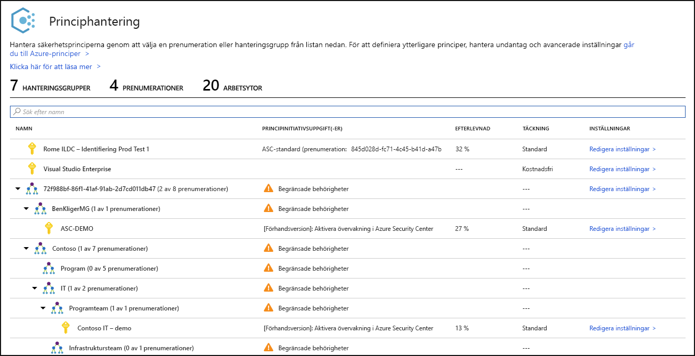
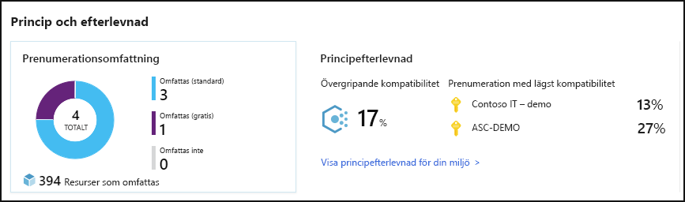
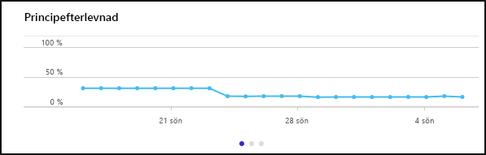
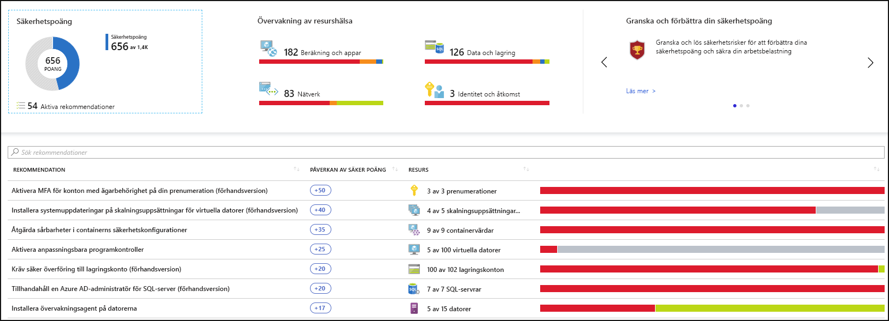
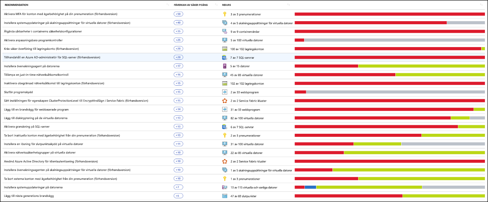
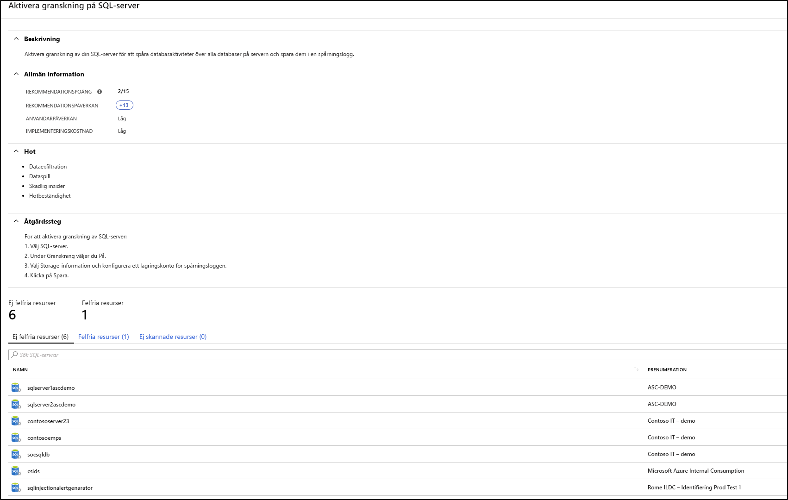
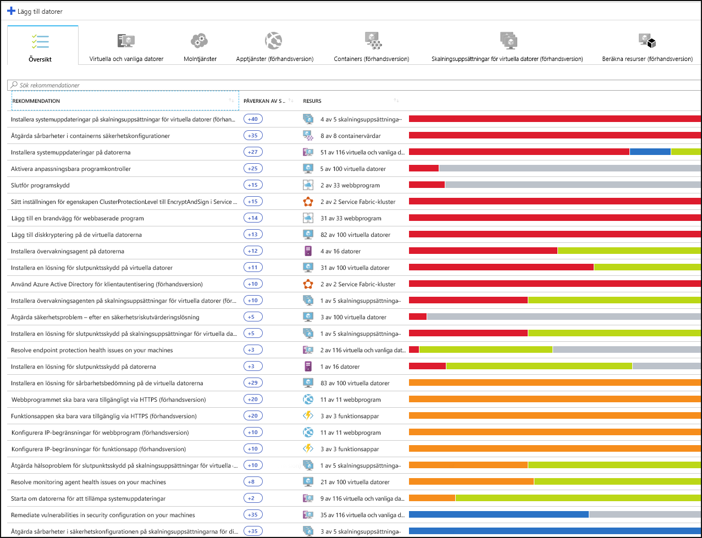
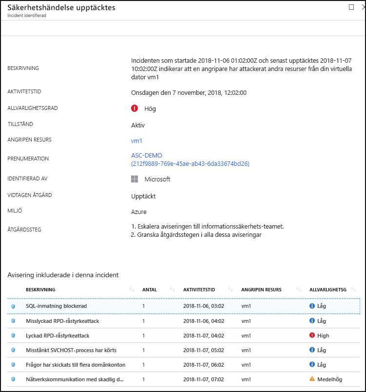

# Vad är Azure Security Center?

Azure Security Center är ett enhetligt system för hantering av infrastruktursäkerhet som stärker dina datacentras säkerhetstillstånd och tillhandahåller avancerat skydd för dina hybridarbetsbelastningar såväl i molnet, oavsett om de finns i Azure eller inte, som lokalt.

Att hålla dina resurser skyddade är en gemensam uppgift för din molnleverantör, Azure och dig som kund. Du måste se till att dina arbetsbelastningar skyddas när du migrerar till molnet, samtidigt som det, när du flyttar till IaaS (infrastruktur som en tjänst), innebär ett större kundansvar jämfört med hur det var i PaaS (plattform som en tjänst) och SaaS (programvara som en tjänst). Azure Security Center ger dig de verktyg du behöver för att stärka ditt nätverk, skydda dina tjänster och se till att du har koll på din säkerhetshållning.

Azure Security Center adresserar de tre mest brådskande säkerhetsutmaningarna:

-   **Snabbt förändrade arbetsbelastningar** – Det är både en styrka och en utmaning i molnet. Å ena sidan uppmuntras slutanvändarna att göra mer. Å andra sidan, hur försäkrar du dig om att de ständigt föränderliga tjänster som människorna använder och skapar uppfyller dina säkerhetsstandarder och följer rekommenderade säkerhetsmetoder?

-   **Allt mer sofistikerade attacker** – Oavsett var du kör dina arbetsbelastningar blir attackerna ständigt alltmer avancerade. Du måste skydda dina arbetsbelastningar i det offentliga molnet, vilka i praktiken är en Internet-inriktad arbetsbelastning som kan gör dig ännu mer sårbar om du inte följer rekommenderade säkerhetsmetoder.

-   **Säkerhets kunskaper har kort till gång** – antalet säkerhets aviseringar och aviserings system i stort antal administratörer med nödvändig bakgrund och erfarenhet för att se till att dina miljöer är skyddade. Att hålla sig informerad om de senaste attackerna är en konstant utmaning, vilket gör det omöjligt att alltid vara på rätt plats eftersom kampen mot säkerhetshoten sker vid en ständigt föränderlig stridslinje.

Som en hjälp i skyddet mot dessa utmaningar erbjuder Security Center dig verktyg för att:

-   **Förbättra säkerheten**: Security Center utvärderar din miljö och hjälper dig att förstå dina resursers status. Är de säkra eller inte?

-   **Skydda dig mot hot**: Security Center utvärderar dina arbetsbelastningar och genererar rekommendationer för förebyggande av hot och hotidentifieringsaviseringar.

-   **Bli skyddad snabbare**: Allt sker med molnhastighet i Security Center. Eftersom Security Center är inbyggt sker distributionen snabbt och enkelt, och ger dig automatisk etablering och skydd med Azure-tjänster.

## Arkitektur

Eftersom Security Center ingår internt i Azure, så övervakas och skyddas PaaS-tjänster i Azure, som Service Fabric, SQL-databaser och lagringskonton, utan att det krävs någon distribution.

Dessutom skyddar Security Center Azure-servrar och virtuella datorer i molnet eller lokalt för både Windows och Linux-servrar genom att installera Microsoft Monitoring Agent på dem. Virtuella Azure-datorer etableras automatiskt i Security Center.

De händelser som samlas in från agenter och från Azure korreleras i säkerhetsanalysmotorn, som ger dig skräddarsydda rekommendationer (härdningsuppgifter) som du bör följa om du vill försäkra dig om att dina arbetsbelastningar är säkra och att du får hotidentifieringsaviseringar. Du bör kontrollera dessa aviseringar så snart som möjligt så att du kan försäkra dig om att dina arbetsbelastningar inte utsätts för potentiellt skadliga attacker.

När du aktiverar Security Center visas den inbyggda Security Center-säkerhetsprincipen i Azure Policy som ett inbyggt initiativ under kategorin Security Center. Det inbyggda initiativet tilldelas automatiskt till alla Security Center-registrerade prenumerationer (på kostnadsfri nivå eller standardnivå). Det inbyggda initiativet innehåller endast granskningsprinciper. Läs mer om Security Center-principer i Azure Policy i artikeln om att [arbeta med säkerhetsprinciper](tutorial-security-policy.md).

## Förbättra säkerheten

Med Azure Security Center kan du förbättra din säkerhet. Du får hjälp med att identifiera och utföra de härdningsuppgifter som anges som rekommenderade säkerhetsmetoder och implementera dem i dina datorer, datatjänster och appar. Detta inkluderar hantering och tillämpning av säkerhetsprinciper och säkerställande av att dina virtuella Azure-datorer, icke-Azure-servrar och Azure PaaS-tjänster är kompatibla. Security Center ger dig de verktyg du behöver ha få en översikt över dina arbetsbelastningar med fokuserad synlighet för din nätverkssäkerhetsegendom. 

### Hantera principer för organisationssäkerhet och efterlevnad

Det tillhör grunderna i säkerhetsarbetet att känna till och skydda sina arbetsbelastningar, och utgångspunkten är att ha skräddarsydda säkerhetsprinciper på plats. Eftersom alla principer i Security Center är byggda på Azure-principkontroller får du tillgång till hela omfattningen och flexibiliteten hos en  **principlösning av världsklass**. Du kan konfigurera dina principer i Security Center så att de körs för hanteringsgrupper, för prenumerationer och även för en hel klientorganisation.

Security Center hjälper dig att **identifiera skugg-IT prenumerationer**. Genom att titta på prenumerationer märkta **omfattas inte** på instrumentpanelen kan du se direkt när det har skapats nya prenumerationer och se till att de omfattas av dina principer och skyddas av Azure Security Center.

Med de avancerade övervakningsfunktionerna i Security Center kan du även **spåra och hantera efterlevnad och styrning över tid**. Den **övergripande kompatibiliteten** ger dig ett mått på i hur hög grad dina prenumerationer är kompatibla med de principer som är associerade med din arbetsbelastning. 

### Kontinuerliga utvärderingar

Security Center identifierar nya resurser som distribueras till dina arbetsbelastningar och utvärderar om de har konfigurerats enligt rekommenderade säkerhetsmetoder. Om så inte är fallet flaggas de och du får en prioriterad lista med rekommendationer om vad du måste åtgärda för att skydda dina datorer.

En av de viktigaste verktygen som Security Center tillhandahåller för kontinuerlig övervakning av ditt nätverks säkerhetsstatus är  **nätverkskartan**. Med hjälp av kartan kan du se dina arbetsbelastningars topologi, och därmed även se om varje enskild nod har konfigurerats korrekt. Du kan se hur dina noder är anslutna, vilket hjälper dig att blockera oönskade anslutningar som potentiellt kan göra det enklare för en angripare att ta sig in i ditt nätverk.

Security Center underlättar hanteringen av säkerhetsaviseringarna med hjälp av  **säkerhetspoäng**. Säkerhetspoängen är nu kopplade till varje enskild rekommendation som du tar emot, så att du enklare ska förstå hur viktigt den enskilda rekommendationen är för den övergripande säkerheten. Detta är av avgörande betydelse för dina möjligheter att  **prioritera ditt säkerhetsarbete**.

### Optimera och förbättra säkerheten genom att konfigurera rekommenderas kontroller

Den avgörande faktorn för värdet av Azure Security Center ligger i dess rekommendationer. Rekommendationerna skräddarsys för varje enskilt säkerhetsproblem som finns i dina arbetsbelastningar och Security Center gör det administrativa säkerhetsarbetet för dig, inte bara genom att söka efter dina säkerhetsrisker, utan även genom att ge dig specifika anvisningar för hur du tar bort dem.

På så sätt gör Security Center det möjligt för dig att inte bara ställa in säkerhetsprinciper, utan även att tillämpa säkra konfigurationsstandarder för alla dina resurser.

Rekommendationerna hjälper dig att minska risken för angrepp för alla dina resurser. Detta omfattar Azure-datorer, icke-Azure-servrar och Azure PaaS-tjänster, som SQL- och Storage-konton och mycket mer, där varje resurstyp bedöms på olika sätt och har sin egen standarder.

## Skydda dig mot risker

Med Security Centers hotskydd kan du upptäcka och förebygga hot mot infrastrukturen som en tjänst (IaaS), icke-Azure-servrar och plattformar som en tjänst (PaaS) i Azure.

Security Centers hotskydd innehåller fusionsattackkedjeanalys, som automatiskt korrelerar aviseringar i din miljö, baserat på cyberattackkedjeanalysen, så att du bättre ska förstå en attackkampanjs i dess helhet, var den startade och vilken typ av effekt den haft på dina resurser.

### Advanced Threat Protection

Med Security Center får du Windows Defender Advanced Threat Protection direkt integrerat från början. Det innebär att utan någon som helst konfiguration så är dina Windows-datorer och servrar är helt integrerade med Security Centers rekommendationer och utvärderingar. Avancerad hotidentifiering erbjuds även direkt för Linux-datorer och servrar.

I kan Security Center du dessutom automatisera programkontrollsprinciper för servermiljöer. Med de anpassningsbara programkontrollerna i Security Center kan du placera program på listan över tillåtna från slutpunkt till slutpunkt för alla dina Windows-servrar. Du behöver varken skapa reglerna eller kontrollera överträdelser. Allt görs automatiskt.

### Skydda PaaS

Security Center hjälpa dig att upptäcka hot mot dina Azure PaaS-tjänster. Du kan identifiera hot mot dina Azure-tjänster, inklusive Azure App Service, Azure SQL, Azure Storage Account, och andra datatjänster. Du kan också dra nytta av den interna integreringen med Microsoft Cloud App Securitys analys av användar- och entitetsbeteende (UEBA), och därigenom genomföra avvikelseidentifiering på dina Azure-aktivitetsloggar.

### Blockera råstyrkeattackerare

Security Center hjälper dig att begränsa exponeringen för råstyrkeattacker. Genom att minska åtkomsten till VM-portar med hjälp av just-in-time-VM-åtkomst kan du skydda ditt nätverk genom att förhindra onödig åtkomst. Du kan ange principer för säker åtkomst på valda portar enbart för behöriga användare, tillåtna käll-IP-adressintervall eller IP-adresser under en begränsad tidsperiod.

### Skydda datatjänster

Security Center innehåller funktioner som hjälper dig att utföra automatisk klassificering av dina data i Azure SQL. Du kan också få utvärderingar avseende potentiella säkerhetsrisker för Azure SQL- och lagringstjänster och rekommendationer för hur du löser dem.

### Skydda IoT-och hybrid moln arbets belastningar

Azure Security Center for IoT (Sakernas Internet) fören klar hybrid arbets belastnings skyddet genom att leverera enhetlig synlighet och kontroll, anpassningsbart hot skydd och intelligent hot identifiering och-svar mellan arbets belastningar som körs på Edge, lokalt, i Azure och i andra moln. Mer information finns i [Azure Security Center for IoT](https://docs.microsoft.com/azure/asc-for-iot/).

## Bli skyddad snabbare

Intern Azure-integration (inklusive Azure Policy och Azure Monitor loggar) kombinerat med sömlös integrering med andra Microsoft-säkerhetslösningar, till exempel Microsoft Cloud App Security och Windows Defender Avancerat skydd se till att din säkerhetslösningen är omfattande och enkelt att publicera och distribuera.

Dessutom kan du utöka den fullständiga lösningen utöver Azure till arbetsbelastningar som körs i andra moln och i lokala datacentra.

### Identifiera och publicera Azure-resurser automatiskt

Security Center ger sömlös inbyggd integrering med Azure och Azure-resurser. Det innebär att du kan samla ihop en fullständig säkerhetshistoria som rör Azure Policy och inbyggda principer i Security Center för alla dina Azure-resurser och se till att alltihop tillämpas automatiskt på nyidentifierade resurser när du skapar dem i Azure.

Omfattande logginsamling som innebär att loggar från både Windows och Linux balanseras i säkerhetsanalysmotorn och används för att skapa rekommendationer och aviseringar.

## Nästa steg

- För att komma igång med Security Center måste du ha en prenumeration på Microsoft Azure. Om du inte har någon prenumeration kan du registrera dig för en [kostnadsfri utvärderingsversion](https://azure.microsoft.com/free/).
- Security Centers kostnadsfria prisnivå aktiveras med Azure-prenumerationen. Om du vill använda avancerad säkerhetshantering och hotidentifiering måste du uppgradera till prisnivån Standard. Du kan prova Standard-nivån kostnadsfritt. På [prissättningssidan för Security Center](https://azure.microsoft.com/pricing/details/security-center/) finns det mer information.
- Om du är redo att aktivera Security Center Standard nu kan du gå till [Snabbstart: Publicera din Azure-prenumeration till Security Center Standard](security-center-get-started.md) där du får stegvisa anvisningar.

